# Генерация новых признаков

## Зачем изучать Feature Engineering

> **Feature Engineering** — это набор методов, который помогает получать признаки, на которых модель при прочих данных выдает лучший результат.

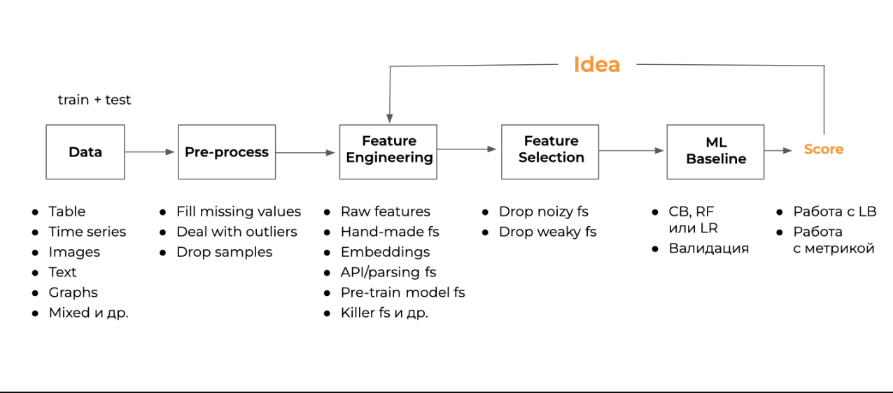

Создание новых признаков начинаем с получения бизлайна на сырых данных с не очень сложной моделью. Мы фиксируем все параметры и добавляем новые признаки. По ходу добавления новых признаков обращаем внимание на скор, который генерирует модель, — чем лучше качество, которое показывает модель, тем полезнее добавленный признак.

Feature Engineering зависит от имеющихся у нас данных. Разберем подробнее, почему нужно погружаться в эту тему.

**Зачем изучать Feature Engineering:**

- **Только сырых данных недостаточно.** Добавление признаков может решить проблему. Например, классы становятся разделенными, потому что признак оказался полезным.
- **Высокая цена, если ML-модель извлекает закономерности сама.** Модель может получаться очень сложной, так как имеющиеся признаки не очень информативны.

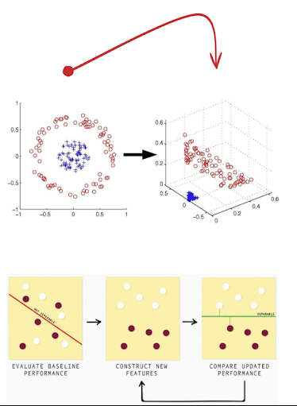

Рассмотрим самые распространенные виды признаков.

## Виды признаков

### **Численные признаки**

Из неуникальных ID можно сгенерировать полезные признаки, например, с помощью группировок.

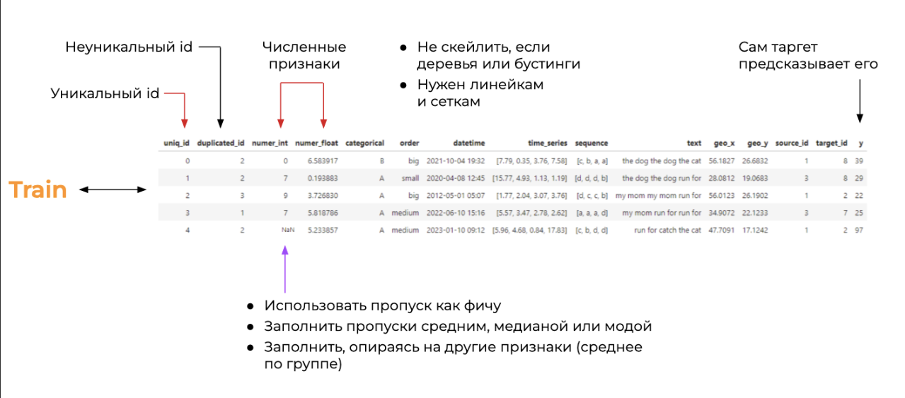

Если в численных или категориальных признаках есть пропуски, то это можно использовать как дополнительные признаки. Для этого заполняем пропуски не только средним, медианой или модой, но и опираясь на другие признаки.

### **Категориальные и порядковые признаки**

Порядковые признаки можно обрабатывать не только как категориальные, но и переводить их в численный вид, чтобы выполнять с ними математические операции.

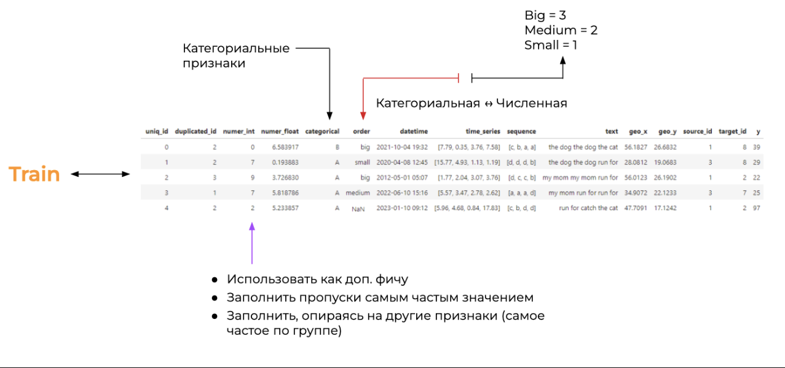

**Что делать, если при работе с категориальными признаками встречаются редкие значения:**

- Схлопывать их в отдельную группу, например, -1.
- Схлопывать их в бины, чтобы сохранить больше информации. Количество бинов определяется качеством модели при изменении этого признака.

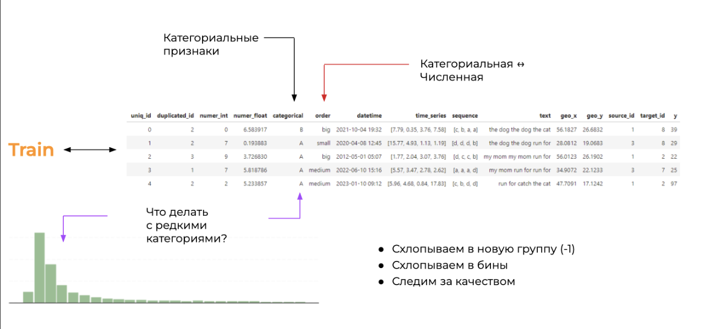

### **Время и временные ряды**

Часто в данных есть временные метки (time stamp). В зависимости от того, какую задачу мы решаем, из даты можем:

- Базово вытащить — год, месяц, день, час, минуты, секунды.
- Добавить в таблицу дополнительные характеристики, например, праздничный день или это выходной.

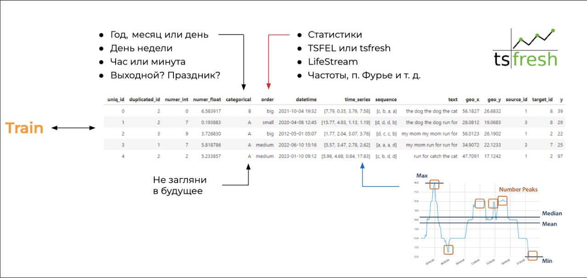

В данных может быть не только дата, но и другие временные метки:

- **временной ряд** — некоторая последовательность значений — статистики генерируются с помощью фреймворка tsfresh;
- **логи**, преобразовываются в признаки с помощью LifeStream.
- **частоты**, извлекаются с помощью преобразования Фурье.


> **Важно!** Когда мы работаем с временной шкалой, важно оставаться внимательным при разделении обучающей выборки на train-тест, чтобы не допустить заглядывания в будущее.

### **Тексты и последовательности**

Базовые статистики часто встречающихся элементов или последовательностей можно извлекать:

- из небольших последовательностей с помощью BoW или TF-iDF.
- из текстовых последовательностей с помощью нейронных сетей или BERT.

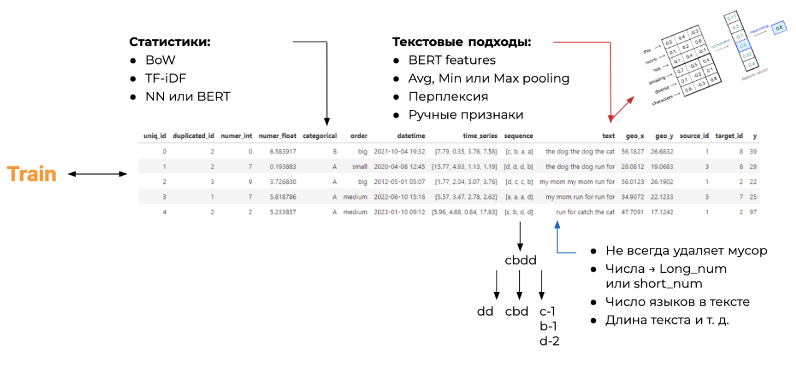

В обучающей выборке могут встретиться категории, которых нет в тесте:

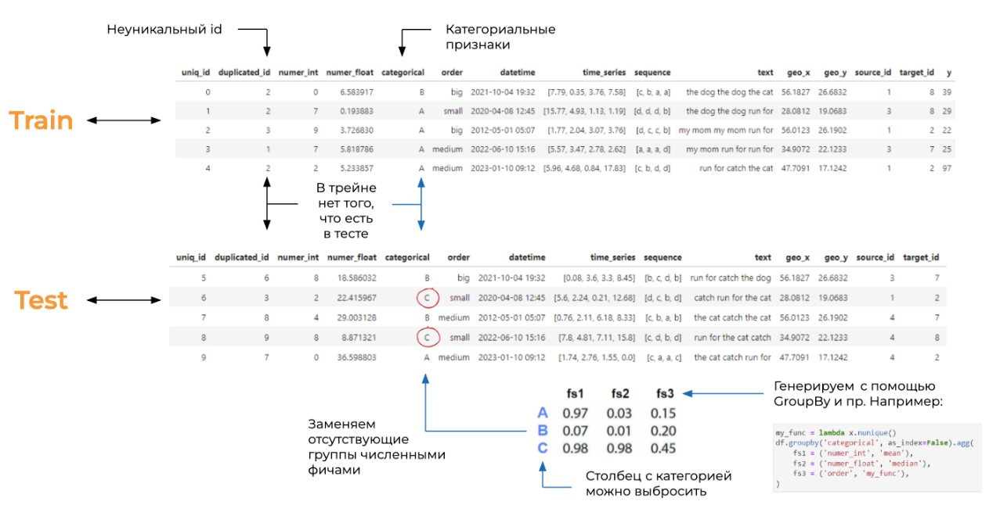

**Что делать:**

1. Попытаться заменить отсутствующие группы численными фичами.
2. Сгенерировать с помощью `GroupBy` и пр. Например:

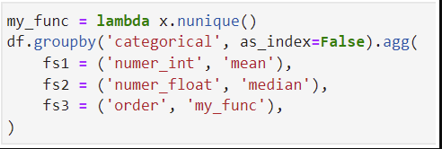

3. Выбросить категориальный столбец.

### **Геоданные**

В датасетах могут присутствовать геоданные в виде координат или полигонов. Первое, что можно сделать, — через GeoPandas извлечь с помощью координат центроиды и посчитать расстояния от каждой координаты до этих центроидов. Если мы работаем с полигонами, то добавляем как признаки пересечение полигонов или для каждой точки считаем самый популярный таргет в диапазоне этой границы.

Бывает полезно из имеющихся геоданных спарсить информацию по IP или через библиотеки (Meteostat, GeoPandas, GeoPy). Ниже указано подробнее, какую информацию в какой библиотеке можно найти:

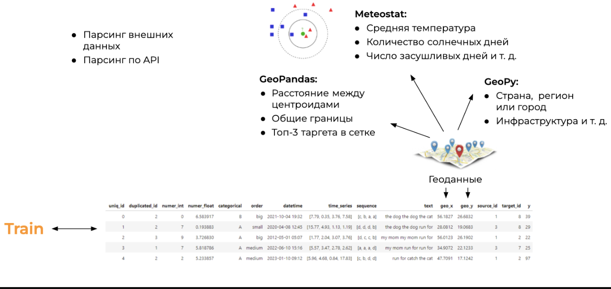

### **Графовые данные**

Если получилось найти графовую структуру данных, то можно использовать библиотеки:

- NetworkX;
- Graph1Vec или Node2Vec;
- StellarGraph и т. д.

NetworkX — самая популярная библиотека. Из нее можно получить следующие признаки:

- PageRank;
- Degree_centrality;
- Closeness_centrality;
- Betweenness_centrality и т. д.

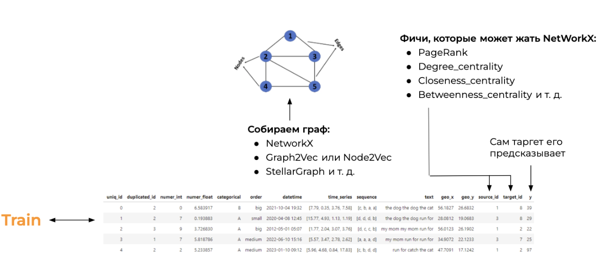

Графовую структуру можно обогатить с помощью других имеющихся признаков. Например, превратить в взвешенный граф, где для ребер будут присутствовать веса:

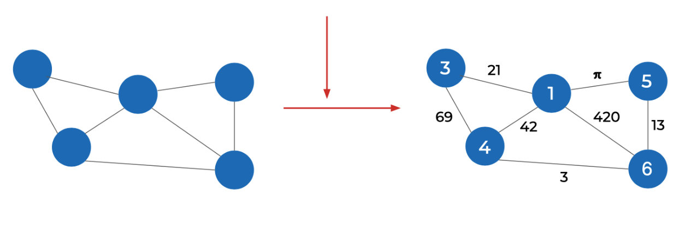

У данных может не быть графовой структуры, но эту структуру мы можем создать сами с помощью K-NN:

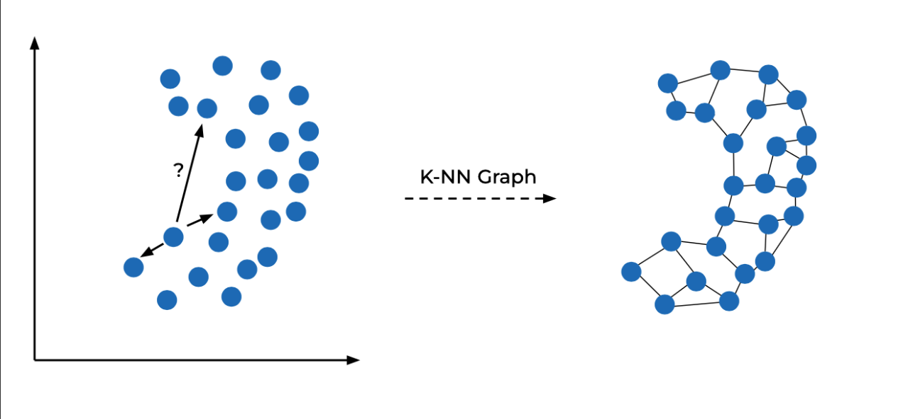

### Соберем все перечисленные признаки в одном месте:

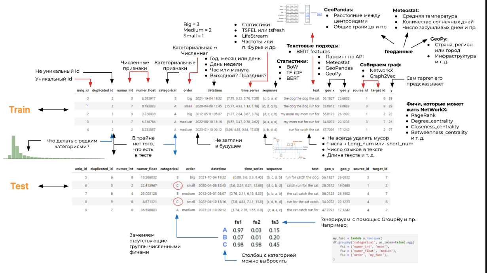

На самом деле, подходов, которые мы можем использовать на практике, намного больше, чем мы разобрали на занятии. Призываем вас экспериментировать и выходить за рамки тех данных, что предлагается изначально.

## Выводы

- Начните с бейзлайна на сырых данных. Цель — извлечь из данных всю информацию.
- Проверяйте эффект от новых признаков как можно чаще.
- Gold features поднимают скор сильнее тюнинга ML-моделей.
- Чем больше неcкоррелированных признаков, тем лучше.
- Визуализация поможет найти киллер-фичи быстрее.
- Признаки бывают вредные.

# **Feature Engineering**

[Полезные ссылки](https://github.com/a-milenkin/Competitive_Data_Science)

## Структура таблицы

В этом разделе мы разберем примеры подготовки признаков. Основной фокус сделаем на ручную генерацию — разнообразие признаков, которые можно извлечь, варьируется в зависимости от имеющихся данных.

У нас есть информация о машинах, их ремонте, поездках и водителях, которые совершали эти поездки:

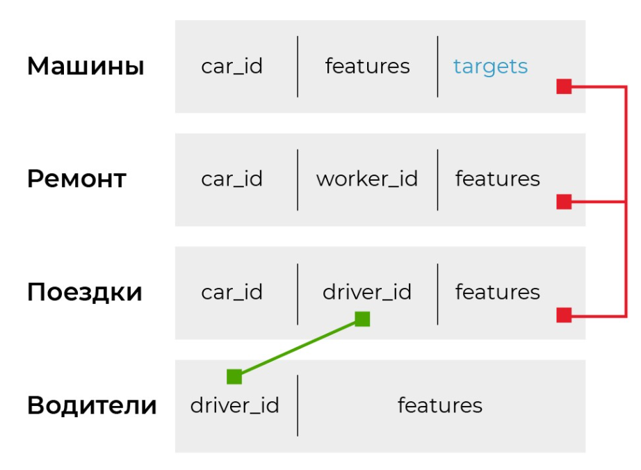

Разберем, как, покрывая эти таблицы, можно генерировать полезные признаки. Сначала важно понять, как придумывать признаки.

**Как придумывать признаки для генерации:**

- Начать с сырых данных. Построить модель и настроить локальную валидацию, чтобы иметь четкое понимание, наши новые признаки улучшают качество модели или ухудшают.
- Брать все, что есть. Покрыть признаками всю имеющуюся информацию в данных.
- Предполагать, от чего зависит таргет (число поездок, количество превышений скорости, количество агрессивных водителей и т. д.). Чем лучше понимаем таргет, тем проще подготовить информативные признаки.
- Смотреть визуально на классы или ошибки. Делать предположения, какие из них полезны.
- Очень много признаков может быть вредно — модель становится нестабильна. Позже их придется отфильтровывать.

Теперь попробуем проанализировать датасет. У нас есть **информация про машины и их поломки:**

```python
# !pip install numpy pandas seaborn -q
import numpy as np
import pandas as pd

train = pd.read_csv("../data/car_train.csv")
print(train.shape)
train.hist(figsize=(25, 4), layout=(2, 5), bins=30)
train.sample(3)
```

| car_id  | model      | car_type           | fuel_type | car_rating | year_to_start | riders | year_to_work | target_reg | target_class |                 |
| ------- | ---------- | ------------------ | --------- | ---------- | ------------- | ------ | ------------ | ---------- | ------------ | --------------- |
| **626** | I20900258y | Smart ForTwo       | economy   | petrol     | 3.80          | 2014   | 61049        | 2019       | 28.12        | engine_overheat |
| **163** | q25090977a | Skoda Rapid        | economy   | petrol     | 3.02          | 2017   | 130192       | 2014       | 47.99        | engine_ignition |
| **524** | S11905138M | Mercedes-Benz E200 | business  | petrol     | 2.64          | 2015   | 92250        | 2016       | 31.85        | engine_fuel     |

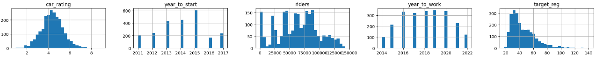

Данные, указанные в датасете:

- `car_id` — идентификатор машины;
- `model` / `car_type` / `fuel_type` — марка, класс и тип топлива машины;
- `car_rating` / `riders` — общий рейтинг и общее число поездок к концу 2021 года;
- `year_to_start` / `year_to_work` — год выпуска машины и начала работы в автопарке;
- `target_reg` — количество дней до поломки;
- `target_class` — класс поломки (9 видов).

Для анализа мало информации одного датасета, поэтому у нас еще есть **информация про поездки**:

```python
rides_info = pd.read_csv("../data/rides_info.csv")
print(rides_info.shape)
rides_info.hist(figsize=(25, 4), layout=(2, 5), bins=40)
rides_info.sample(3)
(739500, 14)
```

| user_id    | car_id     | ride_id    | ride_date | rating     | ride_duration | ride_cost | speed_avg | speed_max | stop_times | distance | refueling  | user_ride_quality | deviation_normal |         |
| ---------- | ---------- | ---------- | --------- | ---------- | ------------- | --------- | --------- | --------- | ---------- | -------- | ---------- | ----------------- | ---------------- | ------- |
| **699545** | G41442087L | x-2014093y | p1L       | 2020-02-04 | 2.09          | 24        | 212       | 36        | 70.828592  | 0        | 507.728335 | 0                 | 2.889705         | 0.001   |
| **524461** | u19529036K | k88534152q | Q1h       | 2020-01-14 | 6.31          | 21        | 245       | 42        | 76.264270  | 1        | 933.391339 | 0                 | -4.357720        | 22.217  |
| **14823**  | J24166270p | A99628604w | P1A       | 2020-01-18 | 5.11          | 14        | 164       | 49        | 69.000000  | 1        | 25.086375  | 0                 | -1.970335        | -33.048 |

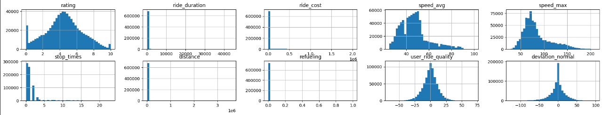

Данные, указанные в датасете:

- `user_id` / `car_id` / `ride_id`— идентификаторы водителя, машины и поездки;
- `ride_date` / `rating`— дата поездки и рейтинг, поставленный водителем;
- `ride_duration` / `distance` / `ride_cost`— длительность (время), пройденное расстояние, стоимость поездки;
- `speed_avg` / `speed_max` — средняя и максимальная скорости поездки;
- `stop_times` / `refueling`— количество остановок (паузы) и флаг — была ли дозаправка;
- `user_ride_quality` — оценка манеры водителя водить машину, определенная скоринговой ML-системой сервиса;
- `deviation_normal`— общий показатель датчиков о состоянии машины, относительно эталонных показателей (нормы).

Кроме информации про поездки, у нас есть **данные про ремонт машин** (`fix_info`):

```python
fix_info = pd.read_csv("../data/fix_info.csv").sort_values('worker_id')
print(fix_info.shape)
fix_info.hist(figsize=(12, 2))
fix_info.sample(3)
(146000, 6)
```

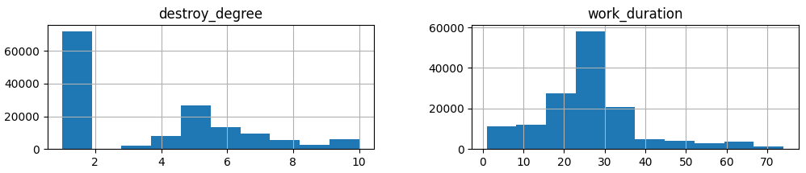

Данные, указанные в датасете:

- `worker_id` / `car_id`— идентификатор работника и машины;
- `work_type` / `work_duration` — тип и длительность (в часах) проводимой работы;
- `destroy_degree` — степень износа или поврежденности машины в случае поломки;
- `fix_date` — время начала ремонта (время снятия машины с линии).

Разберем несколько полезных связок на примере последнего датасета.

## Полезные связки

### groupby() + agg()

**groupby() + agg()** — классическая сказка, которая позволяет агрегировать информацию про каждую из групп. В нашем случае, для каждой из машин мы можем получить информацию про средний рейтинг, суммарную длительность поездки, максимальную стоимость поездки и т. д.

`df.aggregate() == df.agg()` агрегирует с помощью одной или нескольких указанных операций или функций по заданной оси.

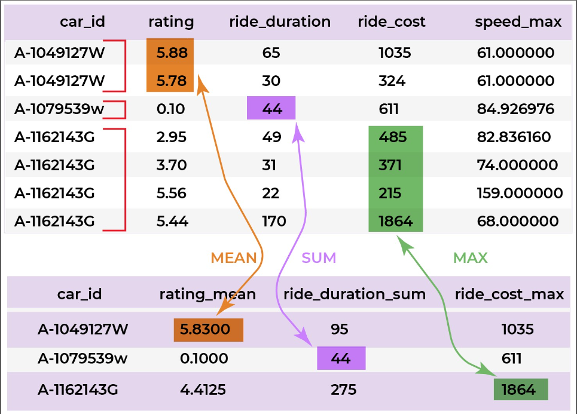

Посмотрим, как связка работает на примере последнего датасета.

**Способ 1:**

```python
fix_info.groupby("car_id", as_index=False).aggregate({
        "worker_id": ["count"],
        "work_duration": ["max", "mean"],
    }
).head(3)
```

|       | car_id     | worker_id | work_duration |           |
| ----- | ---------- | --------- | ------------- | --------- |
|       |            | count     | max           | mean      |
| **0** | A-1049127W | 35        | 56            | 27.485714 |
| **1** | A-1079539w | 34        | 64            | 27.382353 |
| **2** | A-1162143G | 34        | 69            | 27.823529 |

Этот способ не очень удобный, потому что он создает мультииндекс (появилось два названия столбца). При этом, чтобы превратить признак в столбец, нужно переименовать его. Рассмотрим более красивый способ.

**Способ 2.** В функцию `.agg` мы передаем не словарь, а список кортежей — название новой переменной, исходный столбец и функция, которую хотим применить.

```python
fix_info.groupby("car_id", as_index=False).agg(
    worker_id_count=("worker_id", "count"),
    work_duration_max=("work_duration", "max"),
    work_duration_mean=("work_duration", "mean"),
).head(3)
```

С помощью кода мы получаем такой же результат, но каждый столбец имеет свое название (не мультииндекс, а столбцы в один ряд):

|       | car_id     | worker_id_count | work_duration_max | work_duration_mean |
| ----- | ---------- | --------------- | ----------------- | ------------------ |
| **0** | A-1049127W | 35              | 56                | 27.485714          |
| **1** | A-1079539w | 34              | 64                | 27.382353          |
| **2** | A-1162143G | 34              | 69                | 27.823529          |


### groupby() + transform()

`df.transform()` вызывает функцию для самостоятельного создания DataFrame с той же формой оси, как у исходной таблицы. Связка сохраняет исходный размер.

**Способ 1**:

```python
# Среднее время выполнения работы мастером

print(fix_info.shape)

fix_info["worker_speed"] = fix_info.groupby("worker_id")["work_duration"].transform("mean")

print(fix_info.shape)

fix_info.head(3)
(146000, 6)
(146000, 7)
```

|           | car_id     | worker_id | fix_date        | work_type | destroy_degree | work_duration | worker_speed |
| --------- | ---------- | --------- | --------------- | --------- | -------------- | ------------- | ------------ |
| **38176** | m-8902512v | AB        | 2019-2-16 19:28 | repair    | 5.0            | 59            | 26.219917    |
| **25968** | h-5894617f | AB        | 2020-8-13 18:19 | reparking | 1.0            | 30            | 26.219917    |
| **17050** | m-8965256V | AB        | 2020-5-1 10:20  | repair    | 5.0            | 33            | 26.219917    |


**Способ 2**. С помощью этого способа можно получить такой же результат, но потратить гораздо больше времени. Вместо связки `groupby()` + `transform()` используем связку `groupby()` + `agg()`, а затем с помощью команды `merge` приклеиваем к таблице результат группировки.

```python
tmp = fix_info.groupby("worker_id", as_index=False).agg(
    work_duration_mean=("work_duration", "mean")
)

fix_info.merge(tmp, on="worker_id", how="left").head(3)
```

|       | car_id     | worker_id | fix_date       | work_type | destroy_degree | work_duration | worker_speed | work_duration_mean |
| ----- | ---------- | --------- | -------------- | --------- | -------------- | ------------- | ------------ | ------------------ |
| **0** | P17494612l | RJ        | 2020-6-20 2:14 | reparking | 8.0            | 49            | 25.413386    | 25.413386          |
| **1** | N-1530212S | LM        | 2020-2-9 20:25 | repair    | 10.0           | 48            | 26.824627    | 26.824627          |
| **2** | B-1154399t | ND        | 2019-8-24 7:1  | reparking | 1.0            | 27            | 25.714286    | 25.714286          |

```python
fix_info["worker_experience"] = fix_info.groupby("worker_id")["car_id"].transform(
    "count"
)
fix_info.head(3)
```

|           | car_id     | worker_id | fix_date        | work_type | destroy_degree | work_duration | worker_speed | worker_experience |
| --------- | ---------- | --------- | --------------- | --------- | -------------- | ------------- | ------------ | ----------------- |
| **38176** | m-8902512v | AB        | 2019-2-16 19:28 | repair    | 5.0            | 59            | 26.219917    | 241               |
| **25968** | h-5894617f | AB        | 2020-8-13 18:19 | reparking | 1.0            | 30            | 26.219917    | 241               |
| **17050** | m-8965256V | AB        | 2020-5-1 10:20  | repair    | 5.0            | 33            | 26.219917    | 241               |


### groupby + agg() + самописная функция

В функцию `agg()` можно передавать любую функцию, даже ту, которую мы напишем сами.

```python
fix_info.head(3)
```

|           | car_id     | worker_id | fix_date        | work_type | destroy_degree | work_duration | worker_speed | worker_experience |
| --------- | ---------- | --------- | --------------- | --------- | -------------- | ------------- | ------------ | ----------------- |
| **38176** | m-8902512v | AB        | 2019-2-16 19:28 | repair    | 5.0            | 59            | 26.219917    | 241               |
| **25968** | h-5894617f | AB        | 2020-8-13 18:19 | reparking | 1.0            | 30            | 26.219917    | 241               |
| **17050** | m-8965256V | AB        | 2020-5-1 10:20  | repair    | 5.0            | 33            | 26.219917    | 241               |

```python
# Число уникальных значений
f_nuniq = lambda x: x.nunique()

# Число значений, которые больше чем n
more_than_n_func = lambda x, n=8: sum(x > n)

# 30% перцентиль / квантиль уровня 0.3
def quant_func(x):
    return x.quantile(0.3)
# Функции поиска первой и второй моды для категориальных значений
first_mode = lambda x: x.value_counts().index[0]
second_mode = lambda x: x.value_counts().index[1]
```

Теперь мы можем применить все три использованные выше функции:

```python
fix_info_gr = fix_info.groupby("car_id", as_index=False).agg(
    
    # Все встроенные статистики
    worker_count=("worker_id", "count"),
    work_duration_mean=("work_duration", "mean"),
    work_duration_max=("work_duration", "max"),
    destroy_degree_std=("destroy_degree", "std"),
    destroy_degree_sum=("destroy_degree", "sum"),
    
    # Самописные функции для категорий
    work_type_nuniq=("work_type", f_nuniq),
    work_type_mode=("work_type", first_mode),
    work_type_second_mode=("work_type", second_mode),
    
    # Самописные функции для численных
    destroy_degree_crit_q=("destroy_degree", more_than_n_func),
    worker_quant_exp=("worker_experience", quant_func),
)

fix_info_gr.sample(3)
```

|          | car_id     | worker_count | work_duration_mean | work_duration_max | destroy_degree_std | destroy_degree_sum | work_type_nuniq | work_type_mode | work_type_second_mode | destroy_degree_crit_q | worker_quant_exp |
| -------- | ---------- | ------------ | ------------------ | ----------------- | ------------------ | ------------------ | --------------- | -------------- | --------------------- | --------------------- | ---------------- |
| **3842** | v-1736895l | 35           | 25.028571          | 71                | 1.963426           | 104.0              | 3               | reparking      | repair                | 0                     | 250.8            |
| **2174** | a96529450S | 34           | 26.176471          | 73                | 2.976587           | 134.6              | 4               | repair         | reparking             | 2                     | 259.0            |
| **3784** | u12808660Q | 34           | 26.264706          | 67                | 2.985819           | 125.6              | 4               | repair         | reparking             | 3                     | 262.9            |


Получаем компактный и красивый код, который легко вставлять в любую функцию для генерации признака.

```python
fix_info_gr.hist(figsize=(25, 9), layout=(2, 4), bins=40);
```

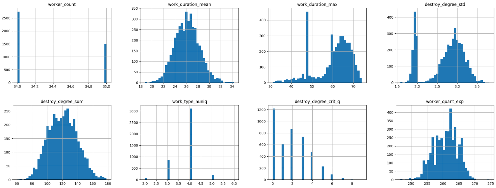

### pivot() / pivot_table() + aggfunc()

На практике могут встречаться датасеты, в которых, кроме численных признаков, есть много категориальных. Бывает полезно считывать статистики внутри этих категорий. Для этого можно заряжать смежные таблицы — функцию `pivot()` или `pivot_table()`.

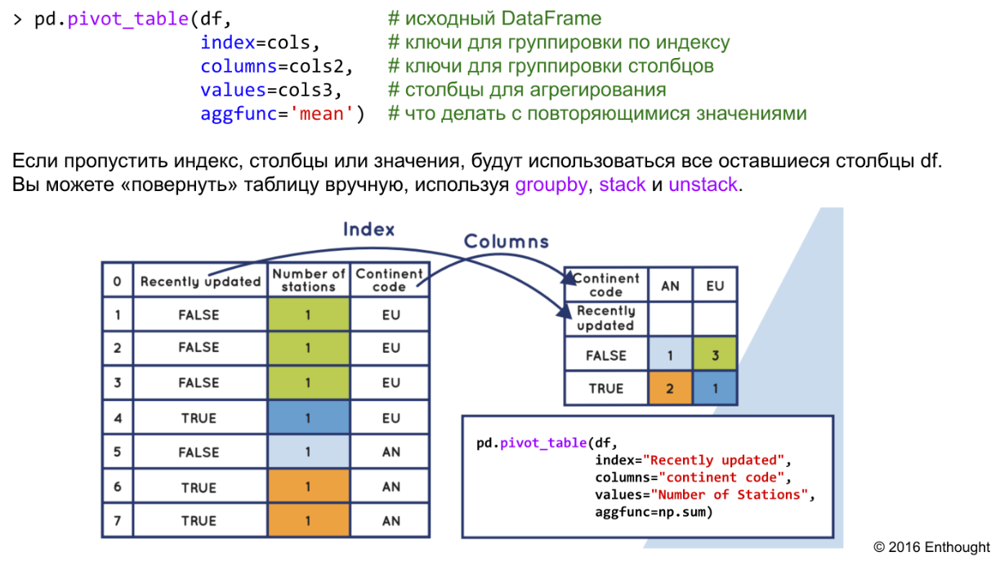

Посмотрим, как такие функции работают.

```python
fix_info.head(3)
```

|       | car_id     | worker_id | fix_date       | work_type | destroy_degree | work_duration | worker_speed | worker_ experience |
| ----- | ---------- | --------- | -------------- | --------- | -------------- | ------------- | ------------ | ------------------ |
| **0** | P17494612l | RJ        | 2020-6-20 2:14 | reparking | 8.0            | 49            | 25.413386    | 254                |
| **1** | N-1530212S | LM        | 2020-2-9 20:25 | repair    | 10.0           | 48            | 26.824627    | 268                |
| **2** | B-1154399t | ND        | 2019-8-24 7:1  | reparking | 1.0            | 27            | 25.714286    | 301                |

```python
fix_info_pivot = fix_info.pivot_table(
    index="car_id",  # Строка, для которой хотим сгенерировать признаки
    columns=["work_type"],  # Колонка, которую вытянем в столбец
    values=["destroy_degree"],  # Столбец, по которому будем считать статистики
    aggfunc=["mean", 'count'],  # Признаки для генерации (mean/count/sum)
).fillna(0)

fix_info_pivot.columns = [f"{i[2]}_{i[0]}" for i in fix_info_pivot.columns]
fix_info_pivot.reset_index(inplace=True)

fix_info_pivot.sample(3)
```

|          | car_id     | oil_change_mean | refuel_mean | refuel_check_mean | refuel_reparking_mean | repair_mean | reparking_mean | oil_change_count | refuel_count | refuel_check_count | refuel_reparking_count | repair_count | reparking_count |
| -------- | ---------- | --------------- | ----------- | ----------------- | --------------------- | ----------- | -------------- | ---------------- | ------------ | ------------------ | ---------------------- | ------------ | --------------- |
| **1250** | P-8016178d | 0.0             | 1.0         | 1.0               | 0.0                   | 5.457143    | 1.411765       | 0.0              | 1.0          | 3.0                | 0.0                    | 14.0         | 17.0            |
| **250**  | C50021983M | 0.0             | 1.0         | 1.0               | 1.0                   | 5.578571    | 1.000000       | 0.0              | 1.0          | 3.0                | 1.0                    | 14.0         | 15.0            |
| **655**  | I-1834975z | 0.0             | 1.0         | 1.0               | 0.0                   | 6.182353    | 1.000000       | 0.0              | 3.0          | 2.0                | 0.0                    | 17.0         | 13.0            |


Теперь разметим все поездки в таргет и посмотрим, какие паттерны можно извлечь из временных рядов, которые появляются в наших данных.

```python
import pandas as pd

train = pd.read_csv("../data/car_train.csv")
rides = pd.read_csv("../data/rides_info.csv")

rides = train.merge(rides, on="car_id", how="left")
rides.head(4)
```

|       | car_id     | model          | car_type | fuel_type | car_rating | year_to_start | riders | year_to_work | target_reg | target_class | ...  | rating | ride_duration | ride_cost | speed_avg | speed_max | stop_times | distance     | refueling | user_ride_quality | deviation_normal |
| ----- | ---------- | -------------- | -------- | --------- | ---------- | ------------- | ------ | ------------ | ---------- | ------------ | ---- | ------ | ------------- | --------- | --------- | --------- | ---------- | ------------ | --------- | ----------------- | ---------------- |
| **0** | y13744087j | Kia Rio X-line | economy  | petrol    | 3.78       | 2015          | 76163  | 2021         | 109.99     | another_bug  | ...  | 5.72   | 220           | 3514      | 42        | NaN       | 6          | 1.682556e+03 | 0         | 0.524750          | 0.0              |
| **1** | y13744087j | Kia Rio X-line | economy  | petrol    | 3.78       | 2015          | 76163  | 2021         | 109.99     | another_bug  | ...  | 2.52   | 37392         | 523483    | 45        | 53.0      | 2          | 1.711379e+06 | 0         | 1.723151          | 0.0              |
| **2** | y13744087j | Kia Rio X-line | economy  | petrol    | 3.78       | 2015          | 76163  | 2021         | 109.99     | another_bug  | ...  | 7.17   | 45            | 444       | 54        | 82.0      | 0          | 9.523155e+02 | 0         | 0.876440          | -0.0             |
| **3** | y13744087j | Kia Rio X-line | economy  | petrol    | 3.78       | 2015          | 76163  | 2021         | 109.99     | another_bug  | ...  | 6.19   | 10            | 105       | 35        | 40.0      | 0          | 2.372539e+02 | 0         | 1.274242          | -0.0             |


```markup
4 rows × 23 columns
```

Посмотрим, как ведет себя `deviation_normal` для 10 автомобилей:

```python
tmp = rides
cols2select = [ "deviation_normal", "ride_date", "target_class", "car_id", "user_ride_quality", ]
ids2select = ["f-4873956c", "p-7109749V", "p-3304414p", "f-1300760u", "L-4452446Z"]
tmp = tmp[tmp["car_id"].isin(tmp.car_id.sample(1000, random_state=8).unique()[:15])]
tmp = tmp[tmp["car_id"].isin(ids2select)][cols2select]
import seaborn as sns
g = sns.relplot(
    data=tmp,
    kind="line",
    x="ride_date",
    y="deviation_normal",  # user_ride_quality
    hue="target_class",
    aspect=4,
    style="car_id",
    legend=True,
)
g.set_xticklabels(rotation=45, horizontalalignment="right", step=4);
```

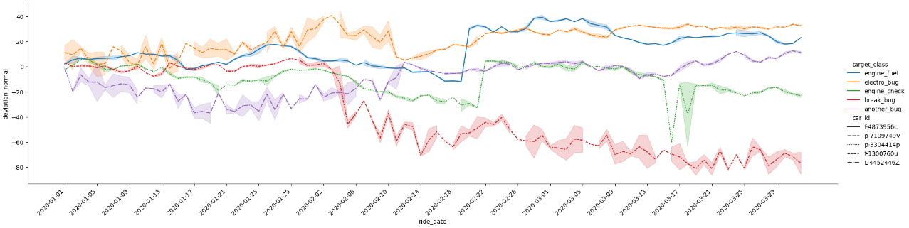

Можно увидеть, что в зависимости от класса будущей поломки, машины имеют разные паттерны поведения во времени`:`

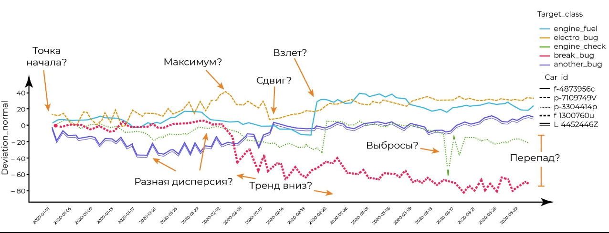

Для каждой машины есть своя история поездок. У каждой истории есть свои паттерны в зависимости от будущей поломки:

- Статистики (среднее, дисперсия, максимум или количество);
- Сложные признаки с помощью функций.

Стоит извлекать всю информацию, которая есть в наших данных. Если мы построим тот же график, но для другого признака, который называется `user_ride_quality`, то мы увидим, что этот признак тоже позволяет отличать некоторые классы. Какие-то признаки по типу среднего значения не очень информативны, потому что среднее значение будет одинаковым у большого количества машин, но дисперсия или перепад между начальным и конечным значением будут более полезными.

В других признаках тоже можно найти интересные паттерны.

```python
import seaborn as sns

g = sns.relplot(
    data=tmp,
    kind="line",
    x="ride_date",
    y="user_ride_quality",  # user_ride_quality
    hue="target_class",
    aspect=4,
    style="car_id",
    legend=True,
)
g.set_xticklabels(rotation=45, horizontalalignment="right", step=2);
```

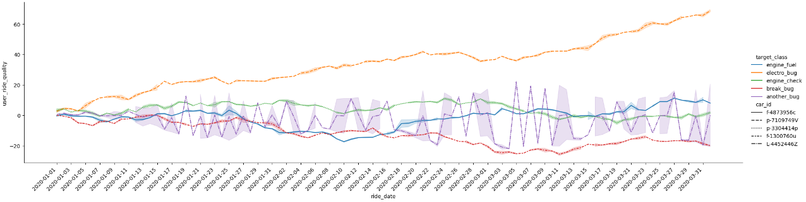

**Список признаков, которые можно погенерировать для датасета на основе графика:**

- `feature_min_max_diff`: разница между максимальным и минимальным значениями `deviation_normal` для каждой машины;
- `feature_corner`: угол наклона по признаку `user_ride_quality` для каждой машины;
- `feature_mean`: среднее значение `deviation_normal`для каждой машины;
- `feature_shift`: точка перегиба или сдвига для `deviation_normal`;
- `feature_start`: значение точки старта для `deviation_normal`;
- `feature_nans`: сумма пропусков для столбца для каждой машины;
- `feature_quant`: X% квантиль для столбца для каждой машины.

Возможно, не все эти признаки понадобятся вам для задачи курса, но это хороший шанс потренироваться. После этих задач вы будете свободнее чувствовать себя в извлечении полезных паттернов из логов и временных рядов.

## Проверка признаков

При генерации фичей легко может пойти что-то не так — вы задумывали одно, а на деле получили совсем иное. Поэтому важно проверять признаки.

**Два метода Pandas для проверки признаков:**

- `df.feature.hist()` — вывести гистограмму;
- `df.feature.value_counts()` — вывести численное распределение.

Посмотрим, как это работает. Предположим, мы сгенерировали код:

```python
bad_func = lambda x: sum(x <= -100)

tmp = fix_info.groupby("car_id", as_index=False).agg(

    # Все встроенные статистики
    good_feature =("work_duration", "mean"),
    gold_feature =("work_duration", "max"),
    killer_feature =("destroy_degree", "std"),

    # Самописные функции для категорий
    bad_feature =("destroy_degree", bad_func),
)

tmp.hist(figsize=(25, 3), layout=(1, 4))
tmp.sample(3)
```

Мы не заметили, что что-то сломалось. На выходе получили, что один из признаков имеет только одно значение, что неинформативно:

|          | car_id     | good_feature | gold_feature | killer_feature | bad_feature |
| -------- | ---------- | ------------ | ------------ | -------------- | ----------- |
| **247**  | C29045893T | 25.142857    | 46           | 2.715616       | 0           |
| **2354** | d-1302572o | 23.882353    | 61           | 1.894254       | 0           |
| **294**  | D-8569809Z | 25.117647    | 58           | 2.676412       | 0           |

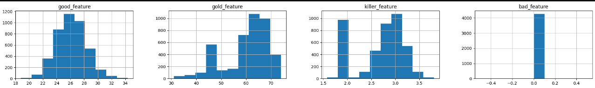

Применение методов `df.feature.hist()` и `df.feature.value_counts()` помогает мониторить такие ошибки и вовремя их исправлять. Иначе модель не получит какой-то полезной информации, которую мы хотели в нее заложить.

## Визуализация признаков

При генерации признаков полезно использовать навык визуализации данных. Посмотрим на нашем примере.

```python
# Добавим к исходной таблице новые признаки
tmp = train.merge(fix_info_gr, on="car_id", how="left")
tmp.head(3)
```

|       | car_id     | model           | car_type | fuel_type | car_rating | year_to_start | riders | year_to_work | target_reg | target_class | worker_count | work_duration_mean | work_duration_max | destroy_degree_std | destroy_degree_sum | work_type_nuniq | work_type_mode | work_type_second_mode | destroy_degree_crit_q | worker_quant_exp |
| ----- | ---------- | --------------- | -------- | --------- | ---------- | ------------- | ------ | ------------ | ---------- | ------------ | ------------ | ------------------ | ----------------- | ------------------ | ------------------ | --------------- | -------------- | --------------------- | --------------------- | ---------------- |
| **0** | y13744087j | Kia Rio X-line  | economy  | petrol    | 3.78       | 2015          | 76163  | 2021         | 109.99     | another_bug  | 35           | 26.657143          | 56                | 2.732847           | 106.7              | 4               | reparking      | repair                | 2                     | 271.8            |
| **1** | O41613818T | VW Polo VI      | economy  | petrol    | 3.90       | 2015          | 78218  | 2021         | 34.48      | electro_bug  | 35           | 24.942857          | 48                | 2.707233           | 102.1              | 5               | reparking      | repair                | 1                     | 264.6            |
| **2** | d-2109686j | Renault Sandero | standart | petrol    | 6.30       | 2012          | 23340  | 2017         | 34.93      | gear_stick   | 35           | 26.142857          | 59                | 2.978077           | 130.9              | 5               | repair         | reparking             | 2                     | 265.0            |


Построим с помощью `Seaborn` небольшую графику, чтобы посмотреть, как зависит на сгенерированный признак от количества поездок.

```python
import seaborn as sns

g = sns.displot(
    data=tmp,
    x="destroy_degree_sum",
    y="riders",
    aspect=2,
    kind="hist",
    alpha=0.8,
    hue="target_class",
    col="work_type_second_mode",
).set_xticklabels(rotation=45, horizontalalignment="right")
```

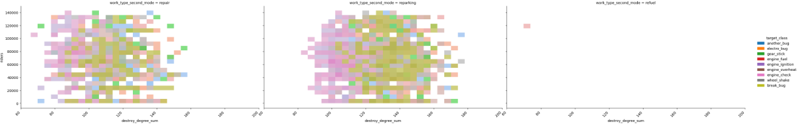

Мы видим, что признак `destroy_degree` не очень хорошо позволяет разделить между собой классы. Но если мы применим другую функцию агрегации, то увидим, что классы стали разделяться лучше:

```python
g = sns.displot(
    data=tmp,
    x="destroy_degree_std",
    y="riders",
    aspect=2,
    kind="hist",
    alpha=0.8,
    hue="target_class",
    col="work_type_second_mode",
).set_xticklabels(rotation=45, horizontalalignment="right");
```

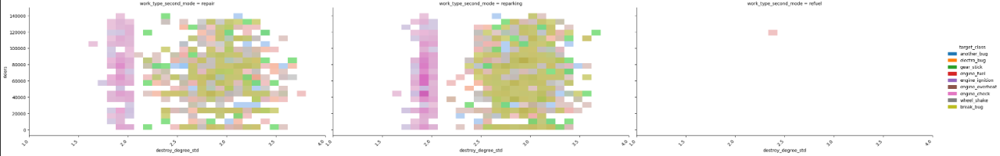

Визуально видно, что `destroy_degree_std` полезнее для классификации, чем признак `destroy_degree_sum`.

## Выводы

- По возможности стоит покрыть все имеющиеся таблицы.
- Полезные связки методов для генерации: `groupby` + `agg` и `groupby` + `transform`.
- Важно искать полезные паттерны глазами.
- Полезно смотреть на качество признаков.

# **Feature Selection**

## Зачем отбирать признаки

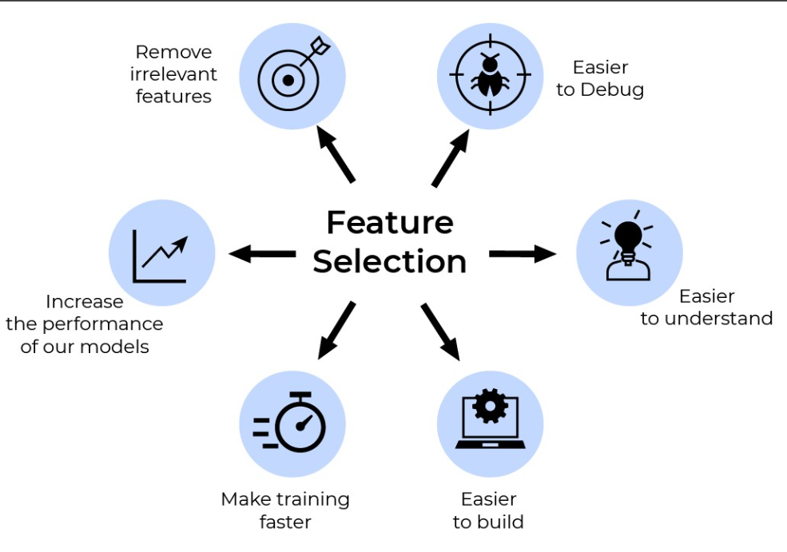

В уроках о Feature Engineering признаков мы увидели, что можно достаточно быстро нагенерировать большое количество фичей. Зачем выкидывать часть из них?

**Основные причины:**

- Если фичей очень много, то данные не помещаются в память. Это существенно **увеличивает время обучения модели**, тем более если мы захотим протестировать несколько разных алгоритмов или ансамбль. Особенно в условиях ограничения платформ на длительность одной сессии (в Kaggle 12 часов) и лимиты по потребляемой памяти.
- Главная причина — с увеличением количества признаков часто **падает точность предсказания модели**, особенно если в данных большое количество мусорных фичей (почти не коррелирующих с таргетом). Некоторые алгоритмы при сильном увеличении числа признаков вообще перестают адекватно работать.
- Даже если точность не снижается, есть риск, что модель опирается на шумные фичи. Это **снижает стабильность прогноза** на приватной выборке.

Описание методов фильтрации признаков

**Методы отбора признаков:**

- Filter methods.
- Wrapper methods.
- Embedded methods.

## Описание методов фильтрации признаков

### Filter methods (методы фильтрации)

Методы фильтрации основаны на статистических методах и, как правило, рассматривают каждый признак независимо. Они позволяют оценить и ранжировать фичи по значимости, за которую принимается степень корреляции этой фичи с целевой переменной.

**Преимущества**:

- Низкая цена вычислений, которая линейно зависит от общего количества признаков.
- Значительно быстрее wrapper и embedded методов.
- Хорошо работают даже тогда, когда число признаков превышает количество примеров в обучающей выборке (методы других категорий не всегда могут похвастаться этим).

**Основной недостаток** — методы рассматривают каждый признак изолированно от других. Именно поэтому они не такие точные, хотя могут быстро отранжировать признаки. Но прогресс не стоит на месте и появляются filter-методы, которые пытаются решить эту проблему разными способами — на основе взаимной информации признаков или учитывая избыточность признаков (метод mRmR — минимальная избыточность при максимальной релевантности).

Некоторые из таких методов реализованы в разделе sklearn.feature_selection библиотеки scikit-learn, например, SelectKBest, chi2 и пр. Feature Importance в библиотеках градиентных бустингов также основаны на этой методике, но при этом их можно отнести и к встроенным методам (это дискуссионный вопрос).

### Embedded methods (встроенные методы)

Встроенные методы встроены прямо в процесс обучения модели. Эти модели позволяют не разделять процессы тренировки и отбора признаков, т. е. во время обучения модели проводить отсев и на выходе получить модель, которая знает, на какие признаки обращать больше внимания, а какие — мусор.

Эти методы требуют меньше вычислений, чем wrapper методы, но больше, чем методы фильтрации.

**Основные методы:**

- регуляризация (например, LASSO и Ridge регрессии, свои регуляризации есть в бустингах и нейросетях);
- алгоритмы Decision Tree и Random Forest.

**Недостатки:**

- Хотя бы раз придется обучить модель на всех признаках и посмотреть коэффициенты, что не всегда удобно и осуществимо.
- Обученная на всех признаках модель медленнее работает при инференсе.

Но в общем случае этот метод способен лучше уловить взаимозависимости переменных, чем методы фильтрации.

### Wrapper methods (методы обертки)

Методы «оборачивают» обучение модели в последовательное удаление (Backward Feature Selection) или добавление (Forward Feature Selection) признаков. Backward feature selection лучше отслеживает взаимосвязи между фичами, но гораздо дороже вычислительно.

**Недостатки:**

- Долгое время вычислений.
- Опасность переобучения, в случае большого количества признаков и небольшого размера тренировочного датасета.

**Примеры методов:**

- RFE (Recursive Feature Elimination) из библиотеки scikit-learn.
- Boruta из пакета BorutaPy (для алгоритма Random Forest) и др.

Порой бывает трудно однозначно определить, к какой группе относится тот или иной метод. К тому же, он может и вовсе оказаться гибридом, который сочетает несколько методов. Например, при использовании библиотеки градиентного бустинга CatBoost можно «потрогать» методы всех трех типов или их сочетания:

- Если возьмем Feature Importance c дефолтными параметрами и отключенной регуляризацией, то получим метод фильтрации.
- Если в модель добавим параметры, отвечающие за регуляризацию, то получим своеобразный гибрид — вроде метод фильтрации, но вместе с тем с регуляризацией (встроенный метод).
- Если применим встроенную в CatBoost функцию `feature_selection()`, то будет работать метод обертки с Backward Feature Selection.

Применение методов фильтрации признаков на практике

Чтобы разобраться, будем использовать датасет, который описывает поломки машин.

```python
!pip install catboost shap -q

import numpy as np
import pandas as pd
import matplotlib.pyplot as plt
import seaborn as sns
import shap
# Загружаем датасет из quickstart'а

df = pd.read_csv('../data/quickstart_train.csv')
df.head(3)
```

|       | car_id     | model           | car_type | fuel_type | car_rating | year_to_start | riders | year_to_work | target_reg | target_class | mean_rating | distance_sum | rating_min | speed_max  | user_ride_quality_median | deviation_normal_count | user_uniq |
| ----- | ---------- | --------------- | -------- | --------- | ---------- | ------------- | ------ | ------------ | ---------- | ------------ | ----------- | ------------ | ---------- | ---------- | ------------------------ | ---------------------- | --------- |
| **0** | y13744087j | Kia Rio X-line  | economy  | petrol    | 3.78       | 2015          | 76163  | 2021         | 109.99     | another_bug  | 4.737759    | 1.214131e+07 | 0.1        | 180.855726 | 0.023174                 | 174                    | 170       |
| **1** | O41613818T | VW Polo VI      | economy  | petrol    | 3.90       | 2015          | 78218  | 2021         | 34.48      | electro_bug  | 4.480517    | 1.803909e+07 | 0.0        | 187.862734 | 12.306011                | 174                    | 174       |
| **2** | d-2109686j | Renault Sandero | standart | petrol    | 6.30       | 2012          | 23340  | 2017         | 34.93      | gear_stick   | 4.768391    | 1.588366e+07 | 0.1        | 102.382857 | 2.513319                 | 174                    | 173       |

```python
df.deviation_normal_count.value_counts()
174    2337
Name: deviation_normal_count, dtype: int64
```

**Что удалить сразу:**

- константы;
- уникальные значения (в том числе в тесте, как правило, ID по типу `car_id`).

```python
cols2drop = ['car_id', 'deviation_normal_count']
df.drop(cols2drop, axis=1, inplace=True, errors = 'ignore')
```

Добавим рандомные признаки в датасет:

```python
df['random_int'] = np.random.randint(-20, 200, df.shape[0]) # Целочисленный признак
df['random_num'] = np.random.random(size = df.shape[0]) # Признак типа float с равномерным распределением
df['random_norm'] = np.random.normal(loc = 4, scale = 1.5, size = df.shape[0]) # Признак с нормальным распределением
df['random_cat'] = np.random.choice(['A', 'B', 'C', 'D'], p = [0.20, 0.3, 0.45, 0.05], size = df.shape[0]) # Категориальный признак str формата с дисбалансом
df['random_ord'] = np.random.choice([1, 10, 100, 1000], p = [0.40, 0.3, 0.2, 0.1], size = df.shape[0]) # Численный категориальный признак

df.hist(figsize = (20, 7), layout = (-1, 5), bins=30);
```

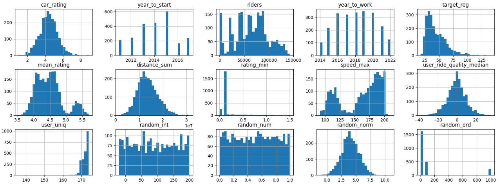

## Применение методов фильтрации признаков на практике

### Линейная корреляция

```python
corrs = df.dropna().corr().round(3).sort_values('target_reg')
sns.heatmap(corrs,
            cmap = 'Greens',
            square=True,
            vmin = 0)
<AxesSubplot: >
```

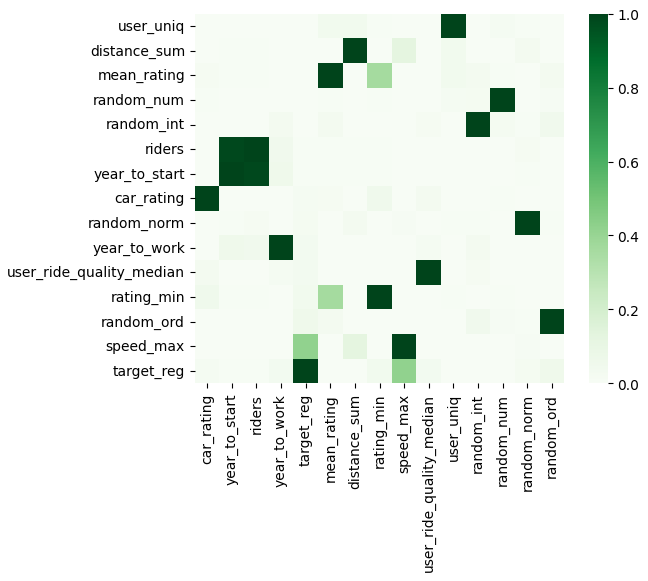

**Преимущество —** быстро и понятно.

**Недостатки:**

- Не улавливает нелинейные зависимости.
- Упускает парные зависимости.
- Не подходит для категорий (нужен другой статистический критерий).

### Phik

Phik — по сути, это та же линейная корреляция, но на стероидах.

```python
!pip install phik -q
import phik
from phik.report import plot_correlation_matrix
from phik import report
phik_overview = df.phik_matrix().round(2).sort_values('target_reg')

plot_correlation_matrix(phik_overview.values, 
                        x_labels=phik_overview.columns, 
                        y_labels=phik_overview.index, 
                        vmin=0, vmax=1, color_map="Greens", 
                        title=r"correlation $\phi_K$", 
                        fontsize_factor=0.8, figsize=(11, 6))
plt.tight_layout()
interval columns not set, guessing: ['car_rating', 'year_to_start', 'riders', 'year_to_work', 'target_reg', 'mean_rating', 'distance_sum', 'rating_min', 'speed_max', 'user_ride_quality_median', 'user_uniq', 'random_int', 'random_num', 'random_norm', 'random_ord']
```

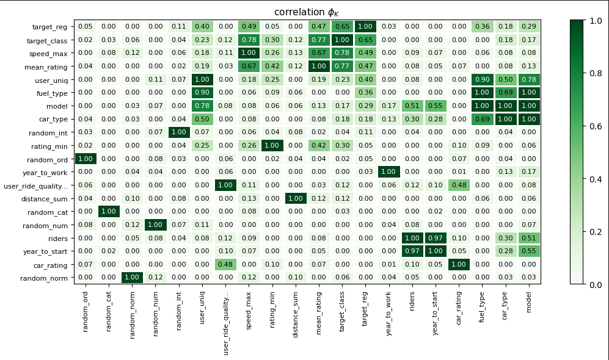

```python
significance_overview = df.significance_matrix().fillna(0).round(1).sort_values('target_reg')

plot_correlation_matrix(significance_overview.values, 
                        x_labels=significance_overview.columns, 
                        y_labels=significance_overview.index, 
                        vmin=0, vmax=1, color_map="Greens",
                        title="Significance of the coefficients", 
                        usetex=False, fontsize_factor=0.8, figsize=(11, 6))
plt.tight_layout()
interval columns not set, guessing: ['car_rating', 'year_to_start', 'riders', 'year_to_work', 'target_reg', 'mean_rating', 'distance_sum', 'rating_min', 'speed_max', 'user_ride_quality_median', 'user_uniq', 'random_int', 'random_num', 'random_norm', 'random_ord']
```

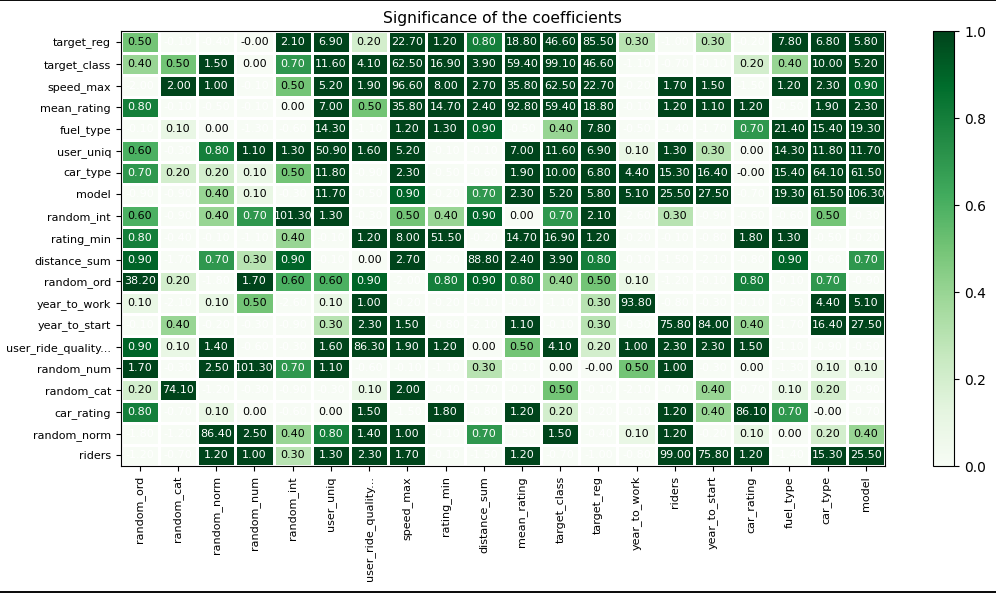

Если логарифмическая вероятность результата больше 6.63, вероятность того, что результат произойдет случайно, составляет менее 1%. Таким образом, мы можем быть на 99% уверены, что результат действительно что-то значит. В терминах p-value обычно это выражается как p < 0.01.

Если логарифмическая вероятность составляет 3.84 или более, вероятность того, что это произойдет случайно, составляет менее 5%. Так что мы на 95% уверены в результате. В терминах p-value выражается как p < 0.05.

**Преимущества:**

- Работает с категориальными значениями.
- Ловит нелинейные зависимости.

**Недостатки:**

- Не ловит парные зависимости.
- Долго считается, если много признаков.

### Feature Importance

Feature Importance — распространенный метод, с помощью которого можно определить, насколько признак важен для модели. Для примера возьмем библиотеку градиентного бустинга CatBoost.

```python
from catboost import CatBoostRegressor, Pool, CatBoostClassifier
from sklearn.model_selection import train_test_split
drop_cols = ['car_id', 'target_class', 'target_reg']
cat_cols = ['car_type', 'fuel_type', 'model', 'random_cat']

X = df.drop(drop_cols, axis=1, errors = 'ignore')
y = df['target_class'].fillna(0)
X_train, X_test, y_train, y_test = train_test_split(X, y, test_size=0.2, random_state=42)
model = CatBoostClassifier(random_state=42,
                           cat_features=cat_cols,
                           thread_count=-1)
model.fit(X_train, y_train, 
          eval_set=(X_test, y_test),
          verbose=100, plot=False, 
          early_stopping_rounds=100)
Learning rate set to 0.109335
0:	learn: 1.8563492	test: 1.8673405	best: 1.8673405 (0)	total: 119ms	remaining: 1m 58s
100:	learn: 0.3900696	test: 0.5529370	best: 0.5529370 (100)	total: 6.43s	remaining: 57.2s
200:	learn: 0.2711183	test: 0.5427949	best: 0.5417541 (187)	total: 13s	remaining: 51.6s
300:	learn: 0.2015605	test: 0.5392054	best: 0.5363573 (271)	total: 19.6s	remaining: 45.6s
Stopped by overfitting detector  (100 iterations wait)

bestTest = 0.5363573323
bestIteration = 271

Shrink model to first 272 iterations.

<catboost.core.CatBoostClassifier at 0x7fc233fc91f0>
# Посмотрим на важность признаков катбуста
fi = model.get_feature_importance(prettified=True)
fi
```

|        | Feature Id               | Importances |
| ------ | ------------------------ | ----------- |
| **0**  | speed_max                | 33.259103   |
| **1**  | mean_rating              | 30.893452   |
| **2**  | rating_min               | 12.562521   |
| **3**  | model                    | 3.825184    |
| **4**  | car_type                 | 2.913044    |
| **5**  | user_uniq                | 2.849120    |
| **6**  | random_cat               | 2.249417    |
| **7**  | user_ride_quality_median | 1.552832    |
| **8**  | riders                   | 1.478427    |
| **9**  | distance_sum             | 1.459926    |
| **10** | random_norm              | 1.404754    |
| **11** | random_num               | 1.345211    |
| **12** | random_int               | 1.283274    |
| **13** | year_to_work             | 1.151977    |
| **14** | car_rating               | 1.052139    |
| **15** | year_to_start            | 0.355329    |
| **16** | random_ord               | 0.325499    |
| **17** | fuel_type                | 0.038789    |

```python
feature_importance = model.feature_importances_
sorted_idx = np.argsort(feature_importance)
fig = plt.figure(figsize=(12, 6))
plt.barh(range(len(sorted_idx)), feature_importance[sorted_idx], align='center')
plt.yticks(range(len(sorted_idx)), np.array(X.columns)[sorted_idx])
plt.title('Feature Importance');
```

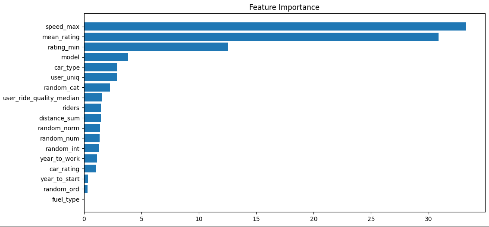

Найденный топ-фичей — это не всегда подмножество, на котором модель покажет наилучшую точность. Если взять Feature Importance, обучив модель бустинга 1 раз, при наличии большого числа сильноскоррелированных признаков они поделят importance между собой (т. к. дерево выберет не одну из них, а все, а частота выбора маленькая) и упадут вниз в топе по важности. Если мы возьмем топ-N, то мы их обрежем, а в топе останется мусор.

### Permutation Importance

Permutation Importance из библиотеки scikit-learn произвольным образом перетасовывает значения в одном столбце из датасета валидации, оставив все остальные столбцы нетронутыми. Признак считается «важным», если точность модели падает и его изменение вызывает увеличение ошибок. С другой стороны, признак считается «неважным», если перетасовка его значений не влияет на точность модели.

В оценке важности признаков таким способом кроется много подводных камней. Например, признак A присутствует лишь в небольшой доле объектов, но сильно влияет на результат, тогда как признак B оказывает лишь небольшое влияние на результат, но во всех объектах. Оба этих признака важны, но эта важность разного рода. В стандартных методах оценки важности признаков не будет видно этого различия.

```python
from sklearn.inspection import permutation_importance

perm_importance = permutation_importance(model, X_test, y_test, n_repeats=10, random_state=1066)
sorted_idx = perm_importance.importances_mean.argsort()
fig = plt.figure(figsize=(12, 6))
plt.barh(range(len(sorted_idx)), perm_importance.importances_mean[sorted_idx], align='center')
plt.yticks(range(len(sorted_idx)), np.array(X.columns)[sorted_idx])
plt.title('Permutation Importance');
```

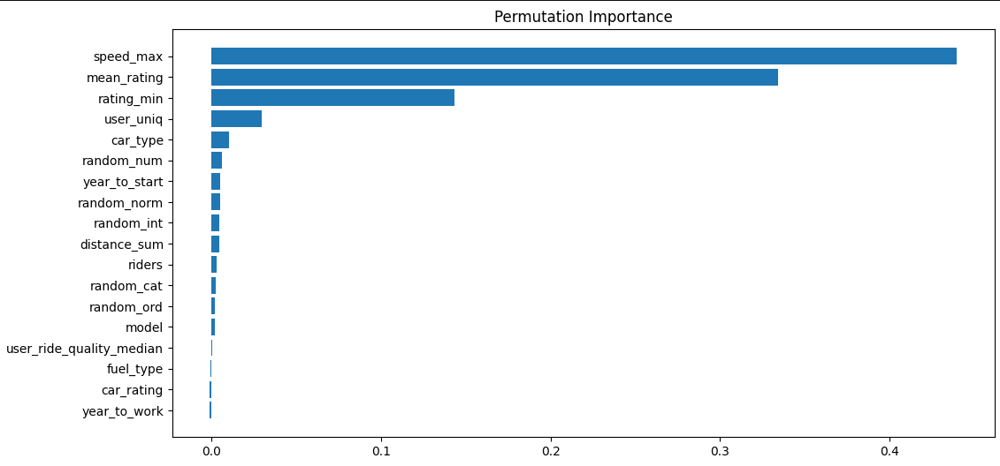

Важность признаков сильно зависит от особенностей распределения данных, а распределение может отличаться при обучении и инференсе. Эта особенность добавляет неоднозначности понятию важности признака.

**Можно ли рандомные признаки использовать как границу для отсеивания.** Как можем увидеть, и в Importance CatBoost и в Permutation Importance рандомный признак попал в топ-10 рейтинга. Следовательно, все, что ниже, можно считать шумом и откидывать. Интересно, что признак model оказался ниже рандома, хотя в других рейтингах находился достаточно высоко.

В общем, можно использовать рандомные признаки как границу для отсеивания, но нет гарантий, что даст улучшение, так как можно случайно выбросить полезные признаки. Это надо проверять валидацией.

В целом, переобученная модель может давать неверную важность признаков. Если релевантность признаков заранее известна, то это помогает распознать переобучение, но если релевантность заранее неизвестна, то отбор признаков на основе важности только усилит переобучение.

SHAP values

SHAP values — более современный способ оценки важности признаков. Они основаны на теории игр и позволяют оценить важность признаков на конкретном тестовом примере.

Но SHAP values также имеют некоторые проблемы. Они зависят от распределения данных, то есть являются характеристикой не только модели, но и объединенной системы «модель + распределение данных». При этом можно получить ненулевые SHAP values для тех признаков, которые никак не используются моделью.

```python
# Посмотрим на SHAP values
explainer = shap.TreeExplainer(model)

val_dataset = Pool(data=X_test, label=y_test, cat_features=cat_cols)
shap_values = explainer.shap_values(val_dataset)
shap.summary_plot(shap_values, X_test, max_display = 25)
```

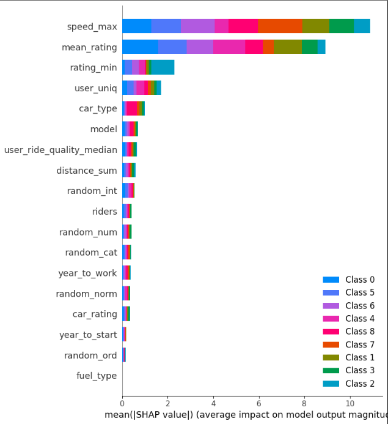

Более подробно про библиотеку SHAP расскажем в следующем уроке.

### CatBoost Feature Selection (рекурсивные методы)

**Суть рекурсивных алгоритмов:** удаляем признаки и смотрим, уменьшится ли качество. Если уменьшилось, значит, признак вредный.

В библиотеке CatBoost есть встроенный метод для отбора признаков `select_features`, который поддерживает три алгоритма отбора признаков — параметр `algorithm`:

- `RecursiveByPredictionValuesChange` — самый быстрый и достаточно точный.
- `RecursiveByLossFunctionChange` — оптимальный по соотношению точность/скорость.
- `RecursiveByShapValues` (по умолчанию) — наиболее точный, но самый ресурсозатратный.

Если не хватает времени (ресурсов) на самый точный алгоритм, можно попробовать другие.

```python
summary = model.select_features(X_train, y_train, 
                      eval_set=(X_test, y_test),
                      features_for_select='0-13',
                      num_features_to_select=8,
                      steps=1,
                      train_final_model=False,
                      logging_level='Silent')
# Посмотрим на список отобранных фичей (не отранжирован по важности)
print(summary['selected_features_names'])
# И на лучшее значение лосса
print(f"Best loss: {summary['loss_graph']['loss_values'][-1]}")
['car_type', 'fuel_type', 'year_to_start', 'mean_rating', 'rating_min', 'speed_max', 'user_ride_quality_median', 'user_uniq']
Best loss: 0.5341921519552307
```


```python
# В summary сохраняется полный отчет работы алгоритма
summary
{'selected_features': [1, 2, 4, 7, 9, 10, 11, 12],
 'eliminated_features_names': ['riders',
  'distance_sum',
  'year_to_work',
  'model',
  'car_rating',
  'random_int'],
 'loss_graph': {'main_indices': [0],
  'removed_features_count': [0, 1, 2, 3, 4, 5, 6],
  'loss_values': [0.5507680694161472,
   0.5452734618145249,
   0.5407711372499631,
   0.5385628759799655,
   0.5367983102948016,
   0.5352907877879963,
   0.5341921519552307]},
 'eliminated_features': [5, 8, 6, 0, 3, 13],
 'selected_features_names': ['car_type',
  'fuel_type',
  'year_to_start',
  'mean_rating',
  'rating_min',
  'speed_max',
  'user_ride_quality_median',
  'user_uniq']}
```

Видим, что с каждой итерацией отбрасывалось по одной фиче, а точность возрастала.

### Boruta

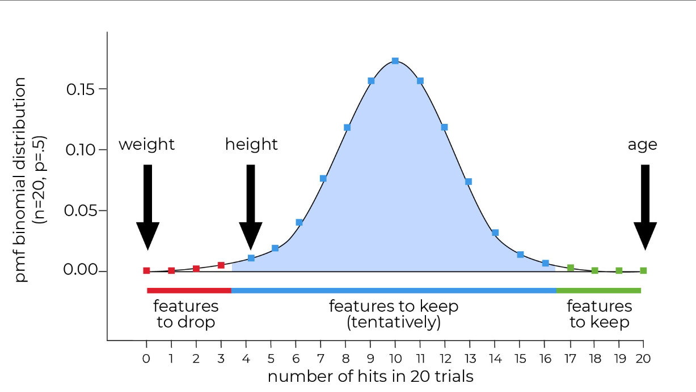

Boruta — метод отбора признаков, пришедший из языка R. Хорошо работает только с алгоритмом Random Forest и достаточно долго вычисляется.

**Примерный принцип работы:**

- Создается копия всех признаков из исходного набора данных.
- Случайным образом перемешиваются значения новых признаков — эти перемешанные дубли называются теневыми (shadow features).
- N раз запускается обучение случайного леса, что дает возможность сгладить случайный шум при оценке важностей.
- Отсекается часть признаков по вычисленному порогу.
- И начинается новый раунд с первого пункта (N раундов).
- В итоге исходные признаки попадают в 3 зоны: красную, синюю и зеленую.
- Все признаки из красной зоны можно удалять, из синей — сохраняем, зеленые самые сильные.

```python
X_train_one_hot = pd.get_dummies(X_train[cat_cols])
X_train = pd.concat((X_train.drop(columns=cat_cols), X_train_one_hot), axis=1).fillna(0)
X_train.head()
```

|          | car_rating | year_to_start | riders | year_to_work | mean_rating | distance_sum | rating_min | speed_max  | user_ride_quality_median | user_uniq | ...  | model_Smart ForTwo | model_Tesla Model 3 | model_VW Polo | model_VW Polo VI | model_VW Tiguan | model_Volkswagen ID.4 | random_cat_A | random_cat_B | random_cat_C | random_cat_D |
| -------- | ---------- | ------------- | ------ | ------------ | ----------- | ------------ | ---------- | ---------- | ------------------------ | --------- | ---- | ------------------ | ------------------- | ------------- | ---------------- | --------------- | --------------------- | ------------ | ------------ | ------------ | ------------ |
| **1573** | 3.44       | 2011          | 684    | 2022         | 4.558103    | 1.229334e+07 | 0.0        | 200.000000 | -2.781503                | 172       | ...  | 0                  | 0                   | 0             | 0                | 0               | 0                     | 1            | 0            | 0            | 0            |
| **65**   | 4.62       | 2015          | 87418  | 2019         | 3.985345    | 1.296057e+07 | 0.1        | 179.759061 | -27.862787               | 173       | ...  | 0                  | 0                   | 0             | 1                | 0               | 0                     | 0            | 0            | 0            | 1            |
| **1251** | 3.52       | 2017          | 109933 | 2021         | 4.298103    | 1.020725e+07 | 0.1        | 189.827476 | -7.945007                | 170       | ...  | 0                  | 0                   | 0             | 0                | 0               | 0                     | 0            | 0            | 1            | 0            |
| **353**  | 5.30       | 2013          | 40347  | 2017         | 4.204828    | 1.195070e+07 | 0.1        | 177.857190 | -4.105497                | 170       | ...  | 0                  | 0                   | 0             | 0                | 0               | 0                     | 0            | 0            | 0            | 1            |
| **700**  | 4.16       | 2016          | 110318 | 2019         | 5.419828    | 1.415952e+07 | 0.1        | 103.765484 | -1.586736                | 172       | ...  | 0                  | 0                   | 0             | 0                | 0               | 0                     | 0            | 0            | 0            | 1            |


```markup
5 rows × 50 columns
# !pip install boruta -q

from boruta import BorutaPy
from sklearn.ensemble import RandomForestRegressor, RandomForestClassifier
###initialize Boruta
forest = RandomForestClassifier(
   n_jobs = -1, 
   max_depth = 3
)
boruta = BorutaPy(
   estimator = forest, 
   n_estimators = 'auto',
   max_iter = 8, # number of trials to perform
    verbose=1
)
### fit Boruta (it accepts np.array, not pd.DataFrame)
boruta.fit(np.array(X_train), np.array(y_train))
### print results
green_area = X_train.columns[boruta.support_].to_list()
blue_area = X_train.columns[boruta.support_weak_].to_list()
red_area = X_train.columns[~(boruta.support_ | boruta.support_weak_)].to_list()
print('features in the green area:', green_area)
print('features in the blue area:', blue_area)
print('features in the red area:', red_area)
Iteration: 1 / 8
Iteration: 2 / 8
Iteration: 3 / 8
Iteration: 4 / 8
Iteration: 5 / 8
Iteration: 6 / 8
Iteration: 7 / 8

BorutaPy finished running.

Iteration: 	8 / 8
Confirmed: 	0
Tentative: 	6
Rejected: 	0
features in the green area: []
features in the blue area: ['mean_rating', 'distance_sum', 'rating_min', 'speed_max', 'user_ride_quality_median', 'user_uniq']
features in the red area: ['car_rating', 'year_to_start', 'riders', 'year_to_work', 'random_int', 'random_num', 'random_norm', 'random_ord', 'car_type_business', 'car_type_economy', 'car_type_premium', 'car_type_standart', 'fuel_type_electro', 'fuel_type_petrol', 'model_Audi A3', 'model_Audi A4', 'model_Audi Q3', 'model_BMW 320i', 'model_Fiat 500', 'model_Hyundai Solaris', 'model_Kia Rio', 'model_Kia Rio X', 'model_Kia Rio X-line', 'model_Kia Sportage', 'model_MINI CooperSE', 'model_Mercedes-Benz E200', 'model_Mercedes-Benz GLC', 'model_Mini Cooper', 'model_Nissan Qashqai', 'model_Renault Kaptur', 'model_Renault Sandero', 'model_Skoda Rapid', 'model_Smart Coupe', 'model_Smart ForFour', 'model_Smart ForTwo', 'model_Tesla Model 3', 'model_VW Polo', 'model_VW Polo VI', 'model_VW Tiguan', 'model_Volkswagen ID.4 ', 'random_cat_A', 'random_cat_B', 'random_cat_C', 'random_cat_D']
```

Видим, что зеленая зона пуста. В синей зоне оказалось 6 признаков:

```markup
['mean_rating', 'distance_sum', 'rating_min', 'speed_max', 'user_ride_quality_median', 'user_uniq']
```

Boruta показывает хорошие результаты в сочетании со случайным лесом, но имеет при этом недостаток — медленные вычисления, особенно на данных больших размеров. Вне зависимости от времени вычислений, Boruta плохо работает на других алгоритмах, таких как бустинг или нейронные сети, хоть и хорошо работает на случайных лесах. Аналогичные проблемы возникают с регуляризацией LASSO, ElasticNet или Ridge регрессией — они хорошо работают на линейных регрессиях, но плохо на других современных алгоритмах.

### BoostARoota

BoostARoota похож на Boruta, но использует в качестве базовой модели не случайный лес, а XGBoost. Алгоритм требует гораздо меньших затрат времени на выполнение и обладает сопоставимым с Boruta качеством на различных наборах данных.

Хотя идея алгоритма идейно близка Boruta, BoostARoota использует немного другой подход для удаления признаков, который выполняется намного быстрее. Перед применением необходимо выполнить dummy-кодирование категориальных признаков, поскольку базовая модель работает только с количественными признаками.

```python
!pip install boostaroota -q

from boostaroota import BoostARoota
from sklearn.preprocessing import LabelEncoder
import warnings
warnings.filterwarnings("ignore")
le = LabelEncoder()
y_train_enc = le.fit_transform(y_train)

br = BoostARoota(metric='logloss', silent=True)

#Fit the model for the subset of variables
br.fit(X_train, y_train_enc)
[09:45:24] WARNING: ../src/learner.cc:767: 
Parameters: { "silent" } are not used.

[09:45:24] WARNING: ../src/learner.cc:767: 
Parameters: { "silent" } are not used.

[09:45:24] WARNING: ../src/learner.cc:767: 
Parameters: { "silent" } are not used.

[09:45:24] WARNING: ../src/learner.cc:767: 
Parameters: { "silent" } are not used.

[09:45:24] WARNING: ../src/learner.cc:767: 
Parameters: { "silent" } are not used.

[09:45:25] WARNING: ../src/learner.cc:767: 
Parameters: { "silent" } are not used.

[09:45:25] WARNING: ../src/learner.cc:767: 
Parameters: { "silent" } are not used.

[09:45:25] WARNING: ../src/learner.cc:767: 
Parameters: { "silent" } are not used.

[09:45:25] WARNING: ../src/learner.cc:767: 
Parameters: { "silent" } are not used.

[09:45:25] WARNING: ../src/learner.cc:767: 
Parameters: { "silent" } are not used.

[09:45:26] WARNING: ../src/learner.cc:767: 
Parameters: { "silent" } are not used.

[09:45:26] WARNING: ../src/learner.cc:767: 
Parameters: { "silent" } are not used.

[09:45:26] WARNING: ../src/learner.cc:767: 
Parameters: { "silent" } are not used.

[09:45:26] WARNING: ../src/learner.cc:767: 
Parameters: { "silent" } are not used.

[09:45:26] WARNING: ../src/learner.cc:767: 
Parameters: { "silent" } are not used.

[09:45:26] WARNING: ../src/learner.cc:767: 
Parameters: { "silent" } are not used.

[09:45:26] WARNING: ../src/learner.cc:767: 
Parameters: { "silent" } are not used.

[09:45:26] WARNING: ../src/learner.cc:767: 
Parameters: { "silent" } are not used.

[09:45:26] WARNING: ../src/learner.cc:767: 
Parameters: { "silent" } are not used.

[09:45:27] WARNING: ../src/learner.cc:767: 
Parameters: { "silent" } are not used.

<boostaroota.boostaroota.BoostARoota at 0x7fc2340ff190>
# Можно взглянуть на значения важности признаков
pd.DataFrame(br.keep_vars_)
```

|        | feature                  |
| ------ | ------------------------ |
| **0**  | car_rating               |
| **1**  | year_to_start            |
| **2**  | riders                   |
| **3**  | year_to_work             |
| **4**  | mean_rating              |
| **5**  | distance_sum             |
| **6**  | rating_min               |
| **7**  | speed_max                |
| **8**  | user_ride_quality_median |
| **9**  | user_uniq                |
| **10** | random_int               |
| **11** | random_num               |
| **12** | random_norm              |
| **13** | random_ord               |
| **14** | car_type_economy         |
| **16** | model_Hyundai Solaris    |
| **17** | model_Kia Rio X          |
| **19** | model_Mercedes-Benz E200 |
| **20** | model_Mini Cooper        |
| **21** | model_Renault Kaptur     |
| **22** | model_Renault Sandero    |
| **23** | model_Skoda Rapid        |
| **24** | model_Smart Coupe        |
| **25** | model_Smart ForFour      |
| **26** | model_Smart ForTwo       |
| **27** | model_VW Polo            |
| **28** | model_VW Tiguan          |
| **29** | random_cat_A             |
| **30** | random_cat_B             |
| **31** | random_cat_C             |

**Также стоит присмотреться к библиотеке** [BorutaShap](https://pypi.org/project/BorutaShap/). Это метод обертки, который сочетает алгоритм Boruta и SHAP values. Он показывает неплохую эффективность, хотя библиотека не обновлялась с 2020 года.

### Сравнение методов

Посмотрим на сводную таблицу важности признаков по всем методам (возьмем топ-10):

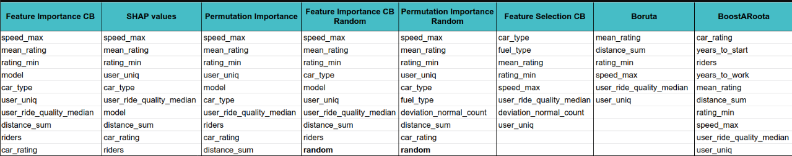

Последние два метода не совсем корректно включать в таблицу, так как там был one hot encoding. Мы включили их для понимания общей картины.

Проверим качество без лишних признаков:

```python
# Возьмем топ-6 самых встречаемых признаков и посмотрим, как изменится точность
important_features = ['speed_max', 'mean_rating', 'rating_min', 'user_uniq', 'user_ride_quality_median', 'car_type']
X_train, X_test, y_train, y_test = train_test_split(X, y, test_size=0.2, random_state=42)

model = CatBoostClassifier(random_state=42,
                           cat_features=['car_type'],
                           thread_count=-1)


model.fit(X_train[important_features], y_train, 
          eval_set=(X_test[important_features], y_test),
          verbose=100, plot=False, 
          early_stopping_rounds=100)
Learning rate set to 0.109335
0:	learn: 1.7879109	test: 1.8019810	best: 1.8019810 (0)	total: 49.5ms	remaining: 49.5s
100:	learn: 0.4077438	test: 0.5237120	best: 0.5231748 (98)	total: 2.02s	remaining: 18s
200:	learn: 0.3163968	test: 0.5290999	best: 0.5210774 (128)	total: 4.05s	remaining: 16.1s
Stopped by overfitting detector  (100 iterations wait)

bestTest = 0.5210774452
bestIteration = 128

Shrink model to first 129 iterations.

<catboost.core.CatBoostClassifier at 0x7fc233ed19d0>
```

Функция ошибки снизилась (0.543 → 0.521). Попробуйте провести свои эксперименты и увеличить точность.

## Проверка признаков

К сожалению, нет универсального алгоритма на все случаи жизни. Одни алгоритмы точные и медленные, другие — слабые, но быстрые. Другими словами, в процессе экспериментов мы должны сами найти подходящий алгоритм для конкретной задачи и данных.

## Выводы

- Рекурсивные методы отбора самые точные, но самые долгие (когда данных много и при этом фичей > 30).
- Перед тем как применять какой-либо из алгоритмов отбора, полезно проводить начальный EDA и откидывать явный мусор.
- Нельзя ограничиваться каким-то одним методом, пусть даже в предыдущих задачах он отлично себя показал.
- Если не хватает ресурсов для работы какого-нибудь алгоритма, попробуйте применить его к меньшему сэмплу данных.
- Можно взять 20% от данных и прогнать алгоритм отбора. Следите за тем, чтобы сэмпл был репрезентативен.
- Постоянно экспериментируйте и сверяйтесь с лидербордом. Всегда есть риски отсеять что-то полезное.
- Менее точными методами можно приоритизировать удаление признаков.
- Методы фильтрации фичей можно объединять между собой. Например, удалять те, которые отфильтровались несколькими способами.
- При ограниченном времени сделайте выбор в пользу Feature Engineering. Так как новые сильные признаки могут добавить десятки % к точности, а фильтрация уже имеющихся — единицы процентов.


## Материалы для дополнительного изучения

- [Обзорная статья по методам фильтрации](https://dataaspirant.com/feature-selection-methods-machine-learning/)
- [Библиотека scikit-feature](https://jundongl.github.io/scikit-feature/), в которой реализовано множество интересных методов отбора на Python 2.7
- [Документация Phik](https://pypi.org/project/phik/)
- [Туториал по Phik на Medium](https://towardsdatascience.com/phik-k-get-familiar-with-the-latest-correlation-coefficient-9ba0032b37e7)

# **Визуализация данных**

## **Зачем нужна визуализация в соревновательном анализе данных**

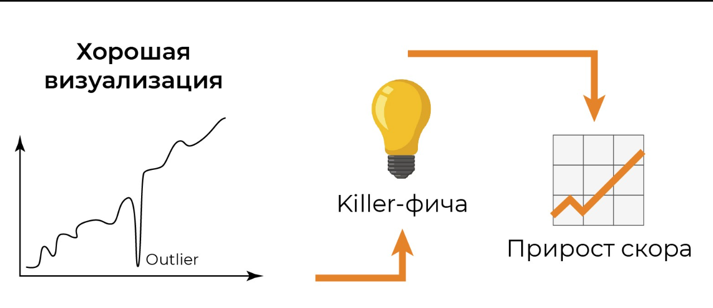

Качественная визуализация хорошо сочетается с генерацией и анализом признаков — легко понять какие признаки будут полезны. Визуализация может здорово помочь разобраться, как устроены данные или как работает модель, а также проверить наличие зависимости визуально.

В курсе мы будем часто использовать элементы графики для поиска инсайтов в данных.

Перед началом работы импортируем библиотеку:

```python
!pip install --upgrade numpy pandas seaborn -q

import numpy as np
import pandas as pd

import warnings
warnings.simplefilter("ignore")
```

А затем импортируем данные — обогатим данные по поездкам:

```python
# Загружаем уже знакомый нам датасет

rides_info = pd.read_csv("../data/rides_info.csv")
cars = pd.read_csv("../data/car_train.csv")
driver_info = pd.read_csv("../data/driver_info.csv")

rides_info = rides_info.merge(cars, on="car_id", how="right")
rides_info = rides_info.merge(driver_info, on="user_id", how="left")
```

## **Встроенные элементы визуализации в Pandas**

Для визуализации данных из датасета необязательно использовать сторонние фреймворки. В Pandas есть несколько встроенных функций, которыми достаточно просто пользоваться:

```python
rides_info.head(3)
```

|       | user_id    | car_id     | ride_id | ride_date  | rating | ride_duration | ride_cost | speed_avg | speed_max | stop_times | ...  | riders | year_to_work | target_reg | target_class | age  | user_rating | user_rides | user_time_accident | sex  | first_ride_date |
| ----- | ---------- | ---------- | ------- | ---------- | ------ | ------------- | --------- | --------- | --------- | ---------- | ---- | ------ | ------------ | ---------- | ------------ | ---- | ----------- | ---------- | ------------------ | ---- | --------------- |
| **0** | n14703870u | y13744087j | Q1Z     | 2020-01-01 | 5.72   | 220           | 3514      | 42        | NaN       | 6          | ...  | 76163  | 2021         | 108.53     | another_bug  | 38   | 7.4         | 268        | 2.0                | 0    | 2019-9-7        |
| **1** | W18144322F | y13744087j | M1P     | 2020-01-01 | 2.52   | 37392         | 523483    | 45        | 53.0      | 2          | ...  | 76163  | 2021         | 108.53     | another_bug  | 46   | 6.7         | 643        | 3.0                | 0    | 2020-7-28       |
| **2** | Q11878237R | y13744087j | D1j     | 2020-01-02 | 7.17   | 45            | 444       | 54        | 82.0      | 0          | ...  | 76163  | 2021         | 108.53     | another_bug  | 49   | 8.4         | 161        | NaN                | 0    | 2020-3-23       |

```markup
3 rows × 29 columns
```

### **df.hist( )**

Посмотрим на распределение через `df.hist( )`. `df.hist( )` строит гистограмму распределения данных по числовым столбцам:

```python
rides_info.hist();  # Вызываем функцию hist( )
```

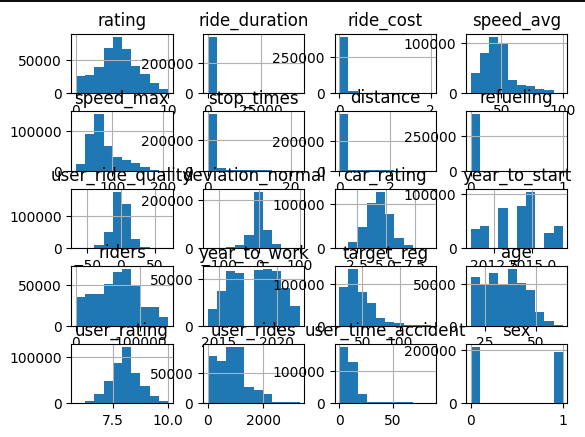

Видно, что графики получились мелкие и текстовая информация накладывается друг на друга, также столбец «Пол» определился как числовой, хотя он категориальный.

Исправим это, добавив параметр `figsize`, и отсеим ненужный столбец. Также, чтобы не выводились служебные строки, перед графиками можно добавить `None` или знак точки с запятой (`;`) в конце ячейки:

```python
# Добавили ; в конце, чтобы не выводилась служебная информация
rides_info.drop("sex", axis=1).hist(figsize=(20, 15), layout=(-1, 5));
```


### **Распределение через боксплот**

`df.boxplot()` — функция, позволяющая рисовать «ящики с усами», показывающие среднее значение, стандартные отклонения и разброс признака на одном графике.

Отобразим вид поломки в зависимости от рейтинга водителя, а также поменяем параметр `fontsize`, отвечающий за размер шрифта:

```python
rides_info.boxplot(
    column=["user_rating"], by="target_class", fontsize=8, figsize=(20, 5)
);
```

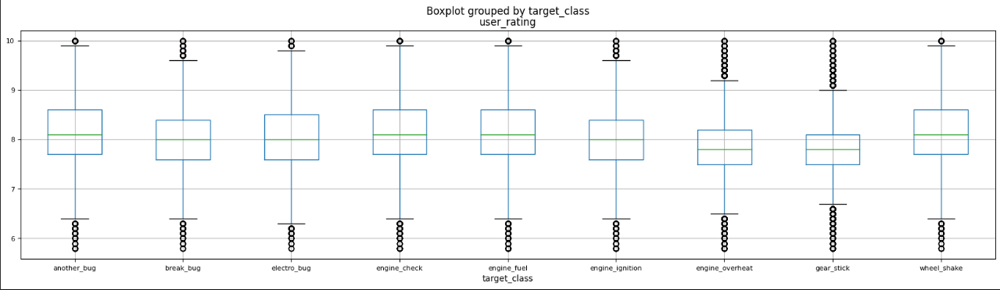

### **Тепловые карты зависимостей численных и категориальных переменных**

```python
corr = rides_info.corr(numeric_only=True).round(2)
corr.style.background_gradient(cmap="RdYlGn")
```

|                    | rating    | ride_duration | ride_cost | speed_avg | speed_max | stop_times | distance  | refueling | user_ride_quality | deviation_normal | car_rating | year_to_start | riders    | year_to_work | target_reg | age       | user_rating | user_rides | user_time_accident | sex       |
| ------------------ | --------- | ------------- | --------- | --------- | --------- | ---------- | --------- | --------- | ----------------- | ---------------- | ---------- | ------------- | --------- | ------------ | ---------- | --------- | ----------- | ---------- | ------------------ | --------- |
| rating             | 1.000000  | 0.000000      | 0.000000  | -0.090000 | -0.230000 | -0.060000  | -0.000000 | 0.000000  | -0.000000         | -0.040000        | 0.000000   | 0.000000      | 0.000000  | 0.000000     | -0.000000  | 0.000000  | 0.000000    | -0.000000  | 0.000000           | -0.000000 |
| ride_duration      | 0.000000  | 1.000000      | 0.920000  | -0.000000 | 0.000000  | 0.010000   | 0.960000  | 0.000000  | 0.000000          | -0.000000        | 0.000000   | 0.000000      | 0.000000  | -0.000000    | -0.000000  | -0.000000 | -0.000000   | -0.000000  | -0.000000          | 0.000000  |
| ride_cost          | 0.000000  | 0.920000      | 1.000000  | -0.000000 | -0.000000 | 0.010000   | 0.880000  | 0.000000  | 0.000000          | 0.000000         | -0.000000  | 0.000000      | 0.000000  | 0.000000     | 0.010000   | 0.000000  | 0.010000    | 0.000000   | -0.000000          | -0.000000 |
| speed_avg          | -0.090000 | -0.000000     | -0.000000 | 1.000000  | 0.500000  | -0.130000  | 0.060000  | 0.000000  | -0.010000         | 0.040000         | -0.000000  | -0.000000     | -0.000000 | 0.000000     | -0.020000  | 0.000000  | -0.000000   | -0.000000  | -0.020000          | -0.000000 |
| speed_max          | -0.230000 | 0.000000      | -0.000000 | 0.500000  | 1.000000  | 0.050000   | 0.030000  | -0.000000 | -0.010000         | 0.090000         | 0.000000   | -0.010000     | -0.010000 | -0.000000    | 0.150000   | -0.000000 | 0.010000    | -0.000000  | 0.000000           | 0.000000  |
| stop_times         | -0.060000 | 0.010000      | 0.010000  | -0.130000 | 0.050000  | 1.000000   | -0.010000 | -0.000000 | 0.020000          | 0.000000         | 0.020000   | 0.010000      | 0.010000  | 0.000000     | 0.190000   | -0.000000 | 0.030000    | -0.000000  | 0.100000           | 0.010000  |
| distance           | -0.000000 | 0.960000      | 0.880000  | 0.060000  | 0.030000  | -0.010000  | 1.000000  | 0.000000  | 0.000000          | 0.000000         | 0.000000   | 0.000000      | 0.000000  | 0.000000     | -0.010000  | -0.000000 | -0.000000   | -0.000000  | -0.000000          | 0.000000  |
| refueling          | 0.000000  | 0.000000      | 0.000000  | 0.000000  | -0.000000 | -0.000000  | 0.000000  | 1.000000  | 0.000000          | -0.000000        | -0.000000  | 0.000000      | 0.000000  | -0.000000    | 0.000000   | 0.000000  | -0.000000   | -0.000000  | -0.000000          | -0.000000 |
| user_ride_quality  | -0.000000 | 0.000000      | 0.000000  | -0.010000 | -0.010000 | 0.020000   | 0.000000  | 0.000000  | 1.000000          | -0.010000        | 0.020000   | -0.020000     | -0.020000 | 0.020000     | 0.030000   | -0.000000 | -0.000000   | 0.000000   | 0.010000           | 0.000000  |
| deviation_normal   | -0.040000 | -0.000000     | 0.000000  | 0.040000  | 0.090000  | 0.000000   | 0.000000  | -0.000000 | -0.010000         | 1.000000         | 0.020000   | 0.010000      | 0.010000  | -0.000000    | 0.100000   | 0.000000  | 0.030000    | 0.000000   | 0.050000           | -0.000000 |
| car_rating         | 0.000000  | 0.000000      | -0.000000 | -0.000000 | 0.000000  | 0.020000   | 0.000000  | -0.000000 | 0.020000          | 0.020000         | 1.000000   | -0.020000     | -0.010000 | -0.020000    | 0.020000   | 0.000000  | 0.000000    | -0.000000  | 0.010000           | -0.000000 |
| year_to_start      | 0.000000  | 0.000000      | 0.000000  | -0.000000 | -0.010000 | 0.010000   | 0.000000  | 0.000000  | -0.020000         | 0.010000         | -0.020000  | 1.000000      | 0.990000  | 0.060000     | 0.010000   | 0.020000  | 0.020000    | 0.010000   | 0.000000           | -0.010000 |
| riders             | 0.000000  | 0.000000      | 0.000000  | -0.000000 | -0.010000 | 0.010000   | 0.000000  | 0.000000  | -0.020000         | 0.010000         | -0.010000  | 0.990000      | 1.000000  | 0.050000     | 0.000000   | 0.020000  | 0.010000    | 0.010000   | 0.000000           | -0.010000 |
| year_to_work       | 0.000000  | -0.000000     | 0.000000  | 0.000000  | -0.000000 | 0.000000   | 0.000000  | -0.000000 | 0.020000          | -0.000000        | -0.020000  | 0.060000      | 0.050000  | 1.000000     | 0.030000   | 0.010000  | 0.010000    | 0.010000   | 0.000000           | -0.010000 |
| target_reg         | -0.000000 | -0.000000     | 0.010000  | -0.020000 | 0.150000  | 0.190000   | -0.010000 | 0.000000  | 0.030000          | 0.100000         | 0.020000   | 0.010000      | 0.000000  | 0.030000     | 1.000000   | 0.010000  | 0.090000    | 0.010000   | 0.120000           | -0.000000 |
| age                | 0.000000  | -0.000000     | 0.000000  | 0.000000  | -0.000000 | -0.000000  | -0.000000 | 0.000000  | -0.000000         | 0.000000         | 0.000000   | 0.020000      | 0.020000  | 0.010000     | 0.010000   | 1.000000  | -0.110000   | -0.020000  | -0.130000          | -0.760000 |
| user_rating        | 0.000000  | -0.000000     | 0.010000  | -0.000000 | 0.010000  | 0.030000   | -0.000000 | -0.000000 | -0.000000         | 0.030000         | 0.000000   | 0.020000      | 0.010000  | 0.010000     | 0.090000   | -0.110000 | 1.000000    | 0.000000   | 0.250000           | 0.150000  |
| user_rides         | -0.000000 | -0.000000     | 0.000000  | -0.000000 | -0.000000 | -0.000000  | -0.000000 | -0.000000 | 0.000000          | 0.000000         | -0.000000  | 0.010000      | 0.010000  | 0.010000     | 0.010000   | -0.020000 | 0.000000    | 1.000000   | -0.010000          | 0.020000  |
| user_time_accident | 0.000000  | -0.000000     | -0.000000 | -0.020000 | 0.000000  | 0.100000   | -0.000000 | -0.000000 | 0.010000          | 0.050000         | 0.010000   | 0.000000      | 0.000000  | 0.000000     | 0.120000   | -0.130000 | 0.250000    | -0.010000  | 1.000000           | 0.170000  |
| sex                | -0.000000 | 0.000000      | -0.000000 | -0.000000 | 0.000000  | 0.010000   | 0.000000  | -0.000000 | 0.000000          | -0.000000        | -0.000000  | -0.010000     | -0.010000 | -0.010000    | -0.000000  | -0.760000 | 0.150000    | 0.020000   | 0.170000           | 1.000000  |

```python
pd.crosstab(
    rides_info["target_class"],
    rides_info["model"],
    # margins = True,
    normalize = True
).style.background_gradient(cmap="RdYlGn")
```

| model           | Audi A3  | Audi A4  | Audi Q3  | BMW 320i | Fiat 500 | Hyundai Solaris | Kia Rio  | Kia Rio X | Kia Rio X-line | Kia Sportage | MINI CooperSE | Mercedes-Benz E200 | Mercedes-Benz GLC | Mini Cooper | Nissan Qashqai | Renault Kaptur | Renault Sandero | Skoda Rapid | Smart Coupe | Smart ForFour | Smart ForTwo | Tesla Model 3 | VW Polo  | VW Polo VI | VW Tiguan | Volkswagen ID.4 |
| --------------- | -------- | -------- | -------- | -------- | -------- | --------------- | -------- | --------- | -------------- | ------------ | ------------- | ------------------ | ----------------- | ----------- | -------------- | -------------- | --------------- | ----------- | ----------- | ------------- | ------------ | ------------- | -------- | ---------- | --------- | --------------- |
| target_class    |          |          |          |          |          |                 |          |           |                |              |               |                    |                   |             |                |                |                 |             |             |               |              |               |          |            |           |                 |
| another_bug     | 0.000856 | 0.001284 | 0.001284 | 0.000856 | 0.000000 | 0.010697        | 0.006846 | 0.008130  | 0.007702       | 0.009414     | 0.002567      | 0.000428           | 0.001284          | 0.000428    | 0.006846       | 0.006846       | 0.009414        | 0.006846    | 0.004707    | 0.008986      | 0.002995     | 0.000856      | 0.003851 | 0.008986   | 0.006846  | 0.000428        |
| break_bug       | 0.001284 | 0.001712 | 0.000000 | 0.000428 | 0.001284 | 0.005563        | 0.005991 | 0.005563  | 0.005135       | 0.008986     | 0.001712      | 0.001284           | 0.000856          | 0.000428    | 0.004279       | 0.008558       | 0.008130        | 0.010270    | 0.006846    | 0.007702      | 0.006846     | 0.000428      | 0.008558 | 0.005563   | 0.007702  | 0.000428        |
| electro_bug     | 0.001284 | 0.000428 | 0.002567 | 0.000428 | 0.000428 | 0.005563        | 0.005135 | 0.005991  | 0.007274       | 0.005563     | 0.000000      | 0.001284           | 0.002139          | 0.000856    | 0.007274       | 0.005991       | 0.005135        | 0.007274    | 0.005563    | 0.005563      | 0.008130     | 0.000856      | 0.006418 | 0.007702   | 0.005991  | 0.001712        |
| engine_check    | 0.000856 | 0.001284 | 0.000428 | 0.002139 | 0.001284 | 0.007274        | 0.004707 | 0.006846  | 0.005563       | 0.007702     | 0.001284      | 0.002567           | 0.000000          | 0.001712    | 0.005991       | 0.009414       | 0.005135        | 0.008558    | 0.005135    | 0.006846      | 0.006418     | 0.000856      | 0.009842 | 0.007702   | 0.005991  | 0.000000        |
| engine_fuel     | 0.000856 | 0.000856 | 0.001712 | 0.000428 | 0.000000 | 0.009414        | 0.004707 | 0.004707  | 0.007702       | 0.008130     | 0.000000      | 0.000856           | 0.000856          | 0.002139    | 0.008130       | 0.009414       | 0.009414        | 0.005563    | 0.005135    | 0.007702      | 0.005991     | 0.001284      | 0.007702 | 0.002995   | 0.005563  | 0.000856        |
| engine_ignition | 0.000856 | 0.000856 | 0.000428 | 0.001284 | 0.000428 | 0.007274        | 0.005135 | 0.008558  | 0.005991       | 0.006418     | 0.000856      | 0.000000           | 0.000000          | 0.001284    | 0.012837       | 0.004707       | 0.009842        | 0.006846    | 0.007274    | 0.008558      | 0.005991     | 0.000856      | 0.005135 | 0.006418   | 0.006846  | 0.000428        |
| engine_overheat | 0.000428 | 0.001284 | 0.001712 | 0.000428 | 0.002139 | 0.008558        | 0.004707 | 0.006418  | 0.006846       | 0.008130     | 0.001712      | 0.002139           | 0.001284          | 0.002139    | 0.009842       | 0.010270       | 0.010270        | 0.004279    | 0.004707    | 0.007274      | 0.006846     | 0.000000      | 0.006846 | 0.007274   | 0.006846  | 0.001284        |
| gear_stick      | 0.000856 | 0.000856 | 0.000856 | 0.000856 | 0.002139 | 0.007702        | 0.005563 | 0.006418  | 0.007274       | 0.008558     | 0.000856      | 0.001284           | 0.000856          | 0.000428    | 0.007274       | 0.010697       | 0.007702        | 0.007274    | 0.006418    | 0.008986      | 0.007702     | 0.000856      | 0.006418 | 0.008558   | 0.004707  | 0.000428        |
| wheel_shake     | 0.000000 | 0.000000 | 0.000000 | 0.000000 | 0.000000 | 0.006846        | 0.004707 | 0.008558  | 0.006418       | 0.000000     | 0.000000      | 0.000000           | 0.000000          | 0.000000    | 0.000000       | 0.000000       | 0.000000        | 0.005991    | 0.004707    | 0.005991      | 0.004707     | 0.000000      | 0.005563 | 0.009842   | 0.007274  | 0.000000        |


И все это не выходя из Pandas!

`df.plot()` — функция, предоставляющая весь функционал библиотеки Matplotlib. Также через точку можно указывать конкретный тип желаемого графика, например: `df.plot.bar()` или `df.plot.scatter()`. На наш взгляд, пользоваться ей не очень удобно, поэтому не будем разбирать ее подробно. Узнать больше о функции можно в документации.

Перейдем к более продвинутым инструментам.

## **Визуализация с помощью Seaborn**

`Seaborn` — это все, что нам надо!

Импортируем `Seaborn`:

```python
import seaborn as sns

sns.set_theme()  # Тут можно задать стили
```

### **relplot()**

Функция `relplot()` объединяет функционал `scatterplot()` (диаграмма рассеяния) и `lineplot()`. Смена происходит переключателем `kind`. Таким образом, можно держать в голове меньше разных названий функций и параметров. Более того, `plt.figure(figsize=(20, 5))` больше не нужен, ведь есть параметры `height` и `aspect`.

**Диаграмма рассеяния** — это диаграмма, которая отображает точки на основе двух измерений набора данных:

```python
g = sns.relplot(
    data=rides_info,
    x="ride_date",
    y="deviation_normal",
    hue="target_class",
    kind="line",  # или scatter
    aspect=4,
)

g.set_xticklabels(rotation=45, horizontalalignment="right", step=2);
```

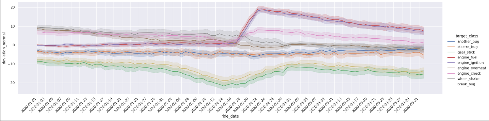

По оси х мы вытянули время. По оси y исследуемый столбец, в данном случае — `deviation_normal`. Все точки мы окрасили в соответствующий класс для наглядности.

Становится видно, что величина `deviation_normal` ведет себя по-разному в зависимости от класса будущей поломки. Например, точку перегиба в центре графика для класса `engine_ignition` можно использовать как вспомогательный признак.

```python
# Импортируем вспомогательные фрагменты из matplotlib
import matplotlib.pyplot as plt
import matplotlib.ticker as ticker

plt.figure(figsize=(20, 5))

g = sns.lineplot(
    data=rides_info,
    x="ride_date",
    y="deviation_normal",
    hue="target_class",
)

g.set_xticklabels(g.get_xticklabels(), rotation=45, horizontalalignment="right")
g.xaxis.set_major_locator(ticker.MultipleLocator(2));
```

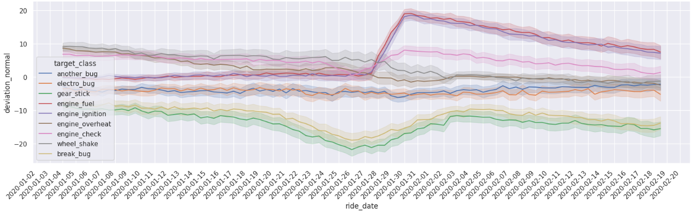

```python
g = sns.relplot(
    data=rides_info,
    x="ride_date",
    y="user_ride_quality",
    kind="line",
    hue="target_class",
    aspect=4,
)

g.set_xticklabels(rotation=45, horizontalalignment="right", step=2);
```

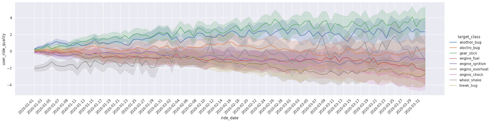

Аналогично растянули признак `user_ride_quality` во времени по оси y как исследуемый столбец. Все точки мы окрасили в соответствующий класс для наглядности.

Заметно, что величина `user_ride_quality` ведет себя по-разному в зависимости от класса будущей поломки. Например, стартовая точка у разных классов находится на разной высоте.

```python
# Отберем информацию только про 10 машин
tmp = rides_info[rides_info["car_id"].isin(rides_info.car_id.unique()[:10])]
# Как ведет себя deviation_normal во времени для 10 автомобилей

g = sns.relplot(
    data=tmp,
    
    x="ride_date",
    y="deviation_normal",
    
    hue="target_class",
    style="car_id",
    
    legend=False,
    kind="line",
    aspect=4,
)
g.set_xticklabels(rotation=45, horizontalalignment="right", step=2)
<seaborn.axisgrid.FacetGrid at 0x7f4db554fa90>
```

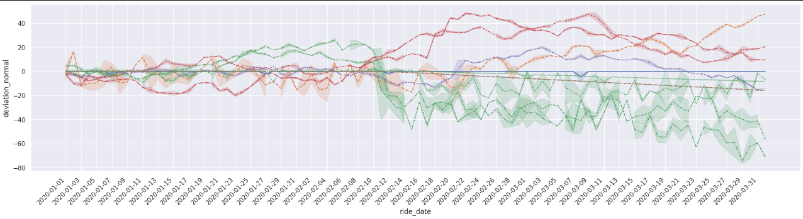

**Какие признаки могут помочь различить классы поломок:**

- точки перегиба;
- точки перегиба;
- точки перегиба;

Все это можно использовать как дополнительные признаки.

```python
# Вместо известного нам:

# plt.figure(figsize=(20, 5))
# sns.scatterplot(data = rides_info,
#                  x = 'ride_duration',
#                  y = 'ride_cost',
#                  hue = 'model'
#                 );
g = sns.relplot(
    data=rides_info,
    x="ride_duration",
    y="ride_cost",
    hue="target_class",
    
    kind="scatter",
    aspect=4,
    alpha=0.5,
);
```

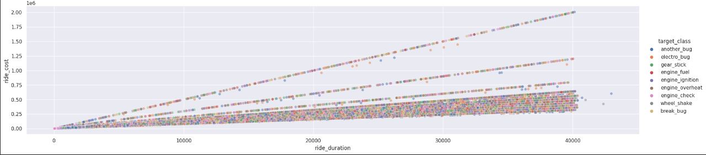

С помощью более функционального `sns.relplot()` мы пишем меньше кода и быстрее анализируем. Кстати, по графику заметно, что угол наклона у разных машин разный.

Возможно `feature = ride_cost/ride_duration` — это отличный дополнительный признак. Имеет смысл поиграть с такими параметрами как `row` и `col`, чтобы построить этот график в разрезах по другим категориальным признакам.

```python
g = sns.relplot(
    data=rides_info,
    x="target_class",
    
    y="user_time_accident",
    
    hue="car_type",
    kind="scatter",
    aspect=4,
    alpha=0.5,
);
```

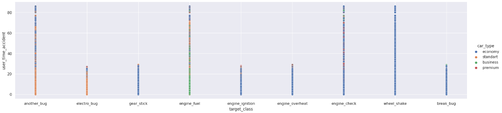

> **Важно!** Полезно растягивать исследуемые признаки не только вдоль времени или численных признаков, но еще и по категориальным переменным.

В этом примере по оси x — таргет, а цветом окрашен сегмент машины.

```python
sns.relplot(
    data=rides_info,
    x="rating",
    y="user_time_accident",
    hue="target_class",
    kind="scatter",
    aspect=4,
    alpha=0.5,
);
```

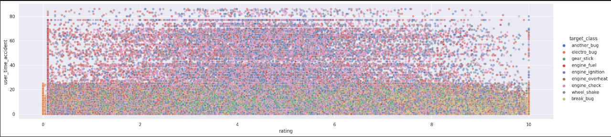

Еще один интересный инсайт — как число инцидентов водителя зависит от его рейтинга. Легко заметить, что некоторые классы поломок свойственны поездкам с низким рейтингом. Очень рекомендуем применять метод `sns.relplot()`.

**Чтобы эффективнее исследовать данные:**

- Растягивайте исследуемый признак во времени.
- Стройте признак относительно другого признака или частоты.
- Раскрашивайте точки в категории или таргет (параметры: hue, style, size).

### **Построение распределений и sns.displot()**

В Seaborn функция `displot()` объединяет функционал `histplot()`, `kdeplot()` и `ecdfplot()`. Переключение происходит с помощью `kind`. Получается, что можно держать в голове меньше разных названий функций и параметров. И снова не нужен `plt.figure(figsize=(20, 5))`, ведь есть параметры `height` и `aspect`.

```python
# plt.figure(figsize=(20, 5)) # Уже можно не использовать, ведь есть параметр aspect

tmp = rides_info[rides_info["car_id"].isin(rides_info.sample(100).car_id.unique()[:20])]

g = sns.displot(
    data=rides_info,
    
    x="user_ride_quality",
    # y="user_time_accident",
    
    hue="target_class",
    legend=True,
    aspect=4,
    kind="hist",  # kde
    alpha=0.5,
);
```

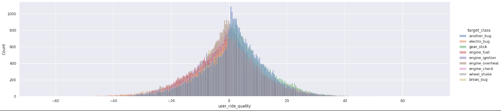

Многофункциональный метод `sns.displot()` — это вторая вещь после `sns.relplot()`, которую нужно запомнить и при возможности использовать.

```python
tmp = rides_info[rides_info["car_id"].isin(rides_info.sample(100, random_state=10).car_id.unique()[:20])]
g = sns.displot(
    data=tmp,
    
    x="user_ride_quality",
    y="deviation_normal",
    
    aspect=1,
    # kind="kde",
    alpha=0.5,
    
    hue="car_id",
    col="target_class",
    
    col_wrap=4,
    
).set_xticklabels(rotation=45, horizontalalignment="right");
```

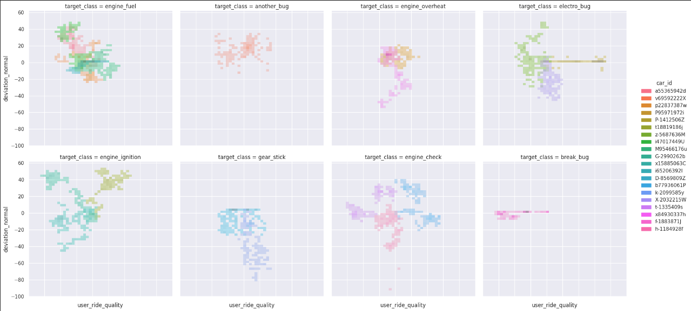

### **Категориальные данные и sns.catplot()**

В `Seaborn` функция `catplot()` объединяет функционал `boxplot()`, `violinplot()`, `boxenplot`, `stripplot`, `swarmplot`, а еще `pointplot`, `barplot` и `countplot`. Переключение происходит параметром `kind`. Получается, что в голове можно держать меньше названий функций и параметров.

```python
sns.catplot(
    data=rides_info,
    x="target_class",
    y="distance",
    
    aspect=4,
    hue="car_type",
    alpha=0.25,
    
).set_xticklabels(rotation=45, horizontalalignment="right");
```

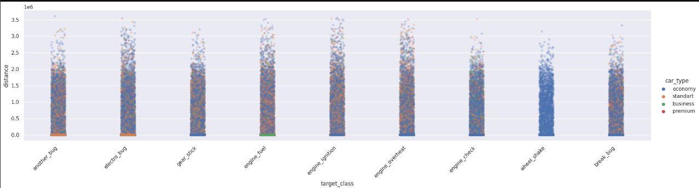

```python
# Варьируем в параметр kind, получаем любой вид графики

sns.catplot(
    data=rides_info,
    x="target_class",
    y="user_ride_quality",
    hue="car_type",
    aspect=4,
    kind="boxen",
).set_xticklabels(rotation=45, horizontalalignment="right");
```

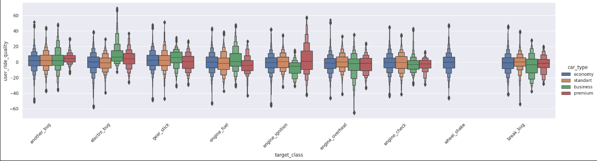

Сходу замечаем, что поломки класса `wheel_shake` не происходят в трех сегментах машин. Многофункциональный метод `sns.catplot()` — это третья вещь после `sns.displot()` и `sns.relplot()`, которую нужно запомнить и использовать при возможности.

### **Попарные корреляции и тепловая карта — sns.heatmap()**

Функция `sns.heatmap()` чаще всего используется для отрисовки наглядной матрицы корреляций признаков. Также ее можно использовать, когда хочется подсветить любую таблицу значений.

Посмотрим как построить на нашем датасете. Сначала посмотрим матрицу корреляций, которую выводит Pandas:

```python
rides_info.corr(numeric_only=True)
```

|                    | rating    | ride_duration | ride_cost | speed_avg | speed_max | stop_times | distance  | refueling | user_ride_quality | deviation_normal | car_rating | year_to_start | riders    | year_to_work | target_reg | age       | user_rating | user_rides | user_time_accident | sex       |
| ------------------ | --------- | ------------- | --------- | --------- | --------- | ---------- | --------- | --------- | ----------------- | ---------------- | ---------- | ------------- | --------- | ------------ | ---------- | --------- | ----------- | ---------- | ------------------ | --------- |
| rating             | 1.000000  | 0.001227      | 0.001568  | -0.086294 | -0.234631 | -0.055198  | -0.003871 | 0.001678  | -0.000310         | -0.042613        | 0.003083   | 0.000846      | 0.000837  | 0.000607     | -0.003452  | 0.002053  | 0.003308    | -0.002442  | 0.000104           | -0.004693 |
| ride_duration      | 0.001227  | 1.000000      | 0.915057  | -0.001735 | 0.000430  | 0.009862   | 0.964560  | 0.004879  | 0.000633          | -0.000385        | 0.000894   | 0.000103      | 0.000352  | -0.000472    | -0.002801  | -0.002866 | -0.000477   | -0.000353  | -0.001229          | 0.001111  |
| ride_cost          | 0.001568  | 0.915057      | 1.000000  | -0.001216 | -0.000034 | 0.007818   | 0.882981  | 0.004250  | 0.001506          | 0.000323         | -0.000041  | 0.002257      | 0.002378  | 0.004566     | 0.007067   | 0.000046  | 0.005591    | 0.001068   | -0.000278          | -0.000168 |
| speed_avg          | -0.086294 | -0.001735     | -0.001216 | 1.000000  | 0.496602  | -0.129687  | 0.064636  | 0.000575  | -0.007180         | 0.040983         | -0.004753  | -0.001666     | -0.002308 | 0.000170     | -0.024530  | 0.001540  | -0.002659   | -0.000611  | -0.022754          | -0.000349 |
| speed_max          | -0.234631 | 0.000430      | -0.000034 | 0.496602  | 1.000000  | 0.051144   | 0.032024  | -0.000847 | -0.008618         | 0.087402         | 0.000648   | -0.012698     | -0.014007 | -0.003338    | 0.149425   | -0.001196 | 0.006604    | -0.001281  | 0.004410           | 0.002147  |
| stop_times         | -0.055198 | 0.009862      | 0.007818  | -0.129687 | 0.051144  | 1.000000   | -0.006981 | -0.000387 | 0.020246          | 0.004780         | 0.018989   | 0.008198      | 0.009124  | 0.002615     | 0.193921   | -0.003088 | 0.032055    | -0.001420  | 0.098434           | 0.005554  |
| distance           | -0.003871 | 0.964560      | 0.882981  | 0.064636  | 0.032024  | -0.006981  | 1.000000  | 0.003681  | 0.000124          | 0.002246         | 0.000241   | 0.000411      | 0.000757  | 0.000053     | -0.005720  | -0.002923 | -0.000643   | -0.000154  | -0.003351          | 0.001479  |
| refueling          | 0.001678  | 0.004879      | 0.004250  | 0.000575  | -0.000847 | -0.000387  | 0.003681  | 1.000000  | 0.001204          | -0.001345        | -0.002619  | 0.002083      | 0.001635  | -0.003023    | 0.000861   | 0.001442  | -0.000931   | -0.001680  | -0.001183          | -0.002582 |
| user_ride_quality  | -0.000310 | 0.000633      | 0.001506  | -0.007180 | -0.008618 | 0.020246   | 0.000124  | 0.001204  | 1.000000          | -0.011180        | 0.018024   | -0.019891     | -0.020917 | 0.021576     | 0.025973   | -0.003643 | -0.002574   | 0.001516   | 0.005087           | 0.003929  |
| deviation_normal   | -0.042613 | -0.000385     | 0.000323  | 0.040983  | 0.087402  | 0.004780   | 0.002246  | -0.001345 | -0.011180         | 1.000000         | 0.021623   | 0.009543      | 0.012239  | -0.004786    | 0.100291   | 0.000671  | 0.027107    | 0.000613   | 0.054867           | -0.000229 |
| car_rating         | 0.003083  | 0.000894      | -0.000041 | -0.004753 | 0.000648  | 0.018989   | 0.000241  | -0.002619 | 0.018024          | 0.021623         | 1.000000   | -0.016672     | -0.013615 | -0.017544    | 0.024515   | 0.002611  | 0.003010    | -0.000529  | 0.013035           | -0.001380 |
| year_to_start      | 0.000846  | 0.000103      | 0.002257  | -0.001666 | -0.012698 | 0.008198   | 0.000411  | 0.002083  | -0.019891         | 0.009543         | -0.016672  | 1.000000      | 0.986746  | 0.059072     | 0.006390   | 0.016189  | 0.015626    | 0.009642   | 0.002742           | -0.009968 |
| riders             | 0.000837  | 0.000352      | 0.002378  | -0.002308 | -0.014007 | 0.009124   | 0.000757  | 0.001635  | -0.020917         | 0.012239         | -0.013615  | 0.986746      | 1.000000  | 0.048270     | 0.003259   | 0.015917  | 0.014912    | 0.009540   | 0.003498           | -0.009730 |
| year_to_work       | 0.000607  | -0.000472     | 0.004566  | 0.000170  | -0.003338 | 0.002615   | 0.000053  | -0.003023 | 0.021576          | -0.004786        | -0.017544  | 0.059072      | 0.048270  | 1.000000     | 0.034604   | 0.011401  | 0.014833    | 0.013002   | 0.003461           | -0.006012 |
| target_reg         | -0.003452 | -0.002801     | 0.007067  | -0.024530 | 0.149425  | 0.193921   | -0.005720 | 0.000861  | 0.025973          | 0.100291         | 0.024515   | 0.006390      | 0.003259  | 0.034604     | 1.000000   | 0.006725  | 0.088232    | 0.008236   | 0.122316           | -0.001264 |
| age                | 0.002053  | -0.002866     | 0.000046  | 0.001540  | -0.001196 | -0.003088  | -0.002923 | 0.001442  | -0.003643         | 0.000671         | 0.002611   | 0.016189      | 0.015917  | 0.011401     | 0.006725   | 1.000000  | -0.109918   | -0.019438  | -0.130837          | -0.757736 |
| user_rating        | 0.003308  | -0.000477     | 0.005591  | -0.002659 | 0.006604  | 0.032055   | -0.000643 | -0.000931 | -0.002574         | 0.027107         | 0.003010   | 0.015626      | 0.014912  | 0.014833     | 0.088232   | -0.109918 | 1.000000    | 0.003577   | 0.252693           | 0.151911  |
| user_rides         | -0.002442 | -0.000353     | 0.001068  | -0.000611 | -0.001281 | -0.001420  | -0.000154 | -0.001680 | 0.001516          | 0.000613         | -0.000529  | 0.009642      | 0.009540  | 0.013002     | 0.008236   | -0.019438 | 0.003577    | 1.000000   | -0.005332          | 0.018100  |
| user_time_accident | 0.000104  | -0.001229     | -0.000278 | -0.022754 | 0.004410  | 0.098434   | -0.003351 | -0.001183 | 0.005087          | 0.054867         | 0.013035   | 0.002742      | 0.003498  | 0.003461     | 0.122316   | -0.130837 | 0.252693    | -0.005332  | 1.000000           | 0.172690  |
| sex                | -0.004693 | 0.001111      | -0.000168 | -0.000349 | 0.002147  | 0.005554   | 0.001479  | -0.002582 | 0.003929          | -0.000229        | -0.001380  | -0.009968     | -0.009730 | -0.006012    | -0.001264  | -0.757736 | 0.151911    | 0.018100   | 0.172690           | 1.000000  |


Можно ориентироваться, но это сделать достаточно сложно, так как у нас большое количество признаков. Теперь отрисуем матрицу с помощью `sns.heatmap( )`:

```python
# Размер будущей тепловой карты. Можно указать в коде разово
import matplotlib.pyplot as plt

plt.rcParams["figure.figsize"] = (12, 12)
sns.heatmap(
    data=rides_info.corr(numeric_only=True).round(2),
    square=True,
    annot=True,
);
```

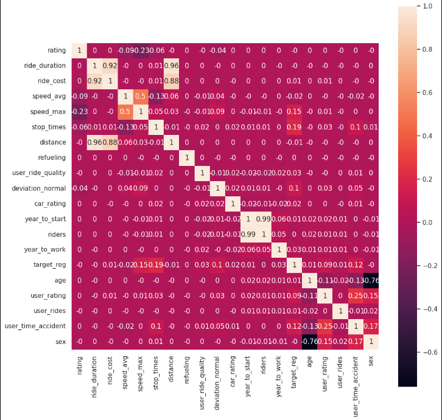

Добавим красоты:

```python
heatmap = sns.heatmap(
    rides_info.corr(numeric_only=True).round(2),
    annot=True,
    square=True,
    
    cmap="Blues",  # Использовать синюю цветовую карту
    cbar_kws={"fraction": 0.01},  # Боковой колор-бар (shrink colour bar)
    linewidth=2,  # Пространство между клетками
)

heatmap.set_xticklabels(
    heatmap.get_xticklabels(), rotation=45, horizontalalignment="right"
);
```

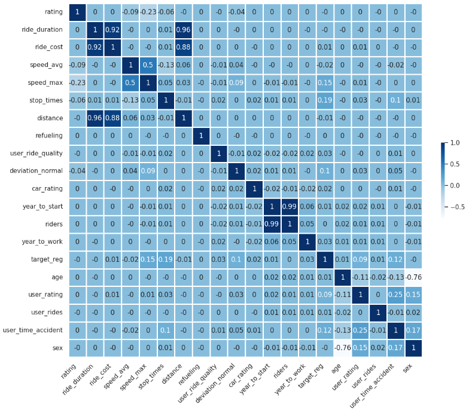

Видно, что части снизу и сверху от диагонали идентичны, новой информации не несут и лишь создают визуальный шум. Уберем одну из них:

```python
sns.set_style("whitegrid")

# Воспользуемся функциями np.triu, чтобы изолировать верхний треугольник (np.tril нижний)
# функция np.ones_like() изменит все изолированные значения на 1.
mask = np.triu(np.ones_like(rides_info.corr(numeric_only=True), dtype=bool))

heatmap = sns.heatmap(
    rides_info.corr(numeric_only=True).round(2),
    annot=True,
    square=True,
    cmap="BrBG",
    cbar_kws={"fraction": 0.01},
    linewidth=1,
    
    mask=mask,
)

heatmap.set_title(
    "Треугольная тепловая карта корреляции", fontdict={"fontsize": 18}, pad=16
);
```

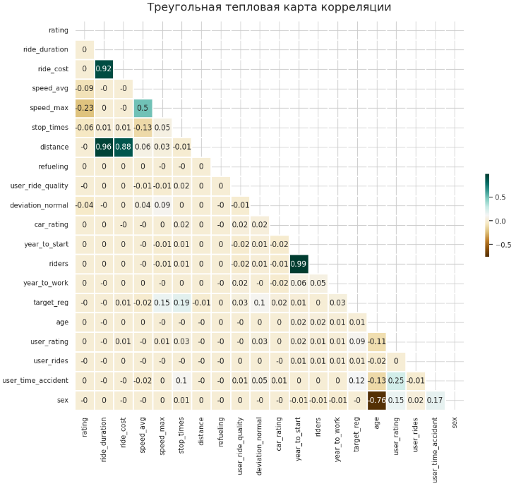

### **Связка pd.crosstab + sns.heatmap**

```python
# Размер будущей тепловой карты. Можно указать в коде разово
plt.rcParams["figure.figsize"] = (25, 25)
crst = pd.crosstab(
    rides_info["target_class"],
    rides_info["model"],
    normalize=True,
).round(4)


heatmap = sns.heatmap(
    crst,
    annot=True,
    square=True,
    cmap="BrBG",
    cbar_kws={"fraction": 0.01},
    linewidth=1,
)

heatmap.set_title("Тепловая карта совстречаемости", fontdict={"fontsize": 18}, pad=16);
```

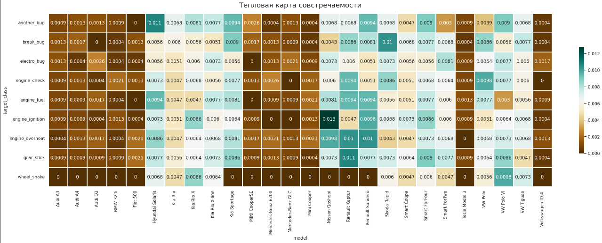

### **Парные зависимости между переменными и sns.pairplot()**

```python
sns.pairplot(
    rides_info.sample(1000),
    vars=["speed_max", "distance", "speed_avg"],
    corner=True,
    hue="target_class",
);
```

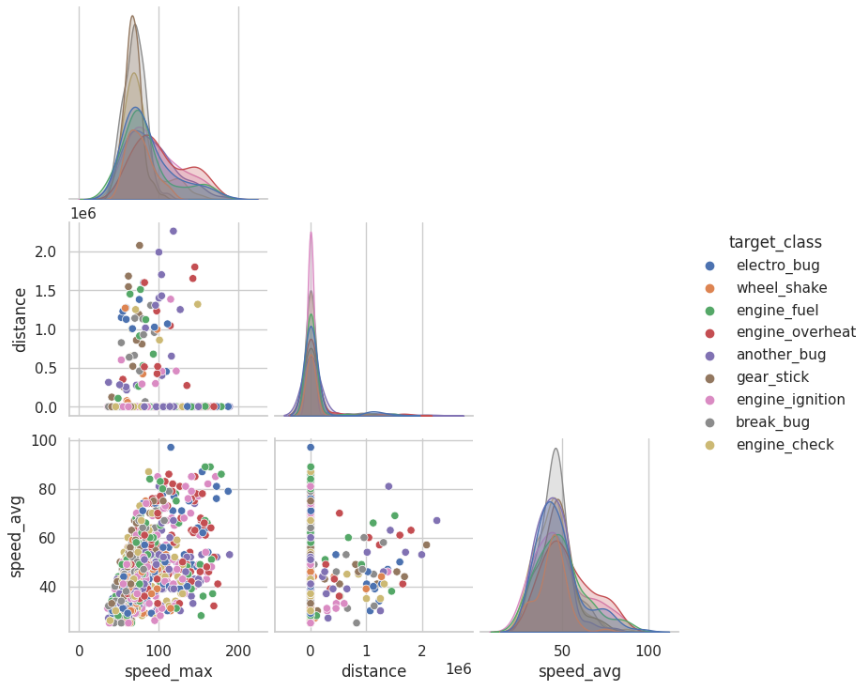

### **sns.lmplot = sns.pairplot + умение провести прямую**

```python
sns.lmplot(
    data=rides_info.sample(1000),
    x="speed_avg",
    y="speed_max",
    
    col="target_class",
    
    col_wrap=3,
);
```

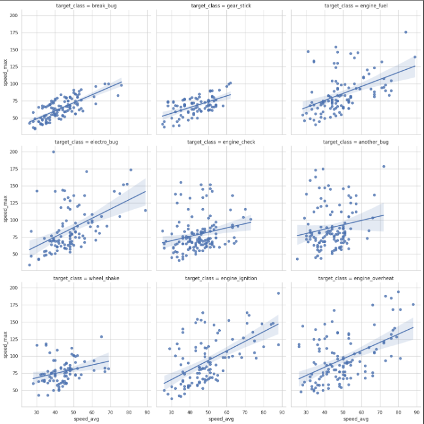

```python
sns.lmplot(
    data=rides_info,
    x="ride_duration",
    y="ride_cost",
    col="target_class",
    
    hue="car_type",
    
    col_wrap=5,
);
```

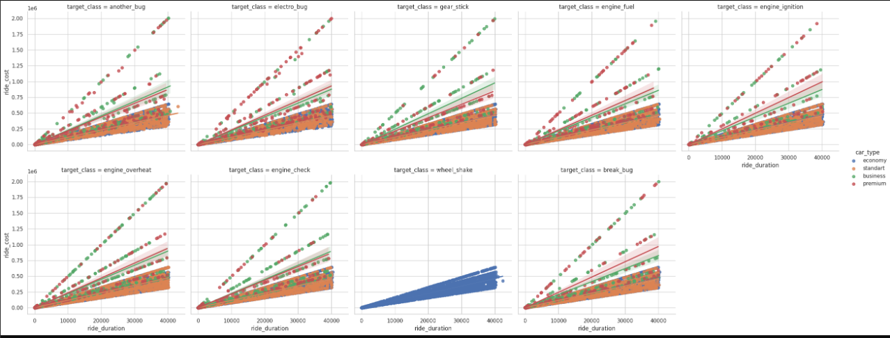

### **Композиция нескольких видов графиков и sns.jointplot()**

```python
# Диаграмма рассеяния + распределения

sns.jointplot(
    data=rides_info.sample(10_000),
    x="target_reg",
    y="rating",
    hue="target_class",
    height=10,
    legend=False,
    ratio=2,
    kind="scatter",
);
```

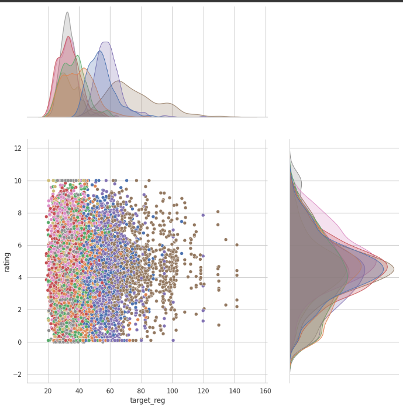

### Карта графики Seaborn:

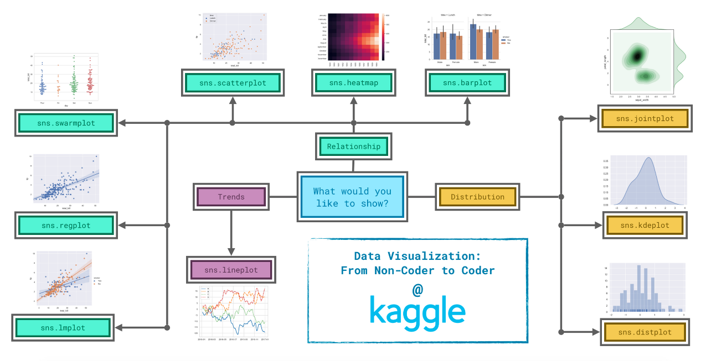

## **Выводы**

- Существует множество способов визуализации. Иногда даже не нужно выходить из Pandas.
- Seaborn — очень функциональный и понятный фреймворк. Для соревновательного DS этого достаточно.
- Важно запомнить хотя бы три самых важных для себя функции и регулярно ими пользоваться. Например: `sns.relplot`, `sns.displot` и `sns.heatmap`.
- Рекомендуем растягивать признак по времени, по частоте или другому признаку, а также Раскрашивать в таргет.

# **Продвинутая визуализация**

