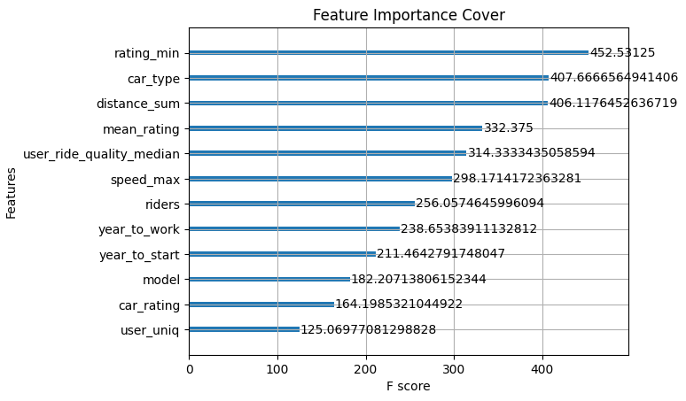

# CatBoost

## CatBoost Classifier и его параметры

> **CatBoost** — это открытая библиотека градиентного бустинга на решающих деревьях с поддержкой категориальных фич из коробки; преемник алгоритма MatrixNet, также разработанного Яндексом.

CatBoost — библиотека для табличных данных, с которой лучше всего начинать работу, если вы новичок. Она проста в использовании и имеет ряд преимуществ.

**Преимущества:**

- Принимает категориальные фичи сразу без всякой предварительной обработки.
- Не требует установки дополнительных пакетов или специальных версий при переносе обучения с CPU на GPU (достаточно поменять значение одного параметра).
- Выдает хорошую точность модели даже с дефолтными параметрами. Основные параметры не константные, а подбираются самой библиотекой в зависимости от размера входных данных.
- Принимает текстовые признаки, эмбеддинги, временные признаки.
- Встраивается в стандартные пайплайны без дополнительных манипуляций и оберток (например, sklearn).
- Имеет множество полезных встроенных функций: `feature_selection`, `object_selection`, `cross_validation`, `grid_search` и пр.

**Недостатки:**

- Не умеет обрабатывать пропуски в данных (сами избавляемся или заполняем NaN перед подачей в модель).
- Не все метрики и лоссы доступны при обучении на GPU.
- Не умеет делать кофе.


Если только начинаете участвовать в соревнованиях, рекомендуем использовать CatBoost.

Теперь посмотрим, как работать с моделью.

**Алгоритм работы:**

1. Скачать данные.
2. Проверить быстрый EDA.
3. Собрать список катфич, загрузить данные в CatBoost.
4. Посмотреть, что дает модель с дефолтными фичами и параметрами (baseline).
5. Отправить сабмишн на лидерборд.
6. Настроить валидацию, Feature Engineering, тюнинг модели и др.

```python
!pip install seaborn catboost -q

import numpy as np
import pandas as pd
```

Импортируем train датасет:

```python
path = "../data/quickstart_train.csv"
train = pd.read_csv(path)

print("train", train.shape)
train.hist(figsize=(25, 6), layout=(-1, 6))
train.sample(3)
train (2337, 17)
```

|          | **car_id** | **model**     | **car_type** | **fuel_type** | **car_rating** | **year_to_start** | **riders** | **year_to_work** | **target_reg** | **target_class** | **mean_rating** | **distance_sum** | **rating_min** | **speed_max** | **user_ride_quality_median** | **deviation_normal_count** | **user_uniq** |
| -------- | ---------- | ------------- | ------------ | ------------- | -------------- | ----------------- | ---------- | ---------------- | -------------- | ---------------- | --------------- | ---------------- | -------------- | ------------- | ---------------------------- | -------------------------- | ------------- |
| **611**  | L-2146603e | Smart ForTwo  | economy      | petrol        | 4.76           | 2014              | 60852      | 2022             | 55.92          | engine_overheat  | 4.214138        | 1.394655e+07     | 0.1            | 179.128822    | -3.120805                    | 174                        | 174           |
| **350**  | v-9234388J | VW Polo VI    | economy      | petrol        | 4.86           | 2014              | 54274      | 2015             | 53.30          | another_bug      | 4.766494        | 1.503168e+07     | 0.1            | 178.000000    | 10.487676                    | 174                        | 171           |
| **1299** | O-9483543e | Smart ForFour | economy      | petrol        | 6.46           | 2014              | 66105      | 2020             | 32.25          | engine_fuel      | 4.179425        | 1.202353e+07     | 0.1            | 169.646526    | 5.313803                     | 174                        | 169           |


Группируем признаки и отбираем категориальные:

```python
cat_features = ["model", "car_type", "fuel_type"]  # Выделяем категориальные признаки
targets = ["target_class", "target_reg"]
features2drop = ["car_id"]  # Эти фичи будут удалены

# Отбираем итоговый набор признаков для использования моделью
filtered_features = [i for i in train.columns if (i not in targets and i not in features2drop)]
num_features = [i for i in filtered_features if i not in cat_features]

print("cat_features", cat_features)
print("num_features", len(num_features))
print("targets", targets)

for c in cat_features:  # Избавлеямся от NaN'ов
    train[c] = train[c].astype(str)

cat_features ['model', 'car_type', 'fuel_type']
num_features 11
targets ['target_class', 'target_reg']
```

**Задача** — использовать CatBoost для классификации поломок. Посмотрим, сможет ли алгоритм справиться с поставленной задачей.

Перед использованием рассмотрим [параметры модели](https://catboost.ai/en/docs/references/training-parameters/common):

```python
from catboost import CatBoostClassifier, CatBoostRegressor, Pool
# Посмотрим через shift + Tab, какие параметры есть в CatBoost
CatBoostClassifier()

<catboost.core.CatBoostClassifier at 0x7fda6164e490>
```

## Базовые параметры

- `iterations (num_boost_round, n_estimators, num_trees)` — максимальное количество деревьев, используемых в модели (по умолчанию — 1000). Значение может быть ниже заданного, если используются другие параметры, накладывающие ограничение на количество деревьев.
- `learning_rate` или `eta` — скорость обучения, которая определяет, насколько быстро или медленно модель будет учиться (обычно по умолчанию — 0.03).
- `depth (max_depth)` — глубина дерева (по умолчанию — 6, максимальное значение — 16).
- `cat_features` — список наименований категориальных признаков.

### Признаки, определяющие режим обучения

- `loss_function` или `objective` — функция потерь, которую надо минимизировать при обучении. Есть показатели для регрессии (среднеквадратичная ошибка) и для классификации (`logloss`).
- `eval_metric` — валидационная метрика, используемая для обнаружения переобучения и ранней остановки.
- `custom_metric` — отслеживаемые метрики. Лучшие метрики в процессе обучения можно вернуть методом `get_best_score`.
- `early_stopping_rounds` определяет число итераций до остановки, если на их протяжении метрика качества не улучшилась по сравнению с оптимальной.
- `use_best_model`, если `True`, в результате обучения с ранней остановкой будет возвращаться модель, полученная на итерации (количеством деревьев) с лучшей метрикой на валидационной выборке.

### Методы регуляризации, ускоряющие и обобщающие модель

- `l2_leaf_reg (reg_lambda)` — коэффициент при члене регуляризации L2 функции потерь (по умолчанию — 3.0).
- `min_data_in_leaf (min_child_samples)` — минимальное количество обучающих сэмплов в листе.
- `max_leaves (num_leaves)` — максимальное количество листьев в дереве.
- `subsample` — часть исходной выборки, отбираемая для обучения каждого дерева.
- `colsample_bylevel` — доля признаков, используемая для отбора на каждом сплите.
- `max_bin` — максимальное число бинов, на которые разбиваются признаки.

### Параметры, которые полезно использовать

- `random_seed` или `random_state` – инициализирующее значение для используемого генератора случайных чисел, чтобы обеспечить воспроизводимость эксперимента.
- `task_type` — используемое для вычислений устройство (CPU, GPU).
- `thread_count` — число используемых для обучения потоков (-1 — число по умолчанию, которое означает, что все ядра процессора).
- `verbose` — объем выводимой информации (`False` — подавляем сообщения).

### Параметры, отвечающие за балансировку классов

- `class_weights` — веса классов в моделях классификации. Используется для устранения дисбаланса (например, вес `positive= количество_negative/количество_positive`).
- `classes_count` — количество классов для многоклассовой классификации.
- `auto_class_weights` — устраняет дисбаланс автоматически (значения —`Balanced, SqrtBalanced`).
- `scale_pos_weight` — задает вес для положительного класса. Среди параметров `scale_pos_weight`, `auto_class_weights`, `class_weights` одновременно используется только один.

## Настройка обучения по фолдам

Для начала обучим CatBoost с параметрами по умолчанию:

```python
from sklearn.model_selection import train_test_split

X = train[filtered_features].drop(targets, axis=1, errors="ignore")
y = train["target_class"]
X_train, X_test, y_train, y_test = train_test_split(X, y, test_size=0.2, random_state=42)
clf = CatBoostClassifier(thread_count=-1,
                         random_seed=42,
                         cat_features=cat_features)

clf.fit(
    X_train,
    y_train,
    eval_set=(X_test, y_test),
    verbose=200,
    use_best_model=True,
    plot=False,
    early_stopping_rounds=100,
)
Learning rate set to 0.109335
0:	learn: 1.8108068	test: 1.8310378	best: 1.8310378 (0)	total: 52.8ms	remaining: 52.8s
200:	learn: 0.2789378	test: 0.5441162	best: 0.5374049 (156)	total: 1.53s	remaining: 6.09s
Stopped by overfitting detector  (100 iterations wait)

bestTest = 0.5374048663
bestIteration = 156

Shrink model to first 157 iterations.
<catboost.core.CatBoostClassifier at 0x7fd9eb457730>
```

Видим, что CatBoost сам установил параметр `learning_rate = 0.109335`. Теперь поменяем количество деревьев:

```python
clf = CatBoostClassifier(iterations=100,
                         thread_count=-1,
                         random_seed=42,
                         cat_features=cat_features)

clf.fit(
    X_train,
    y_train,
    eval_set=(X_test, y_test),
    verbose=10,
    use_best_model=True,
    early_stopping_rounds=50,
)
Learning rate set to 0.26253
0:	learn: 1.4248763	test: 1.4207873	best: 1.4207873 (0)	total: 4.37ms	remaining: 433ms
10:	learn: 0.5816760	test: 0.6235356	best: 0.6235356 (10)	total: 50.5ms	remaining: 408ms
20:	learn: 0.4815769	test: 0.5504441	best: 0.5504441 (20)	total: 94.5ms	remaining: 356ms
30:	learn: 0.4339785	test: 0.5356849	best: 0.5338202 (29)	total: 144ms	remaining: 321ms
40:	learn: 0.3799048	test: 0.5187874	best: 0.5187874 (40)	total: 193ms	remaining: 278ms
50:	learn: 0.3423726	test: 0.5096558	best: 0.5087483 (48)	total: 242ms	remaining: 233ms
60:	learn: 0.3165420	test: 0.5101417	best: 0.5087483 (48)	total: 289ms	remaining: 184ms
70:	learn: 0.2879564	test: 0.5102331	best: 0.5087483 (48)	total: 334ms	remaining: 136ms
80:	learn: 0.2643725	test: 0.5101204	best: 0.5085682 (76)	total: 380ms	remaining: 89.2ms
90:	learn: 0.2439870	test: 0.5100987	best: 0.5085682 (76)	total: 426ms	remaining: 42.1ms
99:	learn: 0.2244591	test: 0.5118741	best: 0.5085682 (76)	total: 466ms	remaining: 0us

bestTest = 0.5085682128
bestIteration = 76

Shrink model to first 77 iterations.
<catboost.core.CatBoostClassifier at 0x7fd9eb490130>
```

В результате число деревьев уменьшили вдвое, а `learning_rate` стал больше — 0.14248. Он также зависит не только от числа деревьев, но и пересчитывается под размеры датасета, поэтому выдает хорошую точность из коробки.

Чтобы посмотреть другие гиперпараметры модели, вызовем метод `clf.get_all_params():`

```python
# Посмотрим на Feature Importance с помощью встроенного метода
# Не забываем про параметр prettified, чтобы список вывелся в виде красивой таблицы
clf.get_feature_importance(prettified=True)
```


|        | Feature Id               | Importances |
| ------ | ------------------------ | ----------- |
| **0**  | speed_max                | 36.712356   |
| **1**  | mean_rating              | 33.260522   |
| **2**  | rating_min               | 12.774934   |
| **3**  | model                    | 4.438743    |
| **4**  | user_uniq                | 2.990045    |
| **5**  | car_type                 | 2.745549    |
| **6**  | riders                   | 1.738469    |
| **7**  | user_ride_quality_median | 1.697093    |
| **8**  | car_rating               | 1.332812    |
| **9**  | distance_sum             | 1.162986    |
| **10** | year_to_work             | 0.907819    |
| **11** | year_to_start            | 0.213770    |
| **12** | fuel_type                | 0.024900    |
| **13** | deviation_normal_count   | 0.000000    |


Теперь настроим обучение по фолдам. Начинаем с того, что импортируем нашу модель и k-фолдную валидацию из sklearn:

```python
from catboost import CatBoostClassifier, CatBoostRegressor, Pool
from sklearn.model_selection import KFold  # k-фолдная валидация
n_splits = 3  # Число фолдов. Оптимально 3, 5 или 10
clfs = [] # Тут будем сохранять модели
scores = [] # Тут — хранить скоры валидационных фолдов

# Параметры валидации, обучение будет идти на n_splits фолдах
X = train[filtered_features].drop(targets, axis=1, errors="ignore")
y = train["target_class"]

kf = KFold(n_splits=n_splits, shuffle=True, random_state=7575)
for train_index, test_index in kf.split(X):

    X_train, X_test = X.iloc[train_index], X.iloc[test_index]
    y_train, y_test = y.iloc[train_index], y.iloc[test_index]

    # Специальный класс для ускорения обучения 
    train_dataset = Pool(data=X_train, label=y_train, cat_features=cat_features)
    eval_dataset = Pool(data=X_test, label=y_test, cat_features=cat_features)

    clf = CatBoostClassifier(
        depth=4,
        iterations=3500,
        learning_rate=0.06,
        loss_function="MultiClass",  # MultiLogloss
        # eval_metric = 'Precision',  F1:macro / AUC:hints=skip_train~false
        custom_metric=["Recall"],  # 'AUC / Accuracy,
        
        # Главная фишка CatBoost — работа с категориальными признаками
        cat_features=cat_features,
        # ignored_features = ignored_features,
        
        # Регуляризация и ускорение
        colsample_bylevel=0.098,
        subsample=0.95,
        l2_leaf_reg=9,
        min_data_in_leaf=243,
        max_bin=187,
        random_strength=1,
        
        # Параметры ускорения
        task_type="CPU",    
        thread_count=-1,
        bootstrap_type="Bernoulli", 
        
        # Важное!
        random_seed=7575,
        auto_class_weights="SqrtBalanced",
        early_stopping_rounds=50)

    clfs.append(clf)

    clf.fit(
        train_dataset,
        eval_set=eval_dataset,
        verbose=500,
        use_best_model=True,
        plot=False)

    scores.append(np.mean([v for k, v in clf.best_score_["validation"].items() if "Recall" in k], dtype="float16"))
    # scores.append(clf.best_score_['validation']['MultiClass'])
    # clf.save_model("../tmp_data/cool_catboost_model_{}_deep".format(n))

assert len(clfs) == n_splits
print("mean Recall score --------->", np.mean(scores, dtype="float16") - np.std(scores, dtype="float16"))
0:	learn: 2.1956073	test: 2.1958090	best: 2.1958090 (0)	total: 939us	remaining: 3.29s
500:	learn: 0.4702692	test: 0.5569354	best: 0.5569354 (500)	total: 525ms	remaining: 3.15s
Stopped by overfitting detector  (50 iterations wait)

bestTest = 0.5096496804
bestIteration = 916

Shrink model to first 917 iterations.
0:	learn: 2.1951404	test: 2.1964014	best: 2.1964014 (0)	total: 887us	remaining: 3.11s
500:	learn: 0.4909194	test: 0.5563577	best: 0.5562080 (497)	total: 516ms	remaining: 3.09s
1000:	learn: 0.3967000	test: 0.5050570	best: 0.5050184 (997)	total: 1.03s	remaining: 2.58s
Stopped by overfitting detector  (50 iterations wait)

bestTest = 0.4961039188
bestIteration = 1241

Shrink model to first 1242 iterations.
0:	learn: 2.1956876	test: 2.1960187	best: 2.1960187 (0)	total: 869us	remaining: 3.04s
500:	learn: 0.4706323	test: 0.5434797	best: 0.5434797 (500)	total: 505ms	remaining: 3.02s
1000:	learn: 0.3921691	test: 0.5102073	best: 0.5102073 (1000)	total: 1.01s	remaining: 2.53s
Stopped by overfitting detector  (50 iterations wait)

bestTest = 0.5101994306
bestIteration = 1001

Shrink model to first 1002 iterations.
mean Recall score ---------> 0.843
# clf.best_score_['validation']
```

Параметры, на которые важно обратить внимание:

- `cat_features` — массив с категориальными столбцами.
- `ignored_features` — указывает на признаки, которые нужно игнорировать в процессе обучения.
- `task_type` — CPU (по умолчанию) или GPU.
- `devices` — идентификаторы устройств GPU, которые будут использоваться для обучения.

```python
# 0.843 - > 0.90
```

Разберем подробнее то, что написали выше:

- Категориальные признаки помещать в `cat_features`. Сами не кодируем.
- Фиксировать `random_seed` модели (в идеале — порядок фич тоже) и разбиения.
- Помещать данные в класс `Pool` для ускорения (квантилизация заранее).
- Иметь `eval_set`, чтобы выставить `early_stopping_rounds`.
- Использовать регуляризационные параметры `l2_leaf_reg`, `colsample_bylevel`, `subsample` и др.
- Ставить `max_depth` как можно меньше при том же уровне точности.
- Указать `iterations` с запасом для срабатывания `early_stopping_rounds`.
- Подбирать `learning_rate` по метрике.
- Обращать внимание на метрику качества, которая заявлена в чемпионате (Recall, MAE, корреляция) — они должны совпадать.
- Оценить модель по `score = mean(metrics) - std(metrics)`.
- Записывать значения локальной метрики и их значение на лидерборде.

## Анализ и интерпретация модели

После того как мы обучили модель, важно проверить, что она работает корректно или те признаки, которые мы используем, ей помогают. Ниже — специальная функция, которая для модели каждого фолда извлекает признаки, группирует их, соединяет значения, сортирует по важности, а далее с помощью ящика с усами строит гистограмму:

```python
import matplotlib.pyplot as plt
import seaborn as sns


def plot_importance(df, best_model, height = 0.2, top_n=50):

    fi = pd.DataFrame(index=df.columns, columns=[])
    for i, m in enumerate(best_model):
        fi[f"m_{i}"] = m.get_feature_importance()

    fi = fi.stack().reset_index().iloc[:, [0, 2]]  # .to_frame()
    fi.columns = ["feature", "importance"]

    cols_ord = list(fi.groupby("feature")["importance"].mean().sort_values(ascending=False).index)
    
    print("Всего признаков {} Усреднее по {}-ти моделям: ".format(len(cols_ord), len(best_model)))
    cols_ord = cols_ord[:top_n]

    fi = fi[fi["feature"].isin(cols_ord)]

    plt.figure(figsize=(10, len(cols_ord) * height))
    b = sns.boxplot(data=fi, y="feature", x="importance", orient="h", order=cols_ord)

    print("На график нанесено топ-{} признаков".format(top_n))
    return (
        fi.groupby(by=["feature"], as_index=False)["importance"]
        .mean()
        .sort_values(by="importance", ascending=False))


df_feats_imp = plot_importance(
    train[filtered_features].drop(targets, axis=1, errors="ignore"),
    best_model = clfs,
    height = 0.20,
    top_n=13,
)
```

Максимальная скорость, средний рейтинг и минимальный рейтинг — это самые важные признаки, которые по версии нашей модели. Визуально кажется, что наша модель работает корректно.

**Feature Importance из библиотеки Shap** — еще один полезный способ понять, как работает модель.

```python
!pip install catboost -q
!pip uninstall opencv-python -y -q
!pip install opencv-python shap -q
import shap

shap.initjs()
explainer = shap.TreeExplainer(clfs[-1])

train_dataset = Pool(data=X_train, label=y_train, cat_features=cat_features)
shap_values = explainer.shap_values(train_dataset)

shap.summary_plot(shap_values, X_train, max_display=25)
```

У этого графика появляется возможность смотреть, насколько важен признак в разрезе на каждый класс.

После того как мы обучили модель, произведем инференс:

```python
# dir(clf)
path = "../data/quickstart_test.csv"
sub = pd.read_csv(path)

# Массив для записи финального прогноза size*n_class
y_pred = np.zeros((sub.shape[0], train[targets].nunique()[0]))

# Пробегаемся по моделям каждого фолда и дергаем прогноз 
for n, clf in enumerate(clfs):
    y_pred += clf.predict_proba(sub[filtered_features])

f = lambda x: clf.classes_[x]
sub["target_class"] = list(map(f, y_pred.argmax(axis=1)))

sub[["car_id", "target_class"]].to_csv("../subs/catboost_kfold.csv", index=False)
sub[["car_id", "target_class"]].head()
```


## Встроенные функции

Еще одна важная особенность CatBoost — большой набор полезных встроенных функций. По сути, внутри одного фреймворка есть все, что нужно для работы:

- `Recursive Feature Selection` рассматривался на уроке по Feature Selection.
- `Object Selection` — отбор объектов для обучения, при котором удаляются вредные.
- `Grid search` — подбор оптимальных гиперпараметров.
- Кросс-валидация.
- Обработка текстов и эмбеддингов.

Рассмотрим подробнее функцию **Object Importance**. Функция позволяет оценить влияние каждого элемента обучающей выборки на значение целевой метрики (`eval_metric`). С помощью этой функции можно найти и избавиться от выбросов, шума и прочего мусора в тренировочном датасете.

Пока расчет Object Importance доступен только для некоторых лосс-функций:

- `Logloss`,
- `CrossEntropy`,
- `RMSE`,
- `MAE`,
- `Quantile`,
- `Expectile`,
- `LogLinQuantile`,
- `MAPE`,
- `Poisson`.

В списке нет `MultiLogloss`, поэтому для задачи мультиклассификации его нельзя рассчитать.

Рассмотрим на примере регрессии:

```python
X = train[filtered_features].drop(targets, axis=1, errors="ignore")
y = train["target_reg"]
X_train, X_test, y_train, y_test = train_test_split(
    X, y, test_size=0.2, random_state=42
)
train_pool = Pool(X_train, y_train, cat_features=cat_features)
test_pool = Pool(X_test, y_test, cat_features=cat_features)

# Обучим модель регрессии
model = CatBoostRegressor(
    random_seed=42, thread_count=-1, cat_features=cat_features, eval_metric="RMSE"
)

model.fit(
    train_pool,
    eval_set=test_pool,
    verbose=100,
    use_best_model=True,
    plot=False,
    early_stopping_rounds=100,
)
```

Рассмотрим основные параметры метода `get_object_importance`:

```python
get_object_importance(pool,
                      train_pool,
                      top_size=-1, # Число возвращаемых наиболее важных объектов из train-датасета (-1 без ограничений)
                      type='Average', # Тип вычисления `Average` или `PerObject` - второй тип дольше
                      importance_values_sign='All' # `Positive`, `Negative`, `All` - зависит от оптимизируемой метрики
                      update_method='SinglePoint', # `SinglePoint` — быстрейший, `TopKLeaves`, `AllPoints` — самый медленный и самый точный метод
                      )
# Метод возвращает отсортированные списки индексов и скоров
idxs, scores = model.get_object_importance(
    test_pool, train_pool, importance_values_sign="Positive", thread_count=-1
)
len(idxs)
# Нашлось 1070 объектов, которые увеличивают нашу RMSE, посмотрим на топ-20
scores[:20]
# Попробуем отбросить топ-100 найденных и посмотрим, как изменится точность
train_pool = Pool(
    X_train.reset_index(drop=True).drop(idxs[:100]),
    y_train.reset_index(drop=True).drop(idxs[:100]),
    cat_features=cat_features,
)

model = CatBoostRegressor(
    random_seed=42, thread_count=-1, cat_features=cat_features, eval_metric="RMSE"
)

model.fit(
    train_pool,
    eval_set=test_pool,
    verbose=100,
    use_best_model=True,
    plot=False,
    early_stopping_rounds=100,
)
```

`RMSE` уменьшилась на ~ 0.5.

Но удаление вредных примеров из датасета не всегда полезно. В тестовых данных у вас все равно могут встречаться вредные примеры для обучения и модель должна уметь с ними справляться тоже.

## Подбор оптимальных гиперпараметров

В CatBoost реализовано 2 метода подбора гиперпараметров модели:

- `grid_search`;
- `randomized_search`.

Как заявляют авторы фреймворка, методы оптимизированы и справляются с задачей быстрее, чем аналогичные из sklearn. [Grid search](https://catboost.ai/en/docs/concepts/python-reference_catboostclassifier_grid_search) перебирает параметры по заданной сетке, [randomized search](https://catboost.ai/en/docs/concepts/python-reference_catboostclassifier_randomized_search) берет рандомные сэмплы из заданного распределения.

Рассмотрим пример с randomized search. В последующих модулях мы разберем более быстрые и умные оптимизаторы гиперпараметров, но начнем с этого.

```python
from scipy import stats

model = CatBoostRegressor(
    random_seed=42,
    thread_count=-1,
    cat_features=cat_features,
    eval_metric="RMSE",
    verbose=500,
)

param_distribution = {
    "one_hot_max_size": stats.bernoulli(p=0.2, loc=2),
    "learning_rate": [0.03, 0.1, 0.3],
    "l2_leaf_reg": [2, 5, 7],
    "depth": stats.binom(n=10, p=0.2),
}
randomized_search_result = model.randomized_search(param_distribution, X_train, y_train)
model.best_score_
# Лучшие параметры модели из перебора
randomized_search_result["params"]
```

Дополнительные полезные параметры CatBoost:

- ```
  boosting_type
  ```

   

  — тип бустинга, который используется при обучении:

  - `Plain` дает качество хуже, но работает быстрее;
  - `Ordered` — другой более затратный тип, который дает лучшее качество (только для небольших датасетов).

- `bootstrap_type` — определяет метод сэмплинга весов объектов. Когда мы строим дерево, построение идет не по всем объектам обучающей выборки, а по нескольким. Это может быть Байес, Бернулли, многомерная случайная величина или Пуассон.

- `subsample` — вероятность, по которой будет выбираться каждый объект для построения дерева. Параметры `bootstrap_type` и `subsample` идут в связке.

- `one_hot_max_size` — это горячее кодирование определенных переменных выборки (конвертируем каждое категориальное значение в новый категориальный столбец и присваиваем этим столбцам двоичное значение 1 или 0).

- `RSM` — аналогичен `subsample`, только используется для фич, а не объектов.

- `leaf_estimation_iterations` — количество итераций подсчета значений в листьях.

- `max_ctr_complexity` — длина перебора комбинаций фич из данной выборки. Разделение ветвей не только по отдельным признакам, но и по их комбинациям (одна из ключевых особенностей CatBoost).

Снова обучим простую версию CatBoost. В обучение включим те параметры, которые мы уже изучили и распечатаем значения других параметров:

```python
from catboost import CatBoost

fast_model = CatBoostClassifier(
    random_seed=63,
    iterations=150,
    learning_rate=0.01,
    boosting_type="Plain",
    bootstrap_type="Bernoulli",
    subsample=0.5,
    one_hot_max_size=20,
    rsm=0.5,
    # cat_features = cat_features,
    leaf_estimation_iterations=5,
    max_ctr_complexity=1,
    early_stopping_rounds=10,
)

fast_model.fit(
    train_dataset,
    eval_set=eval_dataset,
    verbose=100,
    # plot=True
);
```

Какие параметры использовались в модели:

```python
fs2noshow = [
  "boosting_type","boosting_type","max_ctr_complexity","leaf_estimation_iterations", "rsm","one_hot_max_size",
    "subsample", "depth","task_type","eval_metric","iterations", "loss_function","min_data_in_leaf",
    "learning_rate", "auto_class_weights","classes_count", "random_seed","l2_leaf_reg",
]

for key, value in fast_model.get_all_params().items():
    if key not in fs2noshow:
        print("{}, {}".format(key, value))
```

## **Режимы построения дерева (политика роста)**

`grow_policy` — определяет, как будет применяться жадный алгоритм поиска. Может стоять в значении `SymmetricTree`, `Depthwise` или `Lossguide`. По умолчанию `SymmetricTree`.

- `SymmetricTree` — дерево строится уровень за уровнем, пока не достигнет необходимой глубины. На каждом шаге листья с предыдущего дерева разделяются с тем же условием.
- `Depthwise` — дерево строится шаг за шагом, пока не достигнет необходимой глубины. Листья разделяются с использованием условия, которое приводит к лучшему уменьшению потерь.
- `Lossguide` — дерево строится по листьям до тех пор, пока не будет достигнуто заданное количество листьев. На каждом шаге разделяется нетерминальный лист с лучшим уменьшением потерь. lightGBM.

В зависимости от того, какое дерево вы выбираете, у вас становятся доступными или недоступными некоторые параметры:

- `min_data_in_leaf` или `min_child_samples` — это минимальное количество обучающих сэмплов в листе. Этот параметр используется только с политиками роста `Lossguide` и `Depthwise`.
- `max_leaves` или `num_leaves` — этот параметр используется только с политикой `Lossguide` и определяет количество листьев в дереве.

**Пропуски в численных фичах**

- Параметры `Forbidden`, `Min` и `Max`.
- При использовании `Forbidden` наличие пропущенных значений вызовет ошибку.
- При использовании параметра `Max`, пропущенные значения будут приняты за максимальные значения для данного признака.
- При использовании параметра `Min`, пропущенные значения будут приняты за минимальные значения для данного признака.

Параметров очень много. Рекомендуем изучать их по ходу практики решения задач.

- `score_function` — тип оценки, который используется для выбора следующего разбиения при построении дерева (по умолчанию — `Cosine`; другие доступные варианты — `L2`, `NewtonL2` и `NewtonCosine`).

- ```
  leaf_estimation_backtracking
  ```

   

  — тип бэктрекинга, использующийся при градиентном спуске:

  - `AnyImprovement` (по умолчанию) уменьшает шаг спуска до того, как значение функции потерь будет меньшим, чем оно было на последней итерации.
  - `Armijo` уменьшает шаг спуска до тех пор, пока не будет выполнено условие Вольфе.

- `text_features` — используется для объявления текстовых столбцов в задачах классификации.

## Сохранение модели

Сохранить обученную модель CatBoost можно в нескольких форматах — `json`, `cpp`, `onnx`. Однако в CatBoost есть собственный формат для сохранения моделей — `cbm` (CatBoost binary format). Лучше сохранять модели именно в нем.

```python
params = {
    "iterations": 100,
    "learning_rate": 0.001,
    "depth": 7,
    "bootstrap_type": "Bernoulli",
    "subsample": 0.9,
    "random_seed": 7575,
}


clf = CatBoostClassifier(**params)

clf = clf.fit(train_dataset, eval_set=eval_dataset, verbose=False)

print(clf.get_params())
model.save_model("../others/catboost_model.cbm", format="cbm")  # format по умолчанию cbm, поэтому можно явно не указывать
```

Теперь загрузим нашу модель и проверим параметры:

```python
new_clf = CatBoostClassifier()
new_clf.load_model("../others/catboost_model.cbm")
print(new_clf.get_params())
```


## Другие модели и режимы

- На этом уроке мы рассмотрели только модель для классификации. Позже коснемся регрессии.
- CatBoost может решать задачу мультиклассификации или даже мультилейбл классификации (меняется функция потерь).
- Но библиотека также содержит модель для решения задач ранжирования — [CatBoostRanker](https://catboost.ai/en/docs/concepts/python-reference_catboostranker).


## Выводы

- CatBoost — мощный и многофункциональный фреймворк, который содержит много параметров и тонкостей.
- CatBoost — отличный вариант для старта.
- Полезно понимать принцип работы градиентных бустингов.


## Литература для дополнительного изучения

- [LightGBMCatBoost, XGBoost и выразительная способность решающих деревьев](https://habr.com/ru/company/ods/blog/645887/)
- [Работа с параметрами для категориальных фич](https://towardsdatascience.com/categorical-features-parameters-in-catboost-4ebd1326bee5)
- [Трилогия Яндекса про CatBoost. Часть 1 | Часть 2 | Часть 3](https://habr.com/ru/company/ods/blog/594077/)
- [Ссылка на документацию Shap](https://shap.readthedocs.io/en/latest/)
- [Пример решения задачи мэтчинга с помощью CatBoostRanker на VTB DataFusionContest2022](https://github.com/Ivanich-spb/VTB_DataFusion_Contest_2022)

# **LightGBM**

## LightGBM Classifier и его параметры

LightGBM похож на Catboost по интерфейсу, поэтому многое нам уже знакомо. Но в его настройках есть свои тонкости и хитрости, а также он имеет свои преимущества в функционале.

**Зачем нам нужен LightGBM, если мы уже умеем работать с CatBoost.** В работе мы будем сталкиваться с разными задачами и видами данных. В их решении один фреймворк может показать себя лучше, чем остальные. Поэтому полезно знать несколько, чтобы уметь гибко решать любую задачу с максимальной точностью.

Перейдем к библиотеке. LGBM (Light Gradient Boosted Machine) разработана компанией Microsoft. Впервые была описана К. Голинь и соавторами в статье 2017 года «LightGBM: A Highly Efficient Gradient Boosting Decision Tree». Реализация вводит две ключевые идеи: GOSS и EFB.

С помощью **GOSS** (Gradient Based One Side Sampling, градиентная односторонняя выборка) мы исключаем значительную часть экземпляров данных с небольшими градиентами и используем оставшиеся экземпляры для оценки прироста информации. Было доказано, что, поскольку экземпляры данных с большими градиентами играют более важную роль, GOSS может получить довольно точную оценку с гораздо меньшим размером данных.

**Exclusive Feature Bundling** (EFB, объединение взаимоисключающих признаков) — это подход объединения разреженных (в основном нулевых) взаимоисключающих признаков, таких как категориальные переменные, закодированные быстрым кодированием (One-Hot Encoding). По сути, это тип автоматического подбора признаков. Мы пакетируем взаимоисключающие признаки (то есть они редко принимают ненулевые значения одновременно), чтобы уменьшить количество признаков.

Новая реализация GBDT с помощью GOSS и EFB называется LightGBM. Наши эксперименты на нескольких общедоступных наборах данных показывают, что LightGBM ускоряет процесс обучения обычного GBDT более чем в 20 раз, достигая почти такой же точности.

Запустим на нашем датасете LightGBM:

```python
import numpy as np
import pandas as pd
from sklearn.metrics import accuracy_score
# Загружаем train-датасет, который мы сохранили на шаге quickstart
df = pd.read_csv("../data/quickstart_train.csv")
df.hist(figsize=(25, 6), layout=(-1, 6))
df.sample(3)
```

|          | car_id     | model          | car_type | fuel_type | car_rating | year_to_start | riders | year_to_work | target_reg | target_class | mean_rating | distance_sum | rating_min | speed_max  | user_ride_quality_median | deviation_normal_count | user_uniq |
| -------- | ---------- | -------------- | -------- | --------- | ---------- | ------------- | ------ | ------------ | ---------- | ------------ | ----------- | ------------ | ---------- | ---------- | ------------------------ | ---------------------- | --------- |
| **1071** | b-2020563x | Renault Kaptur | standart | petrol    | 4.68       | 2013          | 44779  | 2017         | 24.17      | break_bug    | 5.533276    | 1.867676e+07 | 0.18       | 104.223280 | 11.182988                | 174                    | 173       |
| **439**  | r-1558153U | Audi Q3        | premium  | petrol    | 4.64       | 2017          | 126002 | 2020         | 34.41      | electro_bug  | 4.211494    | 1.807774e+07 | 0.00       | 177.056742 | -7.959062                | 174                    | 173       |
| **1032** | z17317811F | Skoda Rapid    | economy  | petrol    | 4.02       | 2015          | 82696  | 2018         | 35.80      | break_bug    | 5.334540    | 8.937104e+06 | 0.10       | 106.580113 | -12.250617               | 174                    | 173       |


```python
# Отбираем категориальные признаки
cat_cols = ["car_type", "fuel_type", "model"]
drop_cols = ["car_id", "target_reg", "target_class"]

X = df.drop(drop_cols, axis=1)
y = df["target_class"]
!pip install lightgbm -q

import lightgbm as lgb
```


## Обертка данных в класс Dataset

Оборачиваем данные в класс `Dataset`:

- Для создания датасетов в библиотеке CatBoost есть класс `Pool`, а в LightGBM — `Dataset`. Он очень эффективен по потребляемой памяти, так как хранит не конкретные значения признаков, а только их дискретные бины.
- Число бинов можно отрегулировать при создании датасета, уменьшив параметры `max_bin` или `max_bin_by_feature`.
- В документации заявлено, что можно подавать категориальные фичи без быстрого энкодинга. Фреймворк сам обработает, что выходит быстрее до 8 раз.
- Однако процесс реализован специфично: перед созданием класса `Dataset` категориальные фичи надо привести к целочисленному типу (`int`), иначе обучение не запустится.
- Целевая переменная — параметр `label` — также ограничен по возможным типам: `int`, `float` или `bool`.

```python
# Переведем категориальные фичи в int с помощью LabelEncoder
from sklearn.preprocessing import LabelEncoder

le = LabelEncoder()
for col in cat_cols:
    X[col] = le.fit_transform(X[col])

# Таргет также придется перевести из строкового типа в целочисленный
le_tar = LabelEncoder()
y = le_tar.fit_transform(y)
```

Без шага выше фреймворк будет ругаться на нечисловые значения в признаках.

```python
from sklearn.model_selection import train_test_split

X_train, X_test, y_train, y_test = train_test_split(X, y, test_size=0.2, random_state=42,)
from lightgbm import Dataset

train_data = Dataset(
    X_train,
    y_train,
    categorical_feature=cat_cols,
    free_raw_data=False,
)

# Еще валидационный датасет для настройки ранней остановки
val_data = Dataset(
    X_test,
    y_test,
    categorical_feature=cat_cols,
    free_raw_data=False,
)
```

Другие важные параметры:

- `feature_name` — принимает список строк, определяющих имена столбцов.
- `reference` (`Dataset` или `None` на выбор `(default=None)`), если это `Dataset` для валидации, то тренировочный `Dataset` должен быть указан как референсный.
- `group` — используется при решении задачи ранжирования (обучение Ранкера).
- `weight` — можно указать список весов для каждого экземпляра данных (неотрицательные числа) или установить позже, используя метод set_weight().
- `params` — принимает словарь параметров; здесь можно указать количество бинов (`max_bin` или `max_bin_by_feature`).
- `free_raw_data` (`bool`, optional `(default=True)`) — отвечает за освобождение памяти от сырых данных после создания датасета.

## Виды модели в LightGBM

Два основных способа создания и обучения модели в LightGBM:

- Метод `train()` класса `Booster` — наиболее простой и универсальный способ.
- Класс `LGBMModel` с привычными методами `fit()`, `predict()`, который предоставляет подобный scikit-learn API для обучения и прогнозирования в LightGBM, а также позволяет использовать обученные модели в пайплайнах sklearn (например, при стекинге).

Рассмотрим каждый из способов на примере нашей задачи и познакомимся с основными параметрами.

```python
from lightgbm import LGBMClassifier, train  # ,LGBMRegressor
```


### Обучение модели методом `train()`

Самый простой способ создать модель в LightGBM — использовать метод `train()`. Он принимает на вход словарь параметров и обучающий датасет. После обучения возвращается объект типа `Booster`, который является обученной моделью: ее можно использовать для будущих предсказаний.

**Важные параметры метода `train()`:**

- `params` — словарь, определяющий параметры модели. Нужно предоставить целевую функцию для начала работы в зависимости от типа задачи (классификация или регрессия). Позже мы ознакомимся с часто используемым списком параметров, которые можно передать в этот словарь.
- `train_set` — принимает объект типа `Dataset`, который содержит информацию о признаках и целевых значениях.
- `num_boost_round` — указывает количество деревьев бустинга, которые будут использоваться в ансамбле (по умолчанию 100).
- `valid_sets` — принимает список `Dataset` объектов, которые являются выборками для валидации. Эти проверочные датасеты оцениваются после каждого цикла обучения.
- `valid_names` — принимает список строк той же длины, что и у `valid_sets`, определяющих имена для каждой проверочной выборки. Эти имена будут использоваться при выводе оценочных метрик для валидационных наборов данных, а также при их построении.
- `categorical_feature` — принимает список строк или целых чисел или строку `'auto'`. Если мы передадим список строк или целых чисел, тогда указанные столбцы из набора данных будут рассматриваться как категориальные.
- `verbose_eval` — принимает значения типа `bool` или `int`. Определяет, с какой частотой выводить результаты расчета метрик на проверочных выборках.

Запустим обучение:

```python
params = {
    "objective": "multiclass",
    "num_class": 9,
    "verbosity": -1,
}

booster = train(
    params,
    train_set=train_data, # Принимает данные, как класс Dataset 
    valid_sets=(val_data),
    categorical_feature=cat_cols, 
    num_boost_round=10,
)

# В случае мультиклассификации метод predict() возвращает вероятности классов, поэтому используем np.argmax()

test_preds = np.argmax(booster.predict(X_test), axis=1)
print("\nTest Accuracy: %.2f" % accuracy_score(y_test, test_preds))
/home/jovyan/.local/lib/python3.9/site-packages/lightgbm/basic.py:1433: UserWarning: Overriding the parameters from Reference Dataset.
  _log_warning('Overriding the parameters from Reference Dataset.')
/home/jovyan/.local/lib/python3.9/site-packages/lightgbm/basic.py:1245: UserWarning: categorical_column in param dict is overridden.
  _log_warning('{} in param dict is overridden.'.format(cat_alias))

[1]	valid_0's multi_logloss: 1.68905
[2]	valid_0's multi_logloss: 1.43158
[3]	valid_0's multi_logloss: 1.24981
[4]	valid_0's multi_logloss: 1.12568
[5]	valid_0's multi_logloss: 1.02312
[6]	valid_0's multi_logloss: 0.940656
[7]	valid_0's multi_logloss: 0.87623
[8]	valid_0's multi_logloss: 0.822769
[9]	valid_0's multi_logloss: 0.779806
[10]	valid_0's multi_logloss: 0.740605

Test Accuracy: 0.78
```

Метод `predict()` также имеет ряд параметров и может возвращать `SHAP values`, `raw_score` и пр.

### Обучение и создание моделей, используя обертку класса Booster

Обертки для класса `Booster`, которые предоставляют подобный scikit-learn API для обучения и прогнозирования в LightGBM. Позволяют создать модель со списком параметров в качестве входных данных. Затем можно вызвать метод `fit()` для обучения, передав ему тренировочные данные и метод `predict()` для предсказания.

Параметры, которые мы передали в виде словаря аргументу `params` метода `train()`, теперь можно напрямую передать конструктору класса-обертки для создания модели.

**Виды оберток класса `Booster`:**

- **LGBMModel** — универсальная обертка, которая позволяет нам выполнять задачи как классификации, так и регрессии, указав цель (objective) задачи. Например: `model = LGBMModel(objective="regression", n_estimators=10)` для задачи регрессии.
- **LGBMClassifier** — работает так же, как LGBMModel, но только для задач классификации. Он предоставляет метод `score()`, который оценивает точность переданных ему данных. Стоит обратить внимание, что LGBMClassifier предсказывает фактические метки классов для задач классификации с помощью метода `predict()`. Также предоставлен метод `pred_proba()`, если нам нужны вероятности целевых классов.
- **LGBMRegressor** — как следует из названия, он предназначен для задач регрессии.
- **LGBMRanker** — используется для задач ранжирования.

```python
# Заметим, что метод fit() не принимает объект класса Dataset
# Поэтому передадим номера категориальных столбцов в параметр cat_feature
clf = LGBMClassifier(
    objective="multiclass",
    n_estimators=10,
    num_class=9,
    seed=42,
    cat_feature=[0, 1, 2], # Нельзя передать список названий столбцов
)

clf.fit(
    X_train,
    y_train,
    eval_set=[
        (X_test, y_test),
    ],
)
[1]	valid_0's multi_logloss: 1.68905
[2]	valid_0's multi_logloss: 1.43158
[3]	valid_0's multi_logloss: 1.24981
[4]	valid_0's multi_logloss: 1.12568
[5]	valid_0's multi_logloss: 1.02312
[6]	valid_0's multi_logloss: 0.940656
[7]	valid_0's multi_logloss: 0.87623
[8]	valid_0's multi_logloss: 0.822769
[9]	valid_0's multi_logloss: 0.779806
[10]	valid_0's multi_logloss: 0.740605

LGBMClassifier(cat_feature=[0, 1, 2], n_estimators=10, num_class=9,
               objective='multiclass', seed=42)
In a Jupyter environment, please rerun this cell to show the HTML representation or trust the notebook. 
On GitHub, the HTML representation is unable to render, please try loading this page with nbviewer.org.
# В данном случае метод predict() возвращает сразу метку класса, поэтому np.argmax() не нужен
test_preds = clf.predict(X_test)
print("\nTest Accuracy: %.2f" % accuracy_score(y_test, test_preds))

Test Accuracy: 0.78
```


## Подбор оптимальных гиперпараметров

Особенность LightGBM в том, что он поддерживает ряд алгоритмов бустинга, называемых **типами бустинга**. Тип бустинга указывается с помощью аргумента `boosting_type`.

**Возможные значения:**

- `gbdt` — градиеный бустинг над решающими деревьями (используется по умолчанию);

- `dart` — понятие отсева (dropout) вводится в `MART`, получаем `DART` (как `dropout`-слой в нейронках);

- `goss` — односторонняя выборка на основе градиента (`GOSS`);

- `rf` — `Random Forest`.

- ```
  objective
  ```

   

  — параметр позволяет нам определить целевую функцию, используемую для текущей задачи (по умолчанию —

   

  ```
  regression
  ```

  ). Пока поддерживается 16 таких функций. Часто используемые значения этого параметра:

  - `regression (L2 loss)`,
  - `regression_l1 (L1 loss)`,
  - `tweedie, binary`,
  - `multiclass`,
  - `multiclassova`,
  - `cross_entropy`,``
  - `lambdarank`,
  - [Другие доступные целевые функции](https://lightgbm.readthedocs.io/en/latest/Parameters.html#objective)

- ```
  metric
  ```

   

  — параметр принимает метрики для расчета на оценочных наборах данных. Мы можем предоставить более одной метрики, и все они будут посчитаны на проверочных датасетах. Список наиболее часто используемых значений этого параметра:

  - `rmse`,
  - `l2`,
  - `l1`,
  - `binary_logloss`,
  - `multi_logloss`,
  - `auc`,
  - `cross_entropy`,
  - [Другие доступные целевые функции](https://lightgbm.readthedocs.io/en/latest/Parameters.html#metric)

### Базовые параметры, но без max_depth

- `num_iterations` — псевдонимом для `num_boost_round`, который позволяет указать число деревьев в ансамбле для создания модели (по умолчанию — 100).
- `learning_rate` — параметр используется для определения скорости обучения (по умолчанию — 0.1).
- `num_leaves` — параметр принимает целое число, определяющее максимальное количество листьев, разрешенное для каждого дерева (по умолчанию — 31).

### Регуляризация деревьев

- `max_depth` — параметр позволяет указать максимальную глубину, разрешенную для деревьев в ансамбле (по умолчанию -1, что позволяет деревьям расти как можно глубже).
- `min_data_in_leaf` — параметр принимает целочисленное значение, определяющее минимальное количество точек данных (сэмплов), которые могут храниться в одном листе дерева. Этот параметр можно использовать для контроля переобучения (по умолчанию — 20).
- `bagging_fraction` — параметр принимает значение с плавающей запятой от 0 до 1, которое позволяет указать, насколько большая часть данных будет случайно отбираться при обучении. Этот параметр помогает предотвратить переобучение (по умолчанию — 1.0).
- `feature_fraction` — параметр принимает значение с плавающей запятой от 0 до 1, которое информирует алгоритм о выборе этой доли показателей из общего числа для обучения на каждой итерации (по умолчанию — 1.0, поэтому используются все показатели).
- `extra_trees` — параметр принимает логические значения, определяющие, следует ли использовать чрезвычайно рандомизированное дерево или нет.
- `force_col_wise` — параметр принимает логическое значение, определяющее, следует ли принудительно строить гистограмму по столбцам при обучении. Если в данных слишком много столбцов, установка для этого параметра значения `True` повысит скорость процесса обучения за счет уменьшения использования памяти.
- `force_row_wise` — параметр принимает логическое значение, определяющее, следует ли принудительно строить гистограмму по строкам при обучении. Если в данных слишком много строк, установка для этого параметра значения True повысит скорость процесса обучения за счет уменьшения использования памяти.
- `early_stopping_round` — принимает целое число, указывающее, что мы должны остановить обучение, если оценочная метрика, рассчитанная на последнем проверочном датасете, не улучшается на протяжении определенного параметром числа итераций.
- `num_class` — параметр должен содержать количество классов, если мы работаем с задачей мультиклассовой классификации.
- `is_unbalance` — логический параметр, который должен иметь значение `True`, если данные не сбалансированы. Его следует использовать с задачами бинарной и мультиклассовой классификации.

Посмотрим, как меняется точность в зависимости от типа бустинга:

```python
boostings = ["gbdt", "dart", "goss"]

for name in boostings:
    clf = LGBMClassifier(
        objective="multiclass",
        n_estimators=10,
        learning_rate=0.1,
        num_class=9,
        reg_alpha=0.5,
        reg_lambda=0.3,
        seed=42,
        cat_feature=[0, 1, 2],
        boosting_type=name,
    )
    clf.fit(
        X_train,
        y_train,
        eval_set=[(X_test, y_test)],
        verbose=False,
    )
    test_preds = clf.predict(X_test)
    print("{} accuracy: {:.2f}".format(name, accuracy_score(y_test, test_preds)))
gbdt accuracy: 0.79
dart accuracy: 0.79
goss accuracy: 0.79
```

Как видно, отличия небольшие. Подбор оптимальных параметров разберем подробно на занятии Optuna.

## Тюнинг параметров

У LightGBM по дефолду стоят неоптимальные гиперпараметры. Если мы хотим увеличить обучающую способность, то нужно знать, какие аргументы отвечают за регулизацию и какие значения нужно ставить.

**Чтобы повысить точность модели:**

- Использовать большой `max_bin` (замедляет обучение).
- Уменьшить `learning_rate`, увеличив число деревьев `num_iterations`.
- Увеличить `num_leaves` (может привести к оверфиттингу).
- Попробовать `dart`.

**Для борьбы с переобучением:**

- Уменьшить `max_bin` и `num_leaves`.
- Использовать `min_data_in_leaf` и `min_sum_hessian_in_leaf`.
- Использовать бэггинг, указав `bagging_fraction` и `bagging_freq`.
- Использовать сабсэмплинг признаков, установив `feature_fraction`.
- Попробовать `lambda_l1`, `lambda_l2`, `min_gain_to_split` и `extra_trees` для регуляризации.
- Установить `max_depth` для ограничения глубины дерева.

LightGBM строит асимметричное дерево, в отличие от других бустингов (разработчики указывают это как киллер-фичу), поэтому значение `max_depth` по умолчанию выставлено -1 (неограниченная глубина дерева). Но, чтобы не расти до бесконечности и не запомнить все данные, особенно на небольших датасетах, рекомендуется ограничивать глубину дерева другими параметрами: `num_leaves`, `min_data_in_leaf`, `min_sum_hessian_in_leaf`, `min_data_in_bin`, `min_gain_to_split`. А `max_depth` рекомендуется использовать либо на очень маленьких (для борьбы с оверфитом), либо на очень больших датасетах (чтобы уменьшить время обучения).


## Early stopping

Теперь разберем, как понять, когда остановиться. Для `early_stopping` необходимо задать хотя бы 1 валидационный датасет в `valid_sets`. В LightGBM есть два способа задействовать механизм ранней остановки обучения модели (`early_stopping`):

- Задать количество итераций в параметре `early_stopping_round`, через которое обучение остановится, если скор на валидации не меняется.
- Использовать механизм обратных вызовов (`callbacks`) метода `train()`.

Пример:

```python
bst = lgb.train(param,
                train_data,
                num_round,
                valid_sets=valid_sets,
callbacks=[lgb.early_stopping(stopping_rounds=5)])
```

Также есть callback constructor, в котором можно задать более сложную логику срабатывания early stopping, например, если используются несколько метрик для валидации, и одна должна расти, а другая падать.

```python
# Опробуем на нашем примере
clf = lgb.LGBMClassifier(
    objective="multiclass",
    n_estimators=100,
    learning_rate=0.1,
    num_class=9,
    seed=42,
    cat_feature=[0, 1, 2],
)

clf.fit(
    X_train,
    y_train,
    eval_set=[
        (X_test, y_test),
    ],
    early_stopping_rounds=5,
    verbose=10,
)
Training until validation scores don't improve for 5 rounds
[10]	valid_0's multi_logloss: 0.740605
[20]	valid_0's multi_logloss: 0.584428
[30]	valid_0's multi_logloss: 0.581584
Early stopping, best iteration is:
[25]	valid_0's multi_logloss: 0.573207

LGBMClassifier(cat_feature=[0, 1, 2], num_class=9, objective='multiclass',
               seed=42)
In a Jupyter environment, please rerun this cell to show the HTML representation or trust the notebook. 
On GitHub, the HTML representation is unable to render, please try loading this page with nbviewer.org.

# Стоит отметить, что модель возвращается с лучшей итерацией после срабатывания остановки
clf.best_iteration_25
```


## Сохранение и загрузка модели

Чтобы сохранить модель, обученную с использованием LGBMModel, LGBMRegressor и LGBMClassifier, сначала нужно получить их экземпляр Booster с помощью атрибута модели Booster, а затем сохранить его. LGBMModel, LGBMRegressor и LGBMClassifier не предоставляют функций сохранения и загрузки. Они доступны только с экземпляром Booster.

Методы для сохранения и загрузки моделей:

- `save_model()` — этот метод принимает имя файла, в котором сохраняется модель.

- `model_to_string()` — данный метод возвращает строковое представление модели, которое мы затем можем сохранить в текстовый файл.

- ```
  lightgbm.Booster()
  ```

   

  — этот конструктор позволяет нам создать экземпляр класса Booster. У него есть два важных параметра, которые могут помочь нам загрузить модель из файла или из строки.

  - `model_file` — этот параметр принимает имя файла, из которого загружается обученная модель.
  - `model_str` — данный параметр принимает строку, содержащую информацию об обученной модели. Нам нужно передать этому параметру строку, которая была сгенерирована с помощью `model_to_string()` после загрузки из файла.

Сохраним обученную выше модель на диск, а потом загрузим ее обратно.

```python
# Получаем экземпляр класса Booster
booster = clf.booster_
booster.save_model("lgb.mod")

<lightgbm.basic.Booster at 0x7ff2b78c0b80>
# Отметим, что после загрузки модель будет экземпляром класса Booster и соответственно метод predict() опять выдает вероятности
# Поэтому используем argmax()
loaded_booster = lgb.Booster(model_file="lgb.mod")
test_preds = np.argmax(loaded_booster.predict(X_test), axis=1)
print("Test Accuracy: %.2f" % accuracy_score(y_test, test_preds))

Test Accuracy: 0.78
```

## Scheduler в LightGBM

В LightGBM реализован механизм, подобный шедулеру при обучении нейронных сетей, т. е. мы можем менять `learning_rate` в процессе обучения модели. Иногда это бывает полезно, чтобы выжать из модели еще немного.

Механизм реализован на базе `callback` функции `reset_parameter()`. Эта функция обратного вызова позволяет сбрасывать `learning rate` после каждой итерации. Она принимает массив, размер которого совпадает с их количеством, или функцию, возвращающую новую скорость обучения для каждой итерации.

В параметр `callbacks` методов `train()` и `fit()` можно подать список функций обратного вызова. Например:

```python
booster = lgb.LGBMModel(objective=mean_sqaured_error, n_estimators=10,)
booster.fit(X_train, Y_train,
            eval_set=[(X_test, Y_test),], eval_metric="rmse",
            callbacks=[lgb.reset_parameter(learning_rate=np.linspace(0.1, 1, 10).tolist()),
                       lgb.early_stopping(stopping_rounds=5)])
```

## Встроенная визуализация и Feature Importance

Экземпляр класса Booster имеет метод `feature_importance()`, который может возвращать важность признаков на основе значений выигрыша `booster.feature_importance(importance_type="gain")` и разделения деревьев `booster.feature_importance(importance_type="split")`.

### Метод plot_importance()

Встроенный метод `plot_importance()` принимает экземпляр класса Booster и с его помощью отображает важность признаков.

У данного метода есть параметр `importance_type`. Если он установлен в значение `split` (параметр по умолчанию), то график будет отображать количество раз, которое каждый показатель использовался для разбиения. Если установлено значение `gain`, то будет показан выигрыш от соответствующих разделений.

Параметр `max_num_features` принимает целое число, определяющее, сколько признаков включить в график.

```python
# Посмотрим на разные виды импортансов
lgb.plot_importance(booster, figsize=(8, 6), importance_type="split")
lgb.plot_importance(booster, figsize=(8, 6), importance_type="gain");
```


### Метод plot_split_value_histogram()

Этот метод принимает на вход экземпляра класса Booster имя или индекс признака. Затем он строит гистограмму значений разделения (split value) для выбранного признака.

```python
lgb.plot_split_value_histogram(booster, feature="speed_max", figsize=(8, 6));
```


## Кастомные функции loss и eval

В некоторых соревнованиях организаторы считают скор для построения лидерборда на какой-нибудь необычной функции оценки (`eval metric`), которая хорошо работает на конкретной задаче, но более нигде не встречается. Чаще всего, они даже предоставляют формулу для расчета. В таком случае может быть полезно написать собственные кастомные функции для обучения бустинга.

LightGBM позволяет определять собственные функцию потерь и функцию оценки, если мы не хотим использовать метрики, предоставленные фреймворком.

Чаще всего используются 2 способа реализации кастомных функций:

- Наиболее простой: импортировать готовую функцию из другого фреймворка (например, из sklearn) и допилить до нужного формата.
- Написать собственную функцию с нуля.

### Функция потерь (objective)

Нужно создать функцию, которая принимает список прогнозируемых и фактических меток в качестве входных данных и возвращает первую и вторую производные функции потерь, вычисленные с использованием предсказанных и фактических значений. Далее при инициализации модели мы можем передать параметру `objective` определенную нами функцию оценки или потерь. В случае использования метода `train()`, мы должны предоставить ее через параметр `fobj`.

### Функция оценки (feval)

Создаем функцию, которая принимает на вход список предсказаний и фактических целевых значений. Она должна возвращать строку, определяющую название метрики, результат ее расчета и логическое значение, выражающее, стоит ли стремиться к максимизации данной метрики или к ее минимизации.

Чем выше значение метрики, тем лучше, должно быть возвращено `True`, иначе — `False`. Нужно указать ссылку на эту функцию в параметре `feval`, если мы используем метод `train()` для обучения нашей модели. При передаче в `fit()` нам нужно присвоить ссылку параметру `eval_metric`.

```python
# Рассмотрим реализацию кастомной метрики оценки
from sklearn.metrics import precision_score


def precision_score_(preds: np.ndarray, data, threshold: float = 0.5, num_classes: int = 9):
    """Calculate recall_score"""
    
    label = data.get_label()
    preds = preds.reshape(num_classes, -1).T
    pred_label = np.argmax(preds, axis=1)
    rs = precision_score(pred_label, label, average="macro", zero_division=0)
    
    return "precision_score_best", rs, True  # eval_name, eval_result, is_higher_better
booster = lgb.train(
    params,
    train_set=train_data,
    valid_sets=(val_data,),
    num_boost_round=10,
    feval=[precision_score_],
)
/home/jovyan/.local/lib/python3.9/site-packages/lightgbm/basic.py:1702: UserWarning: Using categorical_feature in Dataset.
  _log_warning('Using categorical_feature in Dataset.')

[1]	valid_0's multi_logloss: 1.68905	valid_0's precision_score_best: 0.762309
[2]	valid_0's multi_logloss: 1.43158	valid_0's precision_score_best: 0.776515
[3]	valid_0's multi_logloss: 1.24981	valid_0's precision_score_best: 0.779801
[4]	valid_0's multi_logloss: 1.12568	valid_0's precision_score_best: 0.777885
[5]	valid_0's multi_logloss: 1.02312	valid_0's precision_score_best: 0.79044
[6]	valid_0's multi_logloss: 0.940656	valid_0's precision_score_best: 0.784693
[7]	valid_0's multi_logloss: 0.87623	valid_0's precision_score_best: 0.783361
[8]	valid_0's multi_logloss: 0.822769	valid_0's precision_score_best: 0.782962
[9]	valid_0's multi_logloss: 0.779806	valid_0's precision_score_best: 0.78514
[10]	valid_0's multi_logloss: 0.740605	valid_0's precision_score_best: 0.785187
```


## Выводы

- В работе LightGBM есть свои тонкости.
- Фреймворк имеет много параметров. Регуляризация по умолчанию отсутствует.
- Хорошо подходит для комбинации с другими модулями.
- Умеет менять `learning_rate` и показывать разбиение по разбиению.


## Литература для дополнительного изучения

- [Jason Brownlee. How to Develop a Light Gradient Boosted Machine (LightGBM) Ensemble](https://machinelearningmastery.com/light-gradient-boosted-machine-lightgbm-ensemble/)
- [Сборник победных решений хакатонов с использованием LightGBM](https://gist.github.com/GhibliField/d544464bc81f1d0f002bea243d80c51e)
- [Официальная документация библиотеки](https://lightgbm.readthedocs.io/en/latest/index.html)
- [Гайд, переведенный на русский язык](https://pythonru.com/biblioteki/lightgbm)
- [Guolin Ke, Qi Meng, Thomas Finley, Taifeng Wang, Wei Chen, Weidong Ma, Qiwei Ye, Tie-Yan Liu. «LightGBM: A Highly Efficient Gradient Boosting Decision Tree»](https://papers.nips.cc/paper/6907-lightgbm-a-highly-efficient-gradient-boosting-decision-tree)

# **XgBoost**

## DMatrix для предобработки данных

XGBoost разрабатывался как исследовательский проект Вашингтонского Университета. В 2016 году Tianqi Chen и Carlos Guestrin представили свою работу на конференции SIGKDD и произвели фурор в мире машинного обучения. С тех пор этот алгоритм не только лидировал в соревнованиях на Kaggle, но и был основой нескольких отраслевых приложений.

**Преимущества:**

- Много параметров регуляризации (`lambda`, `gamma`, `alpha`).
- Считается самым быстрым и менее ресурсозатратным (спорное утверждение).
- Встроенная работа с пропусками и категориальными признаками (просто `one-hot encoding`) (`enable_categorical = True / df[cat_col].astype('category')`).
- Поддержка метрик из библиотеки scikit-learn в качестве кастомных из коробки.
- Поддержка работы с Dask и Spark из коробки.
- Поддержка работы с популярными облачными сервисами и распределенное обучение на кластере или нескольких машинах.
- Поддержка большинства популярных языков программирования.
- Поддержка другими фреймворками и сервисами (Optuna, Weights & Biases и пр.).

**Особенности реализации бустинга:**

**Параллелизация.** Построение деревьев основано на параллелизации. Это возможно благодаря взаимозаменяемой природе циклов, используемых для построения базы для обучения: внешний цикл перечисляет листья деревьев, внутренний цикл вычисляет признаки.

Нахождение цикла внутри другого мешает параллелизировать алгоритм, так как внешний цикл не может начать свое выполнение, если внутренний еще не закончил работу. Поэтому порядок циклов меняется для улучшения времени работы: инициализация проходит при считывании данных, затем выполняется сортировка, использующая параллельные потоки. Эта замена улучшает производительность алгоритма, распределяя вычисления по потокам.

**Отсечение ветвей дерева (gamma).** Во фреймворке GBM критерий остановки для разбиения дерева зависит от критерия отрицательной потери в точке разбиения. Вместо него XGBoost использует параметр максимальной глубины `max_depth` и начинает обратное отсечение. Этот «глубинный» подход значительно улучшает вычислительную производительность.

**Аппаратная оптимизация.** Алгоритм был разработан таким образом, чтобы оптимально использовать аппаратные ресурсы. Это достигается путем создания внутренних буферов в каждом потоке для хранения статистики градиента.

**Регуляризация.** Он штрафует сложные модели, используя как регуляризацию LASSO (L1), так и Ridge регуляризацию (L2), чтобы избежать переобучения.

**Работа с пропусками.** Алгоритм упрощает работу с разреженными данными, в процессе обучения, заполняя пропущенные значения в зависимости от значения потерь.

**Кросс-валидация.** Алгоритм использует собственный метод кросс-валидации на каждой итерации.


Во многом XGBoost похож на LightGBM (с точки зрения пользователя): также создается объект Booster, есть отдельное sklearn API, алгоритм dart, callbacks, scheduler и пр. Но есть и некоторые особенности. Посмотрим на них:

```python
!pip install xgboost -q
import xgboost as xgb

import numpy as np
import pandas as pd

import warnings; warnings.filterwarnings("ignore")
# Загружаем train-датасет который мы сохранили на шаге quickstart
train = pd.read_csv('../data/quickstart_train.csv')
train.head(3)
```


|       | **car_id** | **model**       | **car_type** | **fuel_type** | **car_rating** | **year_to_start** | **riders** | **year_to_work** | **target_reg** | **target_class** | **mean_rating** | **distance_sum** | **rating_min** | **speed_max** | **user_ride_quality_median** | **deviation_normal_count** | **user_uniq** |
| ----- | ---------- | --------------- | ------------ | ------------- | -------------- | ----------------- | ---------- | ---------------- | -------------- | ---------------- | --------------- | ---------------- | -------------- | ------------- | ---------------------------- | -------------------------- | ------------- |
| **0** | y13744087j | Kia Rio X-line  | economy      | petrol        | 3.78           | 2015              | 76163      | 2021             | 109.99         | another_bug      | 4.737759        | 1.214131e+07     | 0.1            | 180.855726    | 0.023174                     | 174                        | 170           |
| **1** | O41613818T | VW Polo VI      | economy      | petrol        | 3.90           | 2015              | 78218      | 2021             | 34.48          | electro_bug      | 4.480517        | 1.803909e+07     | 0.0            | 187.862734    | 12.306011                    | 174                        | 174           |
| **2** | d-2109686j | Renault Sandero | standart     | petrol        | 6.30           | 2012              | 23340      | 2017             | 34.93          | gear_stick       | 4.768391        | 1.588366e+07     | 0.1            | 102.382857    | 2.513319                     | 174                        | 173           |


```python
drop_cols = ['car_id', 'target_reg', 'target_class']
cat_cols = ['car_type', 'fuel_type', 'model']

X = train.drop(drop_cols, axis=1)
y = train['target_reg']
```

DMatrix используется для предобработки данных. Таким образом, каждый фреймворк использует свой класс для обертки датасета:

- CatBoost → `Pool`.
- LightGBM → `Dataset`.
- XGBoost → `DMatrix`.

Класс `DMatrix` предназначен для создания структуры данных в XGBoost. Структура оптимизирована как по занимаемой памяти, так и по скорости обучения, и принимает множество источников данных. Также стоит отметить параметр `missing`, который позволяет задать значение, заменяющее пропуски на лету.

Посмотрим на основные параметры и те, которые не встречаются в других бустингах:

- `data` — данные для обучения.

- `label` — таргет.

- `nthread` — количество параллельных потоков при загрузке данных (-1 означает все потоки).

- `missing` (по умолчанию `np.nan`) — можно указать значение, которым следует заменить пропуски.

- `enable_categorical` — сам определяет категориальные фичи, если они были предварительно переведены в тип `category` для pandas.DataFrame.

- `label-encoding` — катфичи из строк надо предварительно перевести к целочисленному типу.

- `save_binary(fname, silent=True)` — метод, который позволяет сохранить датасет в бинарном формате и экономить память и время при дальнейших экспериментах.

- ```
  QuantileDMatrix
  ```

   

  — класс, который генерирует квантилизованный датасет из источника данных. Это позволяет экономить память, избегая промежуточного хранения данных. У этого класса появляются дополнительные параметры:

  - `max_bin` — контролирует количество бинов при квантилизации (должно соответствовать параметру `max_bin` модели);
  - `ref` — в случае создания валидационного датасета, в параметр передается ссылка на train датасет (другой QuantileDMatrix), чтобы получить из него информацию о квантилях и избежать потери данных.

```python
from sklearn.model_selection import train_test_split

# Катфичи приведем в тип 'category'
for col in cat_cols:
    X[col] = X[col].astype('category')

X_train, X_test, y_train, y_test = train_test_split(X, y, test_size=0.2, random_state=42)
dtrain = xgb.DMatrix(X_train,
                     label=y_train,
                     nthread=-1,
                     enable_categorical=True,)

dtest = xgb.DMatrix(X_test,
                    y_test,
                    nthread=-1,
                    enable_categorical=True)
```

## Виды обучения моделей

Как и в LightGBM, представлено два основных способа обучения модели:

- Автономный метод `train`.
- Классический sklearn-API с `fit()`, `predict()`.

Также реализованы dask-API (`dask.train()`), spark-API (`spark.SparkXGBRegressor`) и отдельные классы для обучения `Random Forest (xgboost.XGBRFRegressor)`.

### Автономный метод train

В `train()` подается словарь параметров, датасеты, количество итераций:

```python
params = {
    'objective': 'reg:squarederror',
    'tree_method': 'hist', # 'gpu_hist' # Место для ускорения
    'seed': 42,
}
booster = xgb.train(params,
                    dtrain=dtrain,
                    num_boost_round=30,
                    evals=[(dtrain, 'dtrain'), (dtest, 'dtest')],
                    early_stopping_rounds=10,
                    verbose_eval=5)

[0]	dtrain-rmse:34.42113	dtest-rmse:35.60853
[5]	dtrain-rmse:11.37870	dtest-rmse:13.99612
[10]	dtrain-rmse:8.48258	dtest-rmse:12.48961
[15]	dtrain-rmse:7.36409	dtest-rmse:12.51914
[20]	dtrain-rmse:6.74858	dtest-rmse:12.56913
[23]	dtrain-rmse:6.26933	dtest-rmse:12.69779
```

В методе `predict` всех ранее рассмотренных бустингов есть параметр, отвечающий за количество деревьев, используемых для прогноза. Бывает полезно, если нет валидационного датасета или для проверки утечек (data leaks) в валидационном датасете, отправлять на лидерборд прогноз модели с меньшим или большим количеством деревьев относительно лучшей итерации. В XGBoost это параметр `iteration_range`.

```python
# Инференс
from sklearn.metrics import mean_squared_error

y_pred = booster.predict(dtest,
                         iteration_range=(0, booster.best_iteration + 1))
mean_squared_error(y_test, y_pred) ** 0.5

12.452743086798387
```

Опцию с `iteration_range` полезно использовать для имитации `early_stopping_rounds` у обученных бустингов в режимах `dart`, где нет ранней остановки.

Также существуют методы сохранения и импорта:

```python
# Cохранение модели
booster.save_model('xgb_0001.json')
# Load model
bst = xgb.Booster({'nthread': 4})
bst.load_model('xgb_0001.json')
y_pred = bst.predict(dtest)
mean_squared_error(y_test, y_pred) ** 0.5

12.711885498260823
```

Посмотрим на Feature Importance:

```python
# ”weight” is the number of times a feature appears in a tree
# ”gain” is the average gain of splits which use the feature
# ”cover” is the average coverage of splits which use the feature where overage is defined as the number of samples affected by the split

xgb.plot_importance(bst, title='Feature Importance Weight')
xgb.plot_importance(bst, importance_type='gain', title='Feature Importance Gain')
xgb.plot_importance(bst, importance_type='cover', title='Feature Importance Cover');
```





### Классический sklearn-API с fit(), predict()

Рассмотрим второй способ 2 — через scikit-learn API:

```python
reg = xgb.XGBRegressor(tree_method="hist",
                       enable_categorical=True,
                       use_rmm = True)

# fit() не принимает DMatrix
reg.fit(X_train, y_train)
# reg.set_param({"predictor": "gpu_predictor"}) # cpu_predictor
y_pred = reg.predict(X_test)
print(mean_squared_error(y_test, y_pred) ** 0.5)

# В отличие от LightGBM, не нужно получать объект booster перед сохранением
reg.save_model("xgb_regressor.json")
reg.load_model("xgb_regressor.json")
y_pred = reg.predict(X_test)
print(mean_squared_error(y_test, y_pred) ** 0.5)

13.040472454790878
13.040472454790878
```

Этот способ более удобный, если настраивать k-fold валидацию самостоятельно.

## Важные гиперпараметры модели

Разберем несколько видов параметров, которые помогают в работе.

### Основные параметры

- ```
  booster (default=gbtree)
  ```

  :

  - `gbtree` — градиентный бустинг над деревьями.
  - `dart` — градиентный бустинг над деревьями с отбрасыванием части данных (`dropout`).
  - `gblinear` — регуляризованный градиентный бустинг c регуляризациями l1 и l2 (работает только с DMatrix).

- `verbosity` (default=1) — режим вывода сообщений при обучении 0 (silent), 1 (warning), 2 (info), 3 (debug).

- `verbose_eval` (default=1, в sklearn API: `verbose`) — частота вывода сообщений о процессе обучения (1 — каждую итерацию, 5 — каждую пятую итерацию и т. д.).

- `nthread` (default=-1 максимально возможное число потоков, в sklearn API: `n_jobs`) — число ядер процессора, задействованных при обучении.

- `use_rmm` — использовать ли диспетчер памяти RAPIDS (RMM) для выделения памяти графического процессора. Этот параметр применим только тогда, когда XGBoost собран (скомпилирован) с включенным подключаемым модулем RMM. Допустимые значения: `True` и `False`.

### GPU

- ```
  tree_method
  ```

   

  (default='auto') — '

  ```
  hist
  ```

  ' или '

  ```
  gpu_hist
  ```

  ', учим на процессоре или на GPU:

  - `auto` — эвристический подбор самого быстрого метода.
  - `exact: Exact greedy algorithm` — перебирает всех возможных кандидатов для разделения. (для маленьких датасетов).
  - `approx: Approximate greedy algorithm` — использует квантилизацию и гистограмму градиента (для больших датасетов).
  - `hist: Faster histogram optimized approximate greedy algorithm` — для больших датасетов с лучшей производительностью.
  - `gpu_hist`: имплементация GPU режима `hist`.

### Параметры бустера

- `eta` (default=0.3, aka: `learning_rate`) — шаг обучения.
- `max_depth` (default=6) — максимальная глубина дерева. Чем больше глубина, тем модель сложнее и более склонна к оверфиту.
- `num_boosting_rounds` (default=100, в sklearn API `n_estimators`) — количество деревьев (итераций) бустинга.

### Параметры регуляризации (alpha, lambda, gamma)

- `lambda` (default=1, alias: `reg_lambda`) и `alpha` (default=0, alias: `reg_alpha`) отвечают за L2 и L1 регуляризации. Чем больше значение параметров, тем более консервативной (менее склонной к переобучению, но может упускать актуальную информацию) становится модель. Рекомендуемые значения находятся в диапазоне 0–1000.
- `gamma` (default=0, aka: `min_split_loss`) — значение минимального изменения лосса для разделения ветви дерева. Чем больше `gamma`, тем более консервативна модель.
- `min_child_weight` (default=1) — если шаг разделения дерева приводит к листовому узлу с суммой весов экземпляров меньше, чем `min_child_weight`, то процесс построения откажется от дальнейшего разделения. Чем больше `min_child_weight`, тем более консервативна модель.
- `subsample` (default=1) — доля экземпляров из обучающей выборки, которая будет использована для построения дерева. Если 0.5, то берем половину. Обновляется на каждой итерации.
- `colsample_bytree`, `colsample_bylevel`, `colsample_bynode` (default=1) — семейство параметров по отсечению доли признаков на определенном уровне построения дерева.
- `max_bin` (default=256) — максимальное число бинов, на которое может быть разбит числовой признак. Увеличение значения этого параметра может сделать бинаризацию более оптимальной, но увеличит время обучения.

### Параметры DART бустера

`dart` — режим, в котором есть dropout, аналогично как в нейронных сетях:

- `rate_drop` (default=0.0) — `Dropout rate` (доля предыдущих деревьев, которые будут отброшены во время `dropout`).
- `one_drop` (default=0) (0 или 1) — если 1, хотя бы 1 дерево всегда будет отброшено при `dropout`.
- `skip_drop` (default=0.0) — вероятность, что `dropout` не будет в течение итерации бустинга (имеет больший приоритет, чем 2 предыдущих параметра).


> **Важно!** Если ни один из этих параметров не указать (оставить дефолтные значения), то бустер будет работать в режиме `gbtree`.


> **Важно!** Если объект бустера относится к типу `DART`, функция `predict()` выполнит отсев (`dropout`), т. е. будут использованы только некоторые деревья. Это приведет к неправильным результатам, если данные не являются обучающей выборкой. Чтобы получить правильные результаты на тестовой выборке, установите `iteration_range` в ненулевое значение. Например: `preds = bst.predict(dtest, iteration_range=(0, num_round))`.

В библиотеке LightGBM есть параметр `xgboost_dart_mode` (`True` или `False`). Видимо, у них различные реализации `DART`.

### Параметры обучения

`objective (default=reg:squarederror)` — лосс-функция, которая определяет задачу, которую вы решаете:

- `reg:squaredlogerror` — квадратичная ошибка.
- `reg:logistic` — логистическая регрессия.
- `reg:absoluteerror` — абсолютная ошибка.
- `binary:logistic` — логистическая регрессия для бинарной классификации — на выходе вероятности.
- `binary:logitraw` — на выходе «сырые скоры» до применения логистического преобразования.
- `multi:softmax` — мультиклассовая классификация и др.

`eval_metric` (по дефолту зависит от `objective`) — функция оценки.

- `rmse, mae, mape` — для регрессии.
- `logloss, mlogloss` — для классификации.
- `auc` и пр.

`seed (default=0)` — фиксирует `random seed`.

## Тюнинг гиперпараметров модели

В XGBoost есть два способа борьбы с переобучением:

- Контроль сложности модели, с помощью параметров:
  - `max_depth` — уменьшить;
  - `min_child_weight` — увеличить;
  - `gamma` и `lambda` — увеличить.
- Добавить случайность в модель, чтобы сделать ее устойчивой к шуму:
  - `subsample` — уменьшить;
  - `colsample_bytree`, `colsample_bylevel`, `colsample_bynode` — уменьшить;
  - использовать бустер `DART`.

## LearningRateScheduler

`LearningRateScheduler` — изменение `lr` во время обучения:

- В XGBoost представлен отдельный класс `xgboost.callback.LearningRateScheduler(learning_rates)`, который принимает список значений параметра `eta` равный числу итераций обучения.
- Подобно шедулерам, используемым при обучении нейронных сетей, мы можем плавно понижать `learning rate`, ускоряя обучение и не теряя в точности модели.
- Можно экспериментировать с разными сценариями изменений, прогревами и пр.

Посмотрим на примере:

```python
# Создадим список learning rates с помощью функции np.linspace
iters = 30
learning_rates = np.linspace(0.3, 0.005, iters).tolist() # Значение lr будет плавно понижаться каждую итерацию с 0.3 до 0.005
scheduler = xgb.callback.LearningRateScheduler(learning_rates)

params = {
    'objective': 'reg:squarederror',
    'tree_method': 'hist',
    'seed': 42,
}
booster = xgb.train(params,
                    dtrain=dtrain,
                    num_boost_round=iters,
                    evals=[(dtrain, 'dtrain'), (dtest, 'dtest')],
                    callbacks=[scheduler], # <------ ✅
                    early_stopping_rounds=10,
                    verbose_eval=5)

y_pred = booster.predict(dtest, iteration_range=(0, booster.best_iteration + 1))
mean_squared_error(y_test, y_pred) ** 0.5

[0]	dtrain-rmse:34.42113	dtest-rmse:35.60853
[3]	dtrain-rmse:15.83373	dtest-rmse:17.91577
[6]	dtrain-rmse:10.76915	dtest-rmse:13.65978
[9]	dtrain-rmse:9.26104	dtest-rmse:12.66282
[12]	dtrain-rmse:8.60940	dtest-rmse:12.38993
[15]	dtrain-rmse:8.17437	dtest-rmse:12.33372
[18]	dtrain-rmse:7.91683	dtest-rmse:12.30755
[21]	dtrain-rmse:7.69919	dtest-rmse:12.28500
[24]	dtrain-rmse:7.59105	dtest-rmse:12.24995
[27]	dtrain-rmse:7.51539	dtest-rmse:12.24284
[29]	dtrain-rmse:7.48784	dtest-rmse:12.24497

12.242841661279408
```

Видим, что точность модели выросла и `early stopping` не сработал, т. е. точность еще может вырасти, если продолжить обучение.

## Кастомная метрика из scikit-learn

В XGBoost «из коробки» реализована поддержка метрик из scikit-learn, в качестве `eval_metric`. Это очень удобно — импортируем и используем для тренировки модели.

Как и в других бустингах, поддерживаются кастом метрики и лоссы — механизм реализации везде примерно одинаковый.

```python
from sklearn.metrics import mean_poisson_deviance

reg = xgb.XGBRegressor(tree_method="hist",
                       eval_metric = mean_poisson_deviance, # <------ ✅
                       enable_categorical=True,
                       n_estimators=30, n_jobs=-1
)
reg.fit(X_train, y_train, 
        eval_set=[(X_test, y_test)],
        early_stopping_rounds=10,
        verbose=3)

[0]	validation_0-rmse:35.60853	validation_0-mean_poisson_deviance:49.43745
[3]	validation_0-rmse:17.53222	validation_0-mean_poisson_deviance:6.75479
[6]	validation_0-rmse:13.21624	validation_0-mean_poisson_deviance:3.46860
[9]	validation_0-rmse:12.45591	validation_0-mean_poisson_deviance:3.04263
[12]	validation_0-rmse:12.47883	validation_0-mean_poisson_deviance:3.04533
[15]	validation_0-rmse:12.51914	validation_0-mean_poisson_deviance:3.05402
[18]	validation_0-rmse:12.56969	validation_0-mean_poisson_deviance:3.09003
[21]	validation_0-rmse:12.59638	validation_0-mean_poisson_deviance:3.11176
[23]	validation_0-rmse:12.69779	validation_0-mean_poisson_deviance:3.16079

XGBRegressor(base_score=None, booster=None, callbacks=None,
             colsample_bylevel=None, colsample_bynode=None,
             colsample_bytree=None, early_stopping_rounds=None,
             enable_categorical=True,
             eval_metric=<function mean_poisson_deviance at 0x7f5999cdb940>,
             feature_types=None, gamma=None, gpu_id=None, grow_policy=None,
             importance_type=None, interaction_constraints=None,
             learning_rate=None, max_bin=None, max_cat_threshold=None,
             max_cat_to_onehot=None, max_delta_step=None, max_depth=None,
             max_leaves=None, min_child_weight=None, missing=nan,
             monotone_constraints=None, n_estimators=30, n_jobs=-1,
             num_parallel_tree=None, predictor=None, random_state=None, ...)
In a Jupyter environment, please rerun this cell to show the HTML representation or trust the notebook. 
On GitHub, the HTML representation is unable to render, please try loading this page with nbviewer.org.
y_pred = reg.predict(X_test, iteration_range=(0, reg.best_iteration + 1))
mean_squared_error(y_test, y_pred) ** 0.5

12.452743086798387
```

Видим, что `early_stopping` сработал по метрике из sklearn.

В XGBoost (как и в LightGBM) есть возможность закастомить `early stopping`, чтобы указать, по какой именно метрике останавливать обучение.

## Выводы

- XGBoost похож на LightGBM.
- Из-за отличий в реализации алгоритмов бустинга, XGBoost может неплохо докидывать в ансамбле. Никогда не знаешь, что сработает лучше.
- Из плюсов: встроенная работа с пропусками, удобная интеграция с scikit-learn, интеграция во многие ML-фреймворки и облачные сервисы.
- Относительно легко ускоряется на GPU.
- Продолжается развиваться и долго еще будет сильным baseline.


## Литература для дополнительного изучения

- [Документация с обзором гиперпараметров](https://xgboost.readthedocs.io/en/stable/parameter.html)
- [L1, L2 — регуляризация в бустингах на примере XBoost](https://albertum.medium.com/l1-l2-regularization-in-xgboost-regression-7b2db08a59e0)
- [CatBoost, XGBoost и выразительная способность решающих деревьев](https://habr.com/ru/companies/ods/articles/645887/)
- [Официальный туториал](https://xgboost.readthedocs.io/en/stable/python/callbacks.html)
