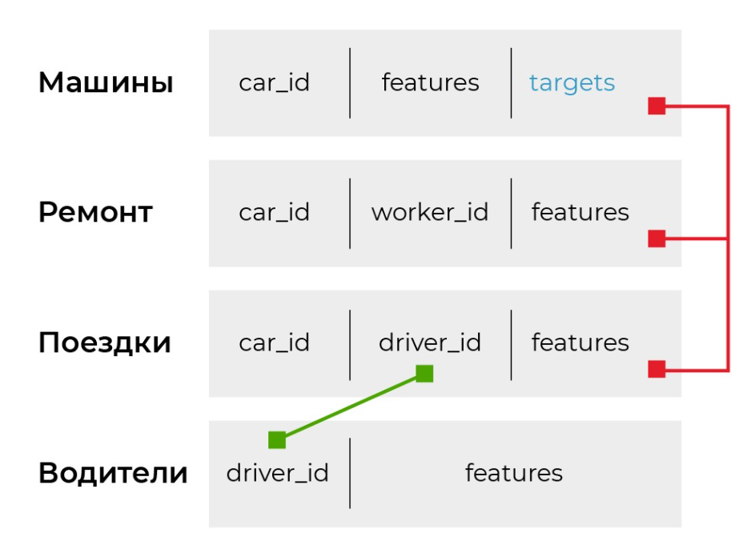
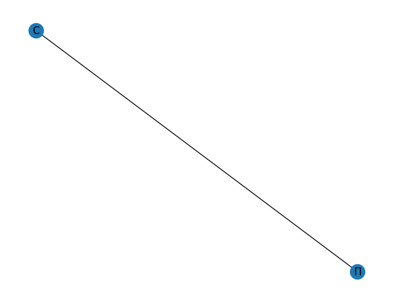
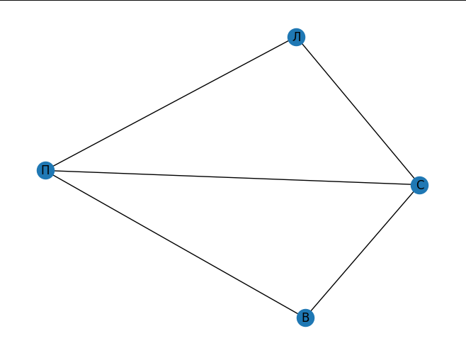
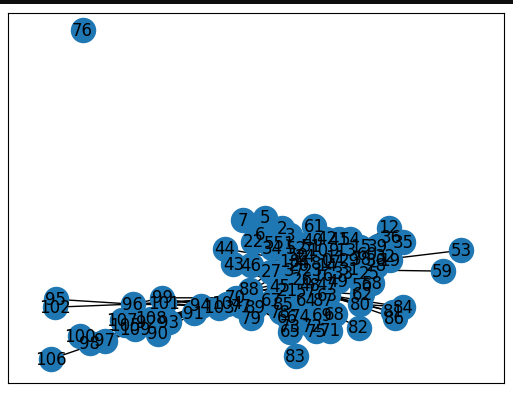
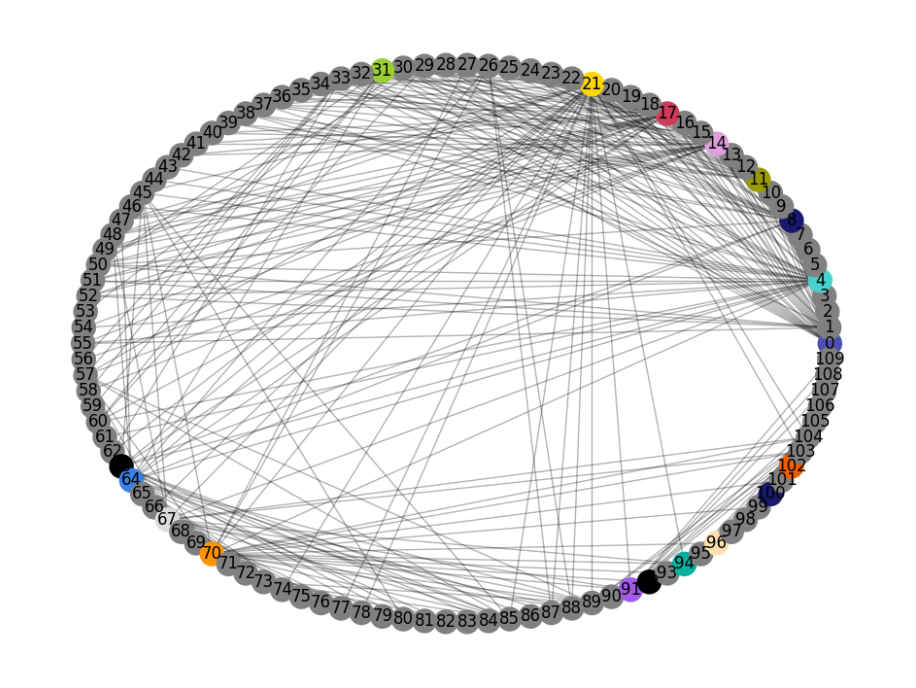
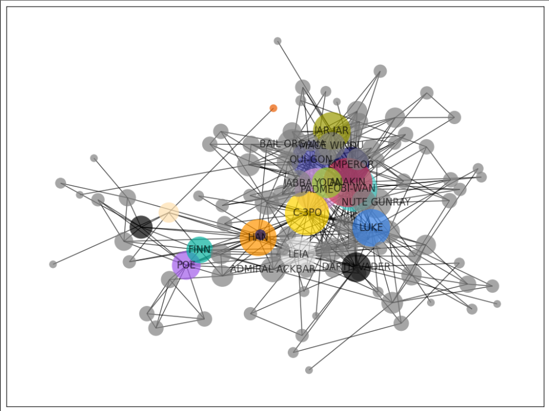
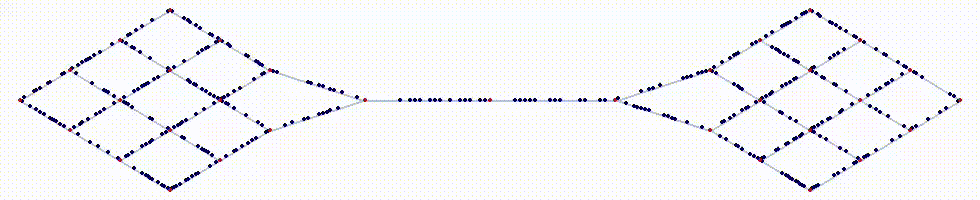
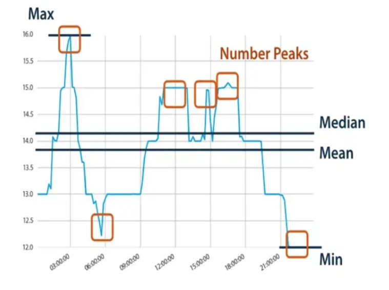
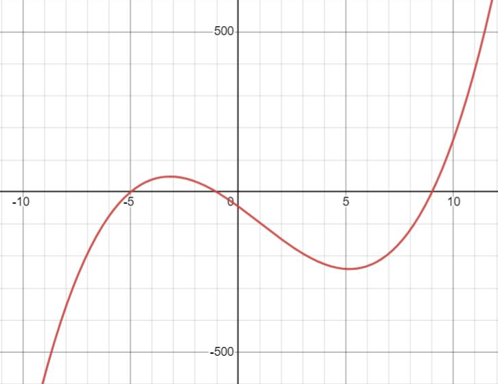
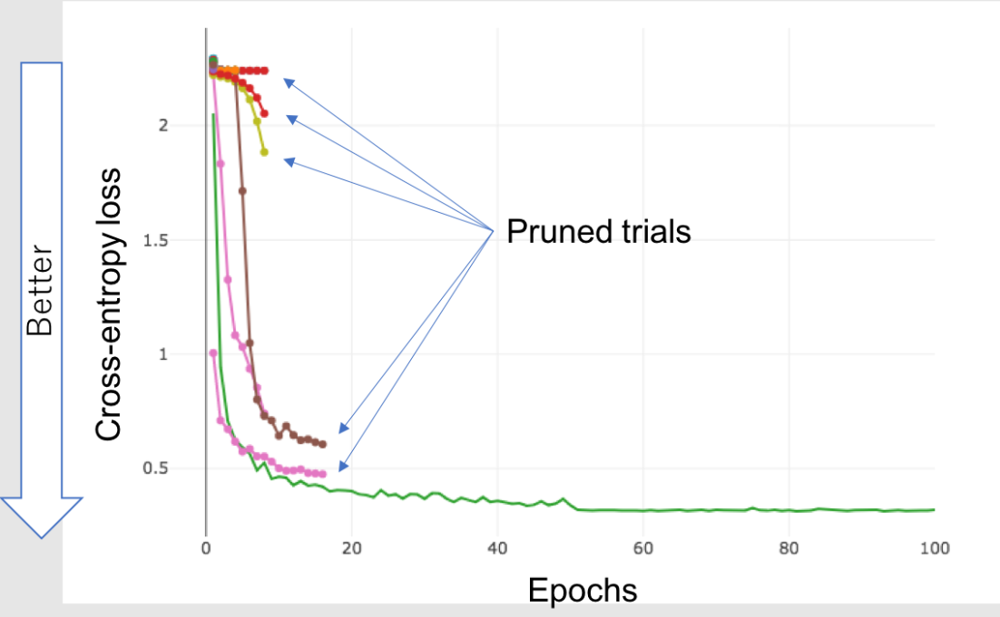

# **Автоматическая генерация и фильтрация признаков**

Предположим, вы достали все возможные визуализированные зависимости из сырых данных, но не нашли решения. Следующий логический шаг — посмотреть на комбинации параметров типа перемножения или сумм средних, посчитать частоту какого-нибудь категориального признака. Все это можно сгенерировать в автоматическом режиме.

**Фреймворки, которые генерируют признаки автоматически:**

- Featuretools — для данных в виде SQL-базы.
- GeoPandas — для работы с геоданными.
- Karate Club и NetworkX — для графов.
- tsfresh — для временных рядов.

Поговорим подробнее о каждом.

## Featuretools

`Featuretools` создана для данных в виде SQL-базы. **Данные в виде SQL-базы** — несколько табличек, которые соединяются по id. У нас есть такая табличка:


\/home\/andrei\/study\/mipt_semester4\/competitive_ds\/week3\/assets\/image-20240315161746537-1710509156667-4-1710509453148-14-1710696825358-1.png

Попробуем загрузить таблицы в `featuretools` и вытащить признаки, которые мы делали вручную в `QuickStart`:

```python
!pip install featuretools -q # Установка
import pandas as pd
import featuretools as ft
```

Загружаем наши таблицы с данными:

```python
path = '../data/car_train.csv'
car_info = pd.read_csv(path) 

path = '../data/rides_info.csv'  
rides_info = pd.read_csv(path)

path = '../data/driver_info.csv' 
driver_info = pd.read_csv(path) 

path = '../data/fix_info.csv'
fix_info = pd.read_csv(path)
```

Сначала создаем `EntitySet` — в нем будут наши таблицы и связи между ними:

```python
es = ft.EntitySet(id="car_data")
```

Теперь добавим таблицы. В них есть категориальные столбцы — `model`, `fuel_type`, `car_type`, `years_to_work`. Нам бы не хотелось суммировать их с чем-то или искать среднее, поэтому укажем для `Featuretools` типы данных с помощью библиотеки `Woodwork` (устанавливается вместе с `Featuretools`).

```python
# Посмотрим какие типы представлены
ft.list_logical_types()
```

|        | name            | type_string      | description                                       | physical_type   | standard_tags | is_default_type | is_registered | parent_type     |
| ------ | --------------- | ---------------- | ------------------------------------------------- | --------------- | ------------- | --------------- | ------------- | --------------- |
| **0**  | Address         | address          | Represents Logical Types that contain address ... | string          | {}            | True            | True          | None            |
| **1**  | Age             | age              | Represents Logical Types that contain whole nu... | int64           | {numeric}     | True            | True          | Integer         |
| **2**  | AgeFractional   | age_fractional   | Represents Logical Types that contain non-nega... | float64         | {numeric}     | True            | True          | Double          |
| **3**  | AgeNullable     | age_nullable     | Represents Logical Types that contain whole nu... | Int64           | {numeric}     | True            | True          | IntegerNullable |
| **4**  | Boolean         | boolean          | Represents Logical Types that contain binary v... | bool            | {}            | True            | True          | BooleanNullable |
| **5**  | BooleanNullable | boolean_nullable | Represents Logical Types that contain binary v... | boolean         | {}            | True            | True          | None            |
| **6**  | Categorical     | categorical      | Represents Logical Types that contain unordere... | category        | {category}    | True            | True          | None            |
| **7**  | CountryCode     | country_code     | Represents Logical Types that use the ISO-3166... | category        | {category}    | True            | True          | Categorical     |
| **8**  | CurrencyCode    | currency_code    | Represents Logical Types that use the ISO-4217... | category        | {category}    | True            | True          | Categorical     |
| **9**  | Datetime        | datetime         | Represents Logical Types that contain date and... | datetime64[ns]  | {}            | True            | True          | None            |
| **10** | Double          | double           | Represents Logical Types that contain positive... | float64         | {numeric}     | True            | True          | None            |
| **11** | EmailAddress    | email_address    | Represents Logical Types that contain email ad... | string          | {}            | True            | True          | None            |
| **12** | Filepath        | filepath         | Represents Logical Types that specify location... | string          | {}            | True            | True          | None            |
| **13** | IPAddress       | ip_address       | Represents Logical Types that contain IP addre... | string          | {}            | True            | True          | None            |
| **14** | Integer         | integer          | Represents Logical Types that contain positive... | int64           | {numeric}     | True            | True          | IntegerNullable |
| **15** | IntegerNullable | integer_nullable | Represents Logical Types that contain positive... | Int64           | {numeric}     | True            | True          | None            |
| **16** | LatLong         | lat_long         | Represents Logical Types that contain latitude... | object          | {}            | True            | True          | None            |
| **17** | NaturalLanguage | natural_language | Represents Logical Types that contain text or ... | string          | {}            | True            | True          | None            |
| **18** | Ordinal         | ordinal          | Represents Logical Types that contain ordered ... | category        | {category}    | True            | True          | Categorical     |
| **19** | PersonFullName  | person_full_name | Represents Logical Types that may contain firs... | string          | {}            | True            | True          | None            |
| **20** | PhoneNumber     | phone_number     | Represents Logical Types that contain numeric ... | string          | {}            | True            | True          | None            |
| **21** | PostalCode      | postal_code      | Represents Logical Types that contain a series... | category        | {category}    | True            | True          | Categorical     |
| **22** | SubRegionCode   | sub_region_code  | Represents Logical Types that use the ISO-3166... | category        | {category}    | True            | True          | Categorical     |
| **23** | Timedelta       | timedelta        | Represents Logical Types that contain values s... | timedelta64[ns] | {}            | True            | True          | None            |
| **24** | URL             | url              | Represents Logical Types that contain URLs, wh... | string          | {}            | True            | True          | None            |
| **25** | Unknown         | unknown          | Represents Logical Types that cannot be inferr... | string          | {}            | True            | True          | None            |


Добавляем наши таблицы в `entity_dataset` с помощью метода `add_dataframe`, указывая типы данных для нечисловых колонок:

```python
from woodwork.logical_types import Categorical, Double, Datetime, Age

es = es.add_dataframe(
    dataframe_name="cars",
    dataframe=car_info,
    index="car_id",
    logical_types={"car_type": Categorical, 'fuel_type': Categorical, 'model': Categorical}
    )

es = es.add_dataframe(
    dataframe_name="rides",
    dataframe=rides_info.drop(['ride_id'], axis=1),
    index='index',
    time_index="ride_date",
    )

es = es.add_dataframe(
    dataframe_name="drivers",
    dataframe=driver_info,
    index="user_id",
    logical_types={"sex": Categorical, "first_ride_date": Datetime, "age": Age}
    )

es = es.add_dataframe(
    dataframe_name="fixes",
    dataframe=fix_info,
    index="index",
    logical_types={"work_type": Categorical, "worker_id":Categorical}
    )
es
/opt/conda/lib/python3.9/site-packages/featuretools/entityset/entityset.py:1906: UserWarning: index index not found in dataframe, creating new integer column
  warnings.warn(
/opt/conda/lib/python3.9/site-packages/featuretools/entityset/entityset.py:754: UserWarning: A Woodwork-initialized DataFrame was provided, so the following parameters were ignored: index, logical_types
  warnings.warn(
Entityset: car_data
  DataFrames:
    cars [Rows: 2337, Columns: 10]
    rides [Rows: 739500, Columns: 14]
    drivers [Rows: 15153, Columns: 7]
    fixes [Rows: 146000, Columns: 7]
  Relationships:
    No relationships
```

Теперь добавим связи между фреймами:

```python
es = es.add_relationship("cars", "car_id", "rides", "car_id")
es = es.add_relationship("drivers", "user_id", "rides", "user_id")
es = es.add_relationship("cars", "car_id", "fixes", "car_id")

es
/opt/conda/lib/python3.9/site-packages/featuretools/entityset/entityset.py:414: UserWarning: Logical type Categorical for child column car_id does not match parent column car_id logical type Unknown. Changing child logical type to match parent.
  warnings.warn(
/opt/conda/lib/python3.9/site-packages/featuretools/entityset/entityset.py:414: UserWarning: Logical type Categorical for child column user_id does not match parent column user_id logical type Unknown. Changing child logical type to match parent.
  warnings.warn(
Entityset: car_data
  DataFrames:
    cars [Rows: 2337, Columns: 10]
    rides [Rows: 739500, Columns: 14]
    drivers [Rows: 15153, Columns: 7]
    fixes [Rows: 146000, Columns: 7]
  Relationships:
    rides.car_id -> cars.car_id
    rides.user_id -> drivers.user_id
    fixes.car_id -> cars.car_id
```

Сгенерируем фичи для машин:

```python
feature_matrix, feature_defs = ft.dfs(
    entityset=es,
    target_dataframe_name="cars",
    max_depth=1,
)
feature_matrix.head()
```

|                | model             | car_type | fuel_type | car_rating | year_to_start | riders | year_to_work | target_reg | target_class | COUNT(rides) | ...  | MODE(fixes.work_type) | MODE(fixes.worker_id) | NUM_UNIQUE(fixes.work_type) | NUM_UNIQUE(fixes.worker_id) | SKEW(fixes.destroy_degree) | SKEW(fixes.work_duration) | STD(fixes.destroy_degree) | STD(fixes.work_duration) | SUM(fixes.destroy_degree) | SUM(fixes.work_duration) |
| -------------- | ----------------- | -------- | --------- | ---------- | ------------- | ------ | ------------ | ---------- | ------------ | ------------ | ---- | --------------------- | --------------------- | --------------------------- | --------------------------- | -------------------------- | ------------------------- | ------------------------- | ------------------------ | ------------------------- | ------------------------ |
| car_id         |                   |          |           |            |               |        |              |            |              |              |      |                       |                       |                             |                             |                            |                           |                           |                          |                           |                          |
| **y13744087j** | Kia Rio X-line    | economy  | petrol    | 3.78       | 2015          | 76163  | 2021         | 108.53     | another_bug  | 174          | ...  | reparking             | LR                    | 4                           | 33                          | 0.835907                   | 0.826462                  | 2.732847                  | 10.171884                | 106.7                     | 933.0                    |
| **O41613818T** | VW Polo VI        | economy  | petrol    | 3.90       | 2015          | 78218  | 2021         | 35.20      | electro_bug  | 174          | ...  | reparking             | YH                    | 5                           | 34                          | 0.997276                   | -0.296841                 | 2.707233                  | 8.574733                 | 102.1                     | 873.0                    |
| **d-2109686j** | Renault Sandero   | standart | petrol    | 6.30       | 2012          | 23340  | 2017         | 38.62      | gear_stick   | 174          | ...  | repair                | AP                    | 5                           | 35                          | 0.472628                   | 0.671481                  | 2.978077                  | 13.040983                | 130.9                     | 915.0                    |
| **u29695600e** | Mercedes-Benz GLC | business | petrol    | 4.04       | 2011          | 1263   | 2020         | 30.34      | engine_fuel  | 174          | ...  | repair                | LM                    | 4                           | 34                          | 0.492743                   | 0.639490                  | 3.237750                  | 14.764994                | 143.0                     | 1007.0                   |
| **N-8915870N** | Renault Sandero   | standart | petrol    | 4.70       | 2012          | 26428  | 2017         | 30.45      | engine_fuel  | 174          | ...  | repair                | CD                    | 4                           | 34                          | 0.478043                   | 1.341642                  | 3.216758                  | 12.659537                | 135.8                     | 981.0                    |


```markup
5 rows × 87 columns
feature_matrix.info()
<class 'pandas.core.frame.DataFrame'>
Index: 2337 entries, y13744087j to z-1337463D
Data columns (total 87 columns):
 #   Column                         Non-Null Count  Dtype   
---  ------                         --------------  -----   
 0   model                          2337 non-null   category
 1   car_type                       2337 non-null   category
 2   fuel_type                      2337 non-null   category
 3   car_rating                     2337 non-null   float64 
 4   year_to_start                  2337 non-null   int64   
 5   riders                         2337 non-null   int64   
 6   year_to_work                   2337 non-null   int64   
 7   target_reg                     2337 non-null   float64 
 8   target_class                   2337 non-null   category
 9   COUNT(rides)                   2337 non-null   Int64   
 10  MAX(rides.deviation_normal)    2337 non-null   float64 
 11  MAX(rides.distance)            2337 non-null   float64 
 12  MAX(rides.rating)              2337 non-null   float64 
 13  MAX(rides.refueling)           2337 non-null   float64 
 14  MAX(rides.ride_cost)           2337 non-null   float64 
 15  MAX(rides.ride_duration)       2337 non-null   float64 
 16  MAX(rides.speed_avg)           2337 non-null   float64 
 17  MAX(rides.speed_max)           2337 non-null   float64 
 18  MAX(rides.stop_times)          2337 non-null   float64 
 19  MAX(rides.user_ride_quality)   2337 non-null   float64 
 20  MEAN(rides.deviation_normal)   2337 non-null   float64 
 21  MEAN(rides.distance)           2337 non-null   float64 
 22  MEAN(rides.rating)             2337 non-null   float64 
 23  MEAN(rides.refueling)          2337 non-null   float64 
 24  MEAN(rides.ride_cost)          2337 non-null   float64 
 25  MEAN(rides.ride_duration)      2337 non-null   float64 
 26  MEAN(rides.speed_avg)          2337 non-null   float64 
 27  MEAN(rides.speed_max)          2337 non-null   float64 
 28  MEAN(rides.stop_times)         2337 non-null   float64 
 29  MEAN(rides.user_ride_quality)  2337 non-null   float64 
 30  MIN(rides.deviation_normal)    2337 non-null   float64 
 31  MIN(rides.distance)            2337 non-null   float64 
 32  MIN(rides.rating)              2337 non-null   float64 
 33  MIN(rides.refueling)           2337 non-null   float64 
 34  MIN(rides.ride_cost)           2337 non-null   float64 
 35  MIN(rides.ride_duration)       2337 non-null   float64 
 36  MIN(rides.speed_avg)           2337 non-null   float64 
 37  MIN(rides.speed_max)           2337 non-null   float64 
 38  MIN(rides.stop_times)          2337 non-null   float64 
 39  MIN(rides.user_ride_quality)   2337 non-null   float64 
 40  SKEW(rides.deviation_normal)   2337 non-null   float64 
 41  SKEW(rides.distance)           2337 non-null   float64 
 42  SKEW(rides.rating)             2337 non-null   float64 
 43  SKEW(rides.refueling)          2337 non-null   float64 
 44  SKEW(rides.ride_cost)          2337 non-null   float64 
 45  SKEW(rides.ride_duration)      2337 non-null   float64 
 46  SKEW(rides.speed_avg)          2337 non-null   float64 
 47  SKEW(rides.speed_max)          2337 non-null   float64 
 48  SKEW(rides.stop_times)         2337 non-null   float64 
 49  SKEW(rides.user_ride_quality)  2337 non-null   float64 
 50  STD(rides.deviation_normal)    2337 non-null   float64 
 51  STD(rides.distance)            2337 non-null   float64 
 52  STD(rides.rating)              2337 non-null   float64 
 53  STD(rides.refueling)           2337 non-null   float64 
 54  STD(rides.ride_cost)           2337 non-null   float64 
 55  STD(rides.ride_duration)       2337 non-null   float64 
 56  STD(rides.speed_avg)           2337 non-null   float64 
 57  STD(rides.speed_max)           2337 non-null   float64 
 58  STD(rides.stop_times)          2337 non-null   float64 
 59  STD(rides.user_ride_quality)   2337 non-null   float64 
 60  SUM(rides.deviation_normal)    2337 non-null   float64 
 61  SUM(rides.distance)            2337 non-null   float64 
 62  SUM(rides.rating)              2337 non-null   float64 
 63  SUM(rides.refueling)           2337 non-null   float64 
 64  SUM(rides.ride_cost)           2337 non-null   float64 
 65  SUM(rides.ride_duration)       2337 non-null   float64 
 66  SUM(rides.speed_avg)           2337 non-null   float64 
 67  SUM(rides.speed_max)           2337 non-null   float64 
 68  SUM(rides.stop_times)          2337 non-null   float64 
 69  SUM(rides.user_ride_quality)   2337 non-null   float64 
 70  COUNT(fixes)                   2337 non-null   Int64   
 71  MAX(fixes.destroy_degree)      2337 non-null   float64 
 72  MAX(fixes.work_duration)       2337 non-null   float64 
 73  MEAN(fixes.destroy_degree)     2337 non-null   float64 
 74  MEAN(fixes.work_duration)      2337 non-null   float64 
 75  MIN(fixes.destroy_degree)      2337 non-null   float64 
 76  MIN(fixes.work_duration)       2337 non-null   float64 
 77  MODE(fixes.work_type)          2337 non-null   category
 78  MODE(fixes.worker_id)          2337 non-null   category
 79  NUM_UNIQUE(fixes.work_type)    2337 non-null   Int64   
 80  NUM_UNIQUE(fixes.worker_id)    2337 non-null   Int64   
 81  SKEW(fixes.destroy_degree)     2337 non-null   float64 
 82  SKEW(fixes.work_duration)      2337 non-null   float64 
 83  STD(fixes.destroy_degree)      2337 non-null   float64 
 84  STD(fixes.work_duration)       2337 non-null   float64 
 85  SUM(fixes.destroy_degree)      2337 non-null   float64 
 86  SUM(fixes.work_duration)       2337 non-null   float64 
dtypes: Int64(4), category(6), float64(74), int64(3)
memory usage: 1.5 MB
```

Также можно генерировать не все фичи, а только нужные:

```python
feature_matrix, feature_defs = ft.dfs(
    entityset=es,
    target_dataframe_name="cars",
    agg_primitives=["mode", "count"], # Ограничиваем число фичей
    max_depth=1, # Ограничиваем глубину
)
feature_matrix.head()
```

|                | model             | car_type | fuel_type | car_rating | year_to_start | riders | year_to_work | target_reg | target_class | COUNT(rides) | COUNT(fixes) | MODE(fixes.work_type) | MODE(fixes.worker_id) |
| -------------- | ----------------- | -------- | --------- | ---------- | ------------- | ------ | ------------ | ---------- | ------------ | ------------ | ------------ | --------------------- | --------------------- |
| car_id         |                   |          |           |            |               |        |              |            |              |              |              |                       |                       |
| **y13744087j** | Kia Rio X-line    | economy  | petrol    | 3.78       | 2015          | 76163  | 2021         | 108.53     | another_bug  | 174          | 35           | reparking             | LR                    |
| **O41613818T** | VW Polo VI        | economy  | petrol    | 3.90       | 2015          | 78218  | 2021         | 35.20      | electro_bug  | 174          | 35           | reparking             | YH                    |
| **d-2109686j** | Renault Sandero   | standart | petrol    | 6.30       | 2012          | 23340  | 2017         | 38.62      | gear_stick   | 174          | 35           | repair                | AP                    |
| **u29695600e** | Mercedes-Benz GLC | business | petrol    | 4.04       | 2011          | 1263   | 2020         | 30.34      | engine_fuel  | 174          | 35           | repair                | LM                    |
| **N-8915870N** | Renault Sandero   | standart | petrol    | 4.70       | 2012          | 26428  | 2017         | 30.45      | engine_fuel  | 174          | 35           | repair                | CD                    |


С помощью параметра `max_depth` для фичей можно задавать глубину. Тогда фичи будут создаваться не только в пределах таблицы, но и комбинировать признаки со связанных таблиц. Для отладки вычислений считают не на всем датасете, что может быть долго, а на нескольких примерах. Список этих примеров передают в параметр `instance_ids`.

```python
feature_matrix, feature_defs = ft.dfs(
    entityset=es,
    target_dataframe_name="cars",
    agg_primitives=["mean", "sum", "mode"],
    instance_ids=["y13744087j", "d-2109686j", "N-8915870N"],
    max_depth=2,
)
feature_matrix.head()
```

|                | model           | car_type | fuel_type | car_rating | year_to_start | riders | year_to_work | target_reg | target_class | MEAN(rides.deviation_normal) | ...  | MODE(rides.YEAR(ride_date)) | MODE(rides.drivers.sex) | SUM(rides.drivers.age) | SUM(rides.drivers.user_rating) | SUM(rides.drivers.user_rides) | SUM(rides.drivers.user_time_accident) | MODE(fixes.DAY(fix_date)) | MODE(fixes.MONTH(fix_date)) | MODE(fixes.WEEKDAY(fix_date)) | MODE(fixes.YEAR(fix_date)) |
| -------------- | --------------- | -------- | --------- | ---------- | ------------- | ------ | ------------ | ---------- | ------------ | ---------------------------- | ---- | --------------------------- | ----------------------- | ---------------------- | ------------------------------ | ----------------------------- | ------------------------------------- | ------------------------- | --------------------------- | ----------------------------- | -------------------------- |
| car_id         |                 |          |           |            |               |        |              |            |              |                              |      |                             |                         |                        |                                |                               |                                       |                           |                             |                               |                            |
| **y13744087j** | Kia Rio X-line  | economy  | petrol    | 3.78       | 2015          | 76163  | 2021         | 108.53     | another_bug  | -0.120391                    | ...  | 2020                        | 1                       | 5831.0                 | 1432.0                         | 144078.0                      | 2056.0                                | 10                        | 4                           | 5                             | 2019                       |
| **d-2109686j** | Renault Sandero | standart | petrol    | 6.30       | 2012          | 23340  | 2017         | 38.62      | gear_stick   | -2.223954                    | ...  | 2020                        | 1                       | 5714.0                 | 1364.7                         | 163567.0                      | 1701.0                                | 5                         | 3                           | 1                             | 2019                       |
| **N-8915870N** | Renault Sandero | standart | petrol    | 4.70       | 2012          | 26428  | 2017         | 30.45      | engine_fuel  | 12.455678                    | ...  | 2020                        | 0                       | 5968.0                 | 1411.5                         | 155944.0                      | 1891.0                                | 6                         | 4                           | 0                             | 2019                       |


```markup
3 rows × 52 columns
```

Все доступные типы фичей можно посмотреть в `list_primitives`:

```python
ft.list_primitives().head()
```

|       | name               | type        | dask_compatible | spark_compatible | description                                       | valid_inputs                                      | return_type                                       |
| ----- | ------------------ | ----------- | --------------- | ---------------- | ------------------------------------------------- | ------------------------------------------------- | ------------------------------------------------- |
| **0** | time_since_last    | aggregation | False           | False            | Calculates the time elapsed since the last dat... | <ColumnSchema (Logical Type = Datetime) (Seman... | <ColumnSchema (Logical Type = Double) (Semanti... |
| **1** | all                | aggregation | True            | False            | Calculates if all values are 'True' in a list.    | <ColumnSchema (Logical Type = Boolean)>, <Colu... | <ColumnSchema (Logical Type = Boolean)>           |
| **2** | count_above_mean   | aggregation | False           | False            | Calculates the number of values that are above... | <ColumnSchema (Semantic Tags = ['numeric'])>      | <ColumnSchema (Logical Type = IntegerNullable)... |
| **3** | count_greater_than | aggregation | False           | False            | Determines the number of values greater than a... | <ColumnSchema (Semantic Tags = ['numeric'])>      | <ColumnSchema (Logical Type = Integer) (Semant... |
| **4** | count_inside_range | aggregation | False           | False            | Determines the number of values that fall with... | <ColumnSchema (Semantic Tags = ['numeric'])>      | <ColumnSchema (Logical Type = IntegerNullable)... |


Также в `Featuretools` реализован собственный механизм отбора фичей.

**Три функции механизма отбора фичей:**

- `ft.selection.remove_highly_null_features()` — отбрасывает признаки с большим количеством пропусков.
- `ft.selection.remove_single_value_features()` — отбрасывает константные признаки.
- `ft.selection.remove_highly_correlated_features()` — отбрасывает сильно скоррелированные признаки.

Передаем датафрейм в аргументы функции, и она отрабатывает соответственно названию. В библиотеке реализовано много полезных фишек, с которыми можно ознакомиться в документации.

## **GeoPandas**

Часто в датасетах чемпионатов по анализу данных присутствуют географические координаты или привязки к местоположению. Для работы с ними можно использовать библиотеку `GeoPandas`, которая объединяет `Pandas` и `Shapely`, библиотеку для геопространственных расчетов.

```python
!pip install geopandas folium scikit-learn -q
import geopandas as gpd
from sklearn.datasets import fetch_california_housing
```

Посмотрим на `California Housing Dataset`. Это набор данных для прогнозирования цен на жилье. Импортируем его из `scikit-learn`:

```python
df = fetch_california_housing(as_frame=True).data
df.head()
```

|       | MedInc | HouseAge | AveRooms | AveBedrms | Population | AveOccup | Latitude | Longitude |
| ----- | ------ | -------- | -------- | --------- | ---------- | -------- | -------- | --------- |
| **0** | 8.3252 | 41.0     | 6.984127 | 1.023810  | 322.0      | 2.555556 | 37.88    | -122.23   |
| **1** | 8.3014 | 21.0     | 6.238137 | 0.971880  | 2401.0     | 2.109842 | 37.86    | -122.22   |
| **2** | 7.2574 | 52.0     | 8.288136 | 1.073446  | 496.0      | 2.802260 | 37.85    | -122.24   |
| **3** | 5.6431 | 52.0     | 5.817352 | 1.073059  | 558.0      | 2.547945 | 37.85    | -122.25   |
| **4** | 3.8462 | 52.0     | 6.281853 | 1.081081  | 565.0      | 2.181467 | 37.85    | -122.25   |


Нас интересуют два последних столбца — `Latitude` и `Longitude` (широта и долгота).

```python
# Создадим GeoDataFrame
gdf = gpd.GeoDataFrame(
        df,
        geometry=gpd.points_from_xy(df['Longitude'], df['Latitude']),
        crs=4326
    ).to_crs(epsg=3857)
gdf.head(3)
```

|       | MedInc | HouseAge | AveRooms | AveBedrms | Population | AveOccup | Latitude | Longitude | geometry                          |
| ----- | ------ | -------- | -------- | --------- | ---------- | -------- | -------- | --------- | --------------------------------- |
| **0** | 8.3252 | 41.0     | 6.984127 | 1.023810  | 322.0      | 2.555556 | 37.88    | -122.23   | POINT (-13606581.360 4562487.679) |
| **1** | 8.3014 | 21.0     | 6.238137 | 0.971880  | 2401.0     | 2.109842 | 37.86    | -122.22   | POINT (-13605468.165 4559667.342) |
| **2** | 7.2574 | 52.0     | 8.288136 | 1.073446  | 496.0      | 2.802260 | 37.85    | -122.24   | POINT (-13607694.555 4558257.461) |


Мы видим, что он особо ничем не отличается от обычного DataFrame. Единственное отличие — появился столбец `geometry`, который представляет собой объект `GeoSeries`. Для этого объекта дополнительно доступны атрибуты и методы.

```python
type(gdf['geometry'])
geopandas.geoseries.GeoSeries
```

Внутри него лежат объекты `Point` из библиотеки `Shapely`.

```python
type(gdf['geometry'][0])
shapely.geometry.point.Point
```

Также в `GeoPandas` можно работать не только с точками, но и с кривыми линиями, полигонами или одновременно со всем сразу.

## County feature

Теперь генерируем фичи. Калифорния довольно большая, 58 округов. У каждого разный уровень жизни и климат, а, соответственно, разные цены на жилье. Кажется, что категориальная фича о принадлежности к округу могла бы помочь.

Для начала получим координаты округов. Возьмем их из [банка открытых данных Калифорнии](https://data.ca.gov/) (используйте VPN, чтобы посетить сайт). Загрузим их из другого источника или из локального хранилища:

```python
import requests, zipfile, io

#county_fname = 'https://data.ca.gov/dataset/e212e397-1277-4df3-8c22-40721b095f33/resource/'+\
#                       'b0007416-a325-4777-9295-368ea6b710e6/download/ca-county-boundaries.zip'
county_fname = 'https://github.com/a-milenkin/Competitive_Data_Science/raw/main/data/ca-county-boundaries.zip'

r2 = requests.get(county_fname)
z2 = zipfile.ZipFile(io.BytesIO(r2.content))
z2.extractall("./ca")
ca_counties=gpd.read_file('./ca/CA_Counties').to_crs("EPSG:3857")
ca_counties.head(3)
```

|       | STATEFP | COUNTYFP | COUNTYNS | GEOID | NAME          | NAMELSAD             | LSAD | CLASSFP | MTFCC | CSAFP | CBSAFP | METDIVFP | FUNCSTAT | ALAND      | AWATER     | INTPTLAT    | INTPTLON     | geometry                                          |
| ----- | ------- | -------- | -------- | ----- | ------------- | -------------------- | ---- | ------- | ----- | ----- | ------ | -------- | -------- | ---------- | ---------- | ----------- | ------------ | ------------------------------------------------- |
| **0** | 06      | 091      | 00277310 | 06091 | Sierra        | Sierra County        | 06   | H1      | G4020 | NaN   | NaN    | NaN      | A        | 2468694587 | 23299110   | +39.5769252 | -120.5219926 | POLYGON ((-13431319.751 4821511.426, -13431312... |
| **1** | 06      | 067      | 00277298 | 06067 | Sacramento    | Sacramento County    | 06   | H1      | G4020 | 472   | 40900  | NaN      | A        | 2499183617 | 76073827   | +38.4500114 | -121.3404409 | POLYGON ((-13490651.476 4680831.603, -13490511... |
| **2** | 06      | 083      | 00277306 | 06083 | Santa Barbara | Santa Barbara County | 06   | H1      | G4020 | NaN   | 42200  | NaN      | A        | 7084000598 | 2729814515 | +34.5370572 | -120.0399729 | MULTIPOLYGON (((-13423116.772 4042044.149, -13... |


Теперь добавим фичи:

```python
gdf = gpd.overlay(gdf, ca_counties[['NAME', 'geometry']], how='intersection')
gdf.head(3)
```

|       | MedInc | HouseAge | AveRooms | AveBedrms | Population | AveOccup | Latitude | Longitude | NAME    | geometry                          |
| ----- | ------ | -------- | -------- | --------- | ---------- | -------- | -------- | --------- | ------- | --------------------------------- |
| **0** | 8.3252 | 41.0     | 6.984127 | 1.023810  | 322.0      | 2.555556 | 37.88    | -122.23   | Alameda | POINT (-13606581.360 4562487.679) |
| **1** | 8.3014 | 21.0     | 6.238137 | 0.971880  | 2401.0     | 2.109842 | 37.86    | -122.22   | Alameda | POINT (-13605468.165 4559667.342) |
| **2** | 7.2574 | 52.0     | 8.288136 | 1.073446  | 496.0      | 2.802260 | 37.85    | -122.24   | Alameda | POINT (-13607694.555 4558257.461) |


Появился столбец `NAME`. С помощью `Counter` посчитаем, сколько домов в каждом округе:

```python
from collections import Counter

Counter(gdf['NAME']).most_common()
#cnt = dict(Counter(gdf['NAME']))
#sorted(cnt.items(), key=lambda x: x[1], reverse=True)
[('Los Angeles', 5824),
 ('Orange', 1618),
 ('San Diego', 1609),
 ('Alameda', 1017),
 ('Santa Clara', 1003),
 ('San Bernardino', 831),
 ('Sacramento', 688),
 ('Contra Costa', 597),
 ('Riverside', 588),
 ('San Francisco', 575),
 ('Fresno', 525),
 ('San Mateo', 447),
 ('San Joaquin', 419),
 ('Ventura', 384),
 ('Kern', 370),
 ('Sonoma', 313),
 ('Santa Barbara', 307),
 ('Stanislaus', 303),
 ('Tulare', 258),
 ('Monterey', 202),
 ('Solano', 199),
 ('Santa Cruz', 191),
 ('Marin', 166),
 ('Butte', 156),
 ('San Luis Obispo', 139),
 ('Placer', 132),
 ('Merced', 128),
 ('Humboldt', 127),
 ('Shasta', 121),
 ('El Dorado', 120),
 ('Imperial', 118),
 ('Napa', 103),
 ('Nevada', 96),
 ('Kings', 88),
 ('Lake', 87),
 ('Mendocino', 79),
 ('Yolo', 79),
 ('Madera', 75),
 ('Tuolumne', 57),
 ('Sutter', 56),
 ('Yuba', 53),
 ('Tehama', 49),
 ('Siskiyou', 37),
 ('Plumas', 33),
 ('Calaveras', 32),
 ('Amador', 28),
 ('San Benito', 28),
 ('Trinity', 27),
 ('Glenn', 26),
 ('Lassen', 25),
 ('Inyo', 18),
 ('Mariposa', 18),
 ('Mono', 17),
 ('Colusa', 16),
 ('Del Norte', 16),
 ('Modoc', 8),
 ('Sierra', 8),
 ('Alpine', 3)]
```

Бывает полезно посмотреть данные на карте, чтобы удостовериться в адекватности данных — дома не находятся в океане, нет выбросов. Также хорошим признаком при прогнозировании цен на недвижимость может быть расположение на берегу океана или водоема. Нанести объекты на карту можно с помощью библиотеки `Folium`. В `GeoPandas` тоже есть инструменты для отрисовки карт, но в `Folium` делать это удобнее.

```python
# LA coords: 34.033333, -118.266667
import folium

# Создаем объект карты
m = folium.Map([37, -122], tiles='OpenStreetMap', zoom_start=6)

# Добавим точки на карту с помощью обычного apply
gdf.apply(lambda row: folium.CircleMarker(location=[row["Latitude"],row["Longitude"]],
                                          popup=row.name,
                                          radius=1,).add_to(m), axis=1)

#  Добавление LA
#folium.CircleMarker(location=[34.033333, -118.266667],
#                    radius=3, color='red').add_to(m)
m
Make this Notebook Trusted to load map: File -> Trust Notebook
```

NetworkX

Приведем пример, чтобы увидеть, откуда возникают графы в анализе данных.

```python
!pip install networkx --upgrade -q
import numpy as np
import networkx as nx
```

Представим, у нас задача кредитного скоринга. Есть Петя, у него плохая кредитная история — было много задолженностей. Одобрим ли мы ему кредит? Скорее всего, нет.

У Пети есть жена Света, она тоже клиент нашего банка. У нее хорошая кредитная история — брала несколько крупных кредитов — все вернула, задолженностей не было.

Мы с вами понимаем, что они будут вместе выплачивать кредит, а значит, можно поднять скор Пете, но на какое количество? Какой алгоритм для этого применить?

Можно взять деревья. Но если мы захотим использовать информацию о других родственниках, то не сможем — у нас не будет информации по всей родне каждого человека. А если у нас не скоринг, а рекомендательная система в социальных сетях, и мы хотим предлагать рекламу на основании интересов друзей?

Для таких задач нужно работать с графами. Разберемся, что такое граф. **Граф** можно определить как G=(V,E), где V — набор узлов, а E — список ребер.

Представим Петю и Свету в виде графа с помощью `NetworkX`.

```python
g = nx.Graph()
g.add_node('П')
g.add_node('С')
g.add_edge('П','С')
nx.draw(g, with_labels=True)
```



Вершины — это точки данных (Петя и Света), а связь между ними задана ребром.

Мы создали пустой граф, а потом добавили поочередно вершины и ребро между ними. В `NetworkX` есть возможность добавлять сразу несколько вершин или ребер. Делать это можно с помощью методов `add_nodes_from()` и `add_edges_from()`, в которые можно передавать элементы списком.

Добавим к семье еще двух взрослых детей, Витю и Лену:

```python
g.add_nodes_from(['В','Л'])
g.add_edges_from([('В','П'),('В','С'),('Л','П'),('Л','С')])
nx.draw(g, with_labels=True)
```



Рекомендую использовать этот способ — так и удобнее, и быстрее для больших графов.

Граф мы создали, но у нас все еще нет фичей. Добавим их.

Добавим сумму выплаченных кредитов и их количество. Добавлять атрибуты к вершинам удобно с помощью функции `set_node_attributes` — она принимает на вход словарь словарей. Такой транспонированный DataFrame подходит.

```python
feat = {'П':{'sum':2000000,'count':10},
        'С':{'sum':1000000,'count':4},
        'В':{'sum':40000,'count':1},
        'Л':{'sum':0,'count':0},}

feat = pd.DataFrame(feat).T
feat
```

|       | sum     | count |
| ----- | ------- | ----- |
| **П** | 2000000 | 10    |
| **С** | 1000000 | 4     |
| **В** | 40000   | 1     |
| **Л** | 0       | 0     |


```python
nx.set_node_attributes(g, feat.T)
g.nodes.data()
NodeDataView({'П': {'sum': 2000000, 'count': 10}, 'С': {'sum': 1000000, 'count': 4}, 'В': {'sum': 40000, 'count': 1}, 'Л': {'sum': 0, 'count': 0}})
```

Теперь рассмотрим более сложные фичи из `NetworkX`.

**Центральность** (centrality) — степень важности вершины:

- `nx.degree_centrality(G)` — чем больше соседей, тем важнее.
- `nx.betweenness_centrality(G)` — cтепень посредничества.
- `nx.closeness_centrality(G)` — степень близости.

Для демонстрации этих признаков возьмем датасет, содержащий все связи героев из вселенной «Звездных войн»:

```python
import json
import requests
from collections import Counter
from networkx.readwrite import json_graph

# Загружаем датасет
path = 'https://raw.githubusercontent.com/evelinag/StarWars-social-network/master/networks/starwars-full-interactions.json'
interactions = json.loads(requests.get(path).content)
interactions['nodes'][:10]
[{'name': 'QUI-GON', 'value': 61, 'colour': '#4f4fb1'},
 {'name': 'NUTE GUNRAY', 'value': 24, 'colour': '#808080'},
 {'name': 'PK-4', 'value': 3, 'colour': '#808080'},
 {'name': 'TC-14', 'value': 4, 'colour': '#808080'},
 {'name': 'OBI-WAN', 'value': 147, 'colour': '#48D1CC'},
 {'name': 'DOFINE', 'value': 3, 'colour': '#808080'},
 {'name': 'RUNE', 'value': 10, 'colour': '#808080'},
 {'name': 'TEY HOW', 'value': 4, 'colour': '#808080'},
 {'name': 'EMPEROR', 'value': 51, 'colour': '#191970'},
 {'name': 'CAPTAIN PANAKA', 'value': 19, 'colour': '#808080'}]
interactions['links'][:10]
[{'source': 1, 'target': 0, 'value': 1},
 {'source': 2, 'target': 3, 'value': 1},
 {'source': 4, 'target': 3, 'value': 1},
 {'source': 0, 'target': 3, 'value': 1},
 {'source': 4, 'target': 0, 'value': 26},
 {'source': 1, 'target': 3, 'value': 1},
 {'source': 5, 'target': 1, 'value': 1},
 {'source': 5, 'target': 3, 'value': 1},
 {'source': 1, 'target': 6, 'value': 8},
 {'source': 6, 'target': 7, 'value': 2}]
interactions['directed'] = False
interactions['multigraph'] = False
interactions['graph'] = {}
G = json_graph.node_link_graph(interactions)
nx.draw_networkx(G)
```



```python
import matplotlib.pyplot as plt
%matplotlib inline
plt.rcParams["figure.figsize"] = [12, 9]

clrs = np.array([n[1]['colour'] for n in G.nodes.data()])
labels = {n[0]: n[1]['name'] for n in G.nodes.data()}

pos=nx.circular_layout(G)

nx.draw_networkx_nodes(G,
pos=pos,
node_color=clrs,
)

nx.draw_networkx_edges(G,
pos=pos,
alpha=0.3,
label={n[0]: n[1]['name'] for n in G.nodes.data()})

nx.draw_networkx_labels(G, pos=pos)
plt.axis('off')
plt.show()
```



## Degree centrality

Смысл Degree centrality (DC) — самой простой меры — основан на допущении, что тот, кто обладает большим количеством связей (отношений) с другими, занимает центральное положение в локальной общности. Иными словами, центральным можно считать того, кто связан с наибольшим числом членов группы.

**Degree centrality** — это отношение количества связей определенного узла к общему количеству других узлов.

```python
degree_centrality = nx.degree_centrality(G)
degree_centrality_counts = Counter(degree_centrality)
for k, v in degree_centrality_counts.most_common(10):

print(G.nodes[k]['name'], v)
ANAKIN 0.3761467889908257 OBI-WAN 0.3211009174311927 PADME 0.30275229357798167 C-3PO 0.30275229357798167 QUI-GON 0.23853211009174313 JAR JAR 0.22018348623853212 LUKE 0.22018348623853212 HAN 0.21100917431192662 EMPEROR 0.2018348623853211 LEIA 0.1926605504587156
pos=nx.spring_layout(G, k=5*1/np.sqrt(len(G.nodes()))) # Фиксируем случайность
th = degree_centrality_counts.most_common(20)[-1][1]
nx.draw_networkx(
G,
node_color=clrs,
with_labels=True,
alpha=0.7,
labels={n[0]: n[1]['name'] for n in G.nodes.data() if degree_centrality[n[0]] > th},
node_size=np.array(list(degree_centrality.values())) * 10000,
linewidths=0.01,
pos=pos,
)
```



## Betweenness centrality

**Betweenness centrality (степень посредничества)** позволяет ранжировать вершины в графе, то есть оценить их важность с точки зрения количества проходящих через них путей.



На иллюстрации между каждой парой вершин в графе курсирует по одной частице; частицы двигаются только по кратчайшим путям. Каждый раз, когда через вершину графа проходит какая-либо частица, счетчик вершины увеличивается. Чем больше значение счетчика, тем больше радиус вершины, который характеризует «центральность» вершины.

```python
betweenness_centrality = nx.betweenness_centrality(G)
betweenness_centrality_counts = Counter(betweenness_centrality)

for k, v in betweenness_centrality_counts.most_common(10):
print(G.nodes[k]['name'], v)
OBI-WAN 0.21289741830262351 C-3PO 0.1926808487468285 HAN 0.1812153961936558 ANAKIN 0.1621708391273783 LUKE 0.137821617635291 DARTH VADER 0.0880518038555187 POE 0.08361809147724517 EMPEROR 0.07433337936695311 PADME 0.06946928856235446 KYLO REN 0.05646104121849159
```

## Closeness centrality

Closeness centrality (центральность близости) выражает, насколько близко расположен узел к остальным узлам сети.

**Степень близости узла** — это мера центральности в сети, вычисляемая как обратная величина суммы длин кратчайших путей между узлом и всеми другими узлами графа. Таким образом, чем центральнее узел, тем ближе он ко всем другим узлам.

```python
closeness_centrality = nx.closeness_centrality(G)

closeness_centrality_counts = Counter(closeness_centrality)
for k, v in closeness_centrality_counts.most_common(10):
print(G.nodes[k]['name'], v)
OBI-WAN 0.5515936820202403 C-3PO 0.5487649964714185 ANAKIN 0.5377345442810383 LUKE 0.5144671841919549 HAN 0.5047602561883331 EMPEROR 0.4908677720730579 PADME 0.48202330771138113 DARTH VADER 0.48202330771138113 LEIA 0.47986176821491755 QUI-GON 0.4693384838242395
```


## Karate Club

Мы разобрались, что такое граф и как добавлять фичи. Теперь посмотрим, как это использовать в ML.

Есть два способа: графовые алгоритмы и графовые нейронные сети. Мы рассмотрим первый способ. Сделаем это с помощью библиотеки Karate Club.

**Karate Club** — простая библиотека с sklearn-подобным API. Ставится через `conda` (рекомендуем) или `pip` (могут быть проблемы).

```python
!pip install karateclub -q
     ━━━━━━━━━━━━━━━━━━━━━━━━━━━━━━━━━━━━━━━━
64.5/64.5 kB 1.8 MB/s eta 0:00:00
  Preparing metadata (setup.py) ... done
     ━━━━━━━━━━━━━━━━━━━━━━━━━━━━━━━━━━━━━━━━
16.8/16.8 MB 53.3 MB/s eta 0:00:00
     ━━━━━━━━━━━━━━━━━━━━━━━━━━━━━━━━━━━━━━━━
1.9/1.9 MB 66.1 MB/s eta 0:00:00
     ━━━━━━━━━━━━━━━━━━━━━━━━━━━━━━━━━━━━━━━━
1.8/1.8 MB 74.9 MB/s eta 0:00:00
     ━━━━━━━━━━━━━━━━━━━━━━━━━━━━━━━━━━━━━━━━
11.5/11.5 MB 78.5 MB/s eta 0:00:00
     ━━━━━━━━━━━━━━━━━━━━━━━━━━━━━━━━━━━━━━━━
177.4/177.4 kB 16.4 MB/s eta 0:00:00
     ━━━━━━━━━━━━━━━━━━━━━━━━━━━━━━━━━━━━━━━━
3.4/3.4 MB 85.1 MB/s eta 0:00:00
  Building wheel for karateclub (setup.py) ... done
ERROR: pip's dependency resolver does not currently take into account all the packages that are installed. This behaviour is the source of the following dependency conflicts.
bigframes 0.21.0 requires pandas<2.1.4,>=1.5.0, but you have pandas 1.3.5 which is incompatible.
chex 0.1.85 requires numpy>=1.24.1, but you have numpy 1.22.4 which is incompatible.
featuretools 1.29.0 requires pandas>=1.5.0, but you have pandas 1.3.5 which is incompatible.
google-colab 1.0.0 requires pandas==1.5.3, but you have pandas 1.3.5 which is incompatible.
plotnine 0.12.4 requires numpy>=1.23.0, but you have numpy 1.22.4 which is incompatible.
plotnine 0.12.4 requires pandas>=1.5.0, but you have pandas 1.3.5 which is incompatible.
tensorflow 2.15.0 requires numpy<2.0.0,>=1.23.5, but you have numpy 1.22.4 which is incompatible.
woodwork 0.28.0 requires numpy<2.0.0,>=1.25.0, but you have numpy 1.22.4 which is incompatible.
woodwork 0.28.0 requires pandas>=1.4.3, but you have pandas 1.3.5 which is incompatible.
xarray 2023.7.0 requires pandas>=1.4, but you have pandas 1.3.5 which is incompatible.
#!conda install karateclub > _
```

Обученная модель имеет три метода:

- `get_embedding` — возвращает эмбеддинги узлов.
- `get_memberships` — возвращает словарь с принадлежностью узла к тому или иному сообществу (или `None`).
- `get_cluster_centers` — возвращает словарь с информацией, является ли узел центром какого-либо сообщества (или `None`).

Посмотрим пример использования на простом алгоритме `DeepWalk`:

```python
from karateclub import DeepWalk

model = DeepWalk()
model.fit(G)
embedding = model.get_embedding()
print(embedding.shape)
embedding
WARNING:gensim.models.word2vec:Both hierarchical softmax and negative sampling are activated. This is probably a mistake. You should set either 'hs=0' or 'negative=0' to disable one of them. 
(110, 128)

array([[ 0.23625316, -0.11499219,  0.05822323, ...,  0.02780985,
         0.2662718 ,  0.12564729],
       [ 0.07913787, -0.2104752 ,  0.37200937, ...,  0.5789175 ,
         0.89382845, -0.3531492 ],
       [-0.1602411 , -0.19977544,  0.7691918 , ...,  0.05833651,
         0.50188494, -1.3186884 ],
       ...,
       [ 0.5640036 ,  0.09073468, -0.8054235 , ...,  0.26589814,
        -0.6524641 , -0.4358029 ],
       [ 0.55479497,  0.05209317, -0.7967831 , ...,  0.38603738,
        -0.69575506, -0.20319733],
       [ 0.38885987,  0.15158811, -0.6101496 , ...,  0.45692796,
        -0.7426846 , -0.48721942]], dtype=float32)
```

Теперь разберем более сложный алгоритм `Node2Vec`. Он тоже преобразует вершины в эмбеддинги.

Как и большинство графовых алгоритмов, `Node2Vec` получает структурную информацию из случайных блужданий по графу (или не совсем случайных, поскольку вероятность перехода на новую вершину и уже посещенную регулируема). При блужданиях создается последовательность из вершин, на которой модель `Skip-Gram` обучается угадывать пропуски в вершинах, так же как в тексте `word2vec` пытается угадывать пропуски слов.

Создаем модель. У `Node2Vec` есть много параметров, таких как количество и длина случайных блужданий, количество эпох и т. д. Нам интересен параметр dimensions — это размерность наших эмбендингов. Для примера сделаем его равным 64.

```python
from karateclub import Node2Vec

n2v = Node2Vec(dimensions=64)
n2v.fit(G)
embeddings = n2v.get_embedding()
WARNING:gensim.models.word2vec:Both hierarchical softmax and negative sampling are activated. This is probably a mistake. You should set either 'hs=0' or 'negative=0' to disable one of them.
embeddings.shape
(110, 64)
```

Хоть `Node2Vec` и неплохой алгоритм, но он появился аж в 2016 году. В Karate Club есть алгоритмы посвежее. Поэтому, если `Node2Vec` не поднимает вас на LB, пробуйте новое, не бойтесь экспериментировать. Не стесняйтесь заглянуть в документацию NetworkX и Karate Club за подробностями, она довольно подробная и хорошо написана.

## Tsfresh

**Tsfresh** — библиотека, которая автоматически считает большое количество признаков для временных рядов и содержит инструменты для интерпретации силы и важности этих признаков в задачах регрессии и классификации.

Сгенерируем фичи для временных рядов:

```python
!pip install tsfresh -q
━━━━━━━━━━━━━━━━━━━━━━━━━━━━━━━━━━━━━━━━
95.8/95.8 kB 2.6 MB/s eta 0:00:00
━━━━━━━━━━━━━━━━━━━━━━━━━━━━━━━━━━━━━━━━
169.1/169.1 kB 9.4 MB/s eta 0:00:00
```

Подгрузим данные:

```python
from tsfresh.examples.robot_execution_failures import download_robot_execution_failures, \
load_robot_execution_failures

download_robot_execution_failures()
timeseries, y = load_robot_execution_failures()
timeseries
```

| id       | time | F_x  | F_y  | F_z  | T_x  | T_y  | T_z  |      |
| -------- | ---- | ---- | ---- | ---- | ---- | ---- | ---- | ---- |
| **0**    | 1    | 0    | -1   | -1   | 63   | -3   | -1   | 0    |
| **1**    | 1    | 1    | 0    | 0    | 62   | -3   | -1   | 0    |
| **2**    | 1    | 2    | -1   | -1   | 61   | -3   | 0    | 0    |
| **3**    | 1    | 3    | -1   | -1   | 63   | -2   | -1   | 0    |
| **4**    | 1    | 4    | -1   | -1   | 63   | -3   | -1   | 0    |
| **...**  | ...  | ...  | ...  | ...  | ...  | ...  | ...  | ...  |
| **1315** | 88   | 10   | -10  | 2    | 39   | -21  | -24  | 5    |
| **1316** | 88   | 11   | -11  | 2    | 38   | -24  | -22  | 6    |
| **1317** | 88   | 12   | -12  | 3    | 23   | -24  | -24  | 5    |
| **1318** | 88   | 13   | -13  | 4    | 26   | -29  | -27  | 5    |
| **1319** | 88   | 14   | -13  | 2    | 15   | -25  | -25  | 6    |


```markup
1320 rows × 8 columns
timeseries.id.nunique()
88
```

`Tsfresh` автоматически извлекает более 100 паттернов из временного ряда. Эти характеристики описывают основные факторы, такие как количество пиков и средние или максимальные значения, а также более сложные факторы, такие как симметричное распределение.



Генерация признаков происходит на основе словаря, который передается в параметр `default_fc_parameters`. Какой словарь туда передадим — столько признаков по каждому ряду будет сгенерировано. Словарь состоит из т. н. «калькуляторов фичей», но в параметр передается не сам словарь, а объект, который возвращает словарь при вызове. Также стоит отметить, что некоторые вычислители имеют дополнительные атрибуты — на выходе может получиться более 100 признаков.

Посмотрим на список таких объектов:

- `ComprehensiveFCParameters` (по умолчанию) — полный набор вычислителей, 75 штук (фичей более 100).
- `EfficientFCParameters` — все вычислители (кроме самых вычислительно затратных), 73 штуки.
- `MinimalFCParameters` — минимальный набор базовых вычислителей, 10 штук.

Так же можно добавлять или удалять вычислители из этих словарей или добавлять собственные кастомные вычислители.

```python
# Посмотрим на набор признаков в MinimalFCParameters
from tsfresh.feature_extraction import MinimalFCParameters
from pprint import pprint

pprint(MinimalFCParameters())
WARNING:tsfresh.feature_extraction.settings:Dependency not available for matrix_profile, this feature will be disabled!
{'absolute_maximum': None,
 'length': None,
 'maximum': None,
 'mean': None,
 'median': None,
 'minimum': None,
 'root_mean_square': None,
 'standard_deviation': None,
 'sum_values': None,
 'variance': None}
from tsfresh import extract_features

extracted_features = extract_features(timeseries, column_id="id", column_sort="time", n_jobs=2, default_fc_parameters=MinimalFCParameters())
extracted_features.head()
WARNING:tsfresh.feature_extraction.settings:Dependency not available for matrix_profile, this feature will be disabled! Feature Extraction: 100%|██████████| 10/10 [00:00<00:00, 17.97it/s]
```

|       | F_x__sum_values | F_x__median | F_x__mean | F_x__length | F_x__standard_deviation | F_x__variance | F_x__root_mean_square | F_x__maximum | F_x__absolute_maximum | F_x__minimum | ...  | T_z__sum_values | T_z__median | T_z__mean | T_z__length | T_z__standard_deviation | T_z__variance | T_z__root_mean_square | T_z__maximum | T_z__absolute_maximum | T_z__minimum |
| ----- | --------------- | ----------- | --------- | ----------- | ----------------------- | ------------- | --------------------- | ------------ | --------------------- | ------------ | ---- | --------------- | ----------- | --------- | ----------- | ----------------------- | ------------- | --------------------- | ------------ | --------------------- | ------------ |
| **1** | -14.0           | -1.0        | -0.933333 | 15.0        | 0.249444                | 0.062222      | 0.966092              | 0.0          | 1.0                   | -1.0         | ...  | 0.0             | 0.0         | 0.000000  | 15.0        | 0.000000                | 0.000000      | 0.000000              | 0.0          | 0.0                   | 0.0          |
| **2** | -13.0           | -1.0        | -0.866667 | 15.0        | 0.956847                | 0.915556      | 1.290994              | 0.0          | 3.0                   | -3.0         | ...  | -4.0            | 0.0         | -0.266667 | 15.0        | 0.442217                | 0.195556      | 0.516398              | 0.0          | 1.0                   | -1.0         |
| **3** | -10.0           | -1.0        | -0.666667 | 15.0        | 0.596285                | 0.355556      | 0.894427              | 1.0          | 1.0                   | -1.0         | ...  | -4.0            | 0.0         | -0.266667 | 15.0        | 0.442217                | 0.195556      | 0.516398              | 0.0          | 1.0                   | -1.0         |
| **4** | -6.0            | 0.0         | -0.400000 | 15.0        | 0.952190                | 0.906667      | 1.032796              | 1.0          | 2.0                   | -2.0         | ...  | -5.0            | 0.0         | -0.333333 | 15.0        | 0.596285                | 0.355556      | 0.683130              | 1.0          | 1.0                   | -1.0         |
| **5** | -9.0            | -1.0        | -0.600000 | 15.0        | 0.879394                | 0.773333      | 1.064581              | 2.0          | 2.0                   | -2.0         | ...  | -2.0            | 0.0         | -0.133333 | 15.0        | 0.618241                | 0.382222      | 0.632456              | 1.0          | 1.0                   | -1.0         |


```markup
5 rows × 60 columns
```

`Tsfresh` рассчитал 60 фичей, по 10 на каждый временной ряд.

Пока вы не знаете, какие фичи вам нужны, вероятно, вам захочется сгенерировать их все. Но после того как вы определитесь с фичами, рекомендуем сократить объем вычислений и рассчитывать только нужные. В словаре можно указать нужные вам фичи, чтобы не рассчитывать их все.

Дополним `MinimalFCParameters` тремя фичами из списка выше и удалим несколько:

```python
fc_parameters = MinimalFCParameters()
for x in ['sum_values', 'median', 'mean', 'maximum', 'absolute_maximum', 'minimum']:
del fc_parameters[x]

fc_parameters.update({
'linear_trend': [{'attr': 'pvalue'}, {'attr': 'slope'}],
'variance_larger_than_standard_deviation': None,
'large_standard_deviation': [{'r': 0.05}, {'r': 0.1}]
})
pprint(fc_parameters)
WARNING:tsfresh.feature_extraction.settings:Dependency not available for matrix_profile, this feature will be disabled!
{'large_standard_deviation': [{'r': 0.05}, {'r': 0.1}],
 'length': None,
 'linear_trend': [{'attr': 'pvalue'}, {'attr': 'slope'}],
 'root_mean_square': None,
 'standard_deviation': None,
 'variance': None,
 'variance_larger_than_standard_deviation': None}
extracted_features = extract_features(timeseries, column_id="id", column_sort="time", n_jobs=2, default_fc_parameters=fc_parameters)
extracted_features.head()
Feature Extraction: 100%|██████████| 10/10 [00:00<00:00, 18.98it/s]
```

| F_x__length | F_x__standard_deviation | F_x__variance | F_x__root_mean_square | F_x__linear_trend__attr_"pvalue" | F_x__linear_trend__attr_"slope" | F_x__variance_larger_than_standard_deviation | F_x__large_standard_deviation__r_0.05 | F_x__large_standard_deviation__r_0.1 | F_y__length | ...  | T_y__large_standard_deviation__r_0.1 | T_z__length | T_z__standard_deviation | T_z__variance | T_z__root_mean_square | T_z__linear_trend__attr_"pvalue" | T_z__linear_trend__attr_"slope" | T_z__variance_larger_than_standard_deviation | T_z__large_standard_deviation__r_0.05 | T_z__large_standard_deviation__r_0.1 |      |
| ----------- | ----------------------- | ------------- | --------------------- | -------------------------------- | ------------------------------- | -------------------------------------------- | ------------------------------------- | ------------------------------------ | ----------- | ---- | ------------------------------------ | ----------- | ----------------------- | ------------- | --------------------- | -------------------------------- | ------------------------------- | -------------------------------------------- | ------------------------------------- | ------------------------------------ | ---- |
| **1**       | 15.0                    | 0.249444      | 0.062222              | 0.966092                         | 0.173193                        | -2.142857e-02                                | 0.0                                   | 1.0                                  | 1.0         | 15.0 | ...                                  | 1.0         | 15.0                    | 0.000000      | 0.000000              | 0.000000                         | 1.000000                        | 0.000000e+00                                 | 0.0                                   | 0.0                                  | 0.0  |
| **2**       | 15.0                    | 0.956847      | 0.915556              | 1.290994                         | 1.000000                        | -1.586033e-18                                | 0.0                                   | 1.0                                  | 1.0         | 15.0 | ...                                  | 1.0         | 15.0                    | 0.442217      | 0.195556              | 0.516398                         | 1.000000                        | 1.387779e-18                                 | 0.0                                   | 1.0                                  | 1.0  |
| **3**       | 15.0                    | 0.596285      | 0.355556              | 0.894427                         | 0.713543                        | -1.428571e-02                                | 0.0                                   | 1.0                                  | 1.0         | 15.0 | ...                                  | 1.0         | 15.0                    | 0.442217      | 0.195556              | 0.516398                         | 0.619819                        | -1.428571e-02                                | 0.0                                   | 1.0                                  | 1.0  |
| **4**       | 15.0                    | 0.952190      | 0.906667              | 1.032796                         | 0.774068                        | -1.785714e-02                                | 0.0                                   | 1.0                                  | 1.0         | 15.0 | ...                                  | 1.0         | 15.0                    | 0.596285      | 0.355556              | 0.683130                         | 1.000000                        | -2.577303e-18                                | 0.0                                   | 1.0                                  | 1.0  |
| **5**       | 15.0                    | 0.879394      | 0.773333              | 1.064581                         | 0.755869                        | -1.785714e-02                                | 0.0                                   | 1.0                                  | 1.0         | 15.0 | ...                                  | 1.0         | 15.0                    | 0.618241      | 0.382222              | 0.632456                         | 0.201747                        | -5.000000e-02                                | 0.0                                   | 1.0                                  | 1.0  |


```markup
5 rows × 54 columns
```

Также вы можете указывать, какие фичи рассчитывать для каждого отдельного временного ряда.

```python
ts_fc_parameters = {
"F_x": {"mean": None},
"F_y": {"maximum": None, "minimum": None}
}
extracted_features = extract_features(timeseries, column_id="id", column_sort="time", n_jobs=2, kind_to_fc_parameters=ts_fc_parameters)
extracted_features.head()
Feature Extraction: 100%|██████████| 10/10 [00:00<00:00, 81.87it/s]
```

|       | F_x__mean | F_y__maximum | F_y__minimum |
| ----- | --------- | ------------ | ------------ |
| **1** | -0.933333 | 0.0          | -1.0         |
| **2** | -0.866667 | 3.0          | -4.0         |
| **3** | -0.666667 | 2.0          | -3.0         |
| **4** | -0.400000 | 5.0          | -3.0         |
| **5** | -0.600000 | 3.0          | -3.0         |


Еще одна классная функция в tsfresh — `extract_relevant_features`. В нее следует передать не только временные ряды, но и таргет, и фреймворк сам подберет необходимые признаки, которые лучше сгенерировать для предсказания таргета.

```python
from tsfresh import extract_relevant_features

extracted_features = extract_relevant_features(timeseries, y, column_id="id", column_sort="time", n_jobs=4)
extracted_features.head()
WARNING:tsfresh.feature_extraction.settings:Dependency not available for matrix_profile, this feature will be disabled! Feature Extraction: 100%|██████████| 20/20 [00:24<00:00, 1.23s/it]
```

| F_x__value_count__value_-1 | F_x__abs_energy | F_x__root_mean_square | T_y__absolute_maximum | F_x__mean_n_absolute_max__number_of_maxima_7 | F_x__range_count__max_1__min_-1 | F_y__abs_energy | F_y__root_mean_square | F_y__mean_n_absolute_max__number_of_maxima_7 | T_y__variance | ...      | F_y__cwt_coefficients__coeff_14__w_5__widths_(2, 5, 10, 20) | F_y__cwt_coefficients__coeff_13__w_2__widths_(2, 5, 10, 20) | T_y__lempel_ziv_complexity__bins_3 | T_y__quantile__q_0.1 | F_z__time_reversal_asymmetry_statistic__lag_1 | F_x__quantile__q_0.2 | F_y__quantile__q_0.7 | T_x__change_quantiles__f_agg_"var"__isabs_False__qh_0.2__ql_0.0 | T_z__large_standard_deviation__r_0.35000000000000003 | T_z__quantile__q_0.9 |      |
| -------------------------- | --------------- | --------------------- | --------------------- | -------------------------------------------- | ------------------------------- | --------------- | --------------------- | -------------------------------------------- | ------------- | -------- | ----------------------------------------------------------- | ----------------------------------------------------------- | ---------------------------------- | -------------------- | --------------------------------------------- | -------------------- | -------------------- | ------------------------------------------------------------ | ---------------------------------------------------- | -------------------- | ---- |
| 1                          | 14.0            | 14.0                  | 0.966092              | 1.0                                          | 1.000000                        | 15.0            | 13.0                  | 0.930949                                     | 1.000000      | 0.222222 | ...                                                         | -0.751682                                                   | -0.310265                          | 0.400000             | -1.0                                          | -596.000000          | -1.0                 | -1.0                                                         | 0.0                                                  | 0.0                  | 0.0  |
| 2                          | 7.0             | 25.0                  | 1.290994              | 5.0                                          | 1.571429                        | 13.0            | 76.0                  | 2.250926                                     | 3.000000      | 4.222222 | ...                                                         | 0.057818                                                    | -0.202951                          | 0.533333             | -3.6                                          | -680.384615          | -1.0                 | -1.0                                                         | 0.0                                                  | 1.0                  | 0.0  |
| 3                          | 11.0            | 12.0                  | 0.894427              | 5.0                                          | 1.000000                        | 14.0            | 40.0                  | 1.632993                                     | 2.142857      | 3.128889 | ...                                                         | 0.912474                                                    | 0.539121                           | 0.533333             | -4.0                                          | -617.000000          | -1.0                 | 0.0                                                          | 0.0                                                  | 1.0                  | 0.0  |
| 4                          | 5.0             | 16.0                  | 1.032796              | 6.0                                          | 1.285714                        | 10.0            | 60.0                  | 2.000000                                     | 2.428571      | 7.128889 | ...                                                         | -0.609735                                                   | -2.641390                          | 0.533333             | -4.6                                          | 3426.307692          | -1.0                 | 1.0                                                          | 0.0                                                  | 0.0                  | 0.0  |
| 5                          | 9.0             | 17.0                  | 1.064581              | 5.0                                          | 1.285714                        | 13.0            | 46.0                  | 1.751190                                     | 2.285714      | 4.160000 | ...                                                         | 0.072771                                                    | 0.591927                           | 0.466667             | -5.0                                          | -2609.000000         | -1.0                 | 0.8                                                          | 0.0                                                  | 0.0                  | 0.6  |


```markup
5 rows × 682 columns
```

Видим, что сгенерировалось 682 признака с различными параметрами.

Tsfresh легко встраивается в пайплайны sklearn. В примере мы вызовем `RelevantFeatureAugmenter`, который под капотом вызывает функцию `extract_relevant_features`.

```python
from sklearn.pipeline import Pipeline
from sklearn.ensemble import RandomForestClassifier
from tsfresh.transformers import RelevantFeatureAugmenter

pipeline = Pipeline([
('augmenter', RelevantFeatureAugmenter(column_id='id', column_sort='time')),
('classifier', RandomForestClassifier()),
])
timeseries, y = load_robot_execution_failures()
X = pd.DataFrame(index=y.index)

pipeline.set_params(augmenter__timeseries_container=timeseries)
pipeline.fit(X, y)
```

Таким образом, tsfresh — библиотека с достаточно большим функционалом. У нее также имеется отбор признаков, широкие возможности для кастомизации, параллелизации, обработки больших датасетов. Но при ее использовании стоит помнить об ограничениях по памяти: если запускать на дефолтных параметрах, то потребление памяти и вычислительных ресурсов может улетать в небеса, а потом еще столько же времени понадобится, чтобы отобрать нужные признаки и обучить на них модель.

При грамотном использовании tsfresh может сэкономить много времени и ресурсов. Также можно попробовать более быстрый аналог — библиотеку TSFEL.

## Выводы

- С помощью Featuretools можно генерировать признаки автоматически даже для нескольких связанных таблиц, при этом гибко учитывать типы переменных и вид агрегирующих функций.
- Важно визуализировать геоданные и придумывать новые паттерны, например, близость к береговой линии.
- В библиотеке tsfresh или TSFEL можно генерировать сразу сотни хитрых признаков из готовых наборов, при этом генерацию легко кастомизировать под особенности временного ряда и размер датасета.


## Литература для дополнительного изучения

- [Официальная документация Featuretools](https://featuretools.alteryx.com/en/stable/index.html)
- [Официальная документация Shapely](https://shapely.readthedocs.io/en/stable/manual.html)
- [Официальная документация tsfresh](https://colab.research.google.com/corgiredirector?site=https%3A%2F%2Ftsfresh.readthedocs.io%2Fen%2Flatest%2F)
- [Полное описание вычислителей фичей библиотеки tsfresh](https://colab.research.google.com/corgiredirector?site=https%3A%2F%2Ftsfresh.readthedocs.io%2Fen%2Flatest%2Ftext%2Flist_of_features.html)
- [Официальная документация TSFEL](https://colab.research.google.com/corgiredirector?site=https%3A%2F%2Ftsfel.readthedocs.io%2Fen%2Flatest%2F)
- [Официальная документация NetworkX](https://colab.research.google.com/corgiredirector?site=https%3A%2F%2Fnetworkx.org%2Fdocumentation%2Fstable%2Ftutorial.html)
- [Официальная документация Karate Club](https://colab.research.google.com/corgiredirector?site=https%3A%2F%2Fkarateclub.readthedocs.io%2Fen%2Flatest%2Findex.html)

# **Автоматическая оптимизация ML-моделей**

## Базовые концепции Optuna

В предыдущих уроках мы рассматривали поиск оптимальных гиперпараметров классическими способами: полный перебор по сетке (`GridSearchCV`) и случайный перебор значений из заданного распределения (`Random Search`). Хотя `Random Search` значительно ускоряет процесс поиска, мы можем пропустить набор гиперпараметров, при котором модель показывает лучшее качество.

В голову может прийти идея: «А что если вначале немного поугадывать, как в `Random Search`, а затем чаще проверять в тех местах, рядом с которыми модель показала лучшую точность?». Такой метод называется **байесовский поиск гиперпараметров модели**.

Самые популярные библиотеки, в которых реализован этот метод, — `HyperOpt` и `Optuna`. В нашей практике `HyperOpt` часто работает нестабильно, поэтому в этом занятии сосредоточимся на `Optuna`.

Почему не `GridSearch:`

- Легковесность и универсальность — можно подбирать оптимальные параметры под любые функции и метрики.
- SOTA-алгоритмы, адаптированные для поиска гиперпараметров.
- Параллелизация и различные методы прунинга.
- Встроенная визуализация.
- Интеграция со множеством популярных библиотек (бустинги, sklearn, PyTorch, W&B и др.)

## Study и Trial

Чтобы понять, как использовать фреймворк, разберем его по частям:

```python
!pip install optuna catboost -q

import optuna

import numpy as np
import pandas as pd

from catboost import CatBoostClassifier
from sklearn.model_selection import KFold, train_test_split
```

В `Optuna` присутствуют две базовые сущности: `Study` и `Trial`.

**`Study`** — оптимизация, базирующаяся на функции `Objective`. В функцию `Objective` нужно написать код подсчета метрики, которую возвращаем. `Objective` вызывается `Optuna` много раз для подбора лучших параметров.

```python
def objective(trial, ...):
    # Сalculate score...
    return score
```

**`Trial`** — одно выполнение функции `Objective`. В `trial`-объекте мы передаем параметры для «перебора», используя для каждого типа свой метод, например:

```python
# Метод `suggest_float` показывает, что перебираем `float` значения, от 0 и до 1.5 границы
param = trial.suggest_float('param', 0, 1.5) 

# Категориальное значение
loss_function = trial.suggest_categorical('loss', ['Logloss', 'CrossEntropy'])

# Целочисленное значение
depth = trial.suggest_int('depth', 5, 8)

# Равномерное распределение
learning_rate = trial.suggest_uniform('learning_rate', 0.0, 1.0)
```

Запуск алгоритма перебора

Инициализируем объект `study`, который начнет перебор и сохранит историю результатов. Если мы стараемся увеличить метрику, а не уменьшить ошибку, то используем `create_study(direction='maximize')`.

```python
study = optuna.create_study()
study.optimize(objective, n_trials=10)
```

В `Optuna` реализовано несколько методов (`sampler`) подбора параметров (в том числе классические):

- `GridSampler`;
- `RandomSampler`;
- `Tree-Structed Parzen Estimator` (`TPESampler` — самый популярный, дефолтный);
- `BruteForceSampler`.

Существует еще [четыре других метода](https://optuna.readthedocs.io/en/stable/reference/samplers/index.html#module-optuna.samplers). Также можно написать собственный сэмплер.

## Пример работы Optuna

Разберем небольшой пример и посмотрим, как работает `Optuna`.

Допустим, у нас есть функция `y = (x+1)(x+5)(x-9)`, и мы хотим узнать`x`, при котором значение функции будет минимально. Создадим функцию `Objective` и передадим в аргументы объект `trial`, с помощью которого зададим интервал для `x` на `[-5, 5]`.



```python
# Ограничим логирование
optuna.logging.set_verbosity(30)
def objective(trial):
    x = trial.suggest_float("x", -8, 10)
    return (x + 1) * (x + 5) * (x - 9)


# Создадим объект обучения и запустим на 10 итераций; т. к. мы ищем минимум, параметр direction оставляем дефолтным
study = optuna.create_study()

# Запуск поиска
study.optimize(objective,
               n_jobs=-1,
               n_trials=250,
               show_progress_bar=True)
/opt/conda/lib/python3.9/site-packages/optuna/progress_bar.py:56: ExperimentalWarning: Progress bar is experimental (supported from v1.2.0). The interface can change in the future.
  self._init_valid()
0%|          | 0/250 [00:00<?, ?it/s]
optuna.visualization.plot_slice(study)
optuna.visualization.plot_optimization_history(study)
# Выводим лучшие параметры
study.best_params
{'x': 5.1638150638073315}
```

Теперь видим результаты всех запусков. Минимум функции случился при `х = 5.16` — близко к реальному минимуму. Запустим `Optuna` на наших данных:

```python
# Загружаем датасет quickstart_train и отберем колонки
path = "../data/quickstart_train.csv"
train = pd.read_csv(path)

cat_features = ["model", "car_type", "fuel_type"]  # Выделяем категориальные признаки
targets = ["target_class", "target_reg"]
features2drop = ["car_id"]  # Эти фичи будут удалены

# Отбираем итоговый набор признаков для использования моделью
filtered_features = [i for i in train.columns if (i not in targets and i not in features2drop)]
num_features = [i for i in filtered_features if i not in cat_features]
CatBoostClassifier()
<catboost.core.CatBoostClassifier at 0x7f9711b495e0>
```

Объявим функцию обучения `Catboost` с возвращением предсказаний на валидации `KFold`:

```python
def fit_catboost(trial, train, val):
    X_train, y_train = train
    X_val, y_val = val

    param = {
        'iterations' : 400, # Можно не перебирать, есть Early-Stopping
        "learning_rate": trial.suggest_float("learning_rate", 0.001, 0.01),
        "l2_leaf_reg": trial.suggest_int("l2_leaf_reg", 2, 50),
        "colsample_bylevel": trial.suggest_float("colsample_bylevel", 0.01, 0.8),
        
        "auto_class_weights": trial.suggest_categorical("auto_class_weights", ["SqrtBalanced", "Balanced", "None"]),
        "depth": trial.suggest_int("depth", 3, 9),
        
        "boosting_type": trial.suggest_categorical("boosting_type", ["Ordered", "Plain"]),
        "bootstrap_type": trial.suggest_categorical("bootstrap_type", ["Bayesian", "Bernoulli", "MVS"]),
        "used_ram_limit": "14gb",
        "eval_metric": "Accuracy", # Тоже стоит заранее определиться
    }

    
    if param["bootstrap_type"] == "Bayesian":
        param["bagging_temperature"] = trial.suggest_float("bagging_temperature", 0, 20)
        
    elif param["bootstrap_type"] == "Bernoulli":
        param["subsample"] = trial.suggest_float("subsample", 0.1, 1)
        

    clf = CatBoostClassifier(
        **param,
        thread_count=-1,
        random_seed=42,
        cat_features=cat_features,
    )

    clf.fit(
        X_train,
        y_train,
        eval_set=(X_val, y_val),
        verbose=0,
        plot=False,
        early_stopping_rounds=5,
    )

    y_pred = clf.predict(X_val)
    return clf, y_pred
```

Напишем функцию `Оbjective`, в которую поместим валидацию `KFold`, чтобы подбирать лучшие гиперпараметры на всем датасете:

```python
from sklearn.metrics import accuracy_score

def objective(trial, return_models=False):
    n_splits = 3
    kf = KFold(n_splits=n_splits, shuffle=True, random_state=42)
    X_train = train[filtered_features].drop(targets, axis=1, errors="ignore")
    y_train = train["target_class"]

    scores, models = [], []
    
    for train_idx, valid_idx in kf.split(X_train):
        train_data = X_train.iloc[train_idx, :], y_train.iloc[train_idx]
        valid_data = X_train.iloc[valid_idx, :], y_train.iloc[valid_idx]

        # Подаем trials для перебора
        model, y_pred = fit_catboost(trial, train_data, valid_data) # Определили выше
        scores.append(accuracy_score(y_pred, valid_data[1]))
        models.append(model)
        break
         

    result = np.mean(scores)
    
    if return_models:
        return result, models
    else:
        return result
```


### Советы по перебору параметров

- Иметь понимание важности параметров.
- Число `iterations` лучше взять с запасом и зафиксировать, при этом ограничив через `early_stopping_rounds.`
- Подсмотреть или чувствовать диапазоны и шаг значений.
- Исключить то, что перебирать не нужно (`random_seed` , `eval_metric`, `thread_count`).
- Использовать информацию с прошлых попыток.

### Запуск Optuna

```python
study = optuna.create_study(direction="maximize")
study.optimize(objective,
               n_trials=600,
               n_jobs = -1,
               show_progress_bar=True,)
/opt/conda/lib/python3.9/site-packages/optuna/progress_bar.py:56: ExperimentalWarning:

Progress bar is experimental (supported from v1.2.0). The interface can change in the future.
0%|          | 0/600 [00:00<?, ?it/s]
```

Посмотрим на лучшие параметры:

```python
print("Best trial: score {}, params {}".format(study.best_trial.value, study.best_trial.params))
Best trial: score 0.7984595635430038, params {'learning_rate': 0.00849806154878207, 'l2_leaf_reg': 3, 'colsample_bylevel': 0.45644824826460734, 'auto_class_weights': 'Balanced', 'depth': 5, 'boosting_type': 'Plain', 'bootstrap_type': 'Bernoulli', 'subsample': 0.7926751124314249}
```

Обучим итоговые модели уже на них:

```python
valid_scores, models = objective(
    optuna.trial.FixedTrial(study.best_params),
    return_models=True,
)
valid_scores, len(models)
(0.7984595635430038, 1)
```

### Визуализация оптимизаций

Чтобы посмотреть всю историю обучения, можно вывести ее в виде датафрейма:

```python
trials_df = study.trials_dataframe().sort_values('value', ascending=False)
trials_df.head(3)
```

|         | number | value    | datetime_start             | datetime_complete          | duration               | params_auto_class_weights | params_bagging_temperature | params_boosting_type | params_bootstrap_type | params_colsample_bylevel | params_depth | params_l2_leaf_reg | params_learning_rate | params_subsample | state    |
| ------- | ------ | -------- | -------------------------- | -------------------------- | ---------------------- | ------------------------- | -------------------------- | -------------------- | --------------------- | ------------------------ | ------------ | ------------------ | -------------------- | ---------------- | -------- |
| **580** | 580    | 0.798460 | 2023-04-05 10:17:16.277412 | 2023-04-05 10:17:20.514965 | 0 days 00:00:04.237553 | Balanced                  | NaN                        | Plain                | Bernoulli             | 0.456448                 | 5            | 3                  | 0.008498             | 0.792675         | COMPLETE |
| **405** | 405    | 0.797176 | 2023-04-05 10:16:28.725174 | 2023-04-05 10:16:36.881549 | 0 days 00:00:08.156375 | Balanced                  | NaN                        | Plain                | MVS                   | 0.621226                 | 8            | 6                  | 0.007098             | NaN              | COMPLETE |
| **132** | 132    | 0.795892 | 2023-04-05 10:14:25.308314 | 2023-04-05 10:14:30.413653 | 0 days 00:00:05.105339 | Balanced                  | NaN                        | Plain                | MVS                   | 0.606308                 | 8            | 3                  | 0.006538             | NaN              | COMPLETE |


```python
# История изменения от числа испытаний
optuna.visualization.plot_optimization_history(study)
# Зависимость в разрезе по параметрам
params = ['l2_leaf_reg', 'colsample_bylevel', 'bagging_temperature', 'depth', 'bootstrap_type', 'subsample']
optuna.visualization.plot_slice(study,
                                params=params,
                                target_name = 'accuracy_score')
# Важность параметров
optuna.visualization.plot_param_importances(study)
```

## Прунинг

Прунинг — способ не идти по тупиковым траекториям перебора. В `Optuna` реализован параллельный поиск гиперпараметров. Поиск стартует из нескольких рандомных мест и далее развивается по своей уникальной траектории. **Прунинг** — возможность останавливать поиск, когда обучающая кривая становится хуже прошлых лучших результатов, тем самым ускоряя процесс поиска.



Реализации прунеров есть для большинства известных ML-фреймворков. Например, `callbacks` для бустингов:

- `CatBoost : optuna.integration.CatBoostPruningCallback`;
- `XGBoost : optuna.integration.XGBoostPruningCallback`;
- `LightGBM : optuna.integration.LightGBMPruningCallback`.

**Основные виды прунеров:**

- `Median Pruner` — самый популярный, каждые несколько итераций отбрасывает половину процессов с наихудшим качеством.
- `Successive Halving Algorithm` (SHA) — сначала запускаем `trials` с минимальными ресурсами (мало обучающих примеров, мало итераций) и на каждом следующем шаге отсекаем половину `trials` с худшим качеством и увеличиваем ресурсы.
- `Percentile Pruner`, `Hyperband Pruner` и др.

Чтобы использовать прунинг в `CatBoost`, немного дополним функцию `Objective`:

```python
from optuna.integration import CatBoostPruningCallback


def objective_catboost(trial):
    X = train[filtered_features].drop(targets, axis=1, errors="ignore")
    y = train["target_class"]
    X_train, X_test, y_train, y_test = train_test_split(
        X, y, test_size=0.2, random_state=42
    )

    param = {
        'iterations' : 250,
        "learning_rate": trial.suggest_float("learning_rate", 0.001, 0.01),
        "l2_leaf_reg": trial.suggest_int("l2_leaf_reg", 2, 17),
        "colsample_bylevel": trial.suggest_float("colsample_bylevel", 0.01, 0.1),
        
        "auto_class_weights": trial.suggest_categorical("auto_class_weights", ["SqrtBalanced", "Balanced", "None"]),
        "depth": trial.suggest_int("depth", 4, 9),
        
        "boosting_type": trial.suggest_categorical("boosting_type", ["Ordered", "Plain"]),
        "bootstrap_type": trial.suggest_categorical("bootstrap_type", ["Bayesian", "Bernoulli", "MVS"]),
        "used_ram_limit": "12gb",
        
        "eval_metric": "Accuracy",
    }

    if param["bootstrap_type"] == "Bayesian":
        param["bagging_temperature"] = trial.suggest_float("bagging_temperature", 0, 10)
    elif param["bootstrap_type"] == "Bernoulli":
        param["subsample"] = trial.suggest_float("subsample", 0.1, 1)

    clf = CatBoostClassifier(
        **param, thread_count=-1, random_seed=42, cat_features=cat_features
    )

    # Создаем объект callback
    pruning_callback = CatBoostPruningCallback(trial, "Accuracy")

    clf.fit(
        X_train,
        y_train,
        eval_set=(X_test, y_test),
        verbose=0,
        plot=False,
        early_stopping_rounds=5,
        callbacks=[pruning_callback],
    )  # Добавляем callback в fit

    # Запускаем процесс прунинга
    pruning_callback.check_pruned()

    y_pred = clf.predict(X_test)
    accuracy = accuracy_score(y_pred, y_test)
    return accuracy
```

Функция прунинга добавляется в функцию `create_study` в параметр `pruner`. Воспользуемся `MedianPruner`:

```python
# study = optuna.create_study(
#     pruner=optuna.pruners.MedianPruner(n_warmup_steps=5),
#     direction="maximize",
# )

# study.optimize(objective_catboost,
#                n_trials=1000,
#                n_jobs = -1,
#               )
print("Number of finished trials: {}".format(len(study.trials)))
print("Best trial:")
trial = study.best_trial
print("  Value: {}".format(trial.value))
print("  Params: ")

for key, value in trial.params.items():
    print("    {}: {}".format(key, value))
```

При схожей точности поиск завершился заметно быстрее.

## Выводы

- Как правило, подбор гиперпараметров не сильно улучшает качество моделей (но улучшает).
- `Optuna` работает эффективнее перебора.
- В `Optuna` есть способы не делать лишнюю работу.
- Визуализация позволяет отбросить лишние параметры и сократить диапазоны значений.

## Литература для дополнительного изучения

- [Ali Soleymani. Grid search and random search are outdated. This approach outperforms both](https://medium.com/@ali.soleymani.co/stop-using-grid-search-or-random-search-for-hyperparameter-tuning-c2468a2ff887)
- [Препроцессинг датасетов](https://t.me/ds_private_sharing/60)
- [Официальные туториалы](https://optuna.readthedocs.io/en/stable/tutorial/index.html)
- [Виды прунеров](https://optuna.readthedocs.io/en/stable/reference/pruners.html)
