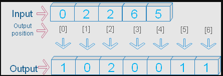

# Считывание и сохранение больших датафреймов

Скорость работы программы и количество памяти, которое ей требуется, могут стать одними из главных боттлнеков при работе с действительно большими данными. Особенно если мы ограничены в ресурсах (как часто бывает на Kaggle) и нам нужно, чтобы решение отработало не только четко, но и быстро. В этом уроке мы рассмотрим подходы и методы, с помощью которых можно сэкономить память и ускорить вычисления.

Сначала импортируем библиотеки:

```python
import pandas as pd
import numpy as np
import matplotlib.pyplot as plt
```

Скачиваем файлы с Google Диска:

```python
!pip install gdown -q
[notice] A new release of pip is available: 23.0.1 -> 23.1.2 [notice] To update, run: pip install --upgrade pi
# Для начала скачаем большой файл с Google Диска, чтобы на нем замерять скорости

!gdown 1Sjb6EYfz23ZuqBGYZfkmhWnBbHQBf6Ke -O '../data/blending/'
Downloading... From (uriginal): https://drive.google.com/uc?id=1Sjb6EYfz23ZuqBGYZfkmhWnBbHQBf6Ke From (redirected): https://drive.google.com/uc?id=1Sjb6EYfz23ZuqBGYZfkmhWnBbHQBf6Ke&confirm=t&uuid=54eb8ce9-a3d7-42de-9676-37b286aec0ab To: /Users/sergak/Documents/Neyro_sets/Competitive_Data_Science/data/blending/text_classification_train.csv 100%|████████████████████████████████████████| 235M/235M [00:20<00:00, 11.5MB/s]
```

## Работа с Pickle

> **Pickle** — это отличная альтернатива привычным CSV-файлам при работе с большими файлами. Он быстро считывает и сохраняет файл. Кроме того, такой файл занимает меньше места на диске.

Также при использовании `to_pickle()` сохраняются индексы и все типы колонок, так что при последующем считывании файла датафрейм остается таким же, его не нужно оптимизировать при каждом открытии, как при использовании CSV-формата.

Рассмотрим пример:

```python
%%time data = pd.read_csv('../data/blending/text_classification_train.csv')
CPU times: user 1.65 s, sys: 160 ms, total: 1.81 s 
Wall time: 1.87 s
data.shape
(7500, 2621)
%%time
data.to_csv('../data/blending/text_classification_train.csv')
CPU times: user 8.76 s, sys: 231 ms, total: 8.99 s 
Wall time: 9.26 s
%%time
pd.to_pickle(data, '../data/blending/text_classification_train.pickle')
CPU times: user 11.7 ms, sys: 33 ms, total: 44.8 ms
Wall time: 99.1 ms
%%time

data = pd.read_pickle('../data/blending/text_classification_train.pickle')
CPU times: user 12.7 ms, sys: 62.9 ms, total: 75.6 ms
Wall time: 204 ms
data.info()
<class 'pandas.core.frame.DataFrame'>
RangeIndex: 7500 entries, 0 to 7499
Columns: 2621 entries, Unnamed: 0.2 to labse_text_feature_767
dtypes: float64(2616), int64(3), object(2)
memory usage: 150.0+ MB
```

Видим, что при использовании Pickle ускорение повышается примерно в 10 раз, а чтение — в 20 раз, при этом датасет весит достаточно мало. Если датафрейм весит много (несколько гигабайтов или даже терабайтов), то разница окажется еще более существенной.

## Считывание по батчам

Если датасет не умещается в память без оптимизации типов или не нужен нам целиком, то можно считывать его по батчам и сразу указывать необходимые типы, индексы и т. д. В параметр `chunksize` передается число сэмплов, которое будет считываться за одну итерацию.

```python
import gc

chunksize = 1000
tmp_lst = []
with pd.read_csv('../data/car_train.csv',
                 index_col='car_id',
                 dtype={'model': 'category',
                        'car_type': 'category',
                        'fuel_type': 'category',
                        'target_class': 'category'}, chunksize=chunksize) as reader:
    for chunk in reader:
        tmp_lst.append(chunk)
        
data = pd.concat(tmp_lst)

del tmp_lst
gc.collect()

data.head()
```

| model          | car_type          | fuel_type | car_rating | year_to_start | riders | year_to_work | target_reg | target_class |             |
| -------------- | ----------------- | --------- | ---------- | ------------- | ------ | ------------ | ---------- | ------------ | ----------- |
| car_id         |                   |           |            |               |        |              |            |              |             |
| **y13744087j** | Kia Rio X-line    | economy   | petrol     | 3.78          | 2015   | 76163        | 2021       | 108.53       | another_bug |
| **O41613818T** | VW Polo VI        | economy   | petrol     | 3.90          | 2015   | 78218        | 2021       | 35.20        | electro_bug |
| **d-2109686j** | Renault Sandero   | standart  | petrol     | 6.30          | 2012   | 23340        | 2017       | 38.62        | gear_stick  |
| **u29695600e** | Mercedes-Benz GLC | business  | petrol     | 4.04          | 2011   | 1263         | 2020       | 30.34        | engine_fuel |
| **N-8915870N** | Renault Sandero   | standart  | petrol     | 4.70          | 2012   | 26428        | 2017       | 30.45        | engine_fuel |


Таким образом можно открыть весь датасет. По мере его открытия мы можем генерировать из чанков нужные нам признаки и сохранять готовые. Исходный датасет либо удаляем, либо вовсе не сохраняем.


> Важно! Пока на какой-то объект в памяти есть ссылки, которые мы не удалили или не переназначили, — этот объект занимает оперативную память, хотя он больше не используется. Поэтому все временные объекты, которые больше не будут использоваться, лучше явно удалять с помощью функции `del`, а после этого запускать сборщик мусора `gc` (garbage collector).

```python
import gc
gc.collect()
```

## Использование генератора

Использовать генератор особенно актуально, когда мы работаем с картинками. Он позволяет не хранить в оперативной памяти все картинки — они считываются только перед тем, как модель считает по ним ошибку и корректирует веса.

При работе с большими текстами генератор тоже бывает полезен:

```python
def read_file(filename):
    with open(filename, 'r') as f:
        for line in f:
            yield line.strip()
it = read_file('../data/car_info.csv')
next(it)
'car_type,fuel_type,car_rating,year_to_start,riders,car_id,model,target_class,year_to_work,target_reg'
next(it)
'economy,petrol,4.8,2013,42269,P17494612l,Skoda Rapid,engine_overheat,2019,46.65071890960271'
```

Функция вытаскивает из текста заголовок, а затем — первую строчку. Так произошло, потому что мы написали не обычную функцию, а итератор, вместо `return` указали `yield`. Теперь при каждом вызове функция выдает те значения, которые извлекает из итерируемого объекта `f` (файла).

# Оптимизация памяти

Одна из проблем Pandas — он подгружает файлы в неоптимальном типе. Например, если в датасете есть бинарная колонка, в которой хранятся только 0 и 1, Pandas хранит ее как максимально возможный тип для целых чисел — `int64`, хотя достаточно `int8`.

Установка правильных типов — самый эффективный способ оптимизации памяти, если мы не хотим удалять часть данных. Если колонка имеет тип `int`, то не нужно ставить ей тип `float`, а если в ней всего несколько уникальных значений, то не нужно делать ее типом `string`.

При правильной постановке типов размер нового датасета обычно в несколько раз меньше, чем без них. Также можно вынести какую-то колонку как индекс, чтобы не хранить лишний индекс.

## Числовые типы

Ниже пример вспомогательной функции. Для любого датафрейма она оптимизирует типы, которые нужно использовать:

```python
def reduce_mem_usage(df):
    """ iterate through all the columns of a dataframe and modify the data type
        to reduce memory usage.
    """
    start_mem = df.memory_usage().sum() / 1024**2
    print('Memory usage of dataframe is {:.2f} MB'.format(start_mem))

    for col in df.columns:
        col_type = df[col].dtype.name

        if col_type not in ['object', 'category', 'datetime64[ns, UTC]']:
            c_min = df[col].min()
            c_max = df[col].max()
            if str(col_type)[:3] == 'int':
                if c_min > np.iinfo(np.int8).min and c_max < np.iinfo(np.int8).max:
                    df[col] = df[col].astype(np.int8)
                elif c_min > np.iinfo(np.int16).min and c_max < np.iinfo(np.int16).max:
                    df[col] = df[col].astype(np.int16)
                elif c_min > np.iinfo(np.int32).min and c_max < np.iinfo(np.int32).max:
                    df[col] = df[col].astype(np.int32)
                elif c_min > np.iinfo(np.int64).min and c_max < np.iinfo(np.int64).max:
                    df[col] = df[col].astype(np.int64)
            else:
                if c_min > np.finfo(np.float16).min and c_max < np.finfo(np.float16).max:
                    df[col] = df[col].astype(np.float16)
                elif c_min > np.finfo(np.float32).min and c_max < np.finfo(np.float32).max:
                    df[col] = df[col].astype(np.float32)
                else:
                    df[col] = df[col].astype(np.float64)

    end_mem = df.memory_usage().sum() / 1024**2
    print('Memory usage after optimization is: {:.2f} MB'.format(end_mem))
    print('Decreased by {:.1f}%'.format(100 * (start_mem - end_mem) / start_mem))

    return df
df_cars = pd.read_csv('../data/car_train.csv') 
df_cars.head()
```

| car_id | model      | car_type          | fuel_type | car_rating | year_to_start | riders | year_to_work | target_reg | target_class |             |
| ------ | ---------- | ----------------- | --------- | ---------- | ------------- | ------ | ------------ | ---------- | ------------ | ----------- |
| **0**  | y13744087j | Kia Rio X-line    | economy   | petrol     | 3.78          | 2015   | 76163        | 2021       | 108.53       | another_bug |
| **1**  | O41613818T | VW Polo VI        | economy   | petrol     | 3.90          | 2015   | 78218        | 2021       | 35.20        | electro_bug |
| **2**  | d-2109686j | Renault Sandero   | standart  | petrol     | 6.30          | 2012   | 23340        | 2017       | 38.62        | gear_stick  |
| **3**  | u29695600e | Mercedes-Benz GLC | business  | petrol     | 4.04          | 2011   | 1263         | 2020       | 30.34        | engine_fuel |
| **4**  | N-8915870N | Renault Sandero   | standart  | petrol     | 4.70          | 2012   | 26428        |            |              |             |


Запустим эту функцию для нашего датасета:

```python
df_cars.info()
<class 'pandas.core.frame.DataFrame'>
RangeIndex: 2337 entries, 0 to 2336
Data columns (total 10 columns):
 #   Column         Non-Null Count  Dtype  
---  ------         --------------  -----  
 0   car_id         2337 non-null   object 
 1   model          2337 non-null   object 
 2   car_type       2337 non-null   object 
 3   fuel_type      2337 non-null   object 
 4   car_rating     2337 non-null   float64
 5   year_to_start  2337 non-null   int64  
 6   riders         2337 non-null   int64  
 7   year_to_work   2337 non-null   int64  
 8   target_reg     2337 non-null   float64
 9   target_class   2337 non-null   object 
dtypes: float64(2), int64(3), object(5)
memory usage: 182.7+ KB
df_cars = reduce_mem_usage(df_cars)
df_cars.info()
Memory usage of dataframe is 0.18 MB
Memory usage after optimization is: 0.12 MB
Decreased by 35.0%
<class 'pandas.core.frame.DataFrame'>
RangeIndex: 2337 entries, 0 to 2336
Data columns (total 10 columns):
 #   Column         Non-Null Count  Dtype  
---  ------         --------------  -----  
 0   car_id         2337 non-null   object 
 1   model          2337 non-null   object 
 2   car_type       2337 non-null   object 
 3   fuel_type      2337 non-null   object 
 4   car_rating     2337 non-null   float16
 5   year_to_start  2337 non-null   int16  
 6   riders         2337 non-null   int32  
 7   year_to_work   2337 non-null   int16  
 8   target_reg     2337 non-null   float16
 9   target_class   2337 non-null   object 
dtypes: float16(2), int16(2), int32(1), object(5)
memory usage: 118.8+ KB
```

Мы получили неплохое ускорение. Также можно получить ускорение, если у нас есть категориальные значения или эмбеддинги, которые легко схлопываются.

## Категориальные фичи

У категориальных признаков также есть точки роста. Если мы явно укажем, что у нас категориальный признак, то сможем оптимальнее:

- хранить переменные;
- производить группировки.

Напишем функцию, в которой каждый столбец конвертируется в категориальный тип.

```python
def convert_columns_to_catg(df, column_list):
    for col in column_list:
        print("converting", col.ljust(30), "size: ", round(df[col].memory_usage(deep=True)*1e-6,2), end="\t")
        df[col] = df[col].astype("category")
        print("->\t", round(df[col].memory_usage(deep=True)*1e-6,2))
```

Если мы произведем группировку до, то получим такие значения:

```python
%%timeit
df_cars.groupby('model')['car_type'].count()
198 µs ± 1.06 µs per loop (mean ± std. dev. of 7 runs, 1,000 loops each)
```

А теперь сначала сделаем конвертацию, а затем группировку:

```python
convert_columns_to_catg(df_cars, ['model', 'car_type', 'fuel_type', 'target_class'])
converting model                          size:  0.16	->	 0.01
converting car_type                       size:  0.15	->	 0.0
converting fuel_type                      size:  0.15	->	 0.0
converting target_class                   size:  0.16	->	 0.0
%%timeit
df_cars.groupby('model')['car_type'].count()

# При правильной типизации не только уменьшается память, но и возрастает скорость
82 µs ± 435 ns per loop (mean ± std. dev. of 7 runs, 10,000 loops each)
df_cars.info()
<class 'pandas.core.frame.DataFrame'>
RangeIndex: 2337 entries, 0 to 2336
Data columns (total 10 columns):
 #   Column         Non-Null Count  Dtype   
---  ------         --------------  -----   
 0   car_id         2337 non-null   object  
 1   model          2337 non-null   category
 2   car_type       2337 non-null   category
 3   fuel_type      2337 non-null   category
 4   car_rating     2337 non-null   float16 
 5   year_to_start  2337 non-null   int16   
 6   riders         2337 non-null   int32   
 7   year_to_work   2337 non-null   int16   
 8   target_reg     2337 non-null   float16 
 9   target_class   2337 non-null   category
dtypes: category(4), float16(2), int16(2), int32(1), object(1)
memory usage: 56.8+ KB
df_cars.memory_usage().sum() / 1024
56.83203125
convert_columns_to_catg(df_cars, ['car_id'])
converting car_id                         size:  0.16	->	 0.23
df_cars.info()
<class 'pandas.core.frame.DataFrame'>
RangeIndex: 2337 entries, 0 to 2336
Data columns (total 10 columns):
 #   Column         Non-Null Count  Dtype   
---  ------         --------------  -----   
 0   car_id         2337 non-null   category
 1   model          2337 non-null   category
 2   car_type       2337 non-null   category
 3   fuel_type      2337 non-null   category
 4   car_rating     2337 non-null   float16 
 5   year_to_start  2337 non-null   int16   
 6   riders         2337 non-null   int32   
 7   year_to_work   2337 non-null   int16   
 8   target_reg     2337 non-null   float16 
 9   target_class   2337 non-null   category
dtypes: category(5), float16(2), int16(2), int32(1)
memory usage: 125.9 KB
```

Мы получили ускорение почти в два раза, при этом память сократилась.

Также приведение к категориальному значению оптимизирует сохранение категориальных значений в памяти за счет небольшого количества категорий. Таким образом Pandas использует n количество ячеек, равное количеству категорий, а не количество ячеек, равное количеству элементов в столбце.

> Важно! Если мы категоризируем `id`, который является уникальным, то можно навредить себе, — увеличить размер. Поэтому нужно конвертировать именно те категории, которые не уникальны и которые по своей сути являются категориальным значением.

# Ускорение при помощи Numpy

Первое правило быстрого кода — везде, где можно, используйте Numpy. Он исполняется на чистом C, так что работает в сотни раз быстрее обычных циклов и `List`.

Убедимся в этом на примерах.

## Инициализация

Посмотрим на увеличение скорости работы Numpy на примере инициализации. Начинаем с импорта:

```python
%%timeit
a = list(range(1_000_000))
9.66 ms ± 51.1 µs per loop (mean ± std. dev. of 7 runs, 100 loops each)
%%timeit
b = np.arange(1_000_000)
518 µs ± 39.1 µs per loop (mean ± std. dev. of 7 runs, 1,000 loops each)
a = list(range(1_000_000))
b = np.arange(1_000_000)
%%timeit
100000 in a
464 µs ± 2.34 µs per loop (mean ± std. dev. of 7 runs, 1,000 loops each)
%%timeit
100000 in b
368 µs ± 2.07 µs per loop (mean ± std. dev. of 7 runs, 1,000 loops each)
```

Уже на этапе работы со списками можно получить ускорение. Например, если нужно создать список из миллиона строк, то с помощью Numpy мы делаем это в 200 раз быстрее.

## Поэлементные функции

Напомним, что Numpy сильно быстрее поэлементных функций, например, при матричных вычислениях или перемножении элементов в списке:

```python
%%timeit
[el * el for el in a]
28.8 ms ± 1.13 ms per loop (mean ± std. dev. of 7 runs, 10 loops each)
%%timeit
[el + 10 for el in a]
24.6 ms ± 241 µs per loop (mean ± std. dev. of 7 runs, 10 loops each)
%%timeit
b * b
537 µs ± 40.6 µs per loop (mean ± std. dev. of 7 runs, 1,000 loops each)
%%timeit
b + 10
302 µs ± 54.6 µs per loop (mean ± std. dev. of 7 runs, 1,000 loops each)
```

## Агрегирующие функции

Методы и функции Numpy работают быстрее, чем их обычные аналоги в Python. Дело в том, что у Python максимальное значение в списке ищется через цикл, а у Numpy есть специальный метод для вычисления этих статистик.

```python
%%timeit

max(b)
25.9 ms ± 140 µs per loop (mean ± std. dev. of 7 runs, 10 loops each)
%%timeit

b.max()
100 µs ± 202 ns per loop (mean ± std. dev. of 7 runs, 10,000 loops each)
```

## Когда использовать List

List может быть быстрее Numpy лишь в одном случае — если мы добавляем много новых элементов. В List добавление одного элемента происходит за `O(1)` и суммарно на все тратится `O(n)` времени. В Numpy при добавлении массива нам нужно заново проинициализировать его, даже если добавили всего один элемент, так что суммарное время работы — `O(n^2)`.

Сравним два кода:

```python
%%timeit

a = np.zeros(0)
for el in range(1000):
    b = np.zeros(1000)
    a = np.append(a, b)
302 ms ± 28.8 ms per loop (mean ± std. dev. of 7 runs, 1 loop each)
%%timeit

a = []
for el in range(1000):
    b = [0 for i in range(1000)]
    a += b
20.2 ms ± 373 µs per loop (mean ± std. dev. of 7 runs, 10 loops each)
```

Мы видим, что код на Numpy отрабатывает хуже, чем Python. Когда мы создаем новый массив, который является контаминацией двух предыдущих, по сути, мы создаем новый объект. В Numpy на это тратится достаточно времени. А в Python мы расширяем существующий список, то есть не пересоздаем, а меняем уже существующий.

Но если мы заранее знаем размер списка, который хотим иметь, мы можем получить сильное ускорение за счет Numpy, потому что нужно редактировать уже имеющийся файл.

## Set()

Если нужно проверить наличие элементов в другом массиве, который достаточно большой, то лучше использовать `set()`, так как в нем поиск элемента осуществляется за `O(log(n))`, а в `np.isin()` за `O(n)`. Даже несмотря на то, что Numpy оптимизирован, `set()` выигрывает его по времени.

Проверить пересечение элементов можно с помощью Numpy и получить не самый быстрый результат:

```python
a = np.arange(1000)
b = np.arange(1000000) * -1
%%timeit
np.isin(a, b)
20.6 ms ± 734 µs per loop (mean ± std. dev. of 7 runs, 10 loops each)
```

Можно заранее перевести массивы в set, а затем проверить их через цикл:

```python
st = set(b)
%%timeit
[el in st for el in a]
41.8 µs ± 903 ns per loop (mean ± std. dev. of 7 runs, 10,000 loops each)
```

# Векторизация в Pandas

**Векторизация** — это процесс, когда мы заменяем обычные поэлементные функции на операции сразу со всем вектором значений, что позволяет значительно прибавить в скорости.

```python
df_cars.head()
```

|       | car_id     | model             | car_type | fuel_type | car_rating | year_to_start | riders | year_to_work | target_reg | target_class |
| ----- | ---------- | ----------------- | -------- | --------- | ---------- | ------------- | ------ | ------------ | ---------- | ------------ |
| **0** | y13744087j | Kia Rio X-line    | economy  | petrol    | 3.779297   | 2015          | 76163  | 2021         | 108.500000 | another_bug  |
| **1** | O41613818T | VW Polo VI        | economy  | petrol    | 3.900391   | 2015          | 78218  | 2021         | 35.187500  | electro_bug  |
| **2** | d-2109686j | Renault Sandero   | standart | petrol    | 6.300781   | 2012          | 23340  | 2017         | 38.625000  | gear_stick   |
| **3** | u29695600e | Mercedes-Benz GLC | business | petrol    | 4.039062   | 2011          | 1263   | 2020         | 30.343750  | engine_fuel  |
| **4** | N-8915870N | Renault Sandero   | standart | petrol    | 4.699219   | 2012          | 26428  | 2017         | 30.453125  | engine_fuel  |


```python
df_cars['car_type'].unique()
['economy', 'standart', 'business', 'premium']
Categories (4, object): ['business', 'economy', 'premium', 'standart']
```

## Numpy.where()

Функция `numpy.where()` позволяет проверить условие и в зависимости от его результатов вернуть то или иное значение. Векторный аналог `if-else`.

```python
def simple_if(x):
    if x['car_rating'] < 3.78:
        return x['car_type']
    else:
        return x['fuel_type']
%%timeit
df_cars.apply(simple_if, axis=1)
7.74 ms ± 25.2 µs per loop (mean ± std. dev. of 7 runs, 100 loops each)
%%timeit
# Первое значение — это условие 
# Второе — что возвращать, если выполнено условие 
# Третье — что возвращать, если не выполнено условие
np.where(df_cars['car_rating'].values < 3.78, df_cars['car_type'].values, df_cars['fuel_type'].values)
72.5 µs ± 412 ns per loop (mean ± std. dev. of 7 runs, 10,000 loops each)
```

## Numpy.vectorize()

Часть функции `numpy.vectorize()` можно оставить поэлементными и засчет их векторизации получить значительный прирост скорости. Однако все равно это работает медленнее, чем операции с векторами чисел.

```python
def simple_if2(car_rating, car_type, fuel_type):
    if car_rating < 3.78:
        return car_type
    else:
        return fuel_type
vectfunc = np.vectorize(simple_if2)
%%timeit
vectfunc(df_cars['car_rating'], df_cars['car_type'], df_cars['fuel_type'])
451 µs ± 1.41 µs per loop (mean ± std. dev. of 7 runs, 1,000 loops each)
```

## Numpy.select()

Функция `numpy.select()` то же, что и `np.where()`, но работает для нескольких условий.

```python
import re

def hard_if(x):
    if x['car_rating'] < 3:
        if 'Audi' == x['model']:
            return 0
        else:
            return 1
    elif x['car_rating'] in [3, 4, 5]:
        return 2
    else:
        return 3
%%timeit
df_cars.apply(simple_if, axis=1)
7.82 ms ± 172 µs per loop (mean ± std. dev. of 7 runs, 100 loops each)
%%timeit
conditions = [
    (df_cars['car_rating'] < 3) & (df_cars['model'] == 'Audi'),
    (df_cars['car_rating'] < 3),
    df_cars['car_rating'].isin([3, 4, 5])
]

choices = [0, 1, 2]
np.select(conditions, choices, default=3)
299 µs ± 3.07 µs per loop (mean ± std. dev. of 7 runs, 1,000 loops each)
```

## Переписывание словарей

Обращаться к значению из словаря можно быстро. Допустим, мы хотим конвертировать строковое значение в численное.

```python
mydict = {'economy': 0,
          'standart': 1,
          'business': 2,
          'premium': 3}
def f(x):
    if x['car_rating'] > 5:
        return mydict[x['car_type']]
    else:
        return np.nan
%%timeit
df_cars.apply(simple_if, axis=1)
7.77 ms ± 15.1 µs per loop (mean ± std. dev. of 7 runs, 100 loops each)
```

А далее не прописываем сразу несколько условий, а с помощью словаря извлекаем значения, если условие выполняется.

```python
%%timeit
np.where(df_cars['car_rating'] > 5, df_cars['car_type'].map(mydict), np.nan)
234 µs ± 3.02 µs per loop (mean ± std. dev. of 7 runs, 1,000 loops each)
```

## Groupby на Numpy

`Pd.groupby()` — одна из самых часто используемых и полезных функций в Pandas, которую можно ускорить до 30 раз при помощи Numpy. Импортируем датасет:

```python
df_cars = pd.read_csv('../data/car_train.csv')
df_cars.head()
```

| car_id | model      | car_type          | fuel_type | car_rating | year_to_start | riders | year_to_work | target_reg | target_class |             |
| ------ | ---------- | ----------------- | --------- | ---------- | ------------- | ------ | ------------ | ---------- | ------------ | ----------- |
| **0**  | y13744087j | Kia Rio X-line    | economy   | petrol     | 3.78          | 2015   | 76163        | 2021       | 108.53       | another_bug |
| **1**  | O41613818T | VW Polo VI        | economy   | petrol     | 3.90          | 2015   | 78218        | 2021       | 35.20        | electro_bug |
| **2**  | d-2109686j | Renault Sandero   | standart  | petrol     | 6.30          | 2012   | 23340        | 2017       | 38.62        | gear_stick  |
| **3**  | u29695600e | Mercedes-Benz GLC | business  | petrol     | 4.04          | 2011   | 1263         | 2020       | 30.34        | engine_fuel |
| **4**  | N-8915870N | Renault Sandero   | standart  | petrol     | 4.70          | 2012   | 26428        | 2017       | 30.45        | engine_fuel |


## Подсчет количества значений в группе

Чтобы подсчитать количество значений в каждой группе, воспользуемся функцией `np.bincount()`. Сначала делаем группировку как обычно:

```python
%%timeit
df_cars.groupby(['model', 'fuel_type'])['target_reg'].count()
321 µs ± 13.1 µs per loop (mean ± std. dev. of 7 runs, 1,000 loops each)
```

Видим, что группировка происходит долго. Теперь соединим две группы, которые хотим сгруппировать, и заменим их на численное значение с помощью `LabelEncoder`:

```python
from sklearn import preprocessing
lbl = preprocessing.LabelEncoder()
df_cars['int_model'] = lbl.fit_transform((df_cars['model'] + df_cars['fuel_type']).astype(str))
```

Получаем новую категорию, которая является комбинацией двух категориальных переменных. Применяем к ней функцию `bincount`:

```python
%%timeit
np.bincount(df_cars['int_model'])
6.55 µs ± 24.9 ns per loop (mean ± std. dev. of 7 runs, 100,000 loops each)
```

Получили увеличенную скорость.

```python
gb_values = df_cars.groupby(['int_model'])['target_reg'].count()
np_values = np.bincount(df_cars['int_model'])

(gb_values == np_values).all()
True
```

`Bincount` — это функция, которая умеет бинаризовать значения, где каждое число — бином. Например:



У нас есть простой набор значений. Максимальное число — 6, значит, в сумме может быть 6 биномов. Инвертируем числа в 6 биномов и под каждым считаем, сколько раз он встретился. Например, бином 2 встретился 2 раза, пишем цифру 2. Это и есть группировка, которая эквивалентна классическому случаю.

## Подсчет суммы или среднего

Чтобы посчитать сумму значений в каждой группе, воспользуемся функцией `np.bincount(weights=your_weights)`.

```python
%%timeit
df_cars.groupby(['model', 'fuel_type'])['target_reg'].sum()
334 µs ± 1.37 µs per loop (mean ± std. dev. of 7 runs, 1,000 loops each)
%%timeit
np.bincount(df_cars['int_model'], weights=df_cars['target_reg'])
9.74 µs ± 25 ns per loop (mean ± std. dev. of 7 runs, 100,000 loops each)
gb_values = df_cars.groupby(['int_model'])['target_reg'].sum()
np_values = np.bincount(df_cars['int_model'], weights=df_cars['target_reg'])

(gb_values.round(10) == np_values.round(10)).all()
True
```

Если мы хотим посчитать среднее, то нужно сумму разделить на то значение, которое получили при подсчете бинкаунта.

## Подсчет минимума или максимума

Чтобы посчитать такие функцие, как максимум, минимум, произведение и т. д., нам потребуется функция `np.ufunc.reduceat()`.

```python
%%timeit
df_cars.groupby(['int_model'])['target_reg'].agg(['max'])
186 µs ± 1.04 µs per loop (mean ± std. dev. of 7 runs, 10,000 loops each)
```

Классический вариант работает долго, посмотрим, как это сделать в 2 раза быстрее:

```python
%%timeit
indices = df_cars['int_model']
max_values = np.maximum.reduceat(df_cars['target_reg'].values[np.argsort(indices)],
                                 np.concatenate(([0], np.cumsum(np.bincount(indices))))[:-1])
max_values
61.2 µs ± 2.33 µs per loop (mean ± std. dev. of 7 runs, 10,000 loops each)
```

Сначала для категориальной переменной, которая является комбинацией двух, мы считаем, что эта группа выполняет роль индексов.

```python
indices = df_cars['int_model']
np_values = np.maximum.reduceat(df_cars['target_reg'].values[np.argsort(indices)],
                                 np.concatenate(([0], np.cumsum(np.bincount(indices))))[:-1])

gb_values = df_cars.groupby(['int_model'])['target_reg'].agg('max')
(gb_values.round(10) == np_values.round(10)).all()
True
# Возвращает перестановку чисел от 0 до n — 1, в которой элементы отсортированы по возрастанию

np.argsort(indices).values, df_cars['int_model'].values[np.argsort(indices)]
(array([1168,  645,  189, ..., 1209, 1123, 1659]),
 array([ 0,  0,  0, ..., 25, 25, 25]))
# Элемент i хранит сумму элементов первых i-значений

np.bincount(indices), np.cumsum(np.bincount(indices))
(array([ 17,  20,  21,  16,  18, 161, 140, 143, 111, 147,  21,  23,  17,
         22, 146, 154, 152, 147, 118, 158, 130,  14, 152, 141, 135,  13]),
 array([  17,   37,   58,   74,   92,  253,  393,  536,  647,  794,  815,
         838,  855,  877, 1023, 1177, 1329, 1476, 1594, 1752, 1882, 1896,
        2048, 2189, 2324, 2337]))
# Сдвигаем так, чтобы значения массива означали позиции начала групп

np.concatenate(([0], np.cumsum(np.bincount(indices))))[:-1]
array([   0,   17,   37,   58,   74,   92,  253,  393,  536,  647,  794,
        815,  838,  855,  877, 1023, 1177, 1329, 1476, 1594, 1752, 1882,
       1896, 2048, 2189, 2324])
```

# Numba.jit

Numba.jit помогает, когда нужно что-то кастомное, что нельзя переписать на Numpy, но нужно чтобы работало быстро. Он конвертирует написанный на питоне код в C.

Однако Numba.jit поддерживает не весь питоновский функционал, и внутри него нельзя использовать разные библиотечные функции. Поэтому в основном он используется для низкоуровневой оптимизации.

```python
from numba import jit

@jit(nopython=True)
def f(n):
    s = 0.
    for i in range(n):
        s += i ** 0.5
    return s
%%timeit
f(10000)
531 µs ± 876 ns per loop (mean ± std. dev. of 7 runs, 1,000 loops each)
%%timeit
f(10000)
9.55 µs ± 10.1 ns per loop (mean ± std. dev. of 7 runs, 100,000 loops each)
```

Видим, что с применением Numba.jit ускорение увеличивается. Рассмотрим другой пример:

```python
@jit(nopython=True)
def monotonically_increasing(a):
    max_value = 0
    for i in range(len(a)):
        if a[i] > max_value:
            max_value = a[i]
        a[i] = max_value
    return a
%%timeit
monotonically_increasing(df_cars['target_reg'].values)
202 µs ± 390 ns per loop (mean ± std. dev. of 7 runs, 1,000 loops each)
%%timeit
monotonically_increasing(df_cars['target_reg'].values)
4.51 µs ± 22.8 ns per loop (mean ± std. dev. of 7 runs, 100,000 loops each)
```

# Multiprocessing

**Multiprocessing** — это распараллеливание на ядра. Он позволяет использовать не одно ядро компьютера, а сразу несколько и, соответственно, ускорить вычисления (уже не только `io-bound`, но и `cpu-bound`) в количество раз, пропорциональное количеству доступных ядер.

Импортируем датафрейм:

```python
import sys
sys.path.append('../src/')
import text_prepare
import importlib
importlib.reload(text_prepare)
<module 'text_prepare' from '/Users/sergak/Documents/Neyro_sets/Competitive_Data_Science/notebooks/../src/text_prepare.py'>
df = pd.read_csv('../data/blending/text_transformer_data.csv')
df.head()
```

|       | category     | text                                              |
| ----- | ------------ | ------------------------------------------------- |
| **0** | extreme      | Ледник Пасторури это цирковой ледник расположе... |
| **1** | martial_arts | Главные участники предстоящего Betokenoid 274 ... |
| **2** | extreme      | Ttokenoid Btokenoid – карта с которой можно не... |
| **3** | autosport    | В Сильверстоуне произошли крупные обновления а... |
| **4** | extreme      | На протяжении более чем 30 лет Вестсайд являет... |


Сначала поработаем с ним обычным способом:

```python
%%time

tmp = df['text'].apply(text_prepare.text_prepare)
CPU times: user 14.8 s, sys: 3.87 s, total: 18.7 s
Wall time: 19.1 s
```

Скорость 19,1. Теперь попробуем распараллелить:

```python
from multiprocessing import Pool

def parallelize_dataframe(df, func, n_cores=4):
    df_split = np.array_split(df, n_cores)
    pool = Pool(n_cores)
    df = np.concatenate(pool.map(func, df_split))
    pool.close()
    pool.join()
    return df
%%time
tmp = parallelize_dataframe(df, text_prepare.many_row_prepare)
CPU times: user 11.3 ms, sys: 41 ms, total: 52.3 ms
Wall time: 7.03 s
```

После запуска скорость увеличилась почти в три раза.

# Выводы

Если нужно ускорить код:

- Замените на Numpy все, что можно.
- Перепишите оставшееся на Numba.jit.
- Если предыдущих двух пунктов не хватило, используйте multiprocessing.

Если нужно оптимизировать память:

- Примените хранение или считывание при помощи Pickle.
- Примените правильное расставление типов.
- Если весь датасет сразу не нужен, то можно считывать его по частям.

# Заключение

Ускорение вычислений и оптимизация памяти — это важные задачи, с которыми периодически можно столкнуться при написании соревнований или при работе с большим количеством данных. Мы рассмотрели основные способы решения этих задач и как их применять на практике.