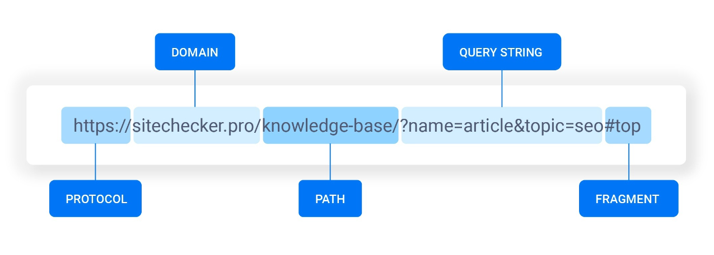
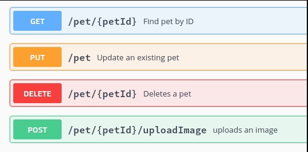
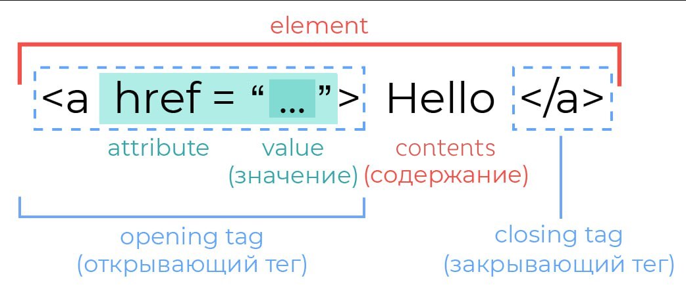
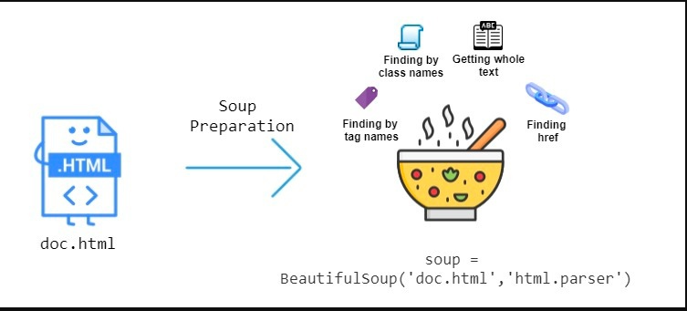
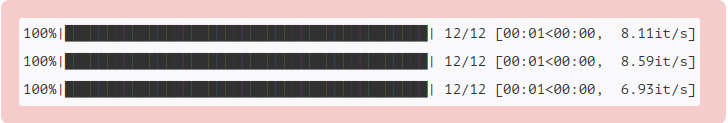
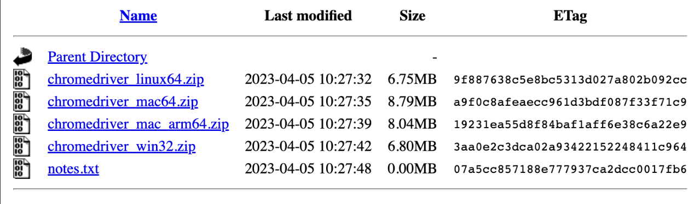

# Анализ URL-запроса

Для начала рассмотрим структуру URL-адреса.

Структура URL-адреса:

- **Сетевой протокол** (метод доступа к ресурсу).
- **Авторизация доступа**.
- **Хосты** — DNS-адрес, который указан как IP-адрес.
- **Порт** включается в сочетании с IP-адресом.
- **Трек** определяет информацию о методе получения доступа.
- **Параметр** — внутренние данные ресурса о файле.



```python
from urllib.parse import urlparse, parse_qsl, parse_qs

url = "http://www.example.com:80/path/to/myfile.html?key1=value1&key2=value2#SomewhereInTheDocument"
url_parsed = urlparse(url)
url_parsed
ParseResult(scheme='http', netloc='www.example.com:80', path='/path/to/myfile.html', params='', query='key1=value1&key2=value2', fragment='SomewhereInTheDocument')
url_parsed.path
'/path/to/myfile.html'
dict(parse_qsl(url_parsed.query))
{'key1': 'value1', 'key2': 'value2'}
```

# Типы запросов и ответов

**Тип HTTP-запроса** (HTTP-метод) указывает серверу на действие, которое мы хотим произвести с ресурсом.

Изначально (в начале 90-х) предполагалось, что клиент хочет от ресурса только одного — получить его. Однако сейчас по протоколу HTTP можно создавать посты, редактировать профиль, удалять сообщения и т. д. — эти действия сложно объединить термином «получение».

Варианты для разграничения действий с ресурсами на уровне HTTP-методов:




- `GET` — получение ресурса.
- `POST` — создание ресурса.
- `PUT` — обновление ресурса.
- `DELETE` — удаление ресурса.

```python
import requests
```

Попробуем отправить и записать сообщение на transfer.sh. Сервис позволяет пользователям хранить, синхронизировать и обмениваться файлами в интернете с другими пользователями прямо из терминала.

```python
r_put = requests.put('https://transfer.sh/arg.txt', data='Bonjour le monde!')
r_put
<Response [200]>
r_put.ok, r_put.status_code
(True, 200)
print(r_put.text)
https://transfer.sh/Xs7zMb/arg.txt
```

Рассмотрим метод создания запроса `POST`. Попытаемся отправить запрос на запись текста. Укажем `URL` интересующего нас ресурса и дополнительные параметры в виде словаря.

```python
page = requests.post('https://controlc.com/index.php?act=submit', data={
    'subdomain': '',
    'antispam': 1,
    'website': '',
    'paste_title': 'Заметка',
    'input_text': 'Привет!',
    'timestamp': 'ba68753935524ba7096650590c86633b',
    'paste_password': '',
    'code': 0,
}, headers={'accept-encoding': 'identity', 'referer': 'https://controlc.com/'})
page
<Response [200]>
```

# Парсинг HTML-страниц

Для понимания парсинга нужно знать структуру HTML. Как театр начинается с вешалки, так и любой HTML-документ начинается с базовой структуры. Она включает теги, которые есть в любом HTML-файле. Эти теги и служебная информация нужны браузеру для корректного отображения информации.


Тег `<html></html>` — основа основ, так как внутри него располагается вся информация. Благодаря этому тегу браузер понимает, где начинается контент, который необходимо обработать как HTML.

> Тег `<head></head>` служит для хранения служебной информации. Здесь возможны разные сочетания тегов, которые подсказывают браузеру название страницы, описание, ключевые слова и т. д. Такая информация называется **метаинформацией**.

После тега `<head>` в документе указывается парный тег `<body></body>`, который является «телом» всей страницы. Именно здесь размещается вся информация, которая выводится на страницу.



Внутри тега `<body></body>` находится вся структура документа, состоящая из тегов, атрибутов и материалов. Рассмотрим единичную структуру — тег.

> Весь текст, заключенный между начальным и конечным тегом, включая и сами эти теги, называется **элементом**. Сам же текст между тегами — **содержанием элемента**. Содержание элемента может включать любой текст и другие элементы.

> У тега могут быть свойства, называемые **атрибутами**, дающие дополнительные возможности форматирования текста. Они записываются в виде сочетания: имя атрибута-значения. Текстовые значения атрибута заключаются в кавычки.

Так как HTML (и XML) имеют древовидную структуру, то до любого элемента всегда существует единственный путь — XPath.

```python
!pip install cssselect -q
[notice] A new release of pip is available: 23.0.1 -> 23.1
[notice] To update, run: pip install --upgrade pip
```

Попробуем поиграть со страницей фильма «Стражи Галактики». Допустим, у нас соревнование по предсказанию жанра фильма, и мы приняли решение о парсинге дополнительных данных.

```python
from lxml import etree, html as lhtml
tree = lhtml.fromstring(open('../data/parsing_data/689066_2.html', 'r', encoding='utf-8').read())
```

С помощью XPath узнаем информацию о фильме. Сначала указываем интересующий нас тег, допустим `//div`, а затем — его атрибут. Настоятельно рекомендуем на этих пунктах открыть исходный код страницы и убедиться, что откуда берется.

```python
film_info = {
    'title': tree.xpath('//h1[@itemprop="name"]/span/text()')[0],
    'title-original': tree.xpath('//span[starts-with(@class, "styles_originalTitle__")]')[0].text,
    'rating': float(tree.cssselect('a.film-rating-value')[0].text),   

# Поддержка CSS-селекторов
    'desription': '\n'.join(tree.xpath('//div[starts-with(@class, "styles_synopsisSection")]//text()'))
}

film_info
{'title': 'Стражи Галактики',
 'title-original': 'Guardians of the Galaxy',
 'rating': 7.763,
 'desription': 'Отважному путешественнику Питеру Квиллу попадает в руки таинственный артефакт, принадлежащий могущественному и безжалостному злодею Ронану, строящему коварные планы по захвату Вселенной. Питер оказывается в центре межгалактической охоты, где жертва — он сам.\nЕдинственный способ спасти свою жизнь — объединиться с четверкой нелюдимых изгоев: воинственным енотом по кличке Ракета, человекоподобным деревом Грутом, смертельно опасной Гаморой и одержимым жаждой мести Драксом, также известным как Разрушитель. Когда Квилл понимает, какой силой обладает украденный артефакт и какую опасность он представляет для вселенной, одиночка пойдет на все, чтобы сплотить случайных союзников для решающей битвы за судьбу галактики.'}
```

Далее найдем ссылку на просмотр. Практически всегда ссылки находятся в тегах `<a href="your_link"></a>`.

```python
watch = tree.xpath('//a[contains(@class, "kinopoisk-watch-online-button")]/attribute::href')
film_info['watch'] = watch
film_info
{'title': 'Стражи Галактики',
 'title-original': 'Guardians of the Galaxy',
 'rating': 7.763,
 'desription': 'Отважному путешественнику Питеру Квиллу попадает в руки таинственный артефакт, принадлежащий могущественному и безжалостному злодею Ронану, строящему коварные планы по захвату Вселенной. Питер оказывается в центре межгалактической охоты, где жертва — он сам.\nЕдинственный способ спасти свою жизнь — объединиться с четверкой нелюдимых изгоев: воинственным енотом по кличке Ракета, человекоподобным деревом Грутом, смертельно опасной Гаморой и одержимым жаждой мести Драксом, также известным как Разрушитель. Когда Квилл понимает, какой силой обладает украденный артефакт и какую опасность он представляет для вселенной, одиночка пойдет на все, чтобы сплотить случайных союзников для решающей битвы за судьбу галактики.',
 'watch': ['https://hd.kinopoisk.ru/film/4a297ba39cb704fa9a81855f76ab1d73?from=button_online&watch=']}
```

Найдем картинку аналогичным образом. Тег ``.

```python
image = tree.xpath('//img[contains(@class, "film-poster")]//attribute::srcset')
image
['//avatars.mds.yandex.net/get-kinopoisk-image/1773646/2e6ab20b-7cf1-49e7-b465-bd5a71c13fa3/300x450 1x, //avatars.mds.yandex.net/get-kinopoisk-image/1773646/2e6ab20b-7cf1-49e7-b465-bd5a71c13fa3/600x900 2x']
```

# Beautiful Soup

Перейдем к библиотеке Beautiful Soup. В ней есть множество полезных алгоритмов, упрощающих работу, оптимизирующих поиск информации и т. д.

Попробуем достать ту же информацию, что и в предыдущем параграфе, только с помощью Beautiful Soup. Также нелишним будет открыть исходный код страницы и убедиться, что откуда берется. Это очень помогает быстро разобраться.



```python
from bs4 import BeautifulSoup
import pandas as pd
from tqdm import tqdm
soup = BeautifulSoup(open('../data/parsing_data/689066_2.html', 'rb').read(), 'lxml')
from operator import attrgetter, itemgetter
```

Берем основную информацию со страницы. Запустим сессию Beautiful Soup и найдем теги `.find("tag", attribute="value")`. Чтобы найти все встречающиеся варианты, используем `.find_all("tag")`.

```python
desc = soup.find('div', itemprop='description')
desc = soup.find('div', class_=lambda s: s and s.startswith("styles_synopsisSection")).find_all('p')

film_info = {
    'title': soup.find('h1', itemprop='name').find('span').text,
    'title-original': soup.find('span', class_=lambda s: s and s.startswith('styles_originalTitle__')).text,
    'rating': float(soup.find('a', {'class': 'film-rating-value'}).text), 
    'description': '\n'.join(map(attrgetter('text'), desc))
}
film_info
{'title': 'Стражи Галактики',
 'title-original': 'Guardians of the Galaxy',
 'rating': 7.763,
 'description': 'Отважному путешественнику Питеру Квиллу попадает в руки таинственный артефакт, принадлежащий могущественному и безжалостному злодею Ронану, строящему коварные планы по захвату Вселенной. Питер оказывается в центре межгалактической охоты, где жертва — он сам.\nЕдинственный способ спасти свою жизнь — объединиться с четверкой нелюдимых изгоев: воинственным енотом по кличке Ракета, человекоподобным деревом Грутом, смертельно опасной Гаморой и одержимым жаждой мести Драксом, также известным как Разрушитель. Когда Квилл понимает, какой силой обладает украденный артефакт и какую опасность он представляет для вселенной, одиночка пойдет на все, чтобы сплотить случайных союзников для решающей битвы за судьбу галактики.'}
soup.find('a', {'class': 'film-rating-value'})
<a class="film-rating-value styles_rootPositive__ac3xv styles_rootLink__1CSPc" href="/film/689066/votes/">7.763</a>
header = soup.find('h3', class_="film-page-section-title")
table = header.next_sibling
rows = table.find_all('div', recursive=False)

len(rows)
23
data = []

for row in rows:
    cols = map(lambda x: x.text, row.find_all('div'))
    data.append(cols)

data = pd.DataFrame(data)
data.head()
```

|       | 0                | 1                                                 | 2                                                 |
| ----- | ---------------- | ------------------------------------------------- | ------------------------------------------------- |
| **0** | Год производства | 2014                                              | None                                              |
| **1** | Страна           | США                                               | None                                              |
| **2** | Жанр             | фантастика, боевик, приключения, комедияслова     | фантастика, боевик, приключения, комедия          |
| **3** | Слоган           | «Мстители спасают лишь Землю бренную, а эти ре... | «Мстители спасают лишь Землю бренную, а эти ре... |
| **4** | Режиссер         | Джеймс Ганн                                       | None                                              |


Найдем картинки. Как было сказано выше, удобнее использовать `.find_all("tag")`.

```markup
soup = BeautifulSoup(open('../data/parsing_data/689066_stills_2.html', 'rb').read(), 'html.parser')
list(map(lambda s: s.attrs['src'], soup.find('table', class_='fotos').find_all("img")))[:10]
['https://st.kp.yandex.net/images/kadr/sm_2802088.jpg',
 'https://st.kp.yandex.net/images/kadr/sm_2802087.jpg',
 'https://st.kp.yandex.net/images/kadr/sm_2802086.jpg',
 'https://st.kp.yandex.net/images/kadr/sm_2802085.jpg',
 'https://st.kp.yandex.net/images/kadr/sm_2802084.jpg',
 'https://st.kp.yandex.net/images/kadr/sm_2802083.jpg',
 'https://st.kp.yandex.net/images/kadr/sm_2802082.jpg',
 'https://st.kp.yandex.net/images/kadr/sm_2802081.jpg',
 'https://st.kp.yandex.net/images/kadr/sm_2751304.jpg',
 'https://st.kp.yandex.net/images/kadr/sm_2485201.jpg']
```

## **Погода**

В соревнованиях, в которых есть информация о географическом расположении, может быть полезно спарсить дополнительную информацию о погоде.

```python
url = 'http://weatherarchive.ru/Temperature/Moscow/{month}-{year}'
months = ['January', 'February', 'March', 'April', 'May', 'June', 'July',
          'August', 'September', 'October', 'November', 'December']

years = [2020, 2021, 2022]
def parse_table(table):
    res = {'temp': [],
           'wet': [],
           'p': [],
           'wind': []}
    
    tags = table.findAll('td')
    k = 0
    for tag in tags:
        if tag.find('a') is not None:
            continue
            
        if k == 0:
            k += 1
            res['temp'].append(float(tag.text.replace('°C', '').replace('+','').replace('−','-')))
        elif k == 1:
            k += 1
            res['wet'].append(float(tag.text.replace('%','')))
        elif k == 2:
            k += 1
            res['p'].append(int(tag.text))
        else:
            k = 0
            res['wind'].append(int(tag.text.replace(' м/с', '')))
    return res
def parse_url(url):
    page = requests.get(url)
    soup = BeautifulSoup(page.text, "html.parser")

    tables = soup.findAll('table', class_='smart')
    for table in tables:
        if 'Среднесуточная' in str(table):
            return parse_table(table)
pd.DataFrame(parse_url(url.format(month=months[0], year=years[0]))).head()
```

|       | temp  | wet   | p    | wind |
| ----- | ----- | ----- | ---- | ---- |
| **0** | -2.25 | 82.86 | 741  | 5    |
| **1** | -1.49 | 91.00 | 743  | 4    |
| **2** | -0.27 | 90.00 | 743  | 4    |
| **3** | -2.67 | 87.14 | 736  | 4    |
| **4** | -1.52 | 83.57 | 744  | 3    |


```python
stats = {}
for year in years:
    stats[year] = {}
    for month in tqdm(months):
        stats[year][month] = parse_url(url.format(month=month, year=year))
```



# **Selenium**

> **Selenium** — это специальная утилита, которая позволяет симулировать работу браузера. С ее помощью можно получать данные с тех сайтов, где используется автоматическая генерация контента при помощи JS, есть какая-то авторизация или не выдают HTML-код страницы по запросу `requests.get()`.

Сначала необходимо скачать ChromeDriver той версии хрома, которая используется на компьютере, и положить его рядом с блокнотом. Сделать это можно с официального сайта.

Файлы могут варьироваться в зависимости от операционной системы. Вот как могут выглядеть версии драйвера для разных ОС:



```python
from selenium import webdriver
from selenium.webdriver.chrome.options import Options as ChromeOptions
from selenium.webdriver.common.by import By
import pandas as pd
from tqdm import tqdm
chrome_options = ChromeOptions()

#chrome_options.add_argument("--headless")
driver = webdriver.Chrome('chromedriver', options=chrome_options)
def translate_text(text):
    time.sleep(0.2)
    driver.get(f"https://www.m-translate.ru/translator/text#text=test&direction=ru-en")

    driver.find_element(By.ID, "text").clear()
    driver.find_element(By.ID, "text").send_keys(text)
    driver.find_element(By.ID, "go_btn").click()
    while driver.find_element(By.ID, "text_out").get_attribute("value") == "":
        time.sleep(0.2)
    return driver.find_element(By.ID, "text_out").get_attribute("value")
text = "Рады приветствовать тебя на курсе по соревновательному анализу данных!"
translate_text(text)
'Welcome to the competitive data analysis course!'
```

# Выводы

Парсинг данных — это очень сильный инструмент, который дает вам большое конкурентное преимущество по сравнению с теми, кто его не освоил или не использует.

Для парсинга полезно владеть:

- библиотекой Requests — для отправки и получения результатов;
- библиотекой Beautiful Soup — для удобного поиска фрагментов по тегам внутри HTML-страниц;
- библиотекой Selenium — для более гибкой работы с сайтами, где необходимо эмулировать действия человека для переходить между страницами.


# Литература для дополнительного изучения

- [Официальный сайт сервиса transfer.sh](https://www.transfer.sh/)
- [Официальный сайт библиотеки Beautiful Soup](https://www.crummy.com/software/BeautifulSoup/bs4/doc/)
- [Официальный сайт ChromeDriver](https://chromedriver.chromium.org/downloads)
