# Введение в аномалии

# Что такое аномалии

Аномалии в контексте машинного обучения представляют собой необычные или редкие события, данные или образцы, которые существенно отличаются от обычного паттерна или нормального поведения в наборе данных. Они могут указывать на потенциальные проблемы, ошибки, атаки или другие важные явления, которые требуют внимания и анализа. Обычно аномалии возникают либо в результате ошибок при создании датасета, либо в случае возникновения экстремальных (редких) событий.

Введем определение, с которым будем работать на занятии.

Аномалии — это отклонения от стандартного или ожидаемого поведения в данных, которые могут свидетельствовать о важных событиях или проблемах. Эти отклонения могут проявляться как выбросы, аномальные образцы или необычные паттерны, и требуют особого внимания алгоритмов машинного обучения для их выявления и классификации.

Если визуализировать аномалии на временном ряду, то можно выделить следующие виды аномалий:

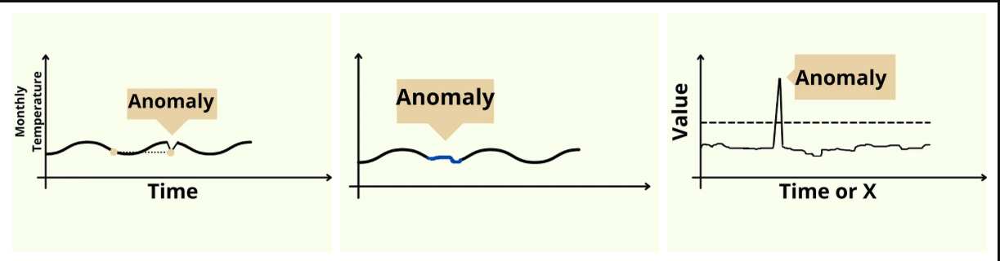

Ранее мы говорили о **выбросах** в данных. Если сравнивать выбросы и аномалии, то стоит отметить, что выбросы — это частный случай аномалий. Такой пример выброса продемонстрирован выше на третьей картинке. В то же время какой-то фрагмент данных может не отличаться статистически значимо от других данных, то есть быть очевидной аномалией (первая и вторая картинки).

## Как работать с выбросами

Существует несколько групп методов работы с аномалиями:

1. Статистические методы

    

   (обсуждали в предыдущих модулях):

   - **Z-оценка** — оценка отклонения точек данных от среднего значения в стандартных отклонениях.
   - **Метод квантилей** — определение аномалий на основе распределения квантилей данных.

2. Методы машинного обучения:

   - **Методы без учителя (Unsupervised Learning)** — кластеризация или методы детекции выбросов, такие как One-Class SVM, Isolation Forest, или методы на основе автоэнкодеров.
   - **Методы с учителем (Supervised Learning)** — использование классификационных моделей с учителем для обучения на нормальных и аномальных данных.

3. Глубокое обучение

    

   (зачастую часть Supervised или Unsupervised Learning):

   - **Автоэнкодеры** — нейронные сети, способные выделять важные признаки и восстанавливать входные данные, что делает их эффективными для обнаружения аномалий.
   - **Генеративные модели** — использование генеративных моделей, таких как Generative Adversarial Networks (GAN), для моделирования нормального распределения данных и выявления аномалий.

4. Комбинированные методы:

   - **Интеграция различных подходов** — использование комбинации различных методов для повышения эффективности обнаружения аномалий.

На уроке мы сконцентрируемся на применении методов обучения с учителем (Supervised Learning) и без учителя (Unsupervised Learning).

Чтобы лучше интерпретировать качество полученных моделей, мы будем использовать методы визуализации. Методы визуализации играют важную роль в работе с алгоритмами поиска аномалий, поскольку помогают в понимании и интерпретации результатов алгоритмов, а также облегчают процесс выявления аномалий. Методы визуализации могут быть полезны при работе с алгоритмами поиска аномалий при отображении данных, построении кривых обучения и тепловых карт, визуализации результатов алгоритмов.

В целом, визуализация делает процесс обнаружения аномалий более доступным и интуитивно понятным, что позволяет эффективнее интерпретировать результаты алгоритмов и принимать информированные решения относительно выявленных аномалий. Обычно в рамках работы с подобными алгоритмами используется scatter plot.

Рассмотрим самые распространенные методы обучения с учителем.

# Методы обучения с учителем (Supervised Learning)

Основная проблема в работе с подобными алгоритмами, — они подходят для разных задач. Обычно можно представить, какой алгоритм пригодится для решения конкретной задачи. Для этого необходимо понимать принципы работы каждого алгоритма.

Предлагаем подробнее ознакомиться с внутренним устройством каждого алгоритма с помощью сторонних ресурсов. Поскольку пока нет универсальных алгоритмов, рассмотрим наиболее популярные.

## Isolation Forest

> **Isolation Forest** — простой, но эффективный подход к обнаружению аномалий. Это ансамблевый метод, который изолирует аномалии путем построения случайных лесов и выделения точек данных, для выделения которых требуется наименьшее количество разделений в дереве. Таким образом, наиболее далекие и отдельностоящие точки будут изолироваться.

Результат работы алгоритма на случайно созданных данных:

```python
import numpy as np
import matplotlib.pyplot as plt
from sklearn.ensemble import IsolationForest


normal_data = np.random.randn(300, 2)
anomalies = 4 + 1.5 * np.random.randn(10, 2)


data = np.vstack([normal_data, anomalies])


clf = IsolationForest(contamination=0.05, random_state=42)
clf.fit(data)


predictions = clf.predict(data)


plt.scatter(data[:, 1], data[:, 0], c=predictions, cmap='viridis')
plt.colorbar(label="Anomaly Score")
plt.title("Anomaly Detection using Isolation Forest")
plt.show()


anomalies_indices = np.where(predictions == -1)[0]
print("Detected anomalies:", anomalies_indices)
```

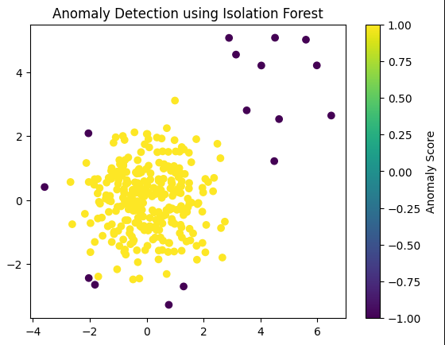

Мы создали массив с десятью выбросами, а алгоритм обнаружил 16. Так произошло, потому что шесть точек находятся снизу и слева от остального разброса, что достаточно удаленно от других точек. Поэтому алгоритм работает с достаточно хорошим качеством.

## k-Nearest Neighbors (KNN)

> **k-Nearest Neighbors (KNN)** — один из самых распространенных алгоритмов в машинном обучении, который также можно использовать для обнаружения выбросов. Метод может быть адаптирован для обнаружения аномалий, используя расстояние до k-ближайшего соседа в качестве меры аномалии. Он классифицирует точки данных как аномалии, если они существенно отличаются от своих k-ближайших соседей.

```python
from sklearn.neighbors import KNeighborsClassifier


normal_data = np.random.randn(300, 2)
anomalies = 4 + 1.5 * np.random.randn(10, 2)


data = np.vstack([normal_data, anomalies])


labels = np.concatenate([np.ones(len(normal_data)), np.zeros(len(anomalies))])


k = 5
clf = KNeighborsClassifier(n_neighbors=k)
clf.fit(data, labels)


predictions = clf.predict(data)


plt.scatter(data[:, 0], data[:, 1], c=predictions, cmap='viridis')
plt.colorbar(label="Anomaly Score")
plt.title("Anomaly Detection using KNN")
plt.show()


anomalies_indices = np.where(predictions == 0)[0]
print("Detected anomalies:", anomalies_indices)

```

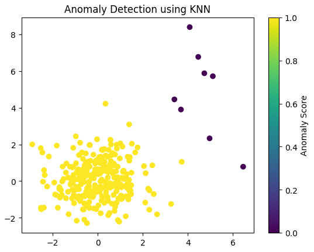

В нашем случае алгоритм распознал 8 из 10 точек, являющихся аномалиями. При этом нет ни одного False Positive срабатывания.

## One-Class SVM (Support Vector Machine)

> **Одноклассовый SVM** — это алгоритм обучения с учителем, который учится отличать класс большинства (нормальный) от класса меньшинства (аномалии). Он создает гиперплоскость, которая отделяет нормальные точки данных от потенциальных выбросов.

```python
from sklearn.svm import OneClassSVM


normal_data = np.random.randn(300, 2)
anomalies = 4 + 1.5 * np.random.randn(10, 2)


data = np.vstack([normal_data, anomalies])


clf = OneClassSVM(nu=0.05, kernel="rbf")
clf.fit(data)


predictions = clf.predict(data)


plt.scatter(data[:, 0], data[:, 1], c=predictions, cmap='viridis')
plt.colorbar(label="Anomaly Score")
plt.title("Anomaly Detection using One-Class SVM")
plt.show()


anomalies_indices = np.where(predictions == -1)[0]
print("Detected anomalies:", anomalies_indices)

```

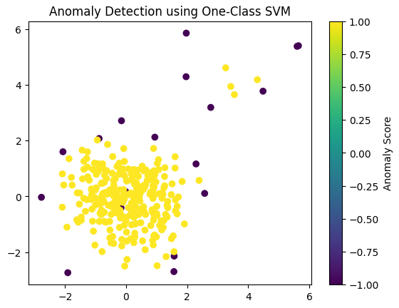

Как мы видим, алгоритм сработал настолько плохо, что распознал выбросы в точках прямо в центре распределения. Именно для обнаружения подобных случаев мы и используем scatter plot.

## Менее распространенные алгоритмы обучения с учителем для детекции аномалии

Разберем менее распространенные алгоритмы и рассмотрим их эффективность.

- **Случайный лес.** Хотя случайные леса часто используются для задач классификации, их также можно использовать для контролируемого обнаружения аномалий. Для этого рассматривают один класс как аномалии, а другой — как обычные данные.

- **Ансамблевые методы.** Алгоритмы AdaBoost (Adaptive Boosting) и Gradient Boosting — популярные методы построения ансамблей, которые объединяют несколько слабых учеников (обычно деревья решений) для создания более сильной модели. Оба алгоритма следуют принципу последовательного обучения, но различаются в способах обработки ошибки и обновления веса образцов.

- **Деревья решений.** Деревья решений могут быть адаптированы для контролируемого обнаружения аномалий путем обучения дерева классификации точек данных как нормальных или аномальных в зависимости от их характеристик.

  ```python
  from sklearn.ensemble import RandomForestClassifier, AdaBoostClassifier, GradientBoostingClassifier
  from sklearn.tree import DecisionTreeClassifier
  from sklearn.datasets import make_classification
  from scipy.stats import norm
  
  
  np.random.seed(40)
  normal_data, _ = make_classification(n_samples=300, n_features=2, n_informative=2, n_redundant=0, random_state=42)
  anomalies = np.random.randn(10, 2) * 3 + np.array([4, 4])
  data = np.vstack([normal_data, anomalies])
  
  
  labels = np.array([1] * len(normal_data) + [-1] * len(anomalies))
  
  
  # Random Forest classifier
  rf = RandomForestClassifier(n_estimators=100)
  rf.fit(data, labels)
  rf_predictions = rf.predict(data)
  
  
  # AdaBoost
  ada = AdaBoostClassifier(n_estimators=100)
  ada.fit(data, labels)
  ada_predictions = ada.predict(data)
  
  
  # Gradient Boosting
  gb = GradientBoostingClassifier(n_estimators=100)
  gb.fit(data, labels)
  gb_predictions = gb.predict(data)
  
  
  # Decision Tree
  dt = DecisionTreeClassifier()
  dt.fit(data, labels)
  dt_predictions = dt.predict(data)
  
  
  def plot_anomaly_detection_results(predictions, title):
  plt.scatter(data[:, 0], data[:, 1], c=predictions, cmap='viridis')
  plt.colorbar(label="Anomaly Score")
  plt.title(title)
  plt.show()
  
  
  plot_anomaly_detection_results(rf_predictions, "Anomaly Detection using Random Forest")
  plot_anomaly_detection_results(ada_predictions, "Anomaly Detection using AdaBoost")
  plot_anomaly_detection_results(gb_predictions, "Anomaly Detection using Gradient Boosting")
  plot_anomaly_detection_results(dt_predictions, "Anomaly Detection using Decision Trees")
  
  ```

  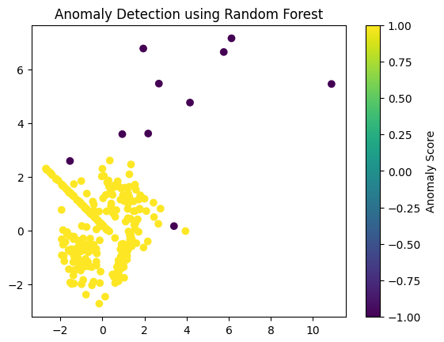


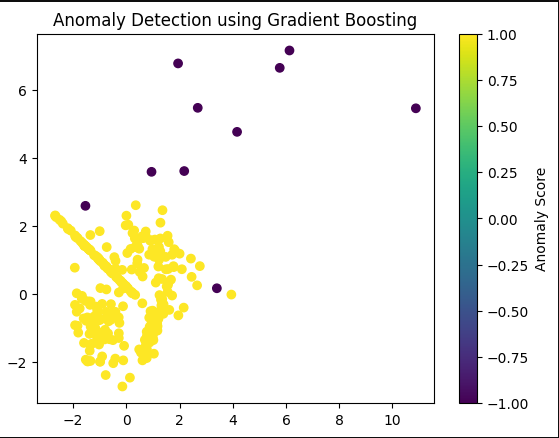

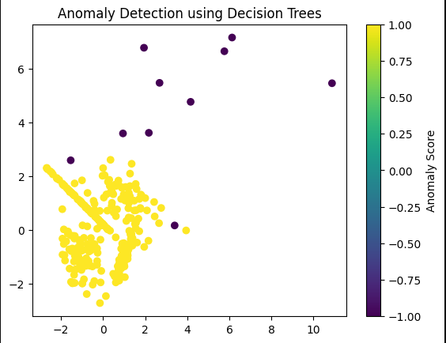

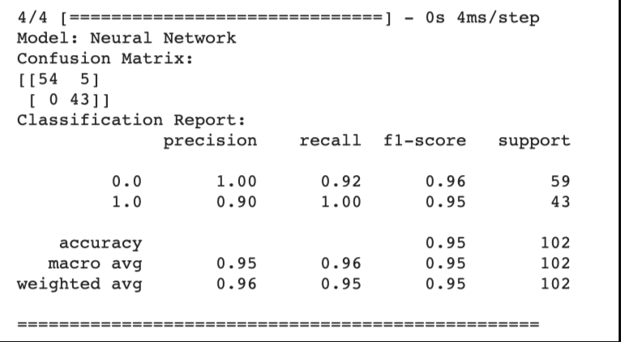

В нашем случае все алгоритмы сработали неплохо. Однако простейший KNN показал более точные результаты. Но при решении других задач ситуация может быть совершенно другой.

Важно понимать, какой алгоритм лучше использовать, отталкиваясь от конкретной ситуации. Определиться с алгоритмом помогает визуализация, а конкретно — scatter plot. Если речь идет о работе с выбросами во временном ряду (как было продемонстрировано на картинке выше), то можно применить line plot. Если аномалия является по своей сути выбросом, то можно использовать hist plot и box plot.

## Использование нейросетей для детекции аномалий

Представим, что, согласно определенному правилу, в наши данные были добавлены аномалии. Мы можем использовать нейросети для обнаружения этих аномалий. После использования нейросети мы создадим визуализацию, чтобы оценить качество классификации.

```python
from sklearn.datasets import make_classification
from sklearn.metrics import confusion_matrix, classification_report
from xgboost import XGBClassifier
from keras.models import Sequential
from keras.layers import Dense


np.random.seed(42)
X, y = make_classification(n_samples=500, n_features=2, n_classes=2, n_clusters_per_class=1, n_redundant=0)
anomalies = 2 + 0.5 * np.random.randn(10, 2)
X = np.vstack([X, anomalies])
y = np.hstack([y, np.ones(len(anomalies))])


from sklearn.model_selection import train_test_split
X_train, X_test, y_train, y_test = train_test_split(X, y, test_size=0.2, random_state=42)


nn_model = Sequential()
nn_model.add(Dense(8, input_dim=2, activation='relu'))
nn_model.add(Dense(1, activation='sigmoid'))
nn_model.compile(loss='binary_crossentropy', optimizer='adam', metrics=['accuracy'])
nn_model.fit(X_train, y_train, epochs=50, batch_size=10, verbose=0)
y_nn_pred = nn_model.predict(X_test)
y_nn_pred = (y_nn_pred > 0.5).astype(int)


print("Model: Neural Network")
print("Confusion Matrix:")
print(confusion_matrix(y_test, y_nn_pred))
print("Classification Report:")
print(classification_report(y_test, y_nn_pred))
print("="*50)


plt.scatter(X_test[y_test == 0][:, 0], X_test[y_test == 0][:, 1], c='b', label='Normal Data')
plt.scatter(X_test[y_test == 1][:, 0], X_test[y_test == 1][:, 1], c='r', label='Anomalies')
plt.title('Neural Network Anomaly Detection')
plt.legend()
plt.show()

```

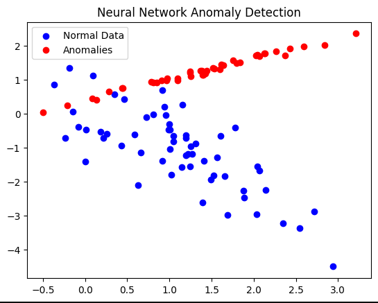

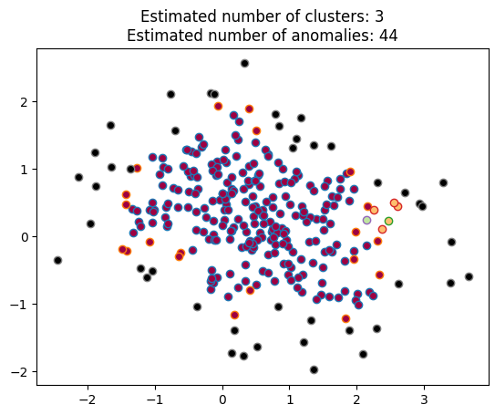


Это наиболее продвинутый способ обнаружения аномалий. Он позволяет обнаружить «закон», в соответствии с которым были добавлены аномалии, затем выделить особо подозрительные точки.

# Методы обучения без учителя (Unsupervised Learning)

## Density-Based Approaches (DBSCAN)

DBSCAN особенно эффективен при идентификации кластеров точек данных в местах с высокой плотностью данных, в то время как точки данных в регионах с низкой плотностью помечаются как аномалии или шум. Он работает на основе концепции плотности данных, что делает его устойчивым к кластерам неправильной формы и способным обрабатывать наборы данных с различными размерами кластеров.

Вот как работает DBSCAN в библиотеке sklearn:

```python
from sklearn.cluster import DBSCAN
from sklearn.datasets import make_moons


X, _ = make_moons(n_samples=300, noise=0.6, random_state=42)


dbscan = DBSCAN(eps=0.3, min_samples=5)
dbscan.fit(X)


labels = dbscan.labels_


core_samples_mask = np.zeros_like(labels, dtype=bool)
core_samples_mask[dbscan.core_sample_indices_] = True
n_clusters_ = len(set(labels)) - (1 if -1 in labels else 0)
n_noise_ = list(labels).count(-1)


unique_labels = set(labels)
colors = [plt.cm.Spectral(each) for each in np.linspace(0, 1, len(unique_labels))]
for k, col in zip(unique_labels, colors):
if k == -1:
col = [0, 0, 0, 1]
class_member_mask = (labels == k)
xy = X[class_member_mask & core_samples_mask]
plt.plot(xy[:, 0], xy[:, 1], 'o', markerfacecolor=tuple(col), markersize=6)
xy = X[class_member_mask & ~core_samples_mask]
plt.plot(xy[:, 0], xy[:, 1], 'o', markerfacecolor=tuple(col), markersize=6)


plt.title(f'Estimated number of clusters: {n_clusters_}\nEstimated number of anomalies: {n_noise_}')
plt.show()

```

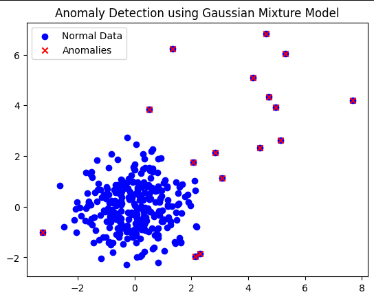

Алгоритм делит наши данные не на два класса (нормальные данные и выбросы), а на большее количество. Черным цветом помечены точки, которые алгоритм однозначно идентифицирует как выбросы. Красные и зеленоватые точки — те, в работе которых алгоритм сомневается.

## Gaussian Mixture Models (GMM)

GMM широко используются для задач кластеризации и оценки плотности, но они также могут применяться для обнаружения аномалий путем идентификации точек данных с низкой вероятностью в рамках смоделированного распределения.

Пример того, как GMM работают для обнаружения аномалий с использованием функции GaussianMixture из библиотеки Scikit-learn:

```python
from sklearn.mixture import GaussianMixture


np.random.seed(42)
normal_data = np.random.randn(300, 2)
anomalies = 4 + 1.5 * np.random.randn(10, 2)


data = np.vstack([normal_data, anomalies])


n_components = 5
gmm = GaussianMixture(n_components=n_components, covariance_type='full', random_state=42)
gmm.fit(data)


likelihoods = -gmm.score_samples(data)
threshold = np.percentile(likelihoods, 95)


anomalies_indices = np.where(likelihoods > threshold)[0]


plt.scatter(data[:, 0], data[:, 1], c='b', label='Normal Data')
plt.scatter(data[anomalies_indices, 0], data[anomalies_indices, 1], c='r', marker='x', label='Anomalies')
plt.legend()
plt.title('Anomaly Detection using Gaussian Mixture Model')
plt.show()

```

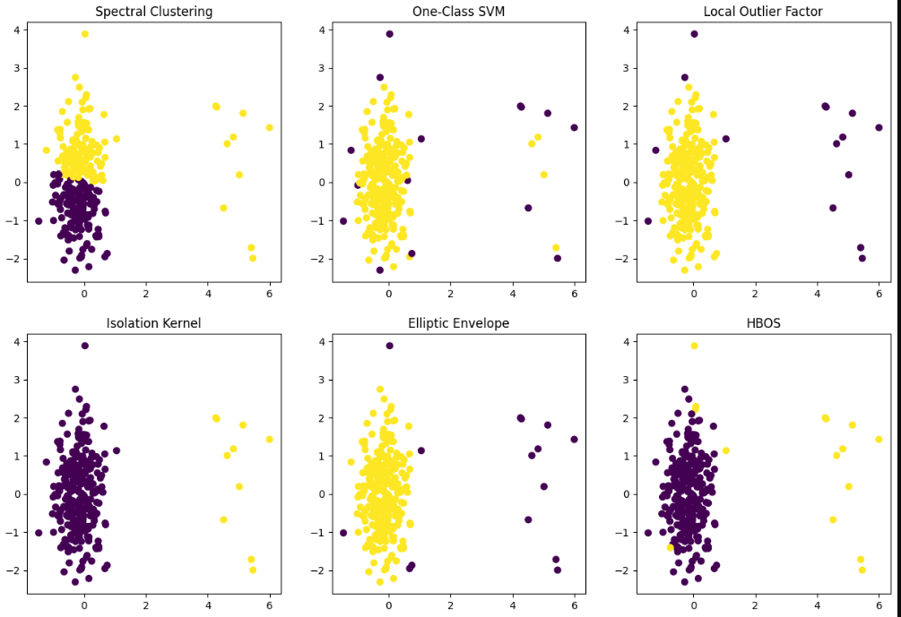

И снова использование визуализации позволяет сделать однозначный вывод о том, насколько хорошо работает алгоритм. В этом случае алгоритм показал себя отлично — его можно использовать в решении нашей задачи.

## Использование нейросети при детекции аномалии без учителя

```python
import torch
import torch.nn as nn
import torch.optim as optim
np.random.seed(42)
normal_data = np.random.randn(300, 10)
anomalies = 4 + 1.5 * np.random.randn(10, 10)
data = np.vstack([normal_data, anomalies])
class Autoencoder(nn.Module):
    def __init__(self, input_dim, encoding_dim):
        super(Autoencoder, self).__init__()
        self.encoder = nn.Sequential(
            nn.Linear(input_dim, encoding_dim),
            nn.ReLU()
        )
        self.decoder = nn.Sequential(
            nn.Linear(encoding_dim, input_dim)
        )
    def forward(self, x):
        encoded = self.encoder(x)
        decoded = self.decoder(encoded)
        return decoded
input_dim = data.shape[1]
encoding_dim = 5
autoencoder = Autoencoder(input_dim, encoding_dim)
criterion = nn.MSELoss()
optimizer = optim.Adam(autoencoder.parameters(), lr=0.001)
data_tensor = torch.Tensor(data)
num_epochs = 100
for epoch in range(num_epochs):
    optimizer.zero_grad()
    outputs = autoencoder(data_tensor)
    loss = criterion(outputs, data_tensor)
    loss.backward()
    optimizer.step()
reconstructed_data = autoencoder(data_tensor).detach().numpy()
reconstruction_errors = np.mean(np.square(data - reconstructed_data), axis=1)
threshold = np.percentile(reconstruction_errors, 95)
anomalies_indices = np.where(reconstruction_errors > threshold)[0]
print("Detected anomalies:", anomalies_indices)
Detected anomalies: [ 20  70 110 116 195 289 300 301 302 303 304 305 306 307 308 309]

```

Алгоритм обнаружил все выбросы, которые мы добавили в данные (точки 300–309), однако также произошло 6 False Positive срабатываний.

## Прочие алгоритмы детекции аномалий с помощью обучения без учителя

Рассмотрим другие популярные алгоритмы обучения без учителя:

- **Spectral Clustering (спектральная кластеризация)** — метод кластеризации данных, основанный на спектральных свойствах матрицы аффинности между точками данных. Она применяется для выделения структуры в данных и может быть использована для выявления аномалий, так как аномальные точки могут формировать отдельные кластеры.
- **One-Class SVM (метод опорных векторов с одним классом)** — метод, который обучается на представителях только одного класса (нормального) и затем пытается выявить аномалии как объекты, далеко стоящие от этого класса в пространстве признаков.
- **Local Outlier Factor** — метод, используемый для измерения степени аномалий точек данных на основе их локального окружения. Он вычисляет отклонение наблюдаемой точки от своих соседей, что позволяет выявлять аномалии, отличающиеся от своего ближайшего окружения.
- **Isolation Kernel** — метод, который основан на изоляции аномальных наблюдений от нормальных. Он строит модель, изолируя аномальные точки, затем использует эту модель для идентификации новых аномалий.
- **Elliptic Envelope** — метод, который моделирует нормальное распределение данных, предполагая, что оно подчиняется многомерной эллиптической форме. Точки, расположенные далеко от этой эллиптической формы, могут быть считаны аномалиями.
- **HBOS (Histogram-based Outlier Score)** — метод, основанный на построении гистограмм для каждого признака данных и вычислении «очков выбросов» на основе вероятности аномальности каждой точки. Этот метод эффективен и вычислительно доступен, особенно для данных с большим числом признаков.

Для использования метода HBOS воспользуемся библиотекой pyod, поскольку его нет в стандартной библиотеке sklearn.

```python
!pip install pyod

from sklearn.datasets import make_blobs
from sklearn.neighbors import LocalOutlierFactor
from sklearn.svm import OneClassSVM
from sklearn.cluster import SpectralClustering, KMeans
from sklearn.covariance import EllipticEnvelope
from sklearn.preprocessing import StandardScaler
from sklearn.metrics import pairwise_distances_argmin_min
from pyod.models.hbos import HBOS


n_samples = 300
n_features = 2
n_outliers = 10


X, _ = make_blobs(n_samples=n_samples, n_features=n_features, centers=1, random_state=42)
X[:n_outliers] = 10 + 2 * np.random.randn(n_outliers, n_features)


scaler = StandardScaler()
X = scaler.fit_transform(X)


fig, axs = plt.subplots(2, 3, figsize=(15, 10))


# Spectral Clustering
spectral = SpectralClustering(n_clusters=2, affinity="nearest_neighbors")
spectral.fit(X)
labels_spectral = spectral.labels_
axs[0, 0].scatter(X[:, 0], X[:, 1], c=labels_spectral, cmap='viridis')
axs[0, 0].set_title("Spectral Clustering")


# One-Class SVM
ocsvm = OneClassSVM(nu=0.05, kernel="rbf")
ocsvm.fit(X)
labels_ocsvm = ocsvm.predict(X)
axs[0, 1].scatter(X[:, 0], X[:, 1], c=labels_ocsvm, cmap='viridis')
axs[0, 1].set_title("One-Class SVM")


# Local Outlier Factor
lof = LocalOutlierFactor(n_neighbors=20, contamination=0.05)
labels_lof = lof.fit_predict(X)
axs[0, 2].scatter(X[:, 0], X[:, 1], c=labels_lof, cmap='viridis')
axs[0, 2].set_title("Local Outlier Factor")


# Isolation Kernel
kernel = KMeans(n_clusters=2, random_state=42)
kernel.fit(X)
labels_kernel, _ = pairwise_distances_argmin_min(X, kernel.cluster_centers_)
axs[1, 0].scatter(X[:, 0], X[:, 1], c=labels_kernel, cmap='viridis')
axs[1, 0].set_title("Isolation Kernel")


# Elliptic Envelope
elliptic = EllipticEnvelope(contamination=0.05)
labels_elliptic = elliptic.fit_predict(X)
axs[1, 1].scatter(X[:, 0], X[:, 1], c=labels_elliptic, cmap='viridis')
axs[1, 1].set_title("Elliptic Envelope")


# HBOS
hbos = HBOS(contamination=0.05)
labels_hbos = hbos.fit_predict(X)
axs[1, 2].scatter(X[:, 0], X[:, 1], c=labels_hbos, cmap='viridis')
axs[1, 2].set_title("HBOS")


plt.show()
/usr/local/lib/python3.10/dist-packages/sklearn/cluster/_kmeans.py:870: FutureWarning: The default value of `n_init` will change from 10 to 'auto' in 1.4. Set the value of `n_init` explicitly to suppress the warning warnings.warn( /usr/local/lib/python3.10/dist-packages/sklearn/utils/deprecation.py:86: FutureWarning: Function fit_predict is deprecated warnings.warn(msg, category=FutureWarning)

```

Как мы видим, не все алгоритмы показали себя одинаково хорошо. Наиболее эффективными оказались Isolation Kernel и Elliptic Envelope. Также с некоторыми оговорками хорошо сработал HBOS. А наиболее забавными получились результаты Spectral Clustering.


------


# Выводы

Введение в аномалии:

- Аномалии — необычные или редкие события, которые существенно отличаются от обычного паттерна или нормального поведения в наборе данных.
- Детекцию аномалий можно проводить с помощью статистических методов, методов ML и Deep Learning, а также комбинации разных подходов.
- В работе с аномалиями удобно использовать визуализацию, чтобы лучше понимать, что происходит в данных. Наиболее часто используется scatter plot, реже — line plot, hist plot, box plot.

Методы обучения с учителем для идентификации аномалий:

- Самые популярные методы доступны в библиотеке sklearn.
- Наиболее часто используются Isolation Forest, KNN, One-Class SVM. Эти алгоритмы работают разными способами и подходят под разные задачи.
- Менее популярные методы (AdaBoost, Gradient Boosting, Random Forest, Decision Trees) также показывают неплохие результаты.
- Наиболее продвинутый способ идентификации аномалий — создание нейросети. Правильно обученная нейросеть способна идентифицировать закон, по которому выбросы добавлены в данные, и избавиться от них.

Методы обучения без учителя:

- Метод DBSCAN делит данные не на два кластера (выбросы и нормальные данные), а идентифицирует «проблемную зону» — значения, которые не удается точно разметить. Часть значений может не являться аномалиями.
- В нашем анализе наиболее эффективным оказался алгоритм семейства GMM. Нейросетевой алгоритм показал качество ниже.
- Прочие алгоритмы (Spectral Clustering, One-Class SVM, Local Outlier Factor, Isolation Kernel, Elliptic Envelope, HBOS) также могут использоваться в анализе, однако они не универсальны и подходят не под все данные. Перед окончательным использованием алгоритма необходимо убедиться в корректности его работы. В нашем случае хорошо себя показали Isolation Kernel, Elliptic Envelope и HBOS.

Заключение

- Итак, мы познакомились с основными алгоритмами идентификации аномалий и способами использования визуализации в рамках этого процесса. На этом занятии мы занимались визуализацией в двумерном пространстве, хотя в работе с аномалиями обычно измерений больше.
- Даже работая с огромным числом измерений, можно использовать визуализацию. Она позволит лучше понимать, что происходит в данных. В этом помогают алгоритмы снижения размерности. На них мы и сосредоточимся в следующем модуле.
