# Методы понижения размерности и оценка результатов работы алгоритмов

> **Алгоритмы понижения размерности** — это методы анализа данных, которые используются для уменьшения количества переменных или признаков в наборе данных, стараясь сохранить как можно больше информации о данных. Они играют важную роль в анализе данных и машинном обучении: позволяют уменьшить избыточность данных, выделить наиболее значимые признаки и улучшить производительность алгоритмов машинного обучения.

Распространенные алгоритмы понижения размерности:

- **Метод главных компонент (PCA).** PCA находит линейные комбинации исходных признаков, которые максимально сохраняют дисперсию данных. Он проецирует данные на новое пространство меньшей размерности, называемое главными компонентами.
- **t-распределенное стохастическое вложение соседей (t-SNE).** t-SNE пытается сохранить локальные структуры данных, то есть близость точек в исходном пространстве в новом пространстве меньшей размерности. Он часто используется для визуализации данных в двумерном или трехмерном пространстве.
- **Линейный дискриминантный анализ (LDA).** LDA ищет линейные комбинации признаков, которые максимизируют различия между классами в данных. Он часто используется в задачах классификации.
- **Нелинейные методы понижения размерности.** К ним относятся такие методы, как Isomap, Locally Linear Embedding (LLE), Autoencoders. Они захватывают более сложные нелинейные зависимости в данных.
- **Многомерное шкалирование (MDS).** MDS стремится сохранить расстояния между точками в исходном пространстве в новом пространстве меньшей размерности. Это позволяет визуализировать исходные данные в пространстве меньшей размерности.

Сегодня мы рассмотрим самые главные и самые распространенные из этих методов. Начнем работу с импорта библиотек:

```python
import gzip
import pandas as pd
import numpy as np


import plotly.offline as py
py.init_notebook_mode(connected=True)
import plotly.graph_objs as go
import plotly.tools as tls
import seaborn as sns
import matplotlib.image as mpimg
import matplotlib.pyplot as plt
import matplotlib
import time
%matplotlib inline


# Import the 3 dimensionality reduction methods
from sklearn.manifold import TSNE
from sklearn.decomposition import PCA
from sklearn.discriminant_analysis import LinearDiscriminantAnalysis as LDA

```

Мы будем работать с популярным датасетом [MNIST](https://en.wikipedia.org/wiki/MNIST_database). Этот датасет представляет собой изображения картинок размером 28 на 28 пикселей. На каждой картинке изображены цифры от нуля до девяти. В рамках нашего датасета каждый пиксель содержится в отдельном столбце. Итого 785 столбцов — один отвечает за label (какая цифра нарисована на самом деле), остальные — за цвет в конкретном пикселе.

```python
train = pd.read_csv('https://github.com/ElijahSum/mipt_visualization/raw/master/week_05_visualization/mnist_train.csv', compression='gzip', index_col=0)
train.head(10)

```

| **label** | **1x1** | **1x2** | **1x3** | **1x4** | **1x5** | **1x6** | **1x7** | **1x8** | **1x9** | **...** | **28x19** | **28x20** | **28x21** | **28x22** | **28x23** | **28x24** | **28x25** | **28x26** | **28x27** | **28x28** |      |
| --------- | ------- | ------- | ------- | ------- | ------- | ------- | ------- | ------- | ------- | ------- | --------- | --------- | --------- | --------- | --------- | --------- | --------- | --------- | --------- | --------- | ---- |
| **0**     | 5       | 0       | 0       | 0       | 0       | 0       | 0       | 0       | 0       | 0       | ...       | 0         | 0         | 0         | 0         | 0         | 0         | 0         | 0         | 0         | 0    |
| **1**     | 0       | 0       | 0       | 0       | 0       | 0       | 0       | 0       | 0       | 0       | ...       | 0         | 0         | 0         | 0         | 0         | 0         | 0         | 0         | 0         | 0    |
| **2**     | 4       | 0       | 0       | 0       | 0       | 0       | 0       | 0       | 0       | 0       | ...       | 0         | 0         | 0         | 0         | 0         | 0         | 0         | 0         | 0         | 0    |
| **3**     | 1       | 0       | 0       | 0       | 0       | 0       | 0       | 0       | 0       | 0       | ...       | 0         | 0         | 0         | 0         | 0         | 0         | 0         | 0         | 0         | 0    |
| **4**     | 9       | 0       | 0       | 0       | 0       | 0       | 0       | 0       | 0       | 0       | ...       | 0         | 0         | 0         | 0         | 0         | 0         | 0         | 0         | 0         | 0    |
| **5**     | 2       | 0       | 0       | 0       | 0       | 0       | 0       | 0       | 0       | 0       | ...       | 0         | 0         | 0         | 0         | 0         | 0         | 0         | 0         | 0         | 0    |
| **6**     | 1       | 0       | 0       | 0       | 0       | 0       | 0       | 0       | 0       | 0       | ...       | 0         | 0         | 0         | 0         | 0         | 0         | 0         | 0         | 0         | 0    |
| **7**     | 3       | 0       | 0       | 0       | 0       | 0       | 0       | 0       | 0       | 0       | ...       | 0         | 0         | 0         | 0         | 0         | 0         | 0         | 0         | 0         | 0    |
| **8**     | 1       | 0       | 0       | 0       | 0       | 0       | 0       | 0       | 0       | 0       | ...       | 0         | 0         | 0         | 0         | 0         | 0         | 0         | 0         | 0         | 0    |
| **9**     | 4       | 0       | 0       | 0       | 0       | 0       | 0       | 0       | 0       | 0       | ...       | 0         | 0         | 0         | 0         | 0         | 0         | 0         | 0         | 0         | 0    |

Теперь разделим наш датасет на две части — `train` и `test`, чтобы использовать их в работе с алгоритмами.

```python
target = train['label']
train = train.drop("label",axis=1)

target
0        5
1        0
2        4
3        1
4        9
        ..
59995    8
59996    3
59997    5
59998    6
59999    8
Name: label, Length: 60000, dtype: int64
```

Отрисуем одну из цифр нашего датасета. Для этого воспользуемся `plt.imshow()`. Эта функция позволяет попиксельно вывести изображение.

```python
plt.imshow(np.array([1, 2, 3, 2, 4, 2, 3, 2, 1]).reshape(3,3))
plt.axis('off')
(-0.5, 2.5, 2.5, -0.5)
```


```python
plt.figure(figsize=(5, 3))
plt.imshow(train.iloc[10000].to_numpy().reshape(28,28))
plt.axis('off')
plt.show()
```


Теперь отрисуем 70 чисел из нашего датасета, чтобы посмотреть, насколько сильно они отличаются.

```python
plt.figure(figsize=(10, 6))
for digit_num in range(0,70):
plt.subplot(7,10,digit_num+1)
grid_data = train.iloc[digit_num].to_numpy().reshape(28,28)
plt.imshow(grid_data, interpolation = "none", cmap = "afmhot")
plt.xticks([])
plt.yticks([])
plt.tight_layout()
```

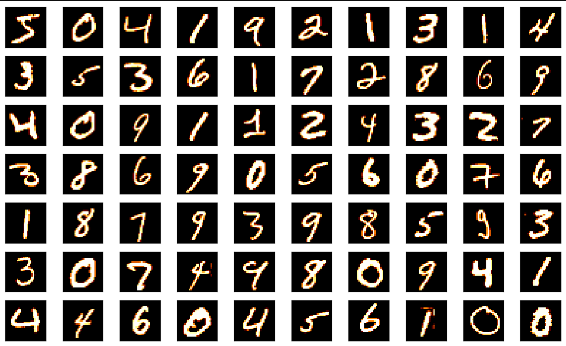

### **Зачем использовать алгоритмы понижения размерности:**

- Уменьшение размерности для повышения производительности, чтобы алгоритм работал быстрее и не обращал внимания на неинформативные признаки.
- Уменьшение размерности для построения визуализаций. Преобразование в двумерное пространство позволит построить привычную визуализацию, которая отразит зависимости в данных.

Алгоритмы снижения размерности позволяют, свести N-мерный массив данных (датасет) к двумерному, сохраняя внутренние связи между данными. Это позволяет строить понятные глазу визуализации, которые можно интерпретировать.

Каждую из этих целей мы рассмотрим отдельно в рамках текущего занятия. Начнем обзор с самого популярного и простого метода — PCA.

## Principal Component Analysis (PCA)

> **Principal Component Analysis (PCA)** — это метод понижения размерности и одновременно метод анализа данных, который используется для идентификации основных шаблонов в данных. Он находит новые оси, называемые главными компонентами, которые представляют собой линейные комбинации исходных признаков. Главные компоненты упорядочены по убыванию дисперсии данных. Это означает, что первая главная компонента объясняет наибольшую долю общей дисперсии, вторая — следующую по величине долю и т. д.

В библиотеке `sklearn` уже есть реализация алгоритма PCA. Перед началом нашей работы отскалируем данные с помощью `StandardScaler()`:

```python
нашей работы отскалируем данные с помощью StandardScaler():
# Standardize the data
from sklearn.preprocessing import StandardScaler
X = train.values
X_std = StandardScaler().fit_transform(X)
```

PCA принимает на вход как минимум один параметр — `n_components`.

```python
# Invoke SKlearn's PCA method
n_components = 95
pca = PCA(n_components=n_components).fit(train.values)
X_reduced = pca.fit_transform(train)
```

Мы применили простейший метод понижения размерности. Преимущество этих методов в том, что они обратимы, — после мы можем восстановить наши значения, например, с помощью функции pca.inverse_transform().

Посмотрим, сильно ли отличается восстановленное изображение от оригинала:

```python
#now that we have got both compressed and decompressed data, let's plot them side by side to see how much we lost(5%)
fig, (ax1, ax2) = plt.subplots(1,2)
X_decompress = pca.inverse_transform(X_reduced)
ax1.imshow(train.iloc[10000].to_numpy().reshape(28,28))
ax2.imshow(X_decompress[10000].reshape(28, 28))
fig.suptitle('compression and decompression')
ax1.axis('off')
ax2.axis('off')
plt.show()
```

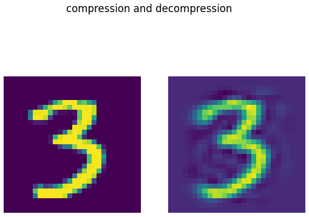

Мы видим, что полученное новое значение не сильно отличается от исходного. Да, видны переходы между цветами, но изображение все еще различимо и принципиально не отличается.

Методы понижения размерности могут применяться для повышения производительности при работе с алгоритмами. Попробуем применить разные классификаторы к исходному датасету с 784 признаками, а затем к датасету после применения алгоритма понижения размерности. После этого сравним их производительность.

## Random Forest Classifier

Для сверки времени работы воспользуемся разницей в `time.time()`. Применим алгоритм на исходном датасете:

```python
алгоритм на исходном датасете:
from sklearn.ensemble import RandomForestClassifier
rfc = RandomForestClassifier(n_estimators=20, random_state = 42)
t0 = time.time()
rfc.fit(train, target)
t1 = time.time()
print(rfc.score(train, target))
print(t1-t0)
0.9999333333333333 14.608989953994751

rfc2 = RandomForestClassifier(n_estimators = 20, random_state = 42)
t0 = time.time()
rfc2.fit(X_reduced, target)
t1 = time.time()
print(rfc2.score(X_reduced, target))
print(t1-t0)
0.9999666666666667 41.03299927711487
```

Что-то пошло не так — скорость вычисления не только не уменьшилась, но даже возросла в три раза. Зато незначительно выросло качество классификации. Посмотрим, как это будет работать на другом алгоритме.

В домашнем задании мы разберем эту ситуацию подробнее и построим визуализацию работы дерева.

## Softmax Classifier

```python
from sklearn.linear_model import LogisticRegression


log_clf = LogisticRegression(random_state = 42, max_iter=200)
t0 = time.time()
log_clf.fit(train, target)
t1 = time.time()
print(log_clf.score(train, target))
print(t1-t0)

from sklearn.linear_model import LogisticRegression


log_clf = LogisticRegression(multi_class = 'multinomial', solver = 'lbfgs', random_state = 42, max_iter=200)
t0 = time.time()
log_clf.fit(train, target)
t1 = time.time()
print(log_clf.score(train, target))
print(t1-t0)

/usr/local/lib/python3.10/dist-packages/sklearn/linear_model/_logistic.py:458: ConvergenceWarning:

lbfgs failed to converge (status=1):
STOP: TOTAL NO. of ITERATIONS REACHED LIMIT.

Increase the number of iterations (max_iter) or scale the data as shown in:
    https://scikit-learn.org/stable/modules/preprocessing.html
Please also refer to the documentation for alternative solver options:
    https://scikit-learn.org/stable/modules/linear_model.html#logistic-regression

0.9379
96.47242832183838

log_clf2 = LogisticRegression(multi_class = 'multinomial', solver = 'lbfgs', random_state = 42, max_iter=500)
t0 = time.time()
log_clf2.fit(X_reduced, target)
t1 = time.time()
print(log_clf2.score(X_reduced, target))
print(t1-t0)

0.92115
34.53950333595276
/usr/local/lib/python3.10/dist-packages/sklearn/linear_model/_logistic.py:458: ConvergenceWarning:

lbfgs failed to converge (status=1):
STOP: TOTAL NO. of ITERATIONS REACHED LIMIT.

Increase the number of iterations (max_iter) or scale the data as shown in:
    https://scikit-learn.org/stable/modules/preprocessing.html
Please also refer to the documentation for alternative solver options:
    https://scikit-learn.org/stable/modules/linear_model.html#logistic-regression
```

Теперь мы видим совершенно другую ситуацию — мы смогли ускорить работу алгоритма аж в три раза, не сильно потеряв в итоговом качестве.

Таким образом, при работе с рядом алгоритмов сокращение размерности позволяет увеличить скорость работы без значительных потерь в качестве.

# Графическое представление данных пониженной размерности

Другое применение алгоритмов понижения размерности — возможность создавать визуализации, чтобы лучше понять происходящее в данных (например, насколько близко друг к другу находятся разные классы). Проблемой может быть то, что датасет — это n-мерный массив данных, который плохо подходит, чтобы строить двумерную визуализацию. Чтобы отразить состояние данных, их нужно свести к двумерному датасету.

Главная польза работы таких алгоритмов — не нужно выделять оси, по которым строится визуализация. Наша работа сводится к тому, чтобы запустить алгоритм и посмотреть, есть ли в нем какие-либо визуальные паттерны.

## PCA

Еще раз запустим алгоритм PCA, но теперь для построения быстрой и эффективной визуализации оставим только 10% от всех наших наблюдений. После снижения размерности данных запустим на нем несколько алгоритмов кластеризации и посмотрим, получится ли найти на них зависимости.

```python
X= train[:6000].values


X_std = StandardScaler().fit_transform(X)


pca = PCA(n_components=5)
pca.fit(X_std)
X_5d = pca.transform(X_std)


Target = target[:6000]

import matplotlib.pyplot as plt
import seaborn as sns


# Create the scatter plot using matplotlib
plt.figure(figsize=(10, 8))
sns.scatterplot(
x=X_5d[:, 0],
y=X_5d[:, 1],
hue=Target,
palette='Accent',
legend='full',
edgecolor='white',
linewidth=0.5,
alpha=0.8
)


# Set the title and labels
plt.title('Principal Component Analysis (PCA)')
plt.xlabel('First Principal Component')
plt.ylabel('Second Principal Component')


# Show the legend
plt.legend(title='Target')


# Show the plot
plt.grid(True)
plt.show()
```

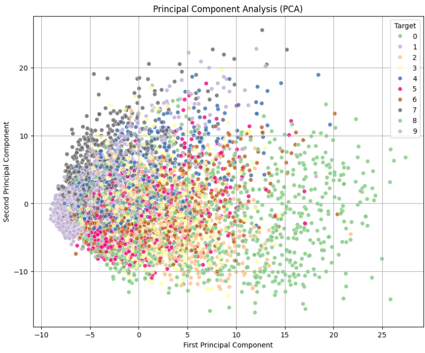

Классы в этой визуализации — это цифры, которые были представлены в датасете.

Благодаря этой визуализации мы можем понять как минимум несколько фактов:

- Классы «Один» и «Семь» находятся очень близко в пространстве. Это логично, поскольку цифры имеют похожее написание.
- Модель плохо справилась с разведением основных классов, однако сильнее всего выделяет класс «Ноль» — точки на визуализации смешаны и толком не кластеризованы.
- Очень близко в пространстве находятся классы «Три», «Шесть» и «Пять».

Однако эта прикидка сделана «на глаз». Попробуем применить реальный алгоритм кластеризации и оценить результаты.

## K-Means Clustering

Создадим метод кластеризации K-Means. Посмотрим, насколько хорошо он справится. Количество классов поставим 10.

```python
from sklearn.cluster import KMeans


kmeans = KMeans(n_clusters=10)


X_clustered = kmeans.fit_predict(X_5d)

/usr/local/lib/python3.10/dist-packages/sklearn/cluster/_kmeans.py:870: FutureWarning: The default value of `n_init` will change from 10 to 'auto' in 1.4. Set the value of `n_init` explicitly to suppress the warning

# Create the scatter plot using matplotlib and seaborn
plt.figure(figsize=(10, 8))
sns.scatterplot(
x=X_5d[:, 0],
y=X_5d[:, 1],
hue=X_clustered,
palette='Accent',
legend=False,
edgecolor='white',
linewidth=0.5,
alpha=0.8
)


# Set the title and labels
plt.title('KMeans Clustering')
plt.xlabel('First Principal Component')
plt.ylabel('Second Principal Component')


# Show the legend
plt.legend(title='Cluster')


# Show the plot
plt.grid(True)
plt.show()

WARNING:matplotlib.legend:No artists with labels found to put in legend.  Note that artists whose label start with an underscore are ignored when legend() is called with no argument.
```

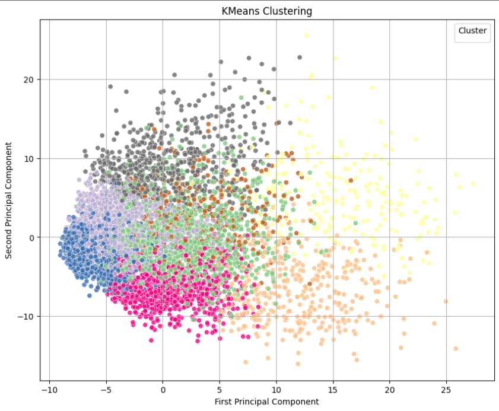

Уже зрительно мы видим, что наш алгоритм отработал плохо, — результаты сильно отличаются от оригинала. Однако какие-то общие паттерны все же проглядываются. Возможно, стоит использовать другой метод понижения размерности. Посмотрим, чем может помочь Linear Discriminant Analysis (LDA).

## Linear Discriminant Analysis (LDA)

**LDA** — очень популярный метод понижения размерности. Его цель — найти новые оси, называемые дискриминантами, которые максимизируют различия между классами данных. Он стремится максимизировать отношение разброса между классами к разбросу внутри классов.

```python
lda = LDA(n_components=5)
# Taking in as second argument the Target as labels
X_LDA_2D = lda.fit_transform(X_std, Target.values)

import matplotlib.pyplot as plt
import seaborn as sns


# Create the scatter plot using matplotlib and seaborn
plt.figure(figsize=(10, 8))
sns.scatterplot(
x=X_LDA_2D[:, 0],
y=X_LDA_2D[:, 1],
hue=Target,
palette='Accent',
legend=True,
edgecolor='white',
linewidth=0.5,
alpha=0.8
)


# Set the title and labels
plt.title('Linear Discriminant Analysis (LDA)')
plt.xlabel('First Linear Discriminant')
plt.ylabel('Second Linear Discriminant')


# Show the legend
plt.legend(title='Target')


# Show the plot
plt.grid(True)
plt.show()
```

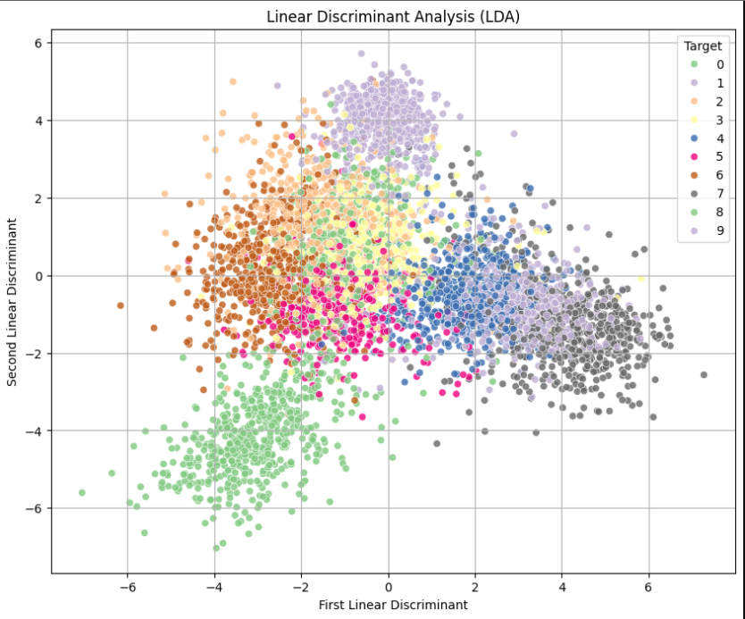

Уже лучше. Мы видим, что есть ряд классов, которые очень сильно отличаются друг от друга при понижении размерности. После LDA наши алгоритмы классификации сработали бы гораздо лучше.

Теперь посмотрим еще один метод понижения размерности — **t-SNE**.

## t-SNE

**t-Distributed Stochastic Neighbor Embedding (t-SNE)** — это метод машинного обучения для визуализации данных высокой размерности в пространство меньшей размерности, обычно двумерное или трехмерное. Он разработан для сохранения локальных структур данных, т. е. близость точек в исходном пространстве должна сохраняться в пространстве меньшей размерности.

Этот алгоритм идеально подходит для кластеризации и работы с алгоритмами после снижения размерности.

```python
tsne = TSNE(n_components=2)
tsne_results = tsne.fit_transform(X_std)

import matplotlib.pyplot as plt
import seaborn as sns


# Create the scatter plot using matplotlib and seaborn
plt.figure(figsize=(10, 8))
sns.scatterplot(
x=tsne_results[:, 0],
y=tsne_results[:, 1],
hue=Target,
palette='Accent',
legend=True,
edgecolor='white',
linewidth=0.5,
alpha=0.8
)


# Set the title and labels
plt.title('TSNE (T-Distributed Stochastic Neighbour Embedding)')
plt.xlabel('First Dimension')
plt.ylabel('Second Dimension')

plt.legend()


# Show the plot
plt.grid(True)
plt.show()
```

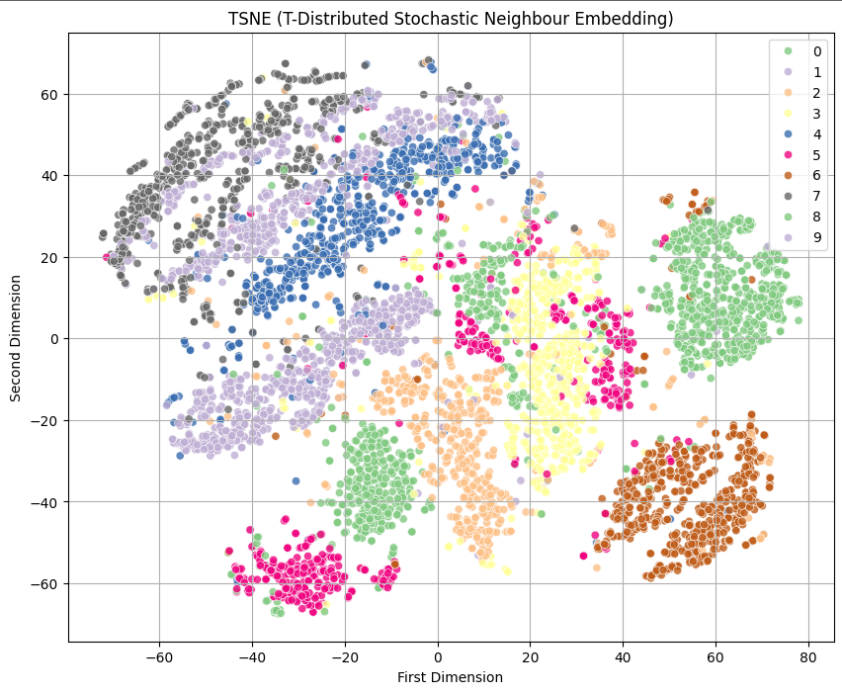

Здесь кластеры выделяются уже намного лучше. Но проблема в том, что в нашей палитре 8 цветов, и два цвета повторяются. Попробуем построить то же самое, но с использованием `colorbar`:

```python
train['label'] = target
X = train.sample(n=10000, random_state=42)


y = X['label']
X = X.drop('label', axis = 1)

tsne = TSNE(n_components = 2, random_state = 42)
X_reduced = tsne.fit_transform(X)

plt.figure(figsize=(12, 8))
plt.scatter(tsne_results[:,0], tsne_results[:,1], c = Target, cmap='jet')
plt.colorbar()
plt.axis('off')
plt.show()
```

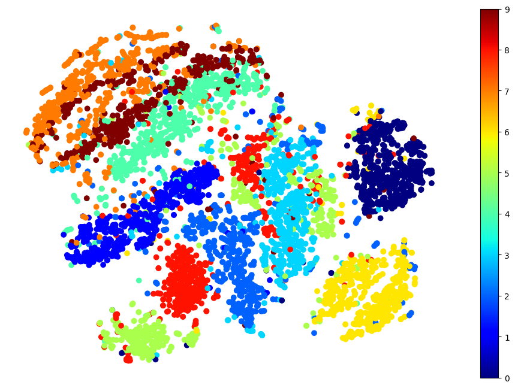

Получившаяся ситуация очень похожа на реальную, которая наблюдается в данных. И это мы использовали всего лишь 10% от наших данных. Попробуйте самостоятельно выделить факты, которые можно понять о датасете и о написании цифр в целом, используя эту визуализацию.

## PCA + t-SNE

Стоит заметить, что разные методы понижения размерности можно совмещать, используя `Pipeline`:

```python
from sklearn.pipeline import Pipeline


pca_tsne = Pipeline([
('pca', PCA(n_components=95, random_state=42)),
('tsne', TSNE(n_components=2, random_state=42)),
])
X_pca_tsne = pca_tsne.fit_transform(train)


plt.figure(figsize=(12, 8))
plt.scatter(X_reduced[:,0], X_reduced[:,1], c = target, cmap='jet')
plt.colorbar()
plt.axis('off')
plt.show()
```

Однако данные в этом случае могут считаться очень долго. Например, этот код учится более часа. Но качество повышается.

## LLE (Locally Linear Embedding)

Другой достаточно популярный алгоритм понижения размерности — LLE. Процесс LLE выполняется следующим образом:

1. **Нахождение ближайших соседей.** Сначала для каждой точки данных находятся ее ближайшие соседи в исходном пространстве.
2. **Поиск весовых коэффициентов.** Затем LLE ищет линейную комбинацию соседей каждой точки, которая наилучшим образом воспроизводит эту точку. Это делается путем минимизации суммы квадратов разницы между точками и их линейными комбинациями.
3. **Представление в пространстве меньшей размерности.** Наконец, LLE находит координаты точек в пространстве меньшей размерности таким образом, чтобы сохранить отношения близости между соседями, найденными на предыдущем шаге.

Это специфически работающий алгоритм: он находит 𝑛-вершин, между которыми распределяет значения.

```python
from sklearn.manifold import LocallyLinearEmbedding
X_lle = LocallyLinearEmbedding(n_components=2, random_state=42).fit_transform(X)


plt.figure(figsize=(12, 8))
plt.scatter(X_lle[:,0], X_lle[:,1], c = y, cmap='jet')
plt.colorbar()
plt.axis('off')
plt.show()
```

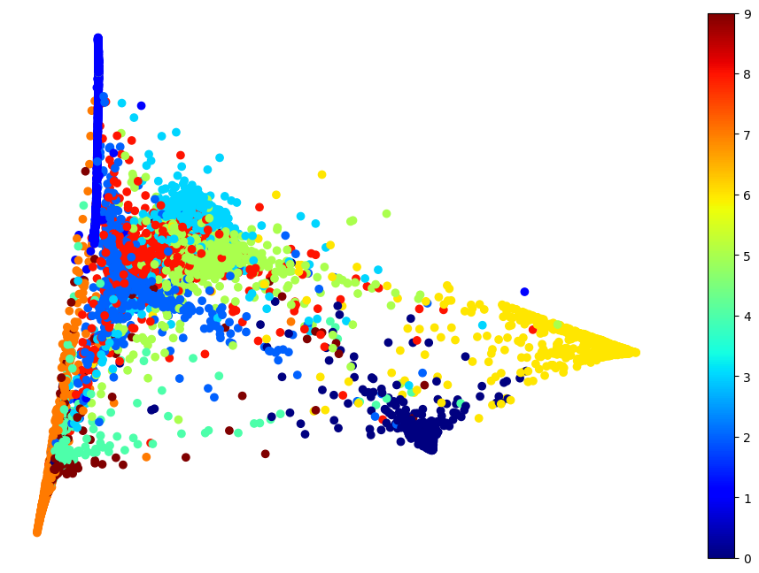

# Применение рассмотренного подхода на примере

Возьмем датасет, который мы ранее использовали в работе на семинаре — датасет оценки качества яблок по ряду характеристик. Тогда мы строили визуализацию, используя только два столбца из всех доступных. Теперь попробуем применить разные методы понижения размерности для получения лучших результатов, при этом имея возможность использовать визуализацию.

```python
apples = pd.read_csv('https://raw.githubusercontent.com/ElijahSum/mipt_visualization/master/week_03_visualization/apple_quality.csv', index_col=0).iloc[:-1, :]
apples
```

|A_id | **Size**   | **Weight** | **Sweetness** | **Crunchiness** | **Juiciness** | **Ripeness** | **Acidity** | Quality |
| ---------- | ---------- | ------------- | --------------- | ------------- | ------------ | ----------- | ------------ | ---- |
| **0.0**    | -3.970049  | -2.512336     | 5.346330        | -1.012009     | 1.844900     | 0.329840    | -0.491590483 | good |
| **1.0**    | -1.195217  | -2.839257     | 3.664059        | 1.588232      | 0.853286     | 0.867530    | -0.722809367 | good |
| **2.0**    | -0.292024  | -1.351282     | -1.738429       | -0.342616     | 2.838636     | -0.038033   | 2.621636473  | bad  |
| **3.0**    | -0.657196  | -2.271627     | 1.324874        | -0.097875     | 3.637970     | -3.413761   | 0.790723217  | good |
| **4.0**    | 1.364217   | -1.296612     | -0.384658       | -0.553006     | 3.030874     | -1.303849   | 0.501984036  | good |
| **...**    | ...        | ...           | ...             | ...           | ...          | ...         | ...          | ...  |
| **3995.0** | 0.059386   | -1.067408     | -3.714549       | 0.473052      | 1.697986     | 2.244055    | 0.137784369  | bad  |
| **3996.0** | -0.293118  | 1.949253      | -0.204020       | -0.640196     | 0.024523     | -1.087900   | 1.854235285  | good |
| **3997.0** | -2.634515  | -2.138247     | -2.440461       | 0.657223      | 2.199709     | 4.763859    | -1.334611391 | bad  |
| **3998.0** | -4.008004  | -1.779337     | 2.366397        | -0.200329     | 2.161435     | 0.214488    | -2.229719806 | good |
| **3999.0** | 0.278540   | -1.715505     | 0.121217        | -1.154075     | 1.266677     | -0.776571   | 1.599796456  | good |

4000 rows × 8 columns

Создадим `test` и `train`, как делали ранее.

```python
apples_train = apples.drop('Quality', axis=1)
apples_train.head(5)
```

|A_id| **Size** | **Weight** | **Sweetness** | **Crunchiness** | **Juiciness** | **Ripeness** | **Acidity** |
| -------- | ---------- | ------------- | --------------- | ------------- | ------------ | ----------- | ------------ |
| **0.0**  | -3.970049  | -2.512336     | 5.346330        | -1.012009     | 1.844900     | 0.329840    | -0.491590483 |
| **1.0**  | -1.195217  | -2.839257     | 3.664059        | 1.588232      | 0.853286     | 0.867530    | -0.722809367 |
| **2.0**  | -0.292024  | -1.351282     | -1.738429       | -0.342616     | 2.838636     | -0.038033   | 2.621636473  |
| **3.0**  | -0.657196  | -2.271627     | 1.324874        | -0.097875     | 3.637970     | -3.413761   | 0.790723217  |
| **4.0**  | 1.364217   | -1.296612     | -0.384658       | -0.553006     | 3.030874     | -1.303849   | 0.501984036  |

```python
apples_target = [1 if x == 'good' else 0 for x in apples['Quality']]
```

Применим PCA-алгоритм и построим визуализацию полученного разбиения.

```python
pca = PCA(n_components = 2)
X_reduced = pca.fit_transform(apples_train)

X_std = StandardScaler().fit_transform(apples_train)


# Call the PCA method with 95 components.
pca = PCA(n_components=5)
pca.fit(X_std)
X_5d = pca.transform(X_std)


# For cluster coloring in our Plotly plots, remember to also restrict the target values
Target = target[:6000]

plt.figure(figsize=(10, 8))
sns.scatterplot(
x=X_5d[:, 0],
y=X_5d[:, 1],
hue=apples_target,
palette='Accent',
legend='full',
edgecolor='white',
linewidth=0.5,
alpha=0.8
)


# Set the title and labels
plt.title('Principal Component Analysis (PCA)')
plt.xlabel('First Principal Component')
plt.ylabel('Second Principal Component')


# Show the legend
plt.legend(title='Target')


# Show the plot
plt.grid(True)
plt.show()
```

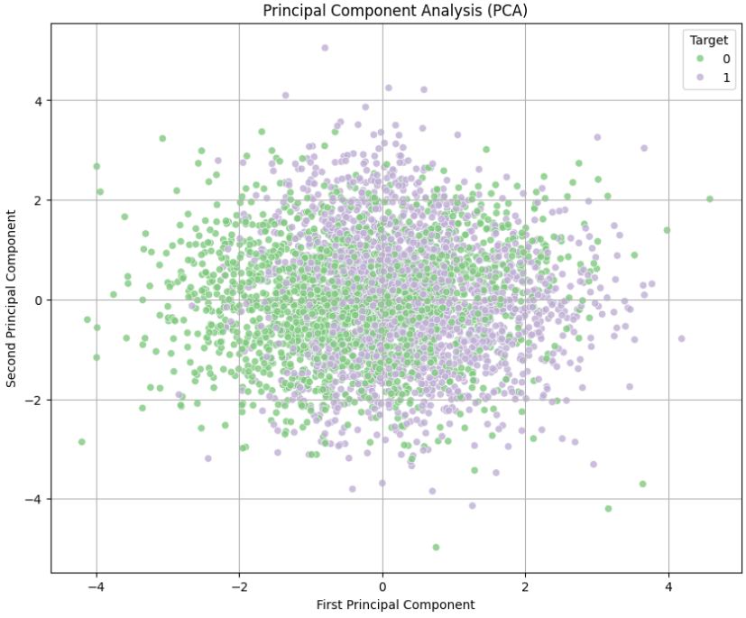

Мы видим, что алгоритм сработал не очень хорошо. Попробуем другие доступные алгоритмы.

```python
tsne = TSNE(n_components=2)
tsne_results = tsne.fit_transform(X_std)

# Create the scatter plot using matplotlib and seaborn
plt.figure(figsize=(10, 8))
sns.scatterplot(
x=tsne_results[:, 0],
y=tsne_results[:, 1],
hue=apples_target,
palette='Accent',
legend=True,
edgecolor='white',
linewidth=0.5,
alpha=0.8
)


# Set the title and labels
plt.title('TSNE (T-Distributed Stochastic Neighbour Embedding)')
plt.xlabel('First Dimension')
plt.ylabel('Second Dimension')


plt.legend()


# Show the plot
plt.grid(True)
plt.show()
```

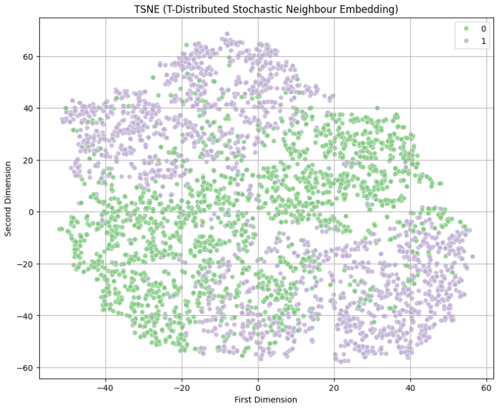

Мы видим, что алгоритм t-SNE сработал лучше, чем PCA. Здесь кластеры заметно разделены. Тут же можно сделать вывод: хорошие яблоки — это такие яблоки, которые сильно отходят от точки (0, 0) по обоим параметрам (разнонаправленно). Те яблоки, которые сильно отличаются только по оси x — плохие.

```python
X_lle = LocallyLinearEmbedding(n_components=2, random_state=42).fit_transform(apples_train)


plt.figure(figsize=(12, 8))
plt.scatter(X_lle[:,0], X_lle[:,1], c = apples_target, cmap='jet')
plt.colorbar()
plt.axis('off')
plt.show()
```

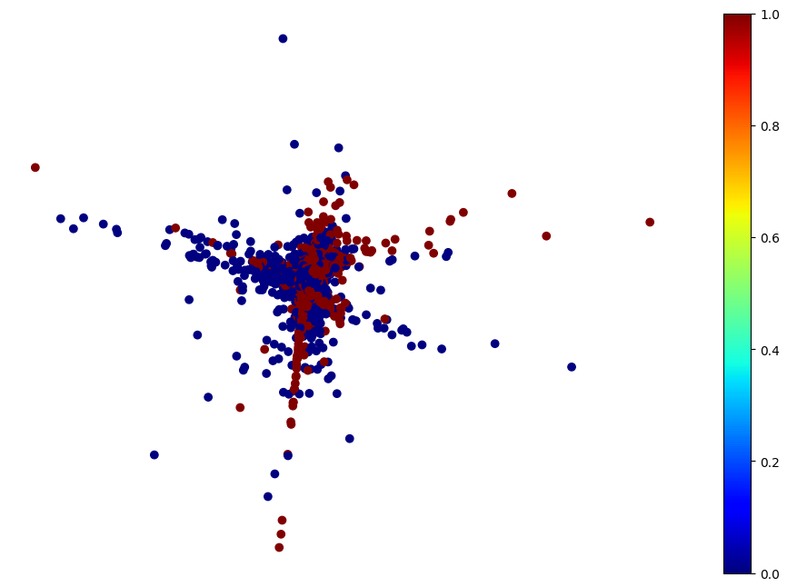

А этот алгоритм отработал хуже — точки находятся очень близко друг к другу.

# Выводы

- Методы понижения размерности можно использовать в двух сценариях: для ускорения работы алгоритма и для построения визуализаций, которые отражают закономерности в данных.
- Самые распространённые методы понижения размерности: PCA, t-SNE, LDA и LLE.
- Визуализация работы алгоритмов понижения размерности помогает проводить лучший EDA, потому показывает закономерности в данных.
- Не все алгоритмы одинаково хорошо работают в разных датасетах: нужно экспериментировать с несколькими и искать те, которые смогут показать закономерности — кластеры, корреляции или любые другие зависимости в широком смысле слова. Если на визуализации каша — стоит попробовать другой алгоритм.
- Если алгоритм отработал плохо, можно попробовать изменить гиперпараметры. Не существует универсального ответа на вопрос, сколько итераций нужно, чтобы разобраться, плохо отработал алгоритм или нужен тюнинг гиперпараметров.
